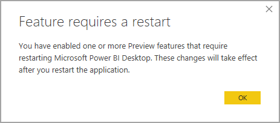

# Gelişmiş veri kümesi meta verilerini kullanma (önizleme)

Power BI Desktop, rapor oluşturduğunda, ilgili PBIX ve PBIT dosyalarında da veri kümesi meta verileri oluşturur. Önceden meta veriler Power BI Desktop’a özgü bir biçimde depolanıyordu. Base-64 kodlu M ifadeleri ve veri kaynaklar kullanılıyordu ve meta verilerin nasıl depolanacağına dair varsayımlarda bulunuluyordu.

**Gelişmiş veri kümesi meta verileri** özelliğinin yayınlanmasıyla birlikte, bu sınırlamaların çoğu kaldırıldı. **Gelişmiş veri kümesi meta verileri** özelliği etkin durumdayken, Power BI Desktop tarafından oluşturulan meta veriler, [Tablolu Nesne Modeli](https://docs.microsoft.com/bi-reference/tom/introduction-to-the-tabular-object-model-tom-in-analysis-services-amo)’ne göre, Analysis Services tablolu modelleri için kullanılanlara benzer bir biçimi kullanır.

**Gelişmiş veri kümesi meta verileri** özelliği stratejik ve temel niteliktedir; gelecekteki Power BI işlevleri bunun meta verileri temelinde oluşturulur. Gelişmiş veri kümesi meta verilerinden yararlanan bazı ek özellikler arasında, Power BI veri kümelerinin yönetimi için [XMLA okuma/yazma](https://docs.microsoft.com/power-platform-release-plan/2019wave2/business-intelligence/xmla-readwrite) ve yeni nesil özelliklerden yararlanmak için Analysis Services iş yüklerinden Power BI’a geçiş yer alır.

## Gelişmiş veri kümesi meta verilerini etkinleştirme

**Gelişmiş veri kümesi meta verileri** özelliği şu anda önizleme aşamasındadır. Gelişmiş veri kümesi meta verilerini etkinleştirmek için Power BI Desktop’ta **Dosya > Seçenekler ve ayarlar > seçenekler > önizleme özellikleri** seçeneğini belirleyin ve sonra aşağıdaki görüntüde gösterildiği gibi **Gelişmiş meta veri biçimini kullanarak veri kümelerini depola** onay kutusunu seçin. 

Power BI Desktop’ı yeniden başlatmanız istenir.

Önizleme özelliği etkinleştirildikten sonra Power BI Desktop, önceki meta veri biçimini kullanan PBIX ve PBIT dosyalarını yükseltmeye çalışır. 

> [!IMPORTANT]
> **Gelişmiş veri kümesi meta verileri** özelliğinin etkinleştirilmesi, raporlara geri alınamayan bir yükseltme uygulanmasıyla sonuçlanır. **Gelişmiş veri kümesi meta verileri** etkinleştirildikten sonra, Power BI Desktop ile yüklenen veya oluşturulan Power BI raporları, geri alınamayacak şekilde gelişmiş veri kümesi meta verileri biçimine dönüştürülür.

## Önemli noktalar ve sınırlamalar

Önizleme sürümünde, önizleme özelliği etkinleştirildiğinde aşağıdaki sınırlamalar geçerli olur.

### Desteklenmeyen özellikler ve bağlayıcılar
Yükseltilmemiş mevcut bir PBIX ve PBIT dosyası açıldıktan sonra, veri kümesi aşağıdaki özelliklerden veya bağlayıcılardan herhangi birini içeriyorsa yükseltme başarısız olur. Bu tür bir hata oluşursa, kullanıcı deneyimi üzerinde anında bir etki oluşmamalıdır ve Power BI Desktop önceki meta veri biçimini kullanmaya devam eder.

* Python betikleri
* Özel bağlayıcılar
* Azure DevOps Server
* BI Bağlayıcısı
* Denodo
* Dremio
* Exasol
* Indexima
* IRIS
* Jethro ODBC
* Kyligence Enterprise
* Mark Logic ODBC
* Qubole Presto
* Team Desk
* Sütun adlarında “\\n” gibi belirli karakter birleşimlerini içeren M ifadeleri
* **Gelişmiş veri kümesi meta verileri** özelliği etkin durumdayken veri kümeleri kullanıldığında Çoklu Oturum Açma (SSO) veri kaynakları, Power BI hizmetinde ayarlanamaz

Ayrıca, **gelişmiş veri kümesi meta verilerini** kullanmak için başarıyla yükseltilmiş olan PBIX ve PBIT dosyaları, geçerli sürümde yukarıdaki özellikleri veya bağlayıcıları *kullanamaz*.

### Köken görünümü
Yeni meta veri biçimini kullanan veri kümeleri, şu anda Power BI hizmetindeki veri kökeni görünümde yer alan veri akışları bağlantılarını göstermiyor.

## Sonraki adımlar

Power BI Desktop ile her şeyi yapabilirsiniz. Özellikler hakkında daha fazla bilgi edinmek için aşağıdaki kaynaklara bakın:

* [Power BI Desktop nedir?](../fundamentals/desktop-what-is-desktop.md)
* [Power BI Desktop’taki Yenilikler](../fundamentals/desktop-latest-update.md)
* [Power BI Desktop ile sorgulara genel bakış](../transform-model/desktop-query-overview.md)
* [Power BI Desktop'taki veri türleri](desktop-data-types.md)
* [Power BI Desktop'ta verileri şekillendirme ve birleştirme](desktop-shape-and-combine-data.md)
* [Power BI Desktop'taki genel sorgu görevleri](../transform-model/desktop-common-query-tasks.md)
