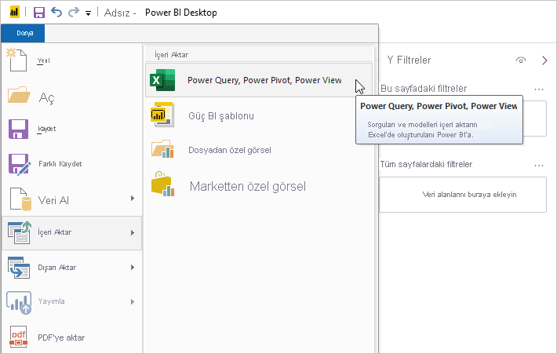

# Power BI Desktop'a Excel çalışma kitabı aktarma
Power BI Desktop’ı kullanarak, Power Query sorguları, Power Pivot modelleri ve Power View çalışma sayfaları içeren Excel çalışma kitaplarını, Power BI Desktop’a kolayca aktarabilirsiniz. Power BI Desktop, Excel çalışma kitabına göre otomatik olarak raporlar ve görselleştirmeler oluşturur. İçeri aktarma işlemini gerçekleştirdikten sonra Power BI Desktop ile hem var olan özellikler hem de her bir Power BI Desktop aylık güncelleştirmesi ile sunulan yeni özellikler sayesinde bu raporları geliştirmeye ve iyileştirmeye devam edebilirsiniz.

## Bir Excel çalışma kitabı nasıl içeri aktarılır?
1. Bir Excel çalışma kitabını Power BI Desktop'a aktarmak için **Dosya** > **İçeri Aktar** > **Power Query, Power Pivot, Power View**'ı seçin.

   

2. **Aç** penceresinden içeri aktarmak istediğiniz Excel çalışma kitabını seçin. 

   Şu anda çalışma kitabı boyutu veya içindeki nesne sayısı ile ilgili herhangi bir sınırlama yoktur ancak Power BI Desktop'ın daha büyük çalışma kitaplarını çözümlemesi ve içeri aktarması daha uzun zaman alır.

   > [!NOTE]
   > Paylaşılan OneDrive İş klasörlerindeki veya Microsoft 365 grup klasörlerindeki Excel dosyalarını yüklemek veya aktarmak için Excel dosyasının URL'sini kullanın ve bu URL'yi Power BI Desktop'taki Web veri kaynağına girin. OneDrive İş URL'sini doğru şekilde biçimlendirmek için uygulamanız gereken birkaç adım vardır. Daha fazla bilgi ve doğru adım dizisi için bkz. [Power BI Desktop'ta OneDrive İş bağlantılarını kullanma](desktop-use-onedrive-business-links.md).
   > 
   > 

3. Açılan içeri aktarma iletişim kutusunda **Başlat**'ı seçin.

   

   Power BI Desktop, çalışma kitabını analiz eder ve bir Power BI Desktop dosyasına (.pbix) dönüştürür. Bu tek seferlik bir işlemdir. Power BI Desktop dosyası bu adımlar uygulanarak oluşturulduktan sonra dosyanın özgün Excel çalışma kitabına hiçbir bağımlılığı kalmaz ve dosya, özgün çalışma kitabı etkilenmeden değiştirilebilir, kaydedilebilir ve paylaşılabilir.

   İçeri aktarma işlemi bittikten sonra, dönüştürülen öğeleri gösteren ve aynı zamanda içeri aktarılmayan öğeleri listeleyen bir özet sayfası görüntülenir.

   

4. **Kapat**’ı seçin. 

   Power BI Desktop, Excel çalışma kitabını içeri aktarır ve çalışma kitabı içeriğine göre bir rapor yükler.

   

Çalışma kitabı içeri aktarıldıktan sonra rapor üzerinde çalışmaya devam edebilirsiniz. Power BI Desktop'ta bulunan özellikleri ve işlevleri kullanarak yeni görselleştirmeler oluşturabilir, veri ekleyebilir veya yeni rapor sayfaları oluşturabilirsiniz.

## Çalışma kitabının hangi öğeleri içeri aktarılır?
Power BI Desktop, Excel'de bulunan ve genellikle *nesneler* olarak adlandırılan şu öğeleri içeri aktarabilir.

| Excel çalışma kitabı nesnesi | Power BI Desktop dosyasının son durumu |
| --- | --- |
| Power Query sorguları |Excel'den yapılan tüm Power Query sorguları, Power BI Desktop sorgularına dönüştürülür. Excel Çalışma Kitabında tanımlı sorgu grupları varsa aynı kuruluş Power BI Desktop'ta çoğaltılır. Excel'de **Verileri İçeri Aktar** iletişim kutusunda **Yalnızca Bağlantı Oluştur** ayarı yapılmadığı sürece tüm sorgular yüklenir. Yükleme davranışını, Power BI Desktop'taki Power Query Düzenleyicisi'nin **Giriş** sekmesinde bulunan **Özellikler**'i seçerek özelleştirebilirsiniz. |
| Power Pivot dış veri bağlantıları |Tüm Power Pivot dış veri bağlantıları, Power BI Desktop'ta sorgulara dönüştürülür. |
| Bağlantılı tablolar veya geçerli çalışma kitabı tabloları |Excel’de veri modeli veya bir sorgu ile bağlantılı bir çalışma sayfası tablosu varsa (M’de *From Table* veya *Excel.CurrentWorkbook()* işlevi kullanılarak) aşağıdaki seçenekler sunulur: <ol><li><b>Tabloyu Power BI Desktop dosyasına aktarın</b>. Bu tablo, verilerin bir defalık anlık görüntüsüdür. Bu işlemden sonra Power BI Desktop’taki tabloda bulunan veriler salt okunur olur. Bu seçenek kullanılarak oluşturulan tablolar için 1 milyon karakterlik (tüm sütun başlıklarının ve hücrelerin birleşiminden elde edilen toplam) bir boyut sınırlaması vardır.</li><li><b>Özgün çalışma kitabıyla bağlantıyı koruyun</b>. Alternatif olarak, özgün Excel Çalışma Kitabı ile bağlantıyı koruyabilirsiniz. Böylece Power BI Desktop, tıpkı Power BI Desktop'taki bir Excel çalışma kitabı için oluşturulan diğer sorgular gibi her yenilemeyle birlikte bu tablodaki en son içeriği alır.</li></ul> |
| Veri modelindeki hesaplanmış sütunlar, ölçüler, KPI’ler, veri kategorileri ve ilişkiler |Bu veri modeli nesneleri, Power BI Desktop'ta eşdeğer nesnelere dönüştürülür. Power BI Desktop’ta Resim gibi belirli veri kategorilerinin henüz kullanıma sunulmadığını göz önünde bulundurun. Böyle durumlarda veri kategorisi bilgileri, söz konusu sütunlar için sıfırlanır. |
| Power View çalışma sayfaları |Excel'deki her bir Power View çalışma sayfası için yeni bir rapor sayfası oluşturulur. Bu rapor sayfalarının adı ve sırası, özgün Excel çalışma kitabı ile eşleşir. |

## Bir çalışma kitabını içeri aktarmaya ilişkin herhangi bir sınırlama var mıdır?
Bir çalışma kitabını Power BI Desktop'a aktarmaya ilişkin birkaç sınırlama bulunur:

* **SQL Server Analysis Services tablosal modellerine dış bağlantılar:** Excel 2013'te SQL Server Analysis Services tablosal modellerine yönelik bağlantı oluşturmak ve verileri içeri aktarmadan bu modellerin üzerinde Power View raporları oluşturmak mümkündür. Bu tür bağlantılar şu anda Excel çalışma kitaplarını Power BI Desktop'a aktarma özelliğinin bir parçası olarak desteklenmemektedir. Geçici bir çözüm olarak, söz konusu dış bağlantıları Power BI Desktop'ta yeniden oluşturmanız gerekir.
* **Hiyerarşiler:** Bu veri modeli nesnesi türü şu anda Power BI Desktop'ta desteklenmemektedir. Bu nedenle, bir Excel çalışma kitabını Power BI Desktop'a aktarma işleminin bir parçası olarak hiyerarşiler atlanır.
* **İkili veri sütunları:** Bu tür bir veri modeli sütunu şu anda Power BI Desktop'ta desteklenmemektedir. İkili veri sütunları, Power BI Desktop'ta sonuç olarak elde edilen tabloda bulunmaz.
* **Desteklenmeyen Power View öğeleri:** Temalar veya belirli görselleştirme türleri (yürütme eksenli dağılım grafiği, detaya git davranışları vb.) gibi Power BI Desktop'ta henüz kullanılabilir olmayan bazı Power View özellikleri bulunmaktadır. Desteklenmeyen görselleştirmeler, Power BI Desktop raporundaki ilgili konumlarında *Desteklenmeyen Görselleştirme* benzer iletilerin bulunmasına neden olur, bu görselleştirmeleri silebilir veya gerektiği şekilde yeniden yapılandırabilirsiniz.
* **Power Query'de** ***From Table*** **kullanan veya M'de** ***Excel.CurrentWorkbook*** **kullanan Adlandırılmış Aralıklar:** Bu adlandırılmış aralık verilerini Power BI Desktop'a aktarma işlemi şu anda desteklenmese de planlanmış bir güncelleştirmedir. Bu adlandırılmış aralıklar şu anda Power BI Desktop'a bir dış Excel çalışma kitabı bağlantısı olarak yüklenir.
* **PowerPivot ile SSRS bağlantısı:** Veri kaynağı şu anda Power BI Desktop'ta kullanılabilir olmadığından SQL Server Reporting Services'e (SSRS) yönelik PowerPivot dış bağlantıları şu anda desteklenmemektedir.

