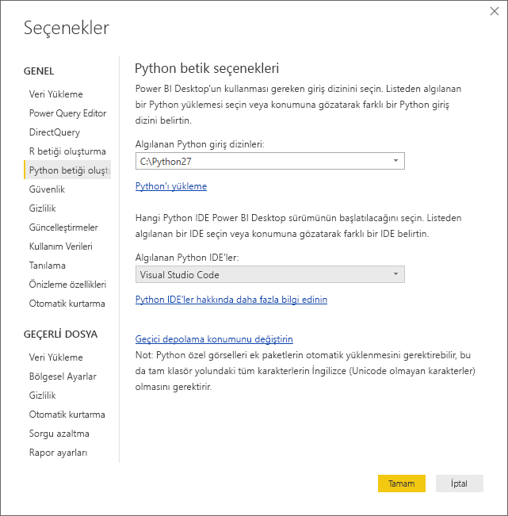
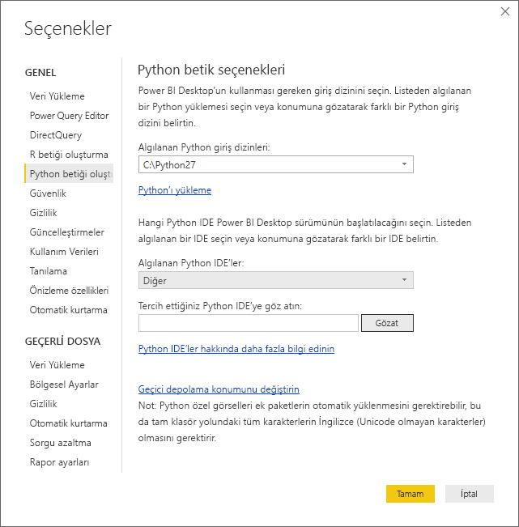
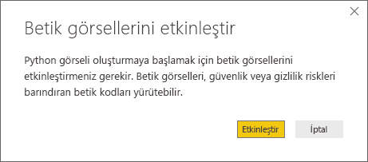
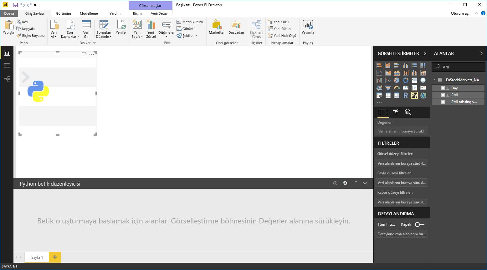
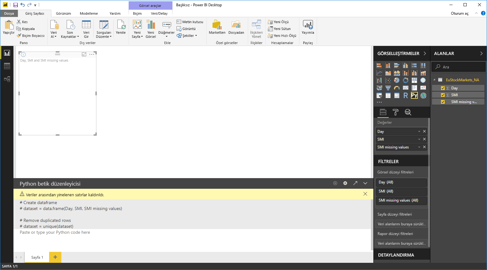
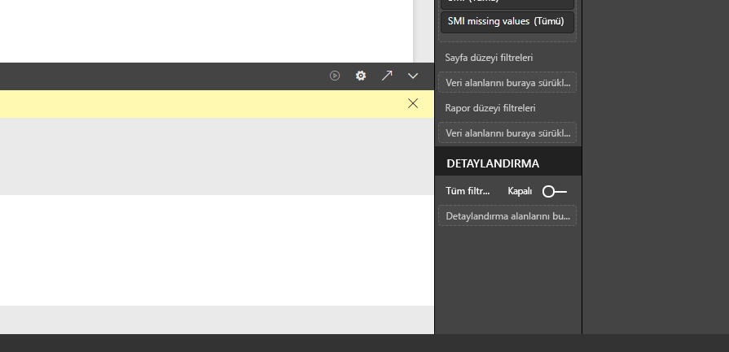
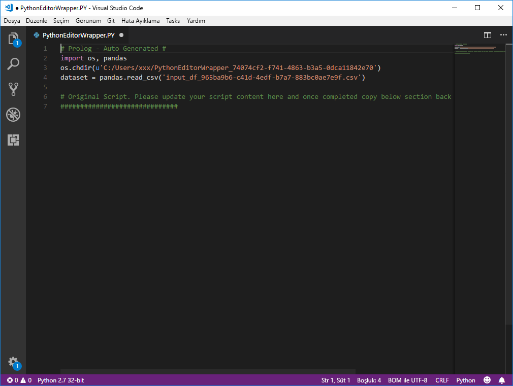

# Power BI ile harici bir Python IDE kullanma
**Power BI Desktop** ile dış Python IDE'nizi (Tümleşik Geliştirme Ortamı) kullanarak Python betikleri oluşturabilir ve geliştirebilir, ardından da söz konusu betikleri Power BI'da kullanabilirsiniz.

## Dış Python IDE'leri etkinleştirme
Dış Python IDE'nizi **Power BI Desktop**'ta başlatabilir ve verilerinizin otomatik olarak Python IDE'ye aktarılmasını ve burada görüntülenmesini sağlayabilirsiniz. Burada, betiği söz konusu Python IDE'de değiştirebilir ve ardından **Power BI Desktop**'a yapıştırarak Power BI görselleri ve raporları oluşturabilirsiniz.

Kullanmak istediğiniz Python IDE'yi belirtebilir ve **Power BI Desktop**'ta otomatik olarak başlatılmasını sağlayabilirsiniz.

### Gereksinimler
Bu özelliği kullanmak için yerel bilgisayarınıza **Python IDE** yüklemeniz gerekir. **Power BI Desktop** Python motoru içermez, dağıtmaz veya yüklemez. Bu nedenle, **Python**’ı yerel bilgisayarınıza ayrı olarak yüklemeniz gerekir. Hangi Python IDE'yi kullanmak istediğinizi seçebilirsiniz. Bu işlem için aşağıdaki şekillerde ilerleyebilirsiniz:

* [Visual Studio Code indirme sayfası](https://code.visualstudio.com/download/) gibi kaynaklardan çoğu ücretsiz olarak sunulan Python IDE'ler arasından favorinizi yükleyebilirsiniz.
* **Power BI Desktop**, **Visual Studio**'yu da destekler.
* Ayrıca aşağıdakilerden birini gerçekleştirerek farklı bir Python IDE yükleyebilir ve **Power BI Desktop**'ın söz konusu **Python IDE**'yi açmasını sağlayabilirsiniz:
  
  * **.PY** dosyalarını, **Power BI Desktop**'ın açmasını istediğiniz dış IDE ile ilişkilendirebilirsiniz.
  * **Seçenekler** iletişim kutusunun **Python Betik Seçenekleri** bölümündeki *Diğer* seçeneğini belirleyerek, **Power BI Desktop**'ın açması gereken .exe dosyasını belirtebilirsiniz. **Dosya > Seçenekler ve ayarlar > Seçenekler**'e giderek **Seçenekler** iletişim kutusunu görüntüleyebilirsiniz.
    
    

Yüklü birden çok Python IDE'niz varsa **Seçenekler** iletişim kutusundaki *Algılanan Python IDE'ler* açılan menüsünden seçim yaparak, hangisinin açılacağını belirtebilirsiniz.

Varsayılan olarak, **Power BI Desktop** dış Python IDE olarak **Visual Studio Code**'u açar (yerel bilgisayarınızda yüklüyse); **Visual Studio Code** yüklü değilse ve **Visual Studio**'ya sahipseniz bu başlatılır. Bu iki Python IDE'den hiçbiri yüklü değilse **.PY** dosyalarıyla ilişkili olan uygulama açılır.

Herhangi bir **.PY** dosyası ilişkilendirmesi bulunmuyorsa, **Seçenekler** iletişim kutusunun *Tercih ettiğiniz Python IDE'ye göz atın* bölümünde bir özel IDE'ye ilişkin yolu belirtebilirsiniz. Ayrıca **Python IDE'yi başlat** ok simgesinin yanındaki **Ayarlar** dişli simgesini seçerek **Power BI Desktop**'ta farklı bir Python IDE de başlatabilirsiniz.

## Power BI Desktop'ta Python IDE başlatma
**Power BI Desktop**'ta Python IDE başlatmak için aşağıdaki adımları uygulayın:

1. **Power BI Desktop**'a veri yükleyin.
2. **Alanlar** bölmesinden birlikte çalışmak istediğiniz alanlar seçin. Henüz betik görsellerini etkinleştirmediyseniz bunu gerçekleştirmeniz istenir.
   
   
3. Betik görselleri etkinleştirildiğinde, **Görsel Öğeler** bölmesinden bir Python görseli seçebilir ve betiğinizin sonuçlarını görüntülemeye hazır, boş bir Python görselinin oluşturulmasını sağlayabilirsiniz. **Python betik düzenleyicisi** bölmesi de görüntülenir.
   
   
4. Artık Python betiğinizde kullanmak istediğiniz alanları seçebilirsiniz. Bir alan seçtiğinizde, **Python betik düzenleyicisi** alanı otomatik olarak, seçtiğiniz alanı veya alanları temel alan betik kodları oluşturur. Python betiğinizi doğrudan **Python betik düzenleyicisi** bölmesinde oluşturabilir (veya buraya yapıştırabilir) ya da bölmeyi boş bırakabilirsiniz.
   
   
   
   > [!NOTE]
   > Python görselleri için varsayılan toplama işlemi *özetleme*'dir.
   > 
   > 
5. Şimdi Python IDE'nizi doğrudan **Power BI Desktop**'tan başlatabilirsiniz. Aşağıda gösterildiği gibi, **Python betik düzenleyicisi** başlık çubuğunun sağ tarafında bulunan **Python IDE'yi başlat** düğmesini seçin.
   
   
6. Aşağıdaki görüntüde gösterildiği gibi, belirttiğiniz Python IDE Power BI Desktop tarafından açılır (bu görüntüde, **Visual Studio Code** varsayılan Python IDE'dir).
   
   
   
   > [!NOTE]
   > **Power BI Desktop**, betiği çalıştırdığınızda **Power BI Desktop**'taki verilerin içeri aktarılabilmesini sağlamak için ilk üç satırı ekler.
   > 
   > 
7. **Power BI Desktop**'ın **Python betik düzenleyicisi bölmesinde** oluşturduğunuz her betik Python IDE'nizdeki 4. satırdan itibaren yer alır. Bu noktada Python betiğinizi Python IDE’de oluşturabilirsiniz. Python IDE'nizde Python betiğinizi tamamladıktan sonra, bunu kopyalayıp **Power BI Desktop**'taki **Python betik düzenleyicisi** bölmesine yapıştırırken, **Power BI Desktop**'ın otomatik olarak oluşturduğu betiğin ilk üç satırını *dışlamanız* gerekir. Betiğin ilk üç satırını **Power BI Desktop**'a geri yapıştırmayın, bu satırlar yalnızca **Power BI Desktop**'taki Python IDE'nizi içeri aktarmak için kullanılmıştır.

### Bilinen sınırlamalar
Doğrudan Power BI Desktop'tan bir Python IDE başlatma ile ilgili birkaç sınırlama bulunur:

* Betiğinizin Python IDE'den **Power BI Desktop**'a otomatik olarak aktarılması desteklenmez.

## Sonraki adımlar
Power BI'da Python kullanımı ile ilgili aşağıdaki ek bilgilere göz atın.

* [Power BI Desktop'ta Python Betikleri Çalıştırma](desktop-python-scripts.md)
* [Python programlama dilini kullanarak Power BI görselleri oluşturma](desktop-python-visuals.md)

