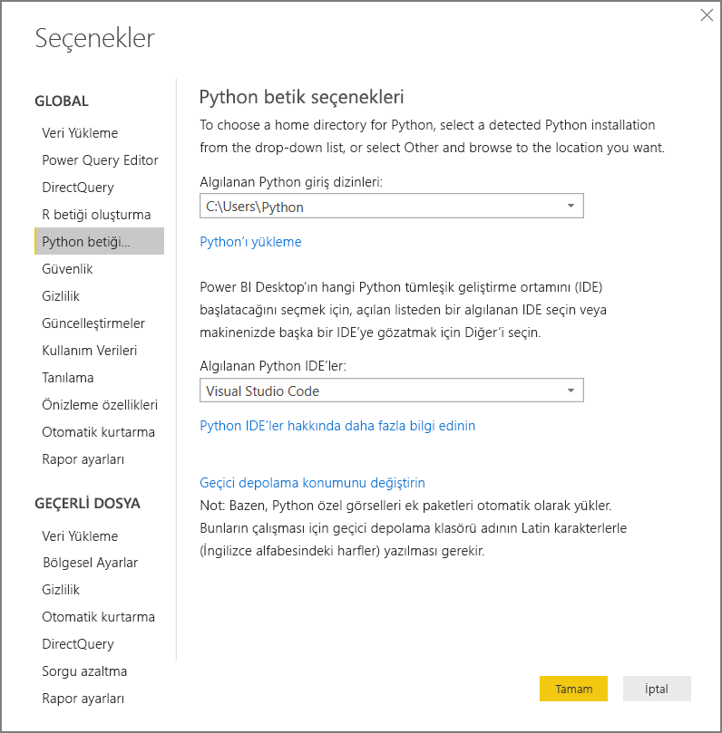
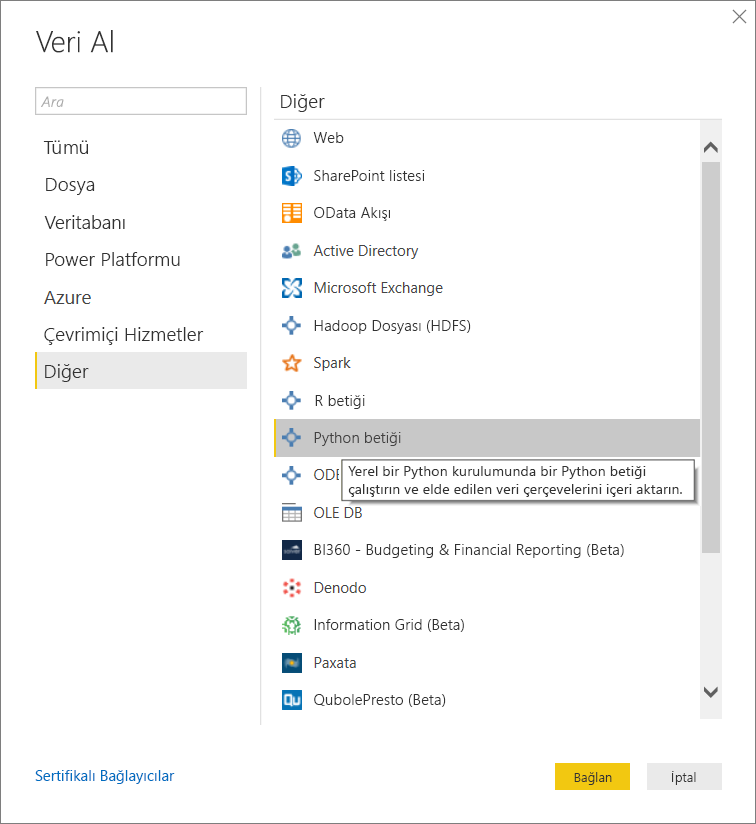
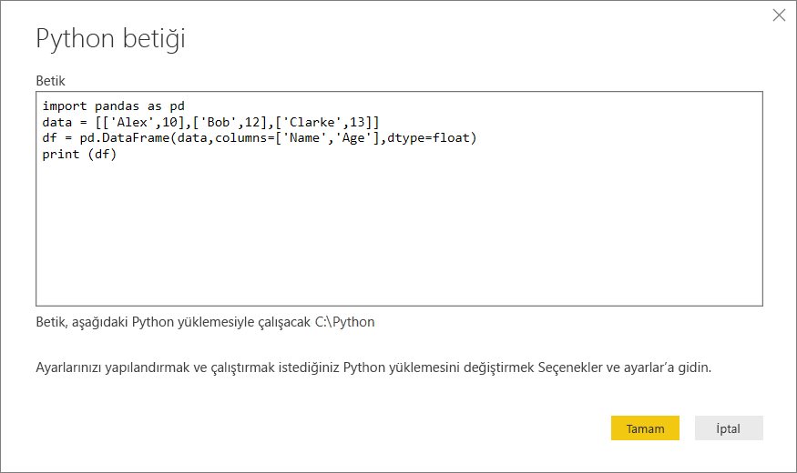
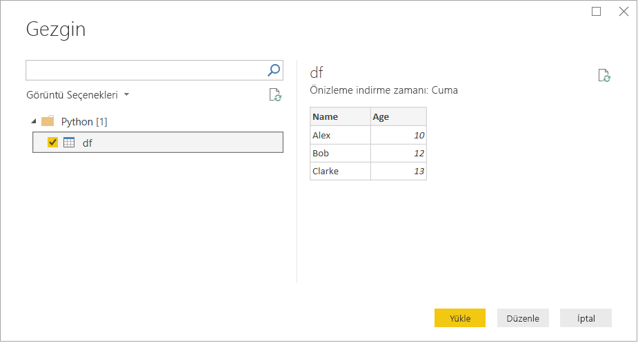
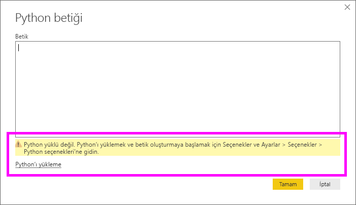

# <a name="run-python-scripts-in-power-bi-desktop"></a>Power BI Desktop'ta Python Betikleri Çalıştırma

Power BI Desktop'ta Python betiklerini doğrudan çalıştırabilir ve elde edilen veri kümelerini bir Power BI Desktop veri modeline aktarabilirsiniz.

## <a name="install-python"></a>Python'ı yükleme

Power BI Desktop'ta Python betikleri çalıştırabilmek için yerel makinenize Python yüklemeniz gerekir. Python’ı [Python web sitesinden](https://www.python.org/) indirebilirsiniz. Geçerli Python betik sürümü, yükleme yolunda Unicode karakterlerini ve boşlukları destekler.

### <a name="install-required-python-packages"></a>Gerekli Python paketlerini yükleme

Power BI Python tümleştirmesi için iki Python paketinin yüklenmesi gerekir:

* [Pandas](https://pandas.pydata.org/). Veri işleme ve analiz için bir yazılım kitaplığı. Sayısal tabloları ve zaman serilerini işlemek için veri yapıları ve işlemler sunar. İçeri aktarılan verilerinizin bir [pandas veri çerçevesinde](https://www.tutorialspoint.com/python_pandas/python_pandas_dataframe.htm) yer alması gerekir. Veri çerçevesi iki boyutlu bir veri yapısıdır. Örneğin veriler tablo şeklinde, satırlar ve sütunlar halinde hizalanır.
* [Matplotlib](https://matplotlib.org/). Python için çizim kitaplığı ve bunun sayısal [NumPy](https://www.numpy.org/) matematik uzantısı. Tkinter, wxPython, Qt veya GTK+ gibi genel amaçlı GUI araç setlerini kullanarak çizimleri uygulamalara eklemek için nesne yönelimli bir API sağlar.

İki paketi yüklemek için konsolda veya kabukta [pip](https://pip.pypa.io/en/stable/) komut satırı aracını kullanın. Pip aracı en son Python sürümleriyle birlikte paketlenmiştir.

```CMD
pip install pandas
pip install matplotlib
```

## <a name="enable-python-scripting"></a>Python betiğini etkinleştirme

Python betiğini etkinleştirmek için:

1. Power BI Desktop’ta **Dosya** > **Seçenekler ve ayarlar** > **Seçenekler** > **Python betiği**’ni seçin. **Python betiği seçenekleri** sayfası görüntülenir.

   

1. Gerekirse, **Algılanan Python giriş dizinleri**’nde yerel Python yükleme yolunuzu belirtin.

   Yukarıdaki resimde Python'ın yerel yükleme yolu *C:\Python* dizinidir. Bu yolun, Power BI Desktop'ın kullanmasını istediğiniz yerel Python yüklemesine ait olduğundan emin olun.

1. **Tamam**’ı seçin.

Python yüklemenizi belirttikten sonra Power BI Desktop’ta Python görsellerini çalıştırmaya başlamak için hazırsınız demektir.

## <a name="run-python-scripts"></a>Python betiklerini çalıştırma

Yalnızca birkaç adımda Python betiklerini çalıştırabilir ve veri modeli oluşturabilirsiniz. Bu modelden raporlar oluşturabilir ve bunları Power BI hizmetinde paylaşabilirsiniz.

### <a name="prepare-a-python-script"></a>Python betiği hazırlama

İlk olarak yerel Python geliştirme ortamınızda bir betik oluşturun ve bu betiğin başarıyla çalıştığından emin olun. Örneğin burada pandas’ı içeri aktaran ve bir veri çerçevesi kullanan basit bir Python betiği verilmiştir:

```python
import pandas as pd
data = [['Alex',10],['Bob',12],['Clarke',13]]
df = pd.DataFrame(data,columns=['Name','Age'],dtype=float)
print (df)
```

Bu betik çalıştırıldığında şunu döndürür:

```python
     Name   Age
0    Alex  10.0
1     Bob  12.0
2  Clarke  13.0
```

Power BI Desktop'ta bir Python betiğini hazırlamaya ve çalıştırmaya ilişkin bazı sınırlamalar vardır:

* Yalnızca pandas veri çerçeveleri içeri aktarılır; dolayısıyla Power BI’a aktarmak istediğiniz verilerin veri çerçevesinde temsil edildiğinden emin olun
* 30 dakikadan uzun süren herhangi bir Python betiği çalıştırma işlemi zaman aşımına uğrar
* Python betiğindeki etkileşimli çağrılar (kullanıcı girişinin beklenmesi gibi) betik yürütme işlemini durdurur
* Python betiğindeki çalışma dizinini ayarlarken çalışma dizinine yönelik bir tam yol (göreli yol yerine) tanımlamanız *gerekir*
* İç içe tablolar şu anda desteklenmemektedir

### <a name="run-your-python-script-and-import-data"></a>Python betiğinizi çalıştırma ve verileri içeri aktarma

Power BI Desktop’ta Python Betiğinizi çalıştırmak için:

1. Giriş şeridinde **Veri Al** > **Diğer**’i seçin.

1. Aşağıdaki resimde gösterildiği gibi **Diğer** > **Python betiği**’ni seçin:

   

1. **Bağlan**'ı seçin. Python altyapınız olarak yerel olarak en son yüklenen Python sürümü seçilir. Betiğinizi görüntülenen **Python betiği** iletişim kutusuna kopyalayın. Burada, daha önce gösterilen basit Python betiğini girdik.

   

1. **Tamam**’ı seçin. Betik başarıyla çalıştırılırsa **Gezgin** görüntülenir ve verileri yükleyip kullanabilirsiniz. Örneğin resimde gösterildiği gibi **df**’yi ve ardından **Yükle**’yi seçin.

    

### <a name="troubleshooting"></a>Sorun Giderme

Python yüklenmez veya tanımlanmazsa bir uyarı görüntülenir. Birden fazla yerel makine yüklemeniz olduğunda da uyarı görebilirsiniz. Önceki Python’ı yükleme ve Python betiğini etkinleştirme bölümlerini yeniden ziyaret edin ve gözden geçirin.



#### <a name="using-custom-python-distributions"></a>Özel Python dağıtımlarını kullanma

Power BI, betikleri kullanıcı tarafından sağlanan bir dizinde bulunan (ayarlar sayfası ile sağlanır) python.exe yürütülebilir dosyasını kullanarak yürütür. Ortamın hazırlanması için ek bir adımın gerçekleştirilmesini gerektiren dağıtımlar (örneğin, Conda) yürütme işleminin başarısız olduğu yerde sorunla karşılaşabilir.

Bu tür sorunları yaşamamak için https://www.python.org/ adresinden edindiğiniz resmi Python dağıtımını kullanmanız önerilir.

Olası bir çözüm olarak, Power BI Desktop’u özel Python ortamı isteminizden başlatabilirsiniz.

### <a name="refresh"></a>Yenile

Power BI Desktop'ta bir Python betiğini yenileyebilirsiniz. Yenilemek için **Giriş** şeridine gidin ve **Yenile**’yi seçin. Python betiğini yenilediğinizde Power BI Desktop Python betiğini yeniden çalıştırır.

## <a name="next-steps"></a>Sonraki adımlar

Power BI'da Python kullanımı ile ilgili aşağıdaki ek bilgilere göz atın.

* [Power BI Desktop'ta Python Görselleri Oluşturma](desktop-python-visuals.md)
* [Power BI ile harici bir Python IDE kullanma](desktop-python-ide.md)
