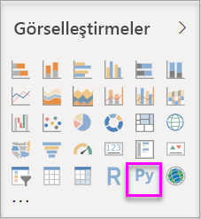
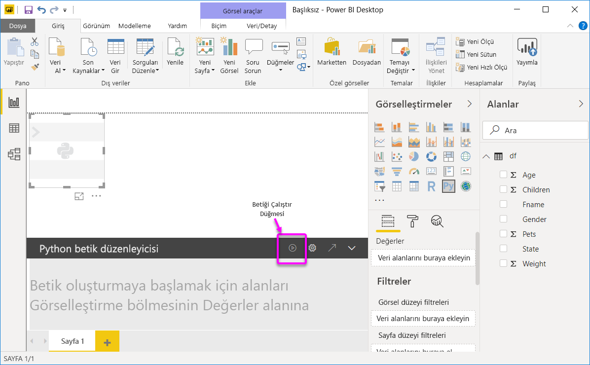
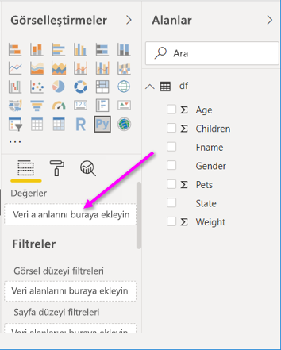
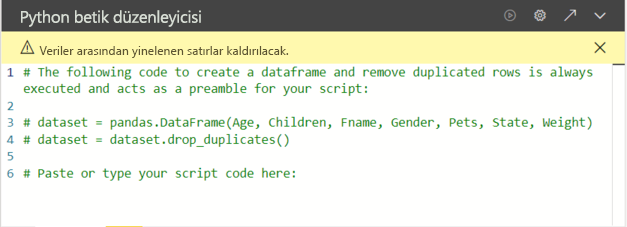
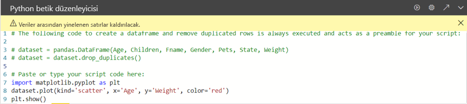
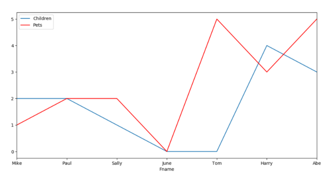
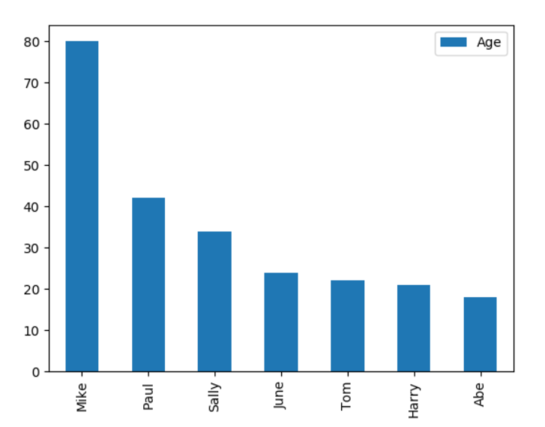

# <a name="create-power-bi-visuals-by-using-python"></a>Python programlama dilini kullanarak Power BI görselleri oluşturma

*Power BI Desktop* ile, verilerinizi görselleştirmek için Python programlama dilini kullanabilirsiniz.

## <a name="prerequisites"></a>Önkoşullar

Aşağıdaki Python betiğini kullanarak [Power BI Desktop’ta Python betiklerini çalıştırma](desktop-python-scripts.md) öğreticisinin üzerinden geçin:

```python
import pandas as pd 
df = pd.DataFrame({ 
    'Fname':['Harry','Sally','Paul','Abe','June','Mike','Tom'], 
    'Age':[21,34,42,18,24,80,22], 
    'Weight': [180, 130, 200, 140, 176, 142, 210], 
    'Gender':['M','F','M','M','F','M','M'], 
    'State':['Washington','Oregon','California','Washington','Nevada','Texas','Nevada'],
    'Children':[4,1,2,3,0,2,0],
    'Pets':[3,2,2,5,0,1,5] 
}) 
print (df) 
```

[Power BI Desktop’ta Python betiklerini çalıştırma](desktop-python-scripts.md) makalesinde yerel makinenize Python yükleme ve Power BI Desktop’ta Python betiği oluşturmak için etkinleştirme işlemleri gösterilir. Bu öğreticide Python görsellerinin nasıl oluşturulduğunu göstermek için yukarıdaki betikten veriler kullanılır.

## <a name="create-python-visuals-in-power-bi-desktop"></a>Power BI Desktop'ta Python görselleri oluşturma

1. **Görsel Öğeler** bölgesinde **Python görseli** simgesini seçin.

   

1. Görüntülenen **Betik görsellerini etkinleştir** iletişim kutusunda **Etkinleştir**’i seçin.

    Rapora Python görseli eklediğinizde Power BI Desktop aşağıdaki eylemleri gerçekleştirir:

    - Rapor tuvalinde bir yer tutucu Python görseli görüntüsü görünür.

    - Orta bölmenin alt kısmında **Python betik düzenleyicisi** görünür.

    

1. Ardından **Buraya veri alanlarını ekleyin** ifadesinin bulunduğu **Değerler** bölümüne **Age**, **Children**, **Fname**, **Gender**, **Pets**, **State** ve **Weight** alanlarını sürükleyin.

    

   Python betiğiniz yalnızca **Değerler** bölümüne eklenmiş olan alanları kullanabilir. Python betiğinizin üzerinde çalışırken **Değerler** bölümünde alanları ekleyip kaldırabilirsiniz. Power BI Desktop alan değişikliklerini otomatik olarak algılar.

   > [!NOTE]
   > Python görselleri için varsayılan toplama işlemi *özetleme*'dir.
   > 
   > 

1. Artık bir çizim oluşturmak için seçtiğiniz verileri kullanabilirsiniz.

    Alanları seçtiğinizde veya kaldırdığınızda Python betik düzenleyicisinde bunu destekleyen kod otomatik olarak oluşturulur veya kaldırılır. 

    Seçimlerinize dayanarak Python betik düzenleyicisi aşağıdaki bağlama kodunu oluşturur.

    - Düzenleyici, sizin eklediğiniz alanlarla *dataset* veri çerçevesini oluşturur.
    - Varsayılan toplama türü şudur: *özetleme*.
    - Tablo görsellerinde olduğu gibi alanlar da gruplandırılır ve yinelenen satırlar yalnızca bir kez görünür.

    

     > [!TIP]
     > Bazı durumlarda, otomatik gruplandırma işleminin gerçekleştirilmesini istemez veya yinelenenler de dahil olmak üzere tüm satırların görünmesini istersiniz. Bu durumda veri kümenize bir dizin alanı ekleyebilirsiniz. Böylece, tüm satırların benzersiz olduğu kabul edilir ve gruplandırma yapılması önlenir.

   Veri kümesindeki sütunlara adlarını kullanarak erişebilirsiniz. Örneğin yaş alanına erişmek için Python betiğinizde `dataset["Age"]` kodlaması yapabilirsiniz.

1. Seçtiğiniz alanlara göre otomatik olarak oluşturulan veri çerçevesi ile Python betiği yazmaya hazır hale gelirsiniz. Python betiği yazdığınızda, varsayılan Python cihazında bir çizim oluşturulur. Betik tamamlandığında **Python betik düzenleyicisi** başlık çubuğunda **Çalıştır**’ı seçin.

   Aşağıdaki olaylardan biri oluşursa Power BI Desktop görseli yeniden çizer:

   - **Python betik düzenleyicisi** başlık çubuğunda **Çalıştır** seçeneğini belirlediğinizde
   - Veri yenileme, filtreleme veya vurgulama işlemi nedeniyle her veri değişikliği gerçekleştiğinde

   Çalıştırdığınız Python betiği hatayla sonuçlanırsa Python görseli çizilmez ve tuvalde hata iletisi görüntülenir. Hata ayrıntıları için iletiden **Ayrıntılara bakın**’ı seçin.

   Görselleştirmelerin daha büyük bir görünümünü elde etmek için **Python betik düzenleyicisi**'ni simge durumuna küçültebilirsiniz.

Şimdi de bazı görseller oluşturalım.

## <a name="create-a-scatter-plot"></a>Dağılım çizimi oluşturma

Yaş ile kilo arasında bir bağıntı olup olmadığını görmek için bir dağılım çizimi oluşturalım.

1. **Betik kodunuzu buraya yazın veya yapıştırın** metninin altına şu kodu girin:

   ```python
   import matplotlib.pyplot as plt 
   dataset.plot(kind='scatter', x='Age', y='Weight', color='red')
   plt.show() 
   ```  

   Python betik düzenleyicisi bölmeniz şimdi şöyle görünmelidir:

   

   Görsellerimizi çizmek ve oluşturmak için **matplotlib** kitaplığı içeri aktarılır.

1. Betik için **Çalıştır** düğmesini seçtiğinizde, yer tutucu Python görseli resminde aşağıdaki dağılım çizimi oluşturulur.

   

## <a name="create-a-line-plot-with-multiple-columns"></a>Birden çok sütunla çizgi çizimi oluşturma

 Kişilerden her biri için çocuklarının ve evcil hayvanlarının sayısını gösteren bir çizgi çizimi oluşturalım. **Betik kodunuzu buraya yazın veya yapıştırın** metninin altındaki kodu kaldırın veya açıklamaya dönüştürün ve şu Python kodunu girin:

 ```python
 import matplotlib.pyplot as plt 
ax = plt.gca() 
dataset.plot(kind='line',x='Fname',y='Children',ax=ax) 
dataset.plot(kind='line',x='Fname',y='Pets', color='red', ax=ax) 
plt.show() 
```

Betik için **Çalıştır** düğmesini seçtiğinizde birden çok sütunlu aşağıdaki çizgi çizimi oluşturulur.



## <a name="create-a-bar-plot"></a>Çubuk çizimi oluşturma

Kişilerden her birinin yaşı için bir çubuk çizimi oluşturalım. **Betik kodunuzu buraya yazın veya yapıştırın** metninin altındaki kodu kaldırın veya açıklamaya dönüştürün ve şu Python kodunu girin:

```python
import matplotlib.pyplot as plt 
dataset.plot(kind='bar',x='Fname',y='Age') 
plt.show() 
```

Betik için **Çalıştır** düğmesini seçtiğinizde aşağıdaki çubuk çizimi oluşturulur:

 

## <a name="security"></a>Güvenlik

> [!IMPORTANT] 
> **Python betiklerinin güvenliği:** Python görselleri, güvenlik veya gizlilik riskleri taşıyan kodlar içerebilecek Python betiklerinden oluşturulur. Bir Python görselini ilk kez görüntülemeye veya Python görseliyle ilk kez etkileşim kurmaya çalışan kullanıcılar bir güvenlik uyarısı iletisiyle karşılaşır. Python görsellerini yalnızca, yazara ve kaynağa güvenmeniz halinde veya ilgili Python betiğini gözden geçirip anladıktan sonra etkinleştirin.
>  

## <a name="more-information-about-plotting-with-matplotlib-pandas-and-python"></a>Matplotlib, Pandas ve Python ile çizim yapma hakkında daha fazla bilgi

Bu öğretici Power BI Desktop’ta Python ile görseller oluşturmaya başlamanıza yardımcı olmak için tasarlanmıştır. Python, Pandas ve Matplotlib kitaplığını kullanarak görsel raporlar oluşturmaya yönelik çok sayıda seçeneğine ve özelliğe yalnızca yüzeysel olarak değinilmiştir. Araştırırsanız çok daha fazla bilgi bulabilirsiniz ve başlangıç yapmanız için burada birkaç bağlantı verilmiştir.

- [Matplotlib](https://matplotlib.org/) web sitesindeki belgeler. 
- [Matplotlib Öğreticisi: Python ile Matplotlib Kullanımı için Temel Kılavuz](https://www.datasciencelearner.com/matplotlib-tutorial-complete-guide-to-use-matplotlib-with-python/) 
- [Matplotlib Öğreticisi – Örneklerle Python Matplotlib Kitaplığı](https://www.edureka.co/blog/python-matplotlib-tutorial/) 
- [Pandas API Başvurusu](https://pandas.pydata.org/pandas-docs/stable/reference/index.html) 
- [Power BI Hizmeti’nde Python görselleştirmeleri](https://powerbi.microsoft.com/blog/python-visualizations-in-power-bi-service/) 
- [Power BI’da Python Görsellerini Kullanma](https://www.absentdata.com/how-to-user-python-and-power-bi/)

## <a name="known-limitations"></a>Bilinen sınırlamalar

Power BI Desktop'ta Python görsellerine ilişkin bazı sınırlamalar vardır:

- Dosya boyutu sınırlamaları. Python görseli tarafından çizim için kullanılan veriler 150.000 satırla sınırlıdır. 150.000'den fazla satır seçilirse yalnızca ilk 150.000 satır kullanılır ve görüntünün üzerinde bir ileti görüntülenir. Bunun yanı sıra, giriş verileri için 250 MB sınırı vardır. 
- Çözünürlük. Tüm Python görselleri 72 DPI çözünürlükte görüntülenir.
- Hesaplama süresi sınırlaması. Python görseli hesaplaması beş dakikadan uzun sürerse betik zaman aşımına uğrar ve sonuçta hata oluşur.
- İlişkiler. Diğer Power BI Desktop görsellerinde olduğu gibi, aralarında tanımlanmış hiçbir ilişki bulunmayan farklı tablolardan veri alanları seçilirse hata oluşur.
- Python görselleri veri güncelleştirme, filtreleme ve vurgulama işlemlerinden sonra yenilenir. Ancak, görüntünün kendisi etkileşimli değildir ve çapraz filtrelemenin kaynağı olamaz.
- Python görselleri diğer görselleri vurgulama işlemine yanıt verir ancak diğer öğelere çapraz filtreleme uygulamak için Python görselindeki öğelere tıklayamazsınız.
- Yalnızca varsayılan Python görüntüleme cihazında çizilen çizimler tuval üzerinde doğru şekilde görüntülenir. Farklı bir Python görüntüleme cihazını açıkça kullanmaktan kaçının.
- Python görselleri, giriş sütunlarının yeniden adlandırılmasını desteklemez. Betik yürütme sırasında sütunlara özgün adlarıyla başvurulur.

## <a name="next-steps"></a>Sonraki adımlar

Power BI'da Python kullanımı ile ilgili aşağıdaki ek bilgilere göz atın.

- [Power BI Desktop'ta Python Betikleri Çalıştırma](desktop-python-scripts.md)
- [Power BI ile harici bir Python IDE kullanma](desktop-python-ide.md)

