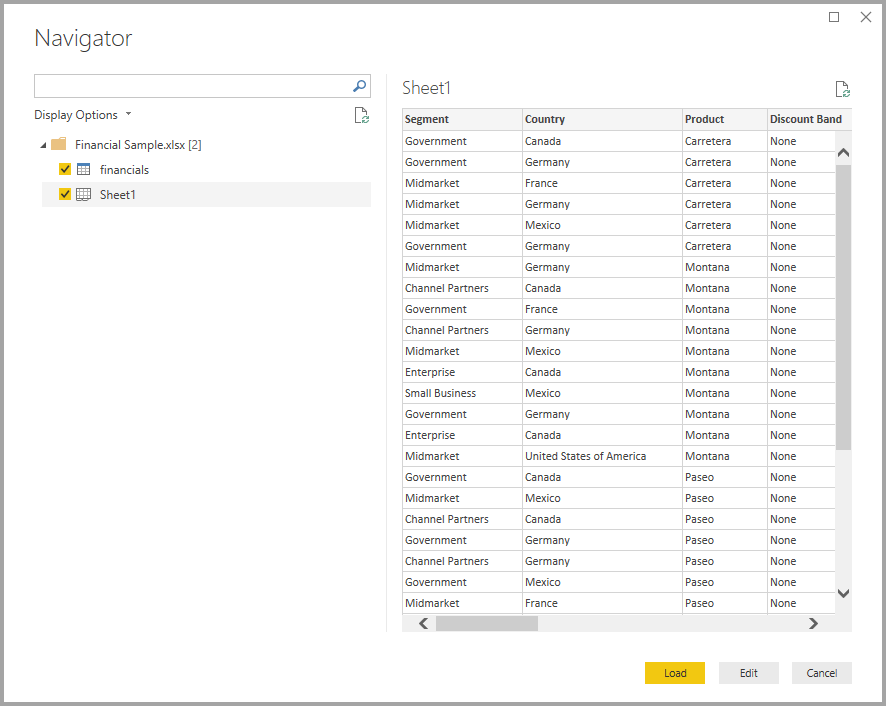

# Hızlı Başlangıç: Power BI Desktop’ta verilere bağlanma

Bu hızlı başlangıçta, veri modelleri derleme ve raporlar oluşturma işleminin ilk adımı olarak Power BI Desktop kullanarak verilere bağlanacaksınız.

PowerApps’e kaydolmadıysanız başlamadan önce [ücretsiz deneme için kaydolun](https://app.powerbi.com/signupredirect?pbi_source=web).

## Önkoşullar

Bu makaledeki adımları tamamlamak için aşağıdaki kaynaklar gereklidir:

* Yerel bilgisayarınızda çalışan ücretsiz bir uygulama olan Power BI Desktop’ı indirin ve yükleyin. [Power BI Desktop’ı doğrudan indirebilir](https://powerbi.microsoft.com/desktop) veya [Microsoft Store](https://aka.ms/pbidesktopstore)’dan edinebilirsiniz.
* [Bu örnek Excel çalışma kitabını indirin](https://go.microsoft.com/fwlink/?LinkID=521962) ve Excel dosyasını depolayabileceğiniz *C:\PBID-qs* adlı bir klasör oluşturun. Bu hızlı başlangıcın sonraki adımlarında, indirilen Excel çalışma kitabı için dosya konumunun burası olduğu varsayılır.
* Birçok Power BI Desktop veri bağlayıcısı, kimlik doğrulaması için Internet Explorer 10 (veya daha yeni bir sürümü) uygulamasına ihtiyaç duyar.

## Power BI Desktop'ı başlatma

Power BI Desktop’ı yükledikten sonra yerel bilgisayarınızda çalışması için uygulamayı başlatın. Bir Power BI öğreticisi gösterilir. Öğreticiyi izleyin veya iletişim kutusunu kapatarak boş bir tuval ile başlayın. Tuval, verilerinizi kullanarak görsel ve rapor oluşturduğunuz alandır.

## Verilere bağlanma

Power BI Desktop ile birçok farklı türde veriye bağlanabilirsiniz. Bu kaynaklar arasında Microsoft Excel dosyaları gibi temel veri kaynakları da mevcuttur. Her türlü veriyi içeren Salesforce, Microsoft Dynamics, Azure Blob Depolama ve daha birçok çevrimiçi hizmete bağlanabilirsiniz.

Verilere bağlanmak için **Giriş** şeridindeki **Veri Al** seçeneğini belirleyin.

**Veri Al** penceresi açılır. Power BI Desktop’ın bağlanabileceği çok sayıda farklı veri kaynağı arasından seçim yapabilirsiniz. Bu hızlı başlangıçta, [Önkoşullar](#prerequisites) bölümünde indirdiğiniz Excel çalışma kitabını kullanın.

Veri kaynağı bir Excel dosyası olduğu için, **Veri Al** penceresinde **Excel**’i, ardından **Bağlan** düğmesini seçin.

Power BI, bağlanmak istediğiniz Excel dosyasının konumunu belirtmenizi ister. İndirilen dosyanın adı *Financial Sample* olarak belirlenmiştir. Bu dosyayı seçin ve sonra **Aç**'ı seçin.

Power BI Desktop daha sonra çalışma kitabını yükleyip içeriğini okur ve **Gezgin** penceresini kullanarak dosyadaki kullanılabilir verileri gösterir. Bu pencereden Power BI Desktop’a yüklemek istediğiniz verileri seçebilirsiniz. İçeri aktarmak istediğiniz her bir tablonun yanındaki onay kutularını işaretleyerek tabloları seçin. Kullanılabilir tabloların ikisini de içeri aktarın.

Seçimlerinizi yaptıktan sonra, verileri Power BI Desktop’a aktarmak için **Yükle**’yi seçin.

## Alanlar bölmesindeki verileri görüntüleme

Tabloları yükledikten sonra **Alanlar** bölmesi size verileri gösterir. Bir tablo adının yanındaki oku seçerek tabloyu genişletebilirsiniz. Aşağıdaki görüntüde *mali bilgiler* tablosu genişletilerek her bir alanı gösterilmiştir.

İşte bu kadar! Power BI Desktop’taki verilere bağlandınız, verileri yüklediniz ve artık bu tablolardaki tüm kullanılabilir alanları görebilirsiniz.

## Sonraki adımlar

Verilere bağlandıktan sonra, Power BI Desktop ile yapabileceğiniz birçok farklı işlem vardır. Görseller ve raporlar oluşturabilirsiniz. Başlamak için aşağıdaki kaynağa göz atın:

* [Power BI Desktop ile çalışmaya başlama](../fundamentals/desktop-getting-started.md)
