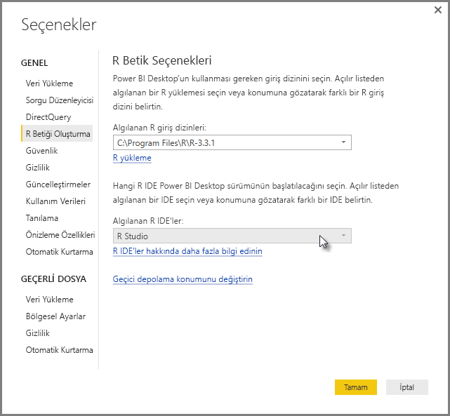
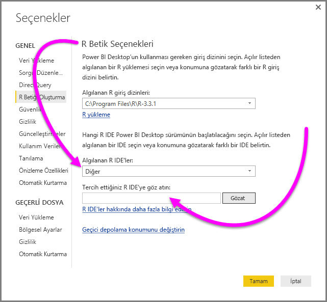
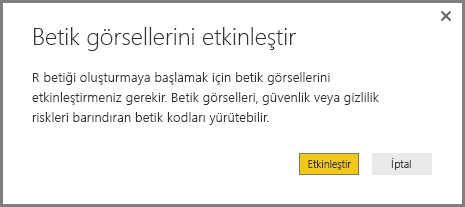
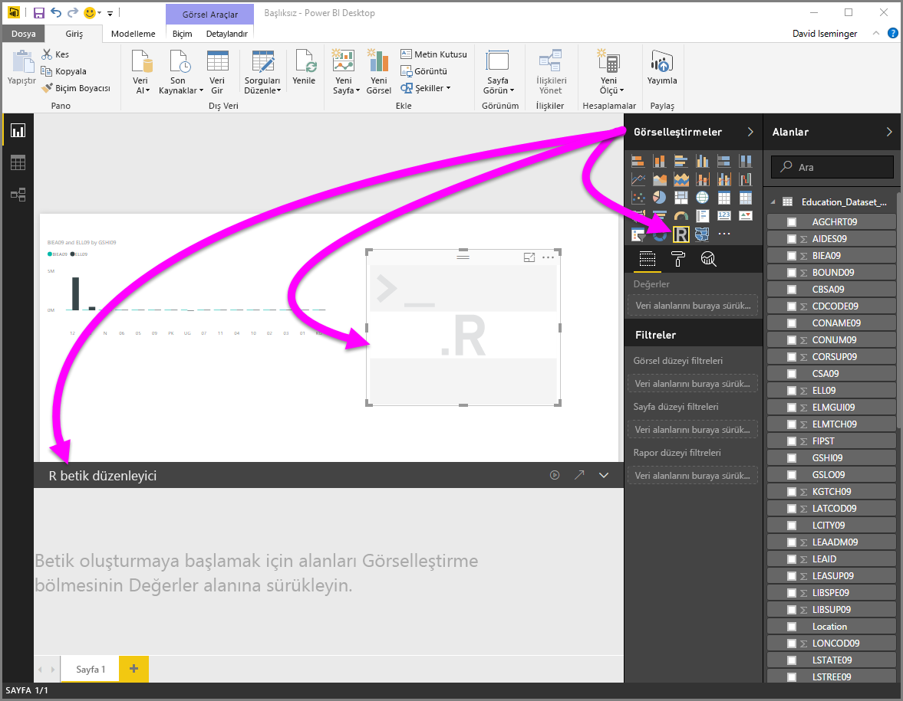
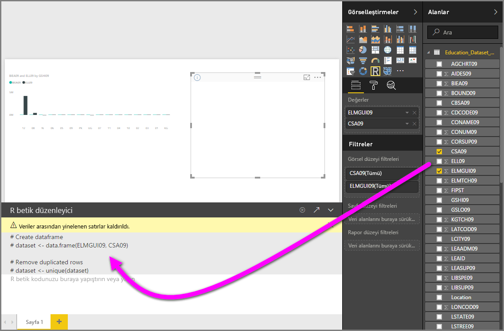
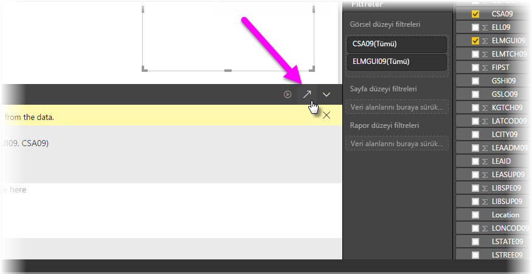
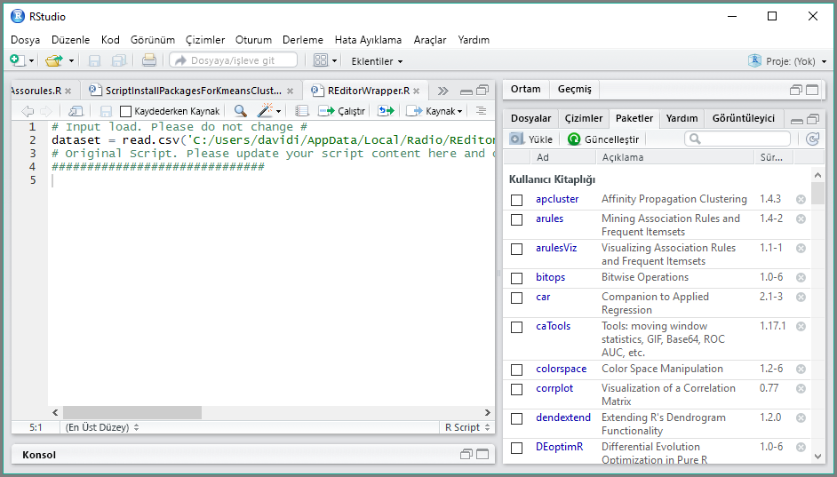

# Power BI ile harici bir R IDE kullanma
**Power BI Desktop** ile dış R IDE'nizi (Tümleşik Geliştirme Ortamı) kullanarak R betikleri oluşturabilir ve geliştirebilir, ardından da söz konusu betikleri Power BI'da kullanabilirsiniz.

## Dış R IDE'leri etkinleştirme
Önceki sürümlerde, R betikleri oluşturmak ve çalıştırmak için **Power BI Desktop**'taki R betik düzenleyicisini kullanmanız gerekiyordu. Bu sürümle birlikte, dış R IDE'nizi **Power BI Desktop**'ta başlatabilir ve verilerinizin otomatik olarak R IDE'ye aktarılmasını ve burada görüntülenmesini sağlayabilirsiniz. Burada, betiği söz konusu R IDE'de değiştirebilir ve ardından **Power BI Desktop**'a yapıştırarak Power BI görselleri ve raporları oluşturabilirsiniz.

**Power BI Desktop**'ın Eylül 2016 sürümü (2.39.4526.362 sürümü) itibarıyla, hangi R IDE'yi kullanmak istediğinizi belirtebilir ve otomatik olarak **Power BI Desktop**'ta açılmasını sağlayabilirsiniz.

### Gereksinimler
Bu özelliği kullanmak için yerel bilgisayarınıza **R IDE** yüklemeniz gerekir. **Power BI Desktop** R motoru içermez, dağıtmaz veya yüklemez. Bu nedenle, **R**’ı yerel bilgisayarınıza ayrı olarak yüklemeniz gerekir. Hangi R IDE'yi kullanmak istediğinizi seçebilirsiniz. Bu işlem için aşağıdaki şekillerde ilerleyebilirsiniz:

* [Revolution Open](https://mran.revolutionanalytics.com/download/) ve [CRAN Repository](https://cran.r-project.org/bin/windows/base/) gibi, çoğu ücretsiz olarak sunulan R IDE'ler arasından favorinizi yükleyebilirsiniz.
* **Power BI Desktop**, [R Studio](https://www.rstudio.com/) ve [*Visual Studio için R Araçları*](/visualstudio/rtvs)'nı içeren **Visual Studio 2015** düzenleyicilerini de destekler.
* Ayrıca aşağıdakilerden birini gerçekleştirerek farklı bir R IDE yükleyebilir ve **Power BI Desktop**'ın söz konusu **R IDE**'yi açmasını sağlayabilirsiniz:
  
  * **.R** dosyalarını, **Power BI Desktop**'ın açmasını istediğiniz dış IDE ile ilişkilendirebilirsiniz.
  * **Seçenekler** iletişim kutusunun **R Betik Seçenekleri** bölümündeki *Diğer* seçeneğini belirleyerek, **Power BI Desktop**'ın açması gereken .exe dosyasını belirtebilirsiniz. **Dosya > Seçenekler ve ayarlar > Seçenekler**'e giderek **Seçenekler** iletişim kutusunu görüntüleyebilirsiniz.
    
    

Yüklü birden çok R IDE'niz varsa **Seçenekler** iletişim kutusundaki *Algılanan R IDE'ler* açılan menüsünden seçim yaparak, hangisinin açılacağını belirtebilirsiniz.

Varsayılan olarak, **Power BI Desktop** dış R IDE olarak **R Studio**'yu açar (yerel bilgisayarınızda yüklüyse); **R Studio** yüklü değilse ve **R Tools for Visual Studio** içeren **Visual Studio 2015**'e sahipseniz bu başlatılır. Bu iki R IDE'den hiçbiri yüklü değilse **.R** dosyalarıyla ilişkili olan uygulama açılır.

Herhangi bir **.R** dosyası ilişkilendirmesi bulunmuyorsa, **Seçenekler** iletişim kutusunun *Tercih ettiğiniz R IDE'ye göz atın* bölümünde bir özel IDE'ye ilişkin yolu belirtebilirsiniz. Ayrıca **R IDE'yi başlat** ok simgesinin yanındaki **Ayarlar** dişli simgesini seçerek **Power BI Desktop**'ta farklı bir R IDE de başlatabilirsiniz.

## Power BI Desktop'ta R IDE başlatma
**Power BI Desktop**'ta R IDE başlatmak için aşağıdaki adımları uygulayın:

1. **Power BI Desktop**'a veri yükleyin.
2. **Alanlar** bölmesinden birlikte çalışmak istediğiniz alanlar seçin. Henüz betik görsellerini etkinleştirmediyseniz bunu gerçekleştirmeniz istenir.
   
   
3. Betik görselleri etkinleştirildiğinde, **Görsel Öğeler** bölmesinden bir R görseli seçebilir ve betiğinizin sonuçlarını görüntülemeye hazır, boş bir R görselinin oluşturulmasını sağlayabilirsiniz. **R betik düzenleyicisi** bölmesi de görüntülenir.
   
   
4. Artık R betiğinizde kullanmak istediğiniz alanları seçebilirsiniz. Bir alan seçtiğinizde, **R betik düzenleyicisi** alanı otomatik olarak, seçtiğiniz alanı veya alanları temel alan betik kodları oluşturur. R betiğinizi doğrudan **R betik düzenleyicisi** bölmesinde oluşturabilir (veya buraya yapıştırabilir) ya da bölmeyi boş bırakabilirsiniz.
   
   
   
   > [!NOTE]
   > R görselleri için varsayılan toplama işlemi *özetleme*'dir.
   > 
   > 
5. Şimdi R IDE'nizi doğrudan **Power BI Desktop**'tan başlatabilirsiniz. Aşağıda gösterildiği gibi, **R betik düzenleyicisi** başlık çubuğunun sağ tarafında bulunan **R IDE'yi başlat** düğmesini seçin.
   
   
6. Aşağıdaki görüntüde gösterildiği gibi, belirttiğiniz R IDE Power BI Desktop tarafından açılır. (Bu görüntüde, **RStudio** varsayılan R IDE'dir.)
   
   
   
   > [!NOTE]
   > **Power BI Desktop**, betiği çalıştırdığınızda **Power BI Desktop**'taki verilerin içeri aktarılabilmesini sağlamak için ilk üç satırı ekler.
   > 
   > 
7. **Power BI Desktop**'ın **R betik düzenleyicisi bölmesinde** oluşturduğunuz her betik R IDE'nizdeki 4. satırdan itibaren yer alır. Bu noktada R betiğinizi R IDE’de oluşturabilirsiniz. R IDE'nizde R betiğinizi tamamladıktan sonra, bunu kopyalayıp **Power BI Desktop**'taki **R betik düzenleyicisi** bölmesine yapıştırırken, **Power BI Desktop**'ın otomatik olarak oluşturduğu betiğin ilk üç satırını *dışlamanız* gerekir. Betiğin ilk üç satırını **Power BI Desktop**'a geri yapıştırmayın, bu satırlar yalnızca **Power BI Desktop**'taki R IDE'nizi içeri aktarmak için kullanılmıştır.

### Bilinen sınırlamalar
Doğrudan Power BI Desktop'tan bir R IDE başlatma ile ilgili birkaç sınırlama bulunur:

* Betiğinizin R IDE'den **Power BI Desktop**'a otomatik olarak aktarılması desteklenmez.
* **R Client** düzenleyicisi (RGui.exe) desteklenmez, bunun nedeni, düzenleyicinin dosyaları açmak için tek başına kullanılamamasıdır.

## Sonraki adımlar
Power BI'da R kullanımı ile ilgili aşağıdaki ek bilgilere göz atın.

* [Power BI Desktop'ta R Betikleri çalıştırma](desktop-r-scripts.md)
* [R programlama dilini kullanarak Power BI görselleri oluşturma](../create-reports/desktop-r-visuals.md)
