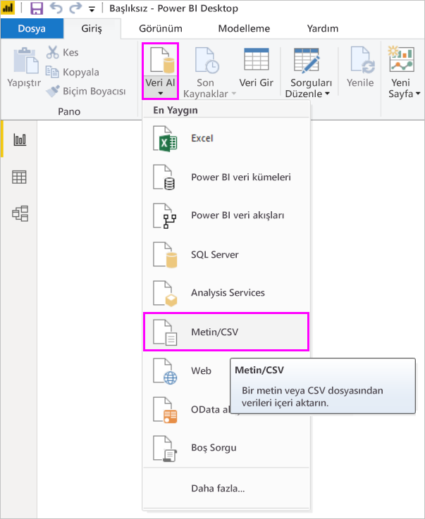
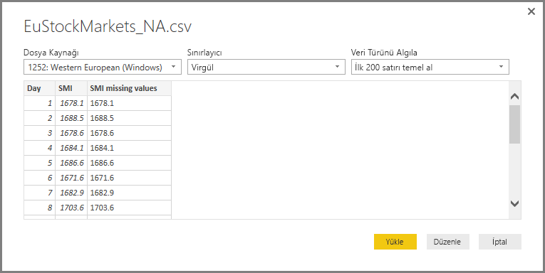
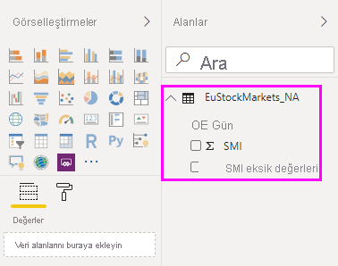
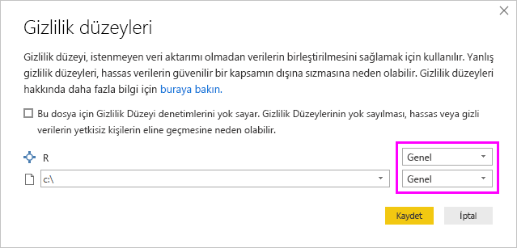
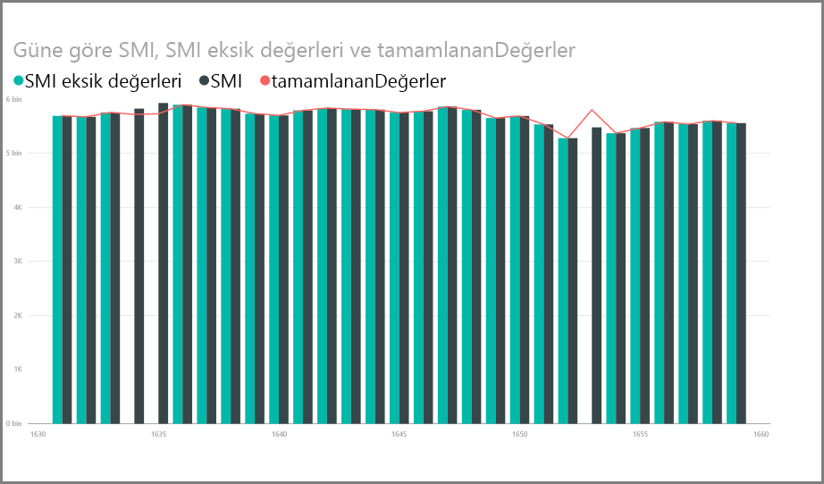
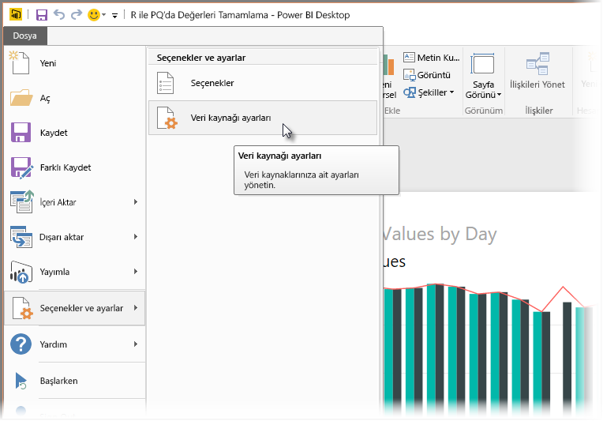
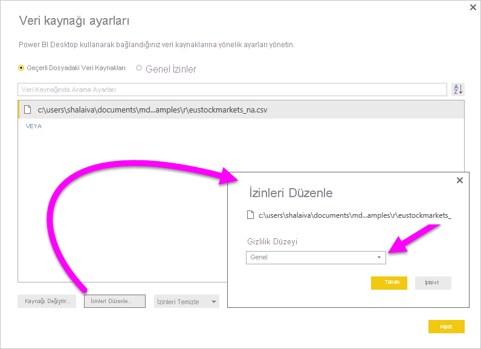

# <a name="use-r-in-power-query-editor"></a>Power Sorgu Düzenleyicisi’nde R kullanma

[R dili](https://mran.microsoft.com/documents/what-is-r) birçok istatistikçi, veri bilimci ve veri analistinin kullandığı güçlü bir programlama dilidir. Power BI Desktop Power Query Düzenleyicisi'nde R dilini kullanarak şunları yapabilirsiniz:

* Veri modelleri hazırlama.

* Rapor oluşturma.

* Veri temizleme, gelişmiş veri şekillendirme ve sksik veri tamamlama, tahminler, kümeleme ile daha fazlasını içeren veri kümesi analizi gerçekleştirin.  

## <a name="install-r"></a>R yükleme

R'yi [Revolution Open indirme sayfası](https://mran.revolutionanalytics.com/download/) ve [CRAN Repository](https://cran.r-project.org/bin/windows/base/)’den ücretsiz olarak indirebilirsiniz.

## <a name="install-mice"></a>Mice yükleme

Önkoşul olarak R ortamınıza [mice kitaplığını](https://www.rdocumentation.org/packages/mice/versions/3.5.0/topics/mice) yüklemeniz gerekir. mice olmadan örnek betik kodu düzgün çalışmaz. mice paketi eksik verilerle başa çıkmaya yönelik bir yöntem uygular.

mice kitaplığını yüklemek için:

1. R.exe programını başlatın (örneğin, C:\Program Files\Microsoft\R Open\R-3.5.3\bin\R.exe).  

2. R isteminden yükleme komutunu çalıştırın:

   ``` 
   install.packages('mice') 
   ```

## <a name="use-r-in-power-query-editor"></a>Power Sorgu Düzenleyicisi’nde R kullanma

Power Query Düzenleyicisi’nde R kullanmayı göstermek için bir .csv dosyasında yer alan örnek bir borsa veri kümesi kullanacak ve aşağıdaki adımları uygulayacağız:

1. [EuStockMarkets_NA.csv dosyasını indirin](https://download.microsoft.com/download/F/8/A/F8AA9DC9-8545-4AAE-9305-27AD1D01DC03/EuStockMarkets_NA.csv). Dosyayı kaydettiğiniz yeri unutmayın.

1. Dosyayı Power BI Desktop'a yükleyin. **Giriş** sekmesinde **Veri Al** > **Metin/CSV**'yi seçin.

   

1. EuStockMarkets_NA.csv dosyasını ve ardından **Aç**'ı seçin. CSV verileri **Metin/CSV dosyası** iletişim kutusunda görüntülenir.

   

1. Dosyadaki verileri yüklemek için **Yükle**'yi seçin. Power BI verileri yükledikten sonra yeni tablo, **Alanlar** bölmesinde görüntülenir.

   

1. Power Query Düzenleyicisi'ni açmak için **Giriş** şeridinde **Sorguları Düzenle**'yi seçin.

   

1. **Dönüştür** sekmesinde **R betiğini çalıştır**'ı seçin. **R betiğini çalıştır** düzenleyicisi görüntülenir. Satır 15 ve 20’de, resimde göremediğiniz diğer satırlarda olduğu gibi eksik veriler bulunmaktadır. Söz konusu satırların R tarafından nasıl doldurulduğu aşağıdaki adımlarda gösterilmiştir.

   

1. Bu örnek için aşağıdaki betik kodunu **R betiğini çalıştır** penceresinin **Betik** kutusuna girin. *&lt;Your File Path&gt;* yerine EuStockMarkets_NA.csv dosyasının yerel dosya sisteminizdeki yolunu girin; örneğin: C:/Users/John Doe/Documents/Microsoft/EuStockMarkets_NA.csv.

    ```r
       dataset <- read.csv(file="<Your File Path>/EuStockMarkets_NA.csv", header=TRUE, sep=",")
       library(mice)
       tempData <- mice(dataset,m=1,maxit=50,meth='pmm',seed=100)
       completedData <- complete(tempData,1)
       output <- dataset
       output$completedValues <- completedData$"SMI missing values"
    ```

    > [!NOTE]
    > Filtre uygulanmış yeni veri kümesini düzgün şekilde oluşturmak için *output* adlı bir değişkenin üzerine yazmanız gerekebilir.

7. **Tamam**’ı seçin. Power Query Düzenleyicisi, veri gizliliği ile ilgili bir uyarı görüntüler.

   
8. Uyarı iletisinin içinde **Devam**'ı seçin. R betiklerinin Power BI hizmetinde doğru şekilde çalışması için açılan **Gizlilik düzeyleri** iletişim kutusunda tüm veri kaynaklarını **Genel** olarak ayarlayın. 

   

   Gizlilik ayarları ve etkileri hakkında daha fazla bilgi için bkz. [Power BI Desktop gizlilik düzeyleri](../admin/desktop-privacy-levels.md).

 9. Betiği çalıştırmak için **Kaydet**’i seçin. 

   **Alanlar** bölmesinde **completedValues** adlı yeni bir sütunla karşılaşırız. Bu sütunda 15 ve 18 numaralı satırlar gibi birkaç eksik veri öğesi vardır. Bu sorunun R tarafından nasıl giderildiğini bir sonraki bölümde görebilirsiniz.

   Yalnızca beş R betiği satırı sayesinde Power Query Düzenleyicisi, eksik değerleri bir tahmin modeli ile doldurur.

## <a name="create-visuals-from-r-script-data"></a>R betik verilerinden görseller oluşturma

Artık R betiği kodunun mice kitaplığıyla birlikte eksik değerleri nasıl tamamladığını görmek için bir görsel oluşturabiliriz.



Tamamlanan tüm görselleri bir Power BI Desktop .pbix dosyasına kaydedebilir ve veri modeli ile R betiklerini Power BI hizmetinde kullanabilirsiniz.

> [!NOTE]
> Bu adımların hepsi tamamlandıktan sonra [bir .pbix dosyası indirebilirsiniz](https://download.microsoft.com/download/F/8/A/F8AA9DC9-8545-4AAE-9305-27AD1D01DC03/Complete%20Values%20with%20R%20in%20PQ.pbix).

.pbix dosyasını Power BI hizmetine yükledikten sonra, hizmet verilerini yenilemeyi ve güncelleştirilmiş görselleri etkinleştirmek için ilave adımlar uygulamanız gerekir:  

* **Veri kümesi için zamanlanmış yenilemeyi etkinleştirme**: R betiklerinin bulunduğu veri kümenizi içeren çalışma kitabına yönelik zamanlanmış yenilemeyi etkinleştirmek için bkz. [Zamanlanmış yenileme yapılandırma](refresh-scheduled-refresh.md). Bu makalede kişisel ağ geçitleri hakkında bilgiler de yer alır.

* **Kişisel ağ geçidi yükleme**: Dosyanın ve R betiğinin bulunduğu makineye bir kişisel ağ geçidi yüklemeniz gerekir. Power BI hizmeti, bu çalışma kitabına erişir ve güncelleştirilmiş görselleri yeniden oluşturur. Daha fazla bilgi için bkz. [Power BI'da kişisel ağ geçitleri kullanma](service-gateway-personal-mode.md).

## <a name="limitations"></a>Sınırlamalar

R betikleri içeren ve Power Query Düzenleyicisi'nde oluşturulmuş sorgulara yönelik bazı sınırlamalar bulunur:

* Tüm R veri kaynağı ayarlarının **Genel** olarak ayarlanması gerekir. Bir Power Query Düzenleyicisi’ndeki diğer tüm adımlar da genel olmalıdır. 

   Veri kaynağı ayarlarına ulaşmak için Power BI Desktop'ta **Dosya** > **Seçenekler ve ayarlar** > **Veri kaynağı ayarları** yolunu izleyin.

   

   **Veri kaynağı ayarları** iletişim kutusunda bir veya daha fazla veri kaynağını seçtikten sonra **İzinleri Düzenle**'yi seçin. **Gizlilik Düzeyi**’ni **Genel** olarak ayarlayın.

     
  
* R görselleriniz veya veri kümeniz için zamanlanmış yenilemeyi etkinleştirmek isterseniz zamanlanmış yenilemeyi etkinleştirmeniz ve çalışma kitabı ile R yüklemesinin bulunduğu bilgisayara kişisel ağ geçidi yüklemeniz gerekir. 

R ve özel sorgularla her türlü işlemi gerçekleştirebilirsiniz. Verilerinizi keşfedebilir ve nasıl görünmesini istiyorsanız o şekilde düzenleyebilirsiniz.

## <a name="next-steps"></a>Sonraki Adımlar

* [R’ye giriş](https://mran.microsoft.com/documents/what-is-r) 

* [Power BI Desktop'ta R betikleri çalıştırma](desktop-r-scripts.md) 

* [Power BI ile harici bir R IDE kullanma](desktop-r-ide.md) 

* [Power BI hizmetinde R paketlerini kullanarak görsel oluşturma](service-r-packages-support.md)
