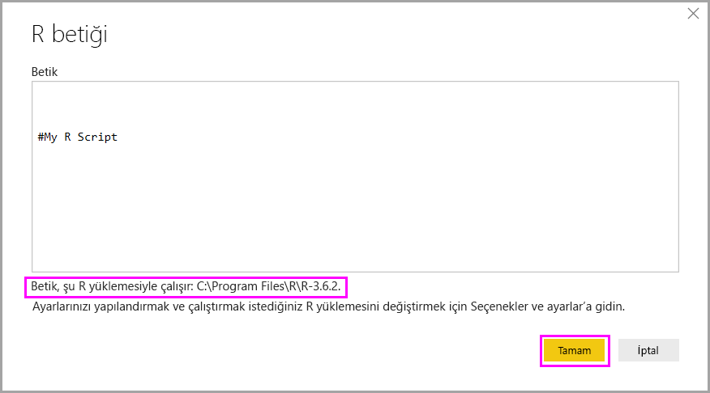
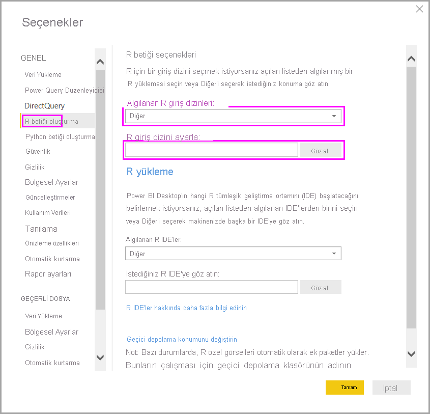

# Power BI Desktop'ta R betikleri çalıştırın

Power BI Desktop'ta R betiklerini doğrudan çalıştırabilir ve elde edilen veri kümelerini bir Power BI Desktop veri modeline aktarabilirsiniz.

## R yükleme

Power BI Desktop'ta R betikleri çalıştırabilmek için yerel makinenize R yüklemeniz gerekir. R'yi [Microsoft R Application Network](https://mran.revolutionanalytics.com/download/) ve [CRAN Repository](https://cran.r-project.org/bin/windows/base/) gibi pek çok konumdan ücretsiz olarak indirip yükleyebilirsiniz. Geçerli sürüm, yükleme yolunda Unicode karakterlerini ve boşlukları (boş karakterler) destekler.

## R betiklerini çalıştırma

Power BI Desktop’ta yalnızca birkaç adımda R betiklerini çalıştırabilir ve veri modeli oluşturabilirsiniz. Veri modeliyle raporlar oluşturabilir ve bunları Power BI hizmetinde paylaşabilirsiniz. Power BI Desktop'taki R betikleri artık, ondalık (.) ve virgül (,) içeren sayı biçimlerini de destekliyor.

### R betiği hazırlama

Power BI Desktop'ta bir R betiği çalıştırmak için yerel R geliştirme ortamınızda betiği oluşturun ve başarıyla çalıştığından emin olun.

Betiği Power BI Desktop'ta çalıştırmak için, söz konusu betiğin yeni ve değiştirilmemiş bir çalışma alanında başarıyla çalıştığından emin olun. Bu önkoşul, tüm paket ve bağımlılıkların açık bir şekilde yüklenmesi ve çalıştırılması gerektiği anlamına gelir. Bağımlı betikleri çalıştırmak için `source()` kullanabilirsiniz.

Power BI Desktop'ta R betiği hazırlar ve çalıştırırken birkaç sınırlama vardır:

* Yalnızca veri çerçeveleri içeri aktarıldığından, içeri aktarmak istediğiniz verileri Power BI'a bir veri çerçevesinde göstermeyi unutmayın.
* Karmaşık ve Vektör olarak yazılan sütunlar içeri aktarılmaz ve oluşturulan tablo bunların yerini hata değerleri alır.
* `N/A` değerleri Power BI Desktop'ta `NULL` değerlerine çevrilir.
* R betiğinin çalışması 30 dakikadan uzun sürerse zaman aşımına uğrar.
* R betiğindeki etkileşimli çağrılar (kullanıcı girişinin beklenmesi gibi) betik yürütme işlemini durdurur.
* R betiğindeki çalışma dizinini ayarlarken çalışma dizinine yönelik bir tam yol (göreli yol yerine) tanımlamanız *gerekir*.

### R betiğinizi çalıştırma ve verileri içeri aktarma

Artık verileri Power BI Desktop’a aktarmak için R betiğinizi çalıştırabilirsiniz:

1. Power BI Desktop’ta **Veri Al**’ı, **Diğer** > **R betiği**’i ve sonra da **Bağlan**’ı seçin:

    

2. Yerel makinenizde R yüklüyse, betiğinizi betik penceresine kopyalayıp **Tamam**’ı seçmeniz yeterli olur. R altyapınız olarak, en son yüklenen sürüm görüntülenir.

    

3. R Betiğini çalıştırmak için **Tamam**'ı seçin. Betik başarıyla çalıştırıldığında, oluşturulan veri çerçevelerini seçip Power BI modeline ekleyebilirsiniz.

Betiğinizi çalıştırmak için hangi R yüklemesinin kullanılacağını denetleyebilirsiniz. R yükleme ayarlarınızı belirtmek için **Dosya** > **Seçenekler ve ayarlar** > **Seçenekler**’i ve sonra da **R betiği oluşturma**’yı seçin. **R betiği seçenekleri**’nin altındaki **Algılanan R giriş dizinleri** açılan listesinde geçerli R yükleme seçenekleriniz gösterilir. İstediğiniz R yüklemesi listelenmiyorsa **Diğer**’i seçin ve ardından **R giriş dizini ayarla** alanında tercih ettiğiniz R yükleme klasörünüze göz atın veya bu klasörü girin.

### Yenile

Power BI Desktop'ta bir R betiğini yenileyebilirsiniz. Bir R betiğini yenilediğinizde Power BI Desktop, R betiğini Power BI Desktop ortamında yeniden çalıştırır.

## Sonraki adımlar

Power BI'daki R hakkında daha fazla bilgi edinmek için aşağıdaki ek kaynaklara göz atın.

* [R programlama dilini kullanarak Power BI görselleri oluşturma](../create-reports/desktop-r-visuals.md)
* [Power BI ile harici bir R IDE kullanma](desktop-r-ide.md)
