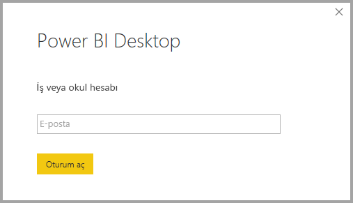
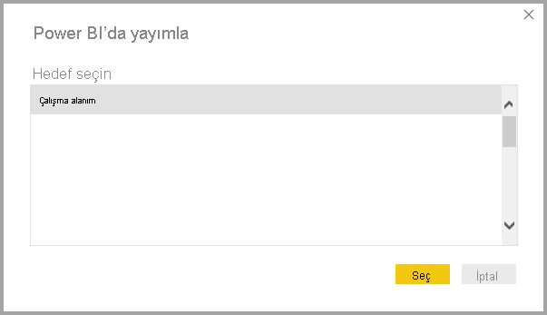
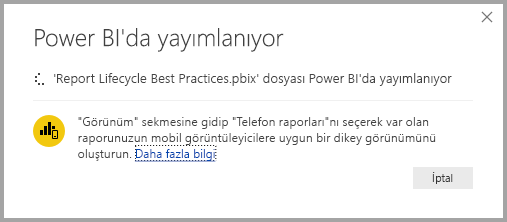
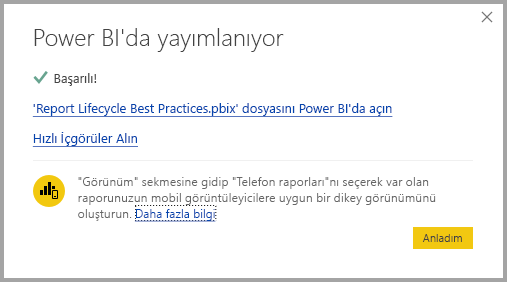
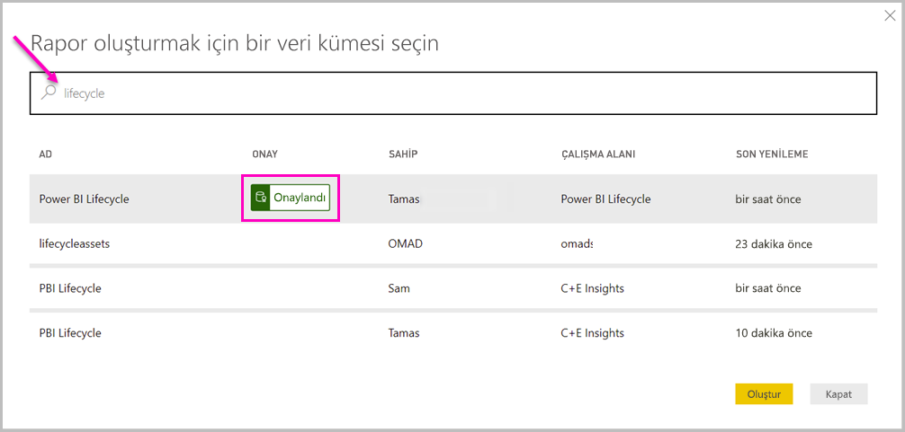

# Power BI Desktop'tan Power BI hizmetindeki veri kümelerine bağlanma

*Power BI hizmetinde* bir paylaşılan veri kümesiyle canlı bağlantı kurabilir, aynı veri kümesinden pek çok farklı rapor oluşturabilirsiniz. Power BI Desktop'ta mükemmel veri modelinizi oluşturabilir ve Power BI hizmetinde yayımlayabilirsiniz. Ardından siz ve başkaları ortak veri modelinden ayrı *.pbix* dosyalarında farklı raporlar oluşturabilir ve bunları farklı çalışma alanlarına kaydedebilirsiniz. Bu özellik *Power BI hizmeti canlı bağlantısı* olarak adlandırılır.

Bu özelliğin en iyi yöntem olması gibi pek çok avantajı vardır. Bunları bu makalede ele alacağız. Bu özelliğin [önemli noktaları ve sınırlamalarını](#limitations-and-considerations) gözden geçirmenizi öneririz.

## Bir Power BI hizmet canlı bağlantısı kullanarak rapor yaşam döngüsünü yönetme

Power BI'ın bu kadar popüler olmasının bir sonucu olarak raporlar, panolar ve temel alınan veri modelleri hızla çoğalmaktadır. Power BI Desktop'ta ilgi çekici raporlar oluşturup bu raporları Power BI hizmetinde [yayımlamak](../create-reports/desktop-upload-desktop-files.md) ve bu veri kümelerinden harika panolar oluşturmak kolaydır. Pek çok kişi genellikle bunu aynı (veya neredeyse aynı) veri kümelerini kullanarak yaptığı için, hangi raporun hangi veri kümesini temel aldığını ve hangi veri kümesinin ne kadar güncel olduğunu bilmek bir zorluğa dönüştü. Power BI hizmeti canlı bağlantısı bu zorluğu gideriyor ve ortak veri kümesi kullanarak rapor ve pano oluşturmayı, paylaşmayı ve genişletmeyi daha kolay ve tutarlı hale getiriyor.

### Herkesin kullanabileceği bir veri kümesi oluşturma ve paylaşma

Diyelim ki Anna takımınızda bir iş analisti. Anna genellikle veri kümesi olarak adlandırılan iyi veri modelleri oluşturma becerisine sahip. Anna bir veri kümesi ve rapor oluşturup bu raporu Power BI hizmetinde paylaşabiliyor.

Anna’nın raporunu ve veri kümesini herkes beğeniyor. İşte sorun bu noktada başlıyor. Anna'nın ekibindeki herkes bu veri kümesinin *kendilerine ait bir sürümünü* oluşturmaya ve ekiple kendi raporlarını paylaşmaya çalışıyor. Birdenbire ekibinizin Power BI hizmetindeki çalışma alanında farklı veri kümelerinden çok sayıda rapor beliriyor. En yakın tarihli olan hangisiydi? Veri kümeleri neredeyse mi aynıydı, yoksa tamamen mi? Farklar nelerdi? Power BI hizmeti canlı bağlantısı özelliği sayesinde bütün bunlar iyi yönde değişebilir. Aşağıdaki bölümde, Anna'nın yayımlanmış veri kümesini diğer ekip üyelerinin kendi çalışma alanlarında kendi raporları için nasıl kullanabileceğini ve herkesin benzersiz raporunu oluşturabilmesi için aynı sağlam, onaylanmış ve yayımlanmış veri kümesini kullanmasına izin verilebileceğini göreceğiz.

### Canlı bağlantıyla bir Power BI hizmeti veri kümesine bağlanma

Anna rapor oluşturur ve bu raporun dayandığı veri kümesini de oluşturur. Daha sonra bunu Power BI hizmetinde yayımlar. Rapor Power BI hizmetinde, ekibin çalışma alanında gösterilir. Anna bunu *yeni çalışma alanı deneyimine* kaydeder. Anna çalışma alanı içindeki ve dışındaki herkesin bunu görebilmesi ve kullanabilmesi için *Derleme izni* ayarlayabilir.

Yeni çalışma alanları deneyimi hakkında daha fazla bilgi için bkz. [çalışma alanları](../collaborate-share/service-new-workspaces.md).

Anna’nın çalışma alanı içindeki ve dışındaki diğer üyeler artık Power BI hizmeti canlı bağlantı özelliğini kullanarak Anna'nın paylaştığı veri modeliyle canlı bağlantı kurabilir. *Kendi yeni çalışma alanları deneyimlerinde*, *kendi özgün veri kümeleriyle* kendi benzersiz raporlarını oluşturabilirler.

Aşağıdaki resimde, Anna'nın veri modelini içeren Power BI Desktop raporunu nasıl oluşturduğunu ve Power BI hizmetinde nasıl yayımladığını görebilirsiniz. Bundan sonra çalışma alanındaki diğer kişiler, Power BI hizmeti canlı bağlantısını kullanarak Anna'nın veri modeline bağlanabilir ve kendi çalışma alanlarında Anna’nın veri kümesini temel alan kendi benzersiz raporlarını oluşturabilir.

> [!NOTE]
> Veri kümenizi [klasik paylaşılan çalışma alanına](../collaborate-share/service-create-workspaces.md) kaydederseniz, yalnızca söz konusu çalışma alanının üyeleri veri kümenizi temel alan raporlar oluşturabilir. Bir Power BI hizmeti canlı bağlantısı kurmak için, bağlanacağınız veri kümesinin üye olduğunuz bir çalışma alanında paylaşılmış olması gerekir.
> 
> 

## Power BI hizmeti canlı bağlantısını kullanmak için adım adım yönergeler

Artık Power BI hizmeti canlı bağlantısının ne kadar kullanışlı olduğunu ve bağlantıyı rapor yaşam döngüsü yönetiminin en iyi yöntemi olarak nasıl kullanabileceğinizi öğrendiğimize göre, bizi Anna'nın harika raporundan ve veri kümesinden Power BI ekip arkadaşlarının kullanabileceği paylaşılan veri kümesine götüren yolu adım adım yürüyelim.

### Bir Power BI raporu ve veri kümesini yayımlama

Power BI hizmeti canlı bağlantısını kullanarak rapor yaşam döngüsünü yönetmenin ilk adımı, ekip arkadaşlarınızın kullanmak isteyeceği bir rapora ve veri kümesine sahip olmaktır. Bu nedenle Anna'nın ilk olarak raporu Power BI Desktop'tan *yayımlaması* gerekir. Power BI Desktop’taki **Giriş** şeridinde **Yayımla**’yı seçin.

Anna Power BI hizmeti hesabında oturum açmadıysa, Power BI Anna’dan bunu yapmasını ister.

Anna, oradan rapor ve veri kümesinin yayımlanacağı hedef çalışma alanını seçebilir. Anna bunu yeni çalışma alanı deneyimine kaydederse Derleme izni olan herkesin söz konusu veri kümesine erişebileceğini unutmayın. Derleme izni, yayımlama sonrasında Power BI hizmetinde ayarlanır. Çalışma klasik bir çalışma alanına kaydedilirse, yalnızca raporun yayımlandığı çalışma alanına erişimi olan üyeler söz konusu raporun veri kümesine Power BI hizmeti canlı bağlantısıyla erişebilir.

Yayımlama işlemi başlar ve Power BI Desktop ilerleme durumunu gösterir.

İşlem tamamlandığında, Power BI Desktop başarı durumunu gösterir ve Power BI hizmetindeki rapora ulaşmanız ve rapor hakkında hızlı içgörüler almanız için bağlantılar sunar.

Artık raporunuz veri kümesiyle birlikte Power BI hizmetinde olduğundan raporun düzeyini de *yükseltebilirsiniz*. Yükseltme, kalitesini ve güvenilirliğini kanıtlamanız anlamına gelir. Hatta Power BI kiracınızdaki merkezi bir yetkili tarafından *onaylanmasını* bile isteyebilirsiniz. Bu onaylardan herhangi biriyle, başkaları veri kümelerinde arama yaparken veri kümeniz her zaman listenin üstünde görüntülenir. Daha fazla bilgi için bkz. [Veri kümenizin düzeyini yükseltme](service-datasets-promote.md).

Son adım raporun dayandığı veri kümesi için Derleme iznini ayarlamaktır. Derleme izni veri kümenizi kimlerin görebileceğini ve kullanabileceğini belirler. Bu izni çalışma alanının içinde veya çalışma alanında uygulama paylaşırken ayarlayabilirsiniz. Daha fazla bilgi için bkz. [Paylaşılan veri kümeleri için Derleme izni](service-datasets-build-permissions.md).

Şimdi, raporun ve veri kümesinin yayımlandığı çalışma alanına erişimi olan diğer ekip üyelerinin veri kümesine nasıl bağlanıp kendi raporlarını oluşturabileceğini görelim.

### Yayımlanmış veri kümesiyle bir Power BI hizmeti canlı bağlantısı kurma

Yayımlanmış raporla bağlantı kurmak ve yayımlanmış veri kümesini temel alarak kendi raporunuzu oluşturmak için Power BI Desktop'ta **Giriş** şeridinden **Veri Al**'ı seçin, sol bölmede **Power Platform**'u ve sonra da **Power BI veri kümeleri**'ni seçin.

Oturum açmadıysanız Power BI oturum açmanızı ister. Oturum açıldıktan sonra Power BI hangi çalışma alanlarına üye olduğunuzu gösterir. Power BI hizmeti canlı bağlantısı kurmak istediğiniz veri kümesinin yer aldığı çalışma alanını seçebilirsiniz.

Listedeki veri kümelerinin tümü, herhangi bir çalışma alanında Derleme iznine sahip olduğunuz paylaşılan veri kümeleridir. Belirli bir veri kümesi için arama yapabilir ve adını, sahibini, bulunduğu çalışma alanını ve en son ne zaman yenilendiğini görebilirsiniz. Ayrıca listenin en üstünde sertifikalı veya tanıtılan veri kümeleri için **ONAY** seçeneğini de görürsünüz.

**Oluştur**’u seçtiğinizde, seçili veri kümesine canlı bağlantı kurarsınız. Power BI Desktop, gördüğünüz alanları ve onların değerlerini gerçek zamanlı olarak Power BI Desktop’a yükler.

Artık siz ve diğer kişiler aynı veri kümesinden özel raporlar oluşturup paylaşabilirsiniz. Bu Anna’nın yaptığı gibi bilgili bir kişinin iyi biçimlendirilmiş bir veri kümesi oluşturmasını sağlamak için harika bir yaklaşımdır. Birçok ekip üyesi bu paylaşılan veri kümesini kullanarak kendi raporlarını oluşturabilir.

## Sınırlamalar ve önemli noktalar

Power BI hizmeti canlı bağlantısını kullanırken dikkat etmeniz gereken bazı sınırlamalar ve önemli noktalar vardır.

* Yalnızca veri kümesi üzerinde Derleme izni olan kullanıcılar yayımlanmış bir veri kümesine Power BI hizmeti canlı bağlantısını kullanarak bağlanabilir.
* Ücretsiz kullanıcılar yalnızca **Çalışma Alanım**'daki ve Premium tabanlı çalışma alanlarındaki veri kümelerini görebilir.
* Bu canlı bir bağlantı olduğundan sol gezinti ve modelleme devre dışı bırakılır. Her raporda tek bir veri kümesine bağlanabilirsiniz. Bu davranış, *SQL Server Analysis Services*’e bağlanma davranışına benzer.
* Bu canlı bir bağlantı olduğundan satır düzeyi güvenlik (RLS) ve bu tür diğer bağlantı davranışları zorunlu tutulur. SQL Server Analysis Services’e bağlanırken de aynı durum geçerlidir.
* Paylaşılan özgün *.pbix* dosyasında dosyanın sahibi tarafından yapılan değişiklikler, Power BI hizmetinde paylaşılan veri kümesinin ve raporun üzerine yazılır. Bu veri kümesine dayalı raporların üzerine yazılmaz ama veri kümesinde yapılan tüm değişiklikler rapora yansıtılır.
* Bir çalışma alanının üyeleri paylaşılan özgün raporu başka bir raporla değiştiremez. Bunu denediğinizde dosyanızı yeniden adlandırıp yayımlamanızı isteyen bir uyarı belirecektir.
* Power BI hizmetinde paylaşılan veri kümesini silerseniz bu veri kümesine dayalı diğer raporlar düzgün çalışmaz veya görsellerini görüntülemez.
* İçerik Paketlerini *Power BI hizmetinde* bir .pbix raporu ve veri kümesi paylaşmak için temel olarak kullanmadan önce söz konusu içerik paketinin kopyasını oluşturmanız gerekir.
* *Kuruluşum*'dan gelen İçerik Paketlerini kopyaladığınızda, hizmette oluşturulan raporu veya canlı bağlantıyla İçerik Paketini kopyalama işleminin bir parçası olarak oluşturulmuş bir raporu başka bir raporla değiştiremezsiniz. Bunu denediğinizde dosyanızı yeniden adlandırıp yayımlamanızı isteyen bir uyarı belirecektir. Bu durumda yalnızca yayımlanmış canlı bağlantılı raporları başka raporlarla değiştirebilirsiniz.
* Power BI hizmetindeki paylaşılan veri kümesini silerseniz artık o veri kümesine kimse Power BI Desktop'tan ulaşamaz.
* Power BI hizmetinde veri kümesi paylaşan raporlar Power BI REST API’si kullanılarak yapılan otomatikleştirilmiş dağıtımları desteklemez.
