# <a name="tutorial-shape-and-combine-data-in-power-bi-desktop"></a>Öğretici: Power BI Desktop'ta verileri şekillendirme ve birleştirme

Power BI Desktop ile çok çeşitli veri kaynaklarına bağlanabilir ve ardından verileri ihtiyaçlarınızı karşılayacak şekilde şekillendirebilir, böylece başkalarıyla paylaşılabilecek görsel raporlar oluşturabilirsiniz. Verileri *şekillendirme* verileri dönüştürme anlamına gelir. Sütunları veya tabloları yeniden adlandırma, metinleri sayı olarak değiştirme, satırları kaldırma, ilk satırı başlık olarak ayarlama ve benzeri değişiklikler yapma bu işlemlere örnek olarak verilebilir. Verileri *birleştirme*, iki veya daha fazla veri kaynağını bağlama, gerektiği şekilde şekillendirme ve ardından bunları kullanışlı tek bir sorguda birleştirme anlamına gelir.

Bu öğreticide aşağıdakilerin nasıl yapılacağını öğreneceksiniz:

* Sorgu Düzenleyicisi kullanarak verileri şekillendirme.
* Farklı veri kaynaklarına bağlanma.
* Bu veri kaynaklarını birleştirme ve raporlarda kullanılacak bir veri modeli oluşturma.

Bu öğreticide Power BI Desktop’ı kullanarak bir sorgunun nasıl şekillendirileceği gösterilmiş ve en yaygın görevlerin üzerinde durulmuştur. Burada kullanılan sorgu, sıfırdan nasıl oluşturulacağı da dahil olmak üzere [Power BI Desktop ile çalışmaya başlama](../fundamentals/desktop-getting-started.md) başlıklı makalede daha ayrıntılı bir şekilde açıklanmıştır.

Power BI Desktop'taki Sorgu Düzenleyicisi, **Dönüştür** şeridinin yanı sıra, sağ tıklama menülerini bolca kullanır. Şeritte seçilebilecek öğelerin çoğu, sütun gibi bir öğeye sağ tıklanıp görüntülenen menüden seçim yapılarak kullanılabilir.

## <a name="shape-data"></a>Verileri şekillendirme
Sorgu Düzenleyicisi'nde verileri şekillendirdiğinizde, Sorgu Düzenleyicisi'nin verileri yüklemesi ve size sunması sırasında ayarlaması için adım adım yönergeler sağlamış olursunuz. Özgün veri kaynağı etkilenmez. Yalnızca bu veri görünümü ayarlanır veya *şekillendirilir*.

Belirttiğiniz adımlar (bir tabloyu yeniden adlandırma, bir veri türünü dönüştürme veya bir sütunu silme gibi), Sorgu Düzenleyicisi tarafından kaydedilir. Bu sorgu veri kaynağına her bağlandığında, Sorgu Düzenleyicisi verilerin her zaman belirttiğiniz şekilde olması için o adımları uygular. Bu işlem, Sorgu Düzenleyicisi’ni her kullanışınızda veya paylaşılan sorgunuzu kullanan herkes için (örneğin, Power BI hizmetinde) gerçekleştirilir. Bu adımlar, **Sorgu Ayarları** bölmesindeki **Uygulanan Adımlar** bölümünde sırasıyla kaydedilir. Önümüzdeki birkaç paragrafta bu adımların her birini inceleyeceğiz.

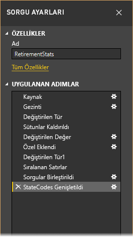

[Power BI Desktop ile Çalışmaya Başlama](../fundamentals/desktop-getting-started.md) başlıklı makalede bir web veri kaynağına bağlanarak edindiğimiz emeklilik verilerini kullanarak, bu verileri ihtiyaçlarımız doğrultusunda şekillendirelim. Tüm verilerin eşit olduğunu dikkate alarak dereceyi hesaplamak için bir özel sütun ekleyelim ve bu sütunu mevcut **Derece** sütunuyla karşılaştıralım.  

1. **Sütun Ekle** şeridinden, özel sütun eklemenize olanak tanıyan **Özel Sütun**’u seçin.

    

1. **Özel Sütun** penceresinde **Yeni sütun adı** alanına _Yeni Derece_ girin. **Özel sütun formülü** alanına aşağıdaki verileri girin:

    ```
    ([Cost of living] + [Weather] + [Health care quality] + [Crime] + [Tax] + [Culture] + [Senior] + [#"Well-being"]) / 8
    ```
 
1. *Söz dizimi hatası algılanmadı* durum iletisinin gösterildiğinden emin olun ve **Tamam**’ı seçin.

    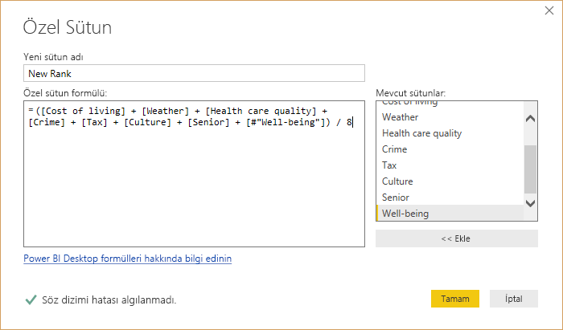

1. Sütun verilerinin tutarlılığını korumak için yeni sütun değerlerini tam sayılara dönüştürün. Değerleri değiştirmek için sütun üst bilgisine sağ tıklayıp **Türü Değiştir \> Tam Sayı** seçeneğini belirleyin. 

    Birden fazla sütun seçmeniz gerekirse bir sütun seçip **SHIFT** tuşunu basılı tutarak daha fazla bitişik sütun belirleyin ve ardından bir sütun üst bilgisine sağ tıklayın. Bitişik olmayan sütunları seçmek için **CTRL** tuşunu da kullanabilirsiniz.

    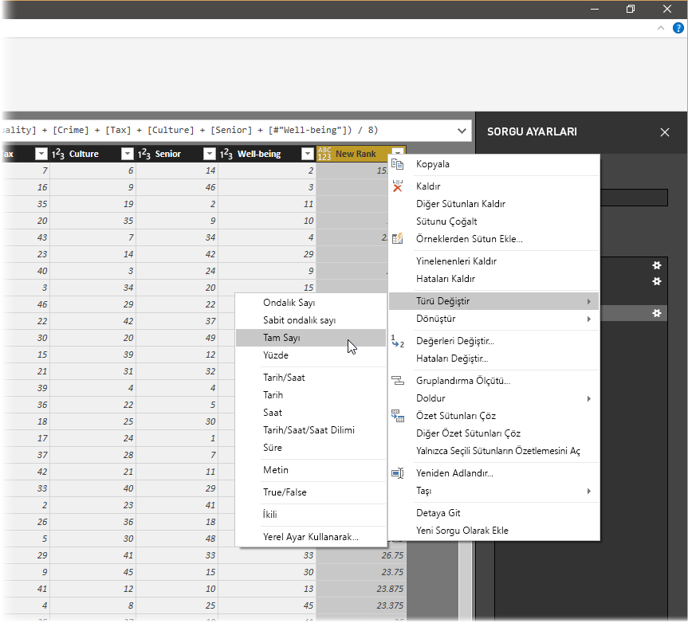

1. Geçerli veri türünün başka bir türe dönüştürüldüğü sütun veri türlerini *dönüştürme* işlemini yapmak için **Dönüştürme** şeridinden **Veri Türü Metni**'ni seçin. 

   

1. **Sorgu Ayarları**'ndaki **Uygulanan Adımlar** listesi, verilere uygulanan tüm şekillendirme adımlarını gösterir. Bir adımı şekillendirme işleminden kaldırmak için adımın solundaki **X** simgesini seçin. 

    Aşağıdaki görüntüde **Uygulanan Adımları** listesi şimdiye kadar eklenen adımları göstermektedir: 
     - **Kaynak**: Web sitesine bağlanma.
     - **Gezinti**: Tabloyu seçme. 
     - **Değiştirilen Tür**: Metin tabanlı sayı sütunlarını *Metin*’den *Tam Sayı*’ya değiştirme. 
     - **Özel Eklendi**: Özel sütun ekleme.
     - **Değiştirilen Tür1**: Son uygulanan adım.

       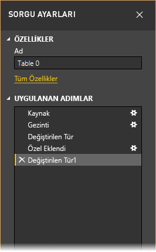

## <a name="adjust-data"></a>Verileri ayarlama

Bu sorguyla çalışabilmek için, verilerini ayarlayacak birkaç değişiklik yapmamız gerekir:

   - Bir sütunu kaldırarak dereceleri ayarlama.

       Sonuçlarımızda **Yaşam maliyeti**’nin bir etken olmadığına karar verdik. Bu sütunu kaldırdıktan sonra verilerin değişmeden kaldığını bulduk. 

   - Birkaç hatayı düzeltme.

       Bir sütunu kaldırdığımız için **Yeni Derece** sütunundaki hesaplamalarımızı yeniden ayarlamamız ve bu işlemin bir parçası olarak bir formülü değiştirmemiz gerekir.

   - Verileri sıralama.

       **Yeni Derece** ve **Derece** sütunlarını temel alarak verileri sıralayın.
 
   - Verileri değiştirme.

       Belirli bir değerin nasıl değiştirileceğini ve bir **Uygulanan Adım** ekleme gereksinimini vurgulayacağız.

   - Tablo adını değiştirin. 

       **Tablo 0** tablo için yararlı bir tanımlayıcı olmadığından adını değiştireceğiz.

1. **Yaşam maliyeti** sütununu kaldırmak için sütunu seçin, şeritten **Giriş** sekmesini seçin ve sonra **Sütunları Kaldır** seçeneğini belirleyin.

    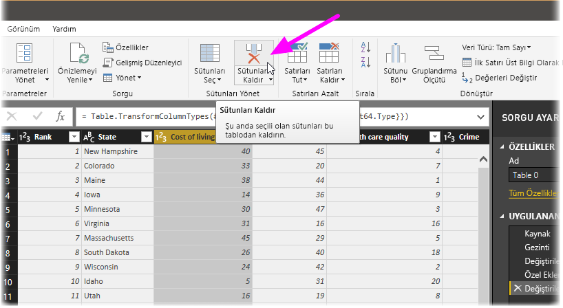

   Adımların sıralanma şekli nedeniyle **Yeni Derece** değerlerinin değişmediğine dikkat edin. Adımlar Sorgu Düzenleyicisi tarafından sırasıyla ancak birbirinden bağımsız olarak kaydedildiğinden, her bir **Uygulanan Adım**'ı sırada yukarı veya aşağı taşıyabilirsiniz. 

1. Bir adıma sağ tıklama. Sorgu Düzenleyicisi aşağıdaki görevleri gerçekleştirmenizi sağlayan bir menü görüntüler: 
   - **Yeniden Adlandır**; Adımı yeniden adlandırma.
   - **Sil**: Adımı silme.
   - **Sona Kadar** **Sil**: Geçerli adımı ve sonraki tüm adımları kaldırma.
   - **Yukarı Taşı**: Adımı listede yukarı taşıma.
   - **Aşağı Taşı**: Adımı listede aşağı taşıma.

1. **Özel Eklendi** adımın hemen yukarısındaki son adım olan **Kaldırılan Sütunlar** adımına geçin.

   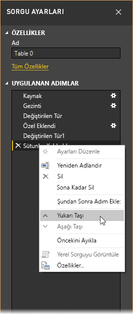

1. **Özel Eklendi** adımını seçin. 

   Verilerin şimdi ele almamız gereken _Hata_’yı gösterdiğine dikkat edin.

   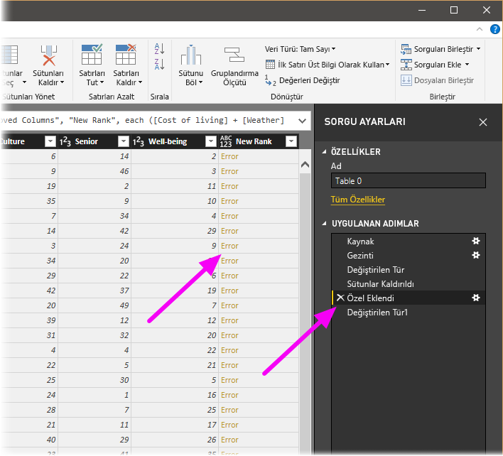

   Her bir hata ile ilgili daha fazla bilgi edinmek için birkaç farklı yol izlenebilir. *Hata* sözcüğüne tıklamadan hücreyi seçerseniz Sorgu Düzenleyicisi, hata bilgilerini pencerenin alt kısmında görüntüler.

   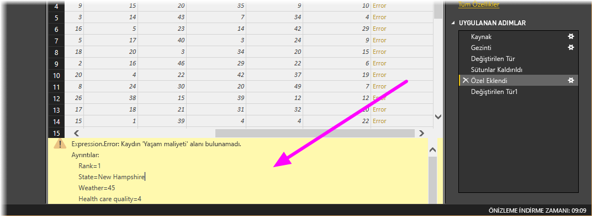

   Doğrudan *Hata* sözcüğünü seçerseniz Sorgu Düzenleyicisi, **Sorgu Ayarları** bölmesinde bir **Uygulanan Adım** oluşturur ve hata hakkındaki bilgileri görüntüler. 

1. Hatalar hakkında bilgi görüntülememiz gerekmediği için **İptal**'i seçin.

1. Hataları düzeltmek için, **Yeni Derece** sütununu seçin, sonra **Görünüm** sekmesinden **Formül Çubuğu** onay kutusunu seçerek sütunun veri formülünü görüntüleyin. 

   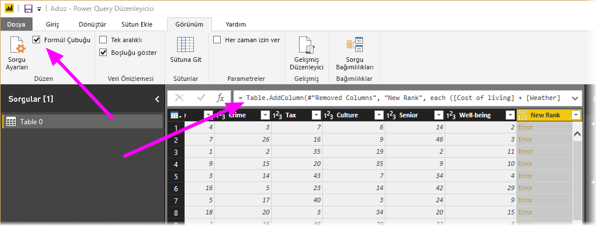

1. Formülü aşağıdaki gibi değiştirerek _Cost of living_ parametresini kaldırın ve böleni azaltın: 
   ```
    Table.AddColumn(#"Removed Columns", "New Rank", each ([Weather] + [Health care quality] + [Crime] + [Tax] + [Culture] + [Senior] + [#"Well-being"]) / 7)
   ```

1. Formül kutusunun solundaki yeşil onay işaretini seçin veya **Enter** tuşuna basın.

  Sorgu Düzenleyicisi, verileri gözden geçirilen değerlerle değiştirir ve **Özel Eklendi** adımı hata olmadan tamamlanır.

   > [!NOTE]
   > Ayrıca şeridi veya sağ tıklama menüsünü kullanarak **Hataları Kaldır** seçeneğini belirleyebilir ve hata içeren tüm satırları kaldırabilirsiniz. Ancak, bu öğreticide tablodaki verileri korumak istediğimiz için bu işlemi yapmak istemedik.

1. **Yeni Derece** sütununu temel alarak verileri sıralayın. İlk olarak, en yeni verileri görüntülemek için son uygulanan adım olan **Değiştirilen Tür1** adımını seçin. Sonra, **Yeni Derece** sütun üst bilgisinin yanında bulunan açılır listeyi seçin ve **Artan Düzende Sırala** seçeneğini belirleyin.

   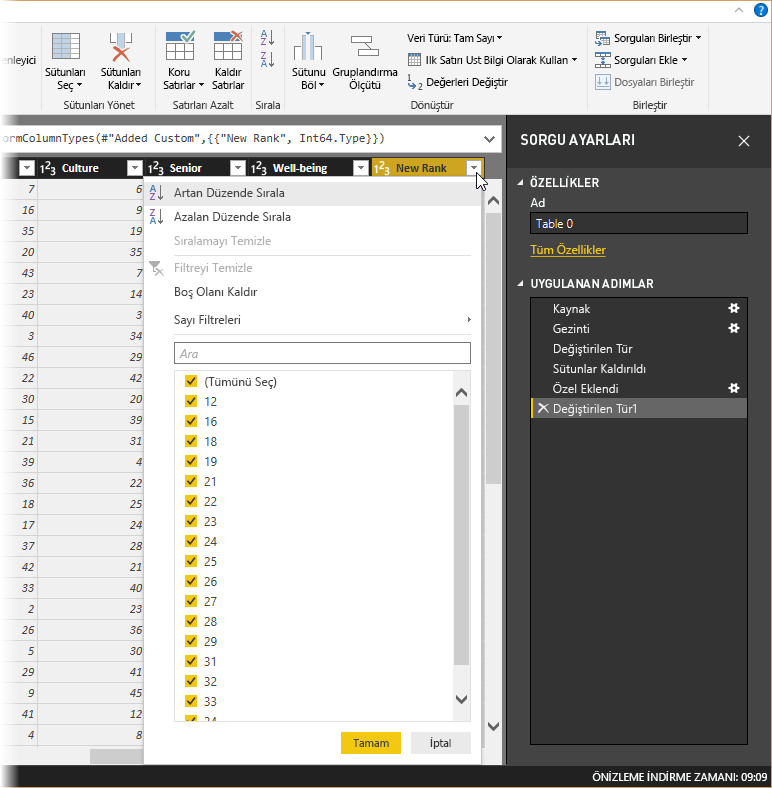

   Veriler **Yeni Derece**’ye göre sıralanır. Ancak **Derece** sütununa bakarsanız, **Yeni Derece** değerinin bağ olması durumunda verilerin düzgün şekilde sıralanmadığını fark edersiniz. Bu sorunu bir sonraki adımda çözeceğiz.

1. Veri sıralama sorununu düzeltmek için, **Yeni Derece** sütununu seçin ve **Formül Çubuğu**’ndaki formülü aşağıdaki formülle değiştirin:

   ```
    = Table.Sort(#"Changed Type1",{{"New Rank", Order.Ascending},{"Rank", Order.Ascending}})
   ```

1. Formül kutusunun solundaki yeşil onay işaretini seçin veya **Enter** tuşuna basın. 

   Satırlar artık hem **Yeni Derece** hem de **Derece** sütununa uygun olarak sıralanır. Ek olarak, listenin herhangi bir yerinde bulunan bir **Uygulanan Adım**'ı seçebilir ve verileri, sıradaki ilgili noktada şekillendirmeye devam edebilirsiniz. Sorgu Düzenleyicisi, yeni bir adımı o anda seçili olan **Uygulanan Adım**'ın arkasına otomatik olarak yerleştirir. 

1. **Uygulanan Adım**’da özel sütundan önceki **Kaldırılan Sütunlar** adımını seçin. Burada, Arizona’daki **Hava Durumu** derecelendirmesinin değerini değiştireceğiz. Arizona’nın **Hava Durumu** derecelendirmesini içeren hücreye sağ tıklayın ve sonra **Değerleri Değiştir**’i seçin. O anda hangi **Uygulanan Adım**’ın seçili olduğuna dikkat edin.

   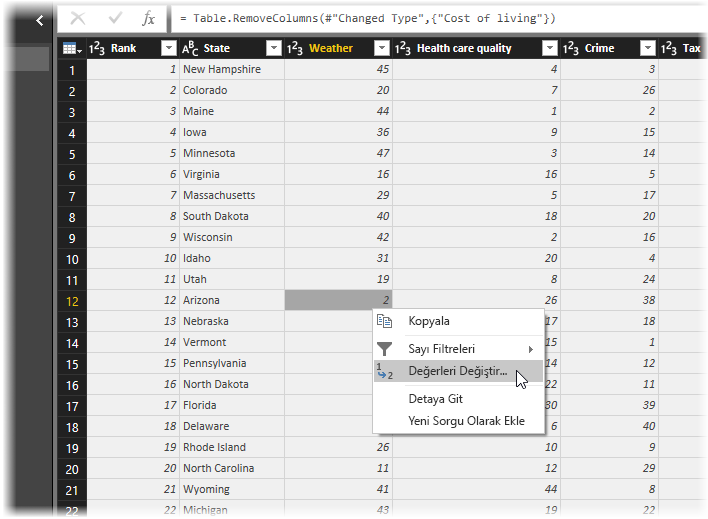

1. **Ekle**'yi seçin.

    Bir adım eklemeye çalıştığımız için Sorgu Düzenleyicisi bizi bu işlemin taşıdığı risk konusunda uyarır; birbirini izleyen adımlar sorgunun bozulmasına neden olabilir. 

    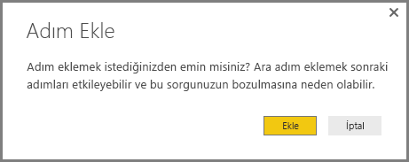

1. Veri değerini _51_ olarak değiştirin. 

   Sorgu Düzenleyicisi, Arizona verilerini değiştirir. Yeni bir **Uygulanan Adım** oluşturduğunuzda, Sorgu Düzenleyicisi bu adımı, gerçekleştirilen eyleme göre (bu örnekte, **Değiştirilen Değer**) adlandırır. Sorgunuzda aynı adlı birden fazla adım varsa, Sorgu Düzenleyicisi bunları ayırt etmek için, birbirini izleyen her bir **Uygulanan Adım**'a bir sayı (sırasıyla) ekler.

1. Son **Uygulanan Adım**’ı, **Satırlar Sıralandı**’yı seçin. 

   Arizona'nın yeni derecelendirmesi ile ilgili verilerin değiştiğine dikkat edin. Bu değişiklik, **Değiştirilen Değer** adımını, **Özel Eklendi** adımından önce doğru konuma eklememizden kaynaklanır.

1. Son olarak, söz konusu tablonun adını daha açıklayıcı bir adla değiştirmek istiyoruz. **Sorgu Ayarları** bölmesindeki **Özellikler** altında tablonun yeni adını girip **Enter** tuşuna basın. Bu tabloyu *RetirementStats* olarak adlandırın.

   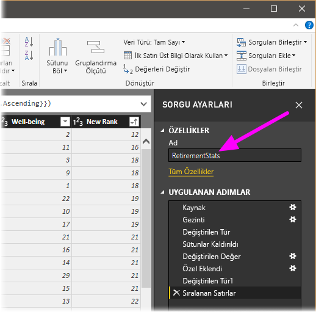

   Rapor oluşturmaya başladığımızda, özellikle de birden çok veri kaynağına bağlandığımızda, açıklayıcı tablo adları kullanmakta yarar vardır. Bu tablo adları **Rapor** görünümünün **Alanlar** bölmesinde listelenir.

   Verilerimizi gerektiği ölçüde şekillendirdik. Şimdi de başka bir veri kaynağına bağlanalım ve verileri birleştirelim.

## <a name="combine-data"></a>Verileri birleştirme
Eyaletlerin çeşitli durumları hakkındaki veriler ilgi çekicidir ve ek çözümleme çalışmaları ile sorgular oluşturmak için faydalı olacaktır. Ancak, bu noktada bir sorun var: Gösterilen verilerin çoğunda eyalet kodları için eyaletin tam adı yerine iki harfli kısaltmalar kullanılmıştır. Eyalet adlarını kısaltmalarıyla ilişkilendirmek için bir yönteme ihtiyacımız vardır.

Şanslı günümüzdeyiz! Tam da bunu yapan başka bir genel veri kaynağı var, ancak emeklilik tablomuza bağlamadan önce bazı şekillendirme işlemleri yapmamız gerekiyor. Verileri şekillendirmek için aşağıdaki adımları izleyin:

1. Sorgu Düzenleyicisi'ndeki **Giriş** şeridinde, **Yeni Kaynak \> Web**’i seçin. 

2. Durum kısaltmaları için web sitesinin *https://en.wikipedia.org/wiki/List_of_U.S._state_abbreviations* adresini girin ve ardından **Bağlan**'ı seçin.

   Gezgin, web sitesinin içeriğini görüntüler.

    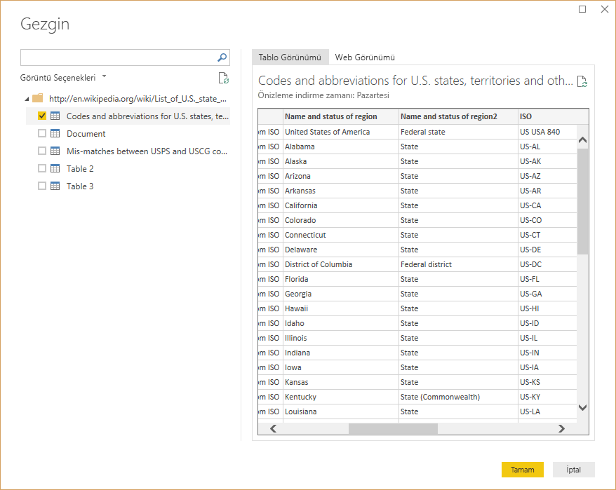

1. **Kodlar ve kısaltmalar**’ı seçin. 

   > [!TIP]
   > Bu tablonun verilerini istediğimiz düzeye indirmek için çok fazla şekillendirme işlemi gerekecektir. Aşağıdaki adımları daha hızlı veya kolay bir şekilde gerçekleştirmenin bir yolu var mı? Evet, iki tablo arasında *ilişki* oluşturabilir ve verileri bu ilişkiye göre şekillendirebiliriz. Aşağıdaki adımlar tablolarla çalışma konusunda öğrenilmesi gereken adımlardır ancak ilişkiler birden fazla tablodaki verileri hızlı bir şekilde kullanmanıza yardımcı olabilir.
> 
> 

Verileri şekillendirmek için aşağıdaki adımları izleyin:

1. En üstteki satırı kaldırın. Bu satır, web sayfasına ilişkin tablonun oluşturulma biçiminin bir sonucudur ve gerekli değildir. **Giriş** şeridinde, **Satırları Azalt \> Satırları Kaldır \> Üst Satırları Kaldır** seçeneğini belirleyin.

    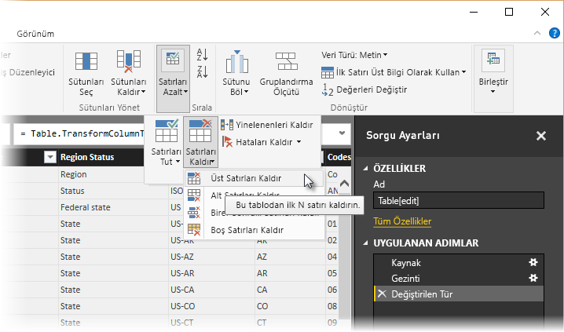

    Kaldırmak istediğiniz sütun sayısını belirtmenizi sağlayan **Üst Satırları Kaldır** penceresi görünür.

    > [!NOTE]
    > Power BI, tablo üst bilgilerini veri tablonuzdaki bir satır olarak yanlışlıkla içeri aktarırsa, tablonuzu düzeltmek için **Giriş** sekmesinden veya şeritteki **Dönüştür** sekmesinden **İlk Satırı Üst Bilgi Olarak Kullan** seçeneğini belirleyebilirsiniz.

1. En alttaki 26 satırı kaldırın. Bu satırlar ABD bölgeleridir ve dahil edilmesi gerekli değildir. **Giriş** şeridinde, **Satırları Azalt \> Satırları Kaldır \> Alt Satırları Kaldır** seçeneğini belirleyin.

    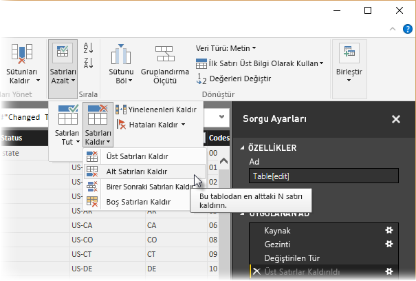

1. RetirementStats tablosunda Washington DC için bilgi bulunmadığından bunu listemizde filtrelememiz gerekir. **Bölge Durumu** açılır listesini seçin ve ardından **Federal bölge** seçeneğinin yanındaki onay kutusunu temizleyin.

    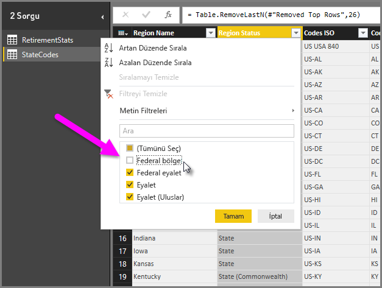

1. Birkaç gereksiz sütunu kaldırın. Yalnızca eyaletlerin iki harfli resmi kısaltmalarıyla eşlenmesi gerekli olduğundan aşağıdaki sütunları kaldırabiliriz: **Sütun1**, **Sütun3**, **Sütun4** ve **Sütun6** ile **Sütun11** arası. İlk olarak **Sütun1**’i seçin ve ardından **CTRL** tuşunu basılı tutarak kaldırılacak diğer sütunların her birini seçin. Şeritteki **Giriş** sekmesinden **Sütunları Kaldır \> Sütunları Kaldır** seçeneğini belirleyin.

   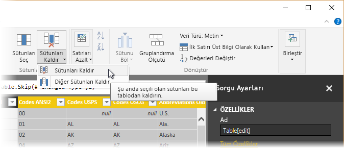

   > [!NOTE]
   > Sorgu Düzenleyicisi'nde uygulanan adımların *sırasının* önemli olduğuna ve verilerin nasıl şekilleneceğini etkileyebildiğine değinmenin zamanı geldi. Bir adımın sonraki bir adımı nasıl etkileyebileceği üzerinde düşünmekte de yarar vardır. Uygulanan Adımlar'daki bir adımı kaldırmanız durumunda, sorgunun adım sıralamasına etkisi nedeniyle sonraki adımlar başta planlandığı gibi davranış göstermeyebilir.

   > [!NOTE]
   > Sorgu Düzenleyicisi penceresini genişlik azalacak şekilde yeniden boyutlandırdığınızda, bazı şerit öğeleri, görünür alandan en iyi şekilde yararlanılmasını sağlayacak şekilde daraltılır. Sorgu Düzenleyicisi penceresinin genişliğini artırdığınızda ise şerit öğeleri, artırılmış şerit alanından en iyi şekilde yararlanılması için genişletilir.

1. Sütunları ve tabloyu yeniden adlandırın. Bir sütunu yeniden adlandırmanın birkaç yolu vardır: İlk olarak sütunu seçin, sonra **Dönüştür** sekmesinden **Yeniden Adlandır**’ı seçin ya da sağ tıklayıp **Yeniden Adlandır**'ı seçin. Söz konusu iki seçenek aşağıdaki görüntüde oklarla gösterilmiştir; bunlardan birini seçmeniz yeterlidir.

   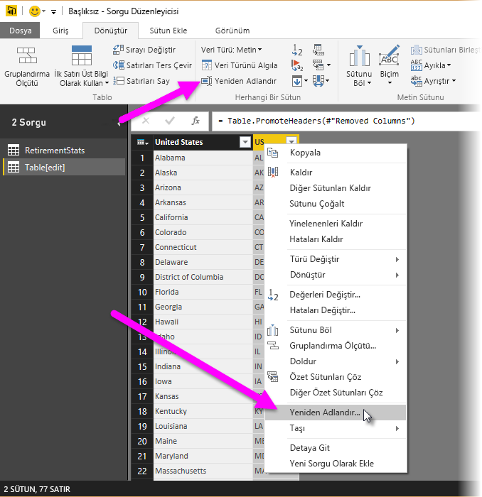

1. Sütunları *Eyalet Adı* ve *Eyalet Kodu* olarak yeniden adlandırın. Tabloyu yeniden adlandırmak için **Sorgu Ayarları** bölmesine **Ad** girin. Bu tabloyu *StateCodes* olarak adlandırın.

## <a name="combine-queries"></a>Sorguları birleştirme

StateCodes tablosunu istediğimiz gibi şekillendirdiğimize göre bu iki tabloyu veya sorguyu birleştirelim. Elde ettiğimiz tablolar verilere uyguladığımız tabloların sorguların bir sonucu olduğundan genellikle *sorgular* olarak adlandırılır.

Sorguları birleştirmenin iki temel yolu vardır: *birleştirme* ve *ekleme*.

- Bir veya daha fazla sütunu başka bir sorguya eklemek istediğinizde sorguları *birleştirirsiniz*. 
- Var olan bir sorguya eklemek istediğiniz ek veri satırları olduğunda sorguyu *eklersiniz*.

Bu örnekte sorguları birleştirmek istiyoruz. Bunu yapmak için şu adımları uygulayın:
 
1. Sorgu Düzenleyicisi'nin sol bölmesinde, diğer sorgunun *içine* birleştirilmesini istediğiniz sorguyu seçin. Bu örnekte sorgu **RetirementStats**’tır. 

1. Şeritteki **Giriş** sekmesinden **Birleştir \> Sorguları Birleştir** seçeneğini belirleyin.

   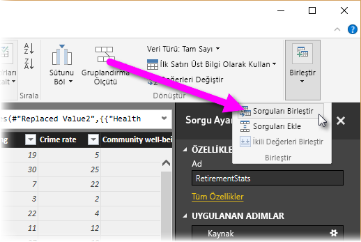

   Verilerin, aktarılmasını istemediğiniz veriler dahil edilmeden veya aktarılmadan birleştirildiğinden emin olmak için gizlilik düzeyleri belirlemeniz istenebilir.

   **Birleştir** penceresi görüntülenir. Seçili tabloyla birleştirmek istediğiniz tabloyu ve birleştirme için kullanılacak eşleşen sütunları seçmenizi ister. 

1. RetirementStats tablosundan **State**'i ve ardından **StateCodes**'u seçin. 

   Doğru eşleşen sütunları seçtiğinizde **Tamam** düğmesi etkinleştirilir.

   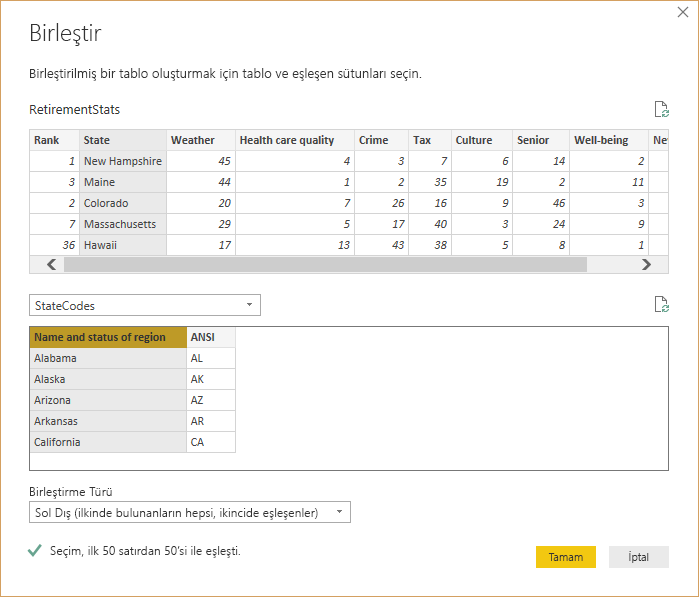

1. **Tamam**’ı seçin.

   Sorgu Düzenleyicisi, sorgunun sonunda, var olan sorguyla birleştirilen tablonun (sorgunun) içeriğinin bulunduğu bir **NewColumn** sütunu oluşturur. Birleştirilen sorgunun tüm sütunları **NewColumn** sütununda yer alacak şekilde daraltılır, ancak tabloyu **Genişlet** seçeneğini belirleyebilir ve istediğiniz sütunları dahil edebilirsiniz.

   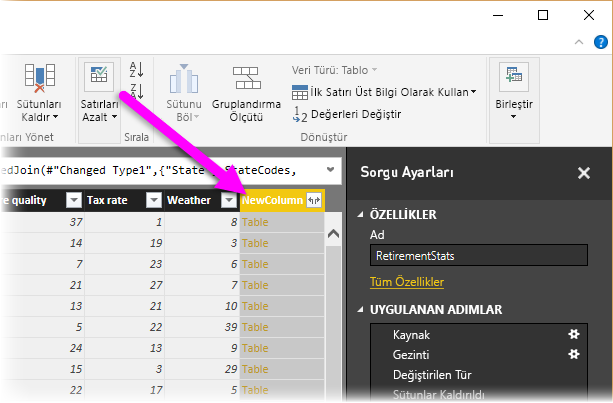

1. Birleştirilen tabloyu genişletmek ve hangi sütunların ekleneceğini seçmek için genişlet simgesini () seçin. 

   **Genişlet** penceresi görünür.

   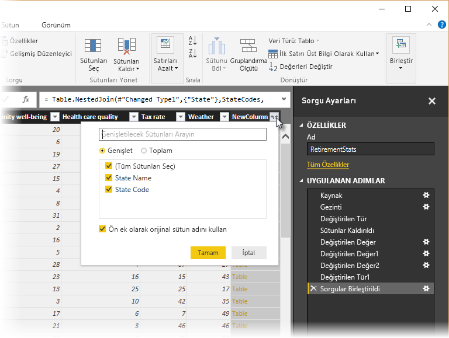

1. Bu örnekte yalnızca **State Code** sütunu gereklidir. Bu sütunu seçin, **Ön ek olarak orijinal sütun adını kullan**'ı temizleyin ve ardından **Tamam**'ı seçin.

   **Ön ek olarak orijinal sütun adını kullan** onay kutusunu işaretlenmiş olarak bıraksaydık, birleştirilen sütun **NewColumn.State Code** olarak adlandırılırdı.

   > [!NOTE]
   > NewColumn tablosunu nasıl getirebileceğinizi araştırmak mı istiyorsunuz? Biraz deneme yapabilirsiniz ve sonuçları beğenmezseniz **Sorgu Düzenleyicisi** bölmesindeki **Uygulanan Adımlar**'dan bu adımı silmeniz yeterlidir. Sorgunuz, bu **Genişlet** adımı uygulanmadan önceki haline geri döner. Bu işlemi, genişletme işlemi istediğiniz gibi görünene dek dilediğiniz kadar tekrarlayabilirsiniz.

   Her biri ihtiyaçlarımıza göre şekillendirilmiş iki veri kaynağının birleştirildiği tek bir sorgu (tablo) elde etmiş olduk. Bu sorgu, herhangi bir eyaletteki konut maliyeti istatistikleri, demografik bilgiler veya iş fırsatları gibi çok sayıda ve ilgi çekici veri bağlantıları için temel oluşturabilir.

1. Yaptığınız değişiklikleri uygulamak ve Sorgu Düzenleyicisi’ni kapatmak için, şeritteki **Giriş** sekmesinde **Kapat ve Uygula** seçeneğini belirleyin. 

   Dönüştürülmüş veri kümesi, rapor oluşturmak için kullanılmaya hazır bir şekilde Power BI Desktop'ta görüntülenir.

   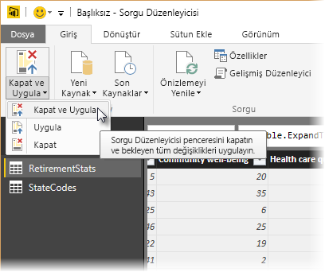

## <a name="next-steps"></a>Sonraki adımlar
Power BI Desktop ve özellikleri hakkında daha fazla bilgi için aşağıdaki kaynaklara bakın:

* [Power BI Desktop nedir?](../fundamentals/desktop-what-is-desktop.md)
* [Power BI Desktop'ta sorgulara genel bakış](../transform-model/desktop-query-overview.md)
* [Power BI Desktop'ta veri kaynakları](desktop-data-sources.md)
* [Power BI Desktop'ta verilere bağlanma](desktop-connect-to-data.md)
* [Power BI Desktop'taki genel sorgu görevleri](../transform-model/desktop-common-query-tasks.md)   
