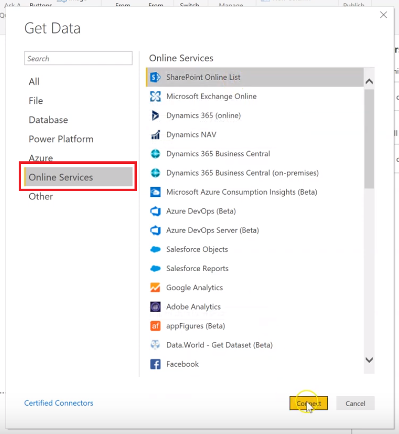
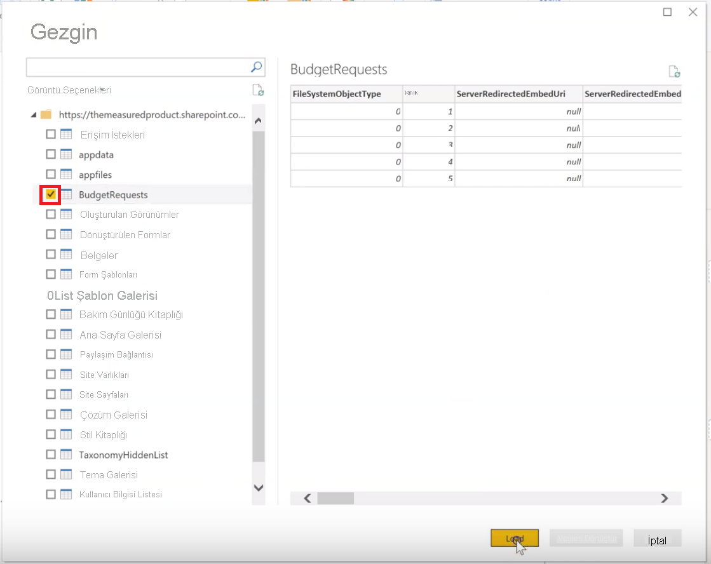

# SharePoint Listesinde rapor oluşturma

Birçok ekip ve kuruluş, kolayca ayarlanabildiğinden ve kullanıcılar tarafından güncelleştirilmesi kolay olduğundan, verileri depolamak için SharePoint Online’daki Listeleri kullanır.  Bazen, kullanıcıların verileri hızlı bir şekilde anlaması için listeye bakmak yerine bir grafiğe bakmak çok daha kolaydır. Bu öğreticide, SharePoint Listesi verilerinizi bir Power BI raporuna nasıl dönüştürebileceğinizi göstereceğiz.

Bu beş dakikalık öğretici videoyu izleyin veya adım adım yönergeler için kaydırarak aşağı doğru ilerleyin.

<iframe width="400" height="450" src="https://www.youtube.com/embed/OZO3x2NF8Ak" frameborder="0" allowfullscreen></iframe>

## 1\. Bölüm: SharePoint Listenize bağlanma

1. Henüz yapmadıysanız, [Power BI Desktop](https://powerbi.microsoft.com/desktop/)’ı indirin ve yükleyin.
2. Power BI Desktop’ı açın ve şeridin Giriş sekmesinde **Verileri Al** > **Daha fazla**’yı seçin.
3. **Çevrimiçi Hizmetler**’i seçin ve ardından **SharePoint Online Listesi**’ni seçin.  

    

4. **Bağlan**'ı seçin.
4. Listenizi içeren SharePoint Online sitenizin adresini (URL olarak da bilinir) bulun.  SharePoint Online’daki bir sayfadan, gezinti bölmesinde **Giriş**’i veya en üstteki sitenin simgesini seçerek site adresini alabilir ve ardından adresi web tarayıcınızın adres çubuğundan kopyalayabilirsiniz.

   Bu adımın videosunu izleyin:
   <iframe width="400" height="300" src="https://www.youtube.com/embed/OZO3x2NF8Ak?start=48&end=90" frameborder="0" allowfullscreen></iframe>

5. Power BI Desktop’ta, adresi Aç iletişim kutusundaki **Site URL’si** alanına yapıştırın.

6. Aşağıdaki görüntüde olduğu gibi bir SharePoint erişim ekranı görebilir veya görmeyebilirsiniz.  Bunu görmüyorsanız, 10. adıma atlayın.  Görüyorsanız, sayfanın sol tarafındaki **Microsoft Hesabı**’nı seçin.

    

7. **Oturum Aç**’ı seçin ve Microsoft 365’te oturum açmak için kullandığınız kullanıcı adını ve parolayı girin.

    

8. Oturum açmayı bitirdiğinizde **Bağlan**’ı seçin.

9. Gezginin sol tarafında, bağlanmak istediğiniz SharePoint listesinin yanındaki onay kutusunu seçin.

    

10. **Yükle**’yi seçin.  Power BI, liste verilerinizi yeni bir rapora yükler.

## 2\. Bölüm: Rapor oluşturma

1. SharePoint listesi verilerinizin yüklendiğini görmek için sol tarafta **Veri** simgesini seçin.

2. Numara içeren liste sütunlarınızın, sağdaki **Alanları bölmesinde** Sum veya Sigma simgesini gösterdiğinden emin olun.  Numara içermeyen sütunlar için, tablo görünümünde sütun başlığını seçin, **Modelleme** sekmesini seçin, daha sonra verilere bağlı olarak **Veri türü**’nü **Ondalık Sayı** veya **Tamsayı** olacak şekilde değiştirin.  Değişikliklerinizi onaylamanız istenirse **Evet**’i seçin.  Numaranız para birimi gibi özel bir biçimde ise, **Biçim** ayarlayarak da bu seçeneği belirleyebilirsiniz.

   Bu adımın videosunu izleyin:
   <iframe width="400" height="300" src="https://www.youtube.com/embed/OZO3x2NF8Ak?start=147&end=204" frameborder="0" allowfullscreen></iframe>

3. Sol tarafta **Rapor** simgesini seçin.
4. Sağdaki **Alanlar** bölmesinde yanlarında bulunan onay kutusunu seçerek görselleştirmek istediğiniz sütunları seçin.

   Bu adımın videosunu izleyin:
   <iframe width="400" height="300" src="https://www.youtube.com/embed/OZO3x2NF8Ak?start=215&end=252" frameborder="0" allowfullscreen></iframe>

5. Gerekirse görsel türünü değiştirin.
6. Mevcut görselin seçimini kaldırıp **Alanlar** bölmesinde diğer sütunlar için onay kutularını seçerek aynı raporda birden çok görselleştirme oluşturabilirsiniz.
7. Raporunuzu kaydetmek için **Kaydet**’i seçin.
