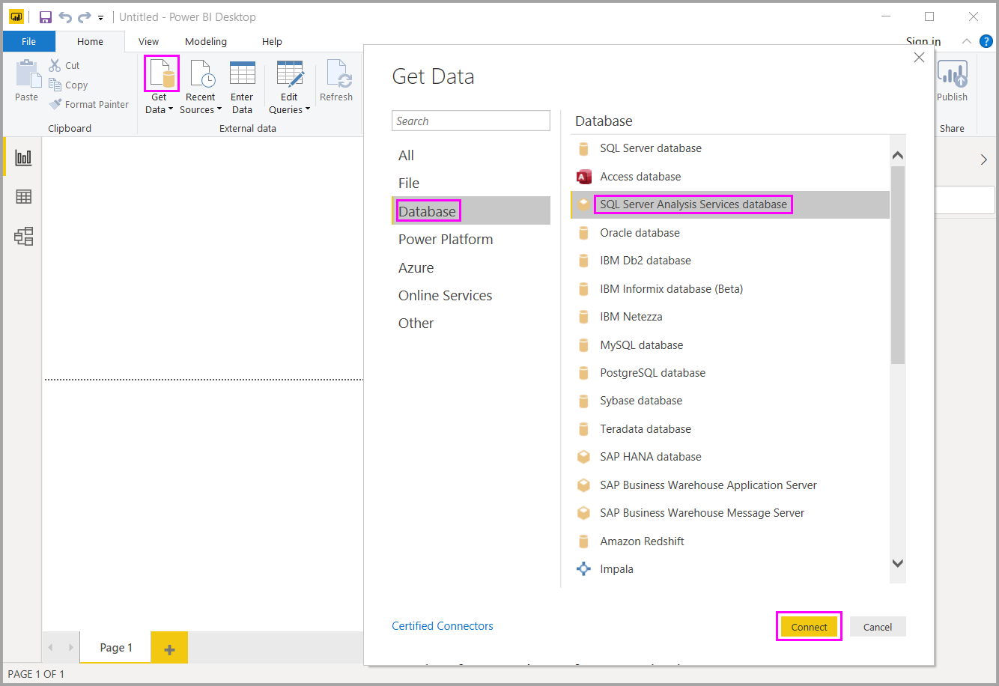

# Power BI Desktop'ta SSAS çok boyutlu modellerine bağlanma

Power BI Desktop ile genelde *SSAS MD* olarak adlandırılan *SSAS çok boyutlu modellerine* erişebilirsiniz.

SSAS MD veritabanına bağlanmak için **Veri Al**'ı, **Veritabanı** > **SQL Server Analysis Services veritabanı**'nı ve sonra da **Bağlan**'ı seçin:

Hem Power BI hizmeti hem de Power BI Desktop canlı bağlantı modunda SSAS çok boyutlu modellerini destekler. **SSAS Çok boyutlu modellerini** canlı modda kullanan raporları Power BI hizmetinde yayımlayabilir ve yükleyebilirsiniz.

## SSAS MD özellikleri

Aşağıdaki bölümlerde Power BI ve SSAS MD bağlantılarının özellikleri anlatılmaktadır.

### Çok boyutlu modellerin tablo meta verileri

Aşağıdaki tabloda çok boyutlu nesnelerle Power BI Desktop uygulamasına döndürülen tablo meta verileri gösterilmektedir. Power BI tablo meta verileri için modeli sorgular. Döndürülen meta verilere göre bir görselleştirme (tablo, matris, grafik veya dilimleyici gibi) oluşturduğunuzda Power BI Desktop SSAS hedefinde uygun DAX sorgularını çalıştırır.

| BISM-Çok boyutlu nesne | Tablo Meta Verileri |
| --- | --- |
| Küp |Model |
| Küp boyutu |Tablo |
| Boyut öznitelikleri (anahtarlar), ad |Sütunlar |
| Ölçü grubu |Tablo |
| Ölçü |Ölçü |
| Ölçüler, ilgili ölçü grubu olmadan |*Ölçüler* adlı tablonun içinde |
| Ölçü grubu -> Küp boyutu ilişkisi |İlişki |
| Perspektif |Perspektif |
| KPI |KPI |
| Kullanıcı/üst-alt öğe hiyerarşileri |Hiyerarşiler |

### Ölçüler, ölçü grupları ve KPI'ler

Çok boyutlu küpteki ölçü grupları **Alanlar** bölmesinde yanında sigma (∑) işareti olan tablolar şeklinde gösterilir. İlişkili ölçü grubu olmayan hesaplanan ölçüler, tablo meta verilerinde *Ölçüler* adındaki özel bir tabloda gruplanır.

Çok boyutlu modelde karmaşık modelleri basitleştirmeye yardımcı olmak için bir ölçü veya KPI kümesi tanımlayarak *görüntüleme klasörü* içine yerleştirebilirsiniz. Power BI tablo meta verilerindeki görüntüleme klasörlerini tanır ve görüntüleme klasörleri içindeki ölçülerle KPI'leri gösterir. Çok boyutlu veritabanlarındaki KPI'ler *Value*, *Goal*, *Status Graphic* ve *Trend Graphic* öğelerini destekler.

### Boyut özniteliği türü

Çok boyutlu modeller ayrıca boyut özniteliklerini belirli boyut öznitelik türleriyle ilişkilendirmeyi de destekler. Örneğin *City*, *State-Province*, *Country* ve *Postal Code* boyut özniteliklerinin ilişkilendirilmiş uygun coğrafya türlerine sahip olduğu bir **Geography** boyutu tablo meta verilerinde gösterilir. Power BI meta verileri tanıyarak harita görselleştirmeleri oluşturmanızı sağlar. Bu ilişkilendirmeleri Power BI'daki **Alan** bölmesinde öğenin yanında bulunan *harita* simgesinden anlayabilirsiniz.

Power BI ayrıca resimlerin URL'lerini (tekdüzen kaynak konum belirleyicisi) içeren bir alan belirttiğinizde resimleri oluşturabilir. Bu alanları SQL Server Veri Araçları'nda (veya Power BI'da) *ImageURL* türlerinde belirtebilirsiniz. Tür bilgisi Power BI'a tablo meta verilerinde sağlanır. Power BI da bu resimleri URL'den alarak görsellerde görüntüleyebilir.

### Üst-alt öğe hiyerarşileri

Çok boyutlu modeller üst-alt öğe hiyerarşilerini destekler ve bunlar tablo meta verilerinde *hiyerarşi* olarak gösterilir. Üst-alt öğe hiyerarşisinin her düzeyi tablo meta verilerinde gizli bir sütun olarak gösterilir. Üst-alt öğe boyutunun anahtar özniteliği tablo meta verilerinde gösterilmez.

### Boyut hesaplanan üyeleri

Çok boyutlu modeller çeşitli *hesaplanan üye* türlerinin oluşturulmasını destekler. En çok kullanılan iki hesaplanan üye türü:

* Öznitelik hiyerarşilerinde bulunan ve *Tümü* öğesinin alt öğeleri olmayan hesaplanan üyeler
* Kullanıcı hiyerarşilerindeki hesaplanan üyeler

Çok boyutlu modelde *öznitelik hiyerarşilerindeki hesaplanan üyeler* sütun değeri olarak gösterilir. Bu tür bir hesaplanan üyeyi kullanıma sunarsanız birkaç ek seçeneğiniz olur:

* Boyut özniteliğinin isteğe bağlı *UnknownMember* parametresi olabilir.

* Hesaplanan üyeleri içeren bir öznitelik, boyutun tek özniteliği olmadığı sürece boyutun anahtar özniteliği olamaz.

* Hesaplanan üyeleri içeren bir öznitelik, üst-alt öğe özniteliği olamaz.

Kullanıcı hiyerarşilerinin hesaplanan üyeleri Power BI'da gösterilmez. Bunun yerine kullanıcı hiyerarşilerindeki hesaplanan üyeleri içeren bir küpe bağlanabilirsiniz. Öte yandan hesaplanan üyeler önceki madde işaretli listede belirttiğimiz kısıtlamalara uymuyorsa, bu üyeleri göremezsiniz.

### Güvenlik

Çok boyutlu modeller *roller* aracılığıyla boyut ve hücre düzeyi güvenlik desteği sunar. Power BI ile bir küpe bağlandığınızda kimlik doğrulamasından geçersiniz ve ilgili izinlere sahip olup olmadığınız kontrol edilir. Kullanıcıya *boyut güvenliği* uygulandıysa ilgili boyut üyeleri Power BI'da bu kullanıcı tarafından görünmez. Ancak kullanıcıya *hücre güvenliği* izni tanımlandığında belirli hücrelere erişim kısıtlanır ve bu kullanıcı Power BI kullanarak küpe bağlanamaz.

## Önemli noktalar ve sınırlamalar

SSAS MD kullanımının belirli sınırlamaları vardır:

* SQL Server 2014’ün yalnızca Enterprise ve BI sürümleri canlı bağlantıları destekler. SQL Server’ın Standard sürümünde, canlı bağlantılar için SQL Server 2016 veya üzeri gereklidir.

* *Eylemler* ve *adlandırılmış kümeler* Power BI'ın kullanımına sunulmaz. Görselleri ve raporları oluşturmak için yine de eylemleri veya adlandırılmış kümeleri de içeren çok boyutlu küplere bağlanabilirsiniz.

* Power BI bir SSAS modeli için meta verileri görüntülediğinde bazen modelden verileri alamazsınız. MSOLAP sağlayıcısının 32 bit sürümünü yüklediyseniz ama 64 bit sürümünü yüklemediyseniz, bu senaryo gerçekleşebilir. 64 bit sürümün yüklenmesi sorunu çözebilir.

* SSAS çok boyutlu modeline canlı bağlantısı olan bir rapor yazarken *rapor düzeyi* ölçümleri oluşturamazsınız. Kullanılabilen ölçüler yalnızca MD modelinde tanımlanmış olanlardır.

## Power BI Desktop'ta desteklenen SSAS MD özellikleri

SSAS MD'nin bu sürümünde aşağıdaki öğelerin kullanımı desteklenir. Bu özellikler hakkında daha fazla bilgi için bkz. [Çok boyutlu modeller için Power View'u anlama](/sql/analysis-services/multidimensional-models/understanding-power-view-for-multidimensional-models?view=sql-server-2014).

* Varsayılan üyeler
* Boyut öznitelikleri
* Boyut özniteliği türleri
* Boyut hesaplanan üyeleri, bunlar:
  * boyutun birden çok özniteliği olduğunda tek gerçek üye olmalıdır;
  * tek öznitelik olmadığı sürece boyutun anahtar özniteliği olamaz;
  * bir üst-alt öğe özniteliği olamaz.
* Boyut güvenliği
* Görüntüleme klasörleri
* Hiyerarşiler
* ImageUrls
* KPI'ler
* KPI eğilimleri
* Ölçüler (ölçü gruplarıyla veya onlar olmadan)
* Değişken olarak ölçüler

## Sorun giderme

Aşağıdaki listede SQL Server Analysis Services’a (SSAS) bağlanma sırasında yaşandığı bilinen tüm sorunlar açıklanmıştır.

* **Hata: Model şeması yüklenemedi** - Bu hata genellikle Analysis Services’a bağlanan kullanıcının veritabanına/küpe erişimi olmadığında oluşur.
