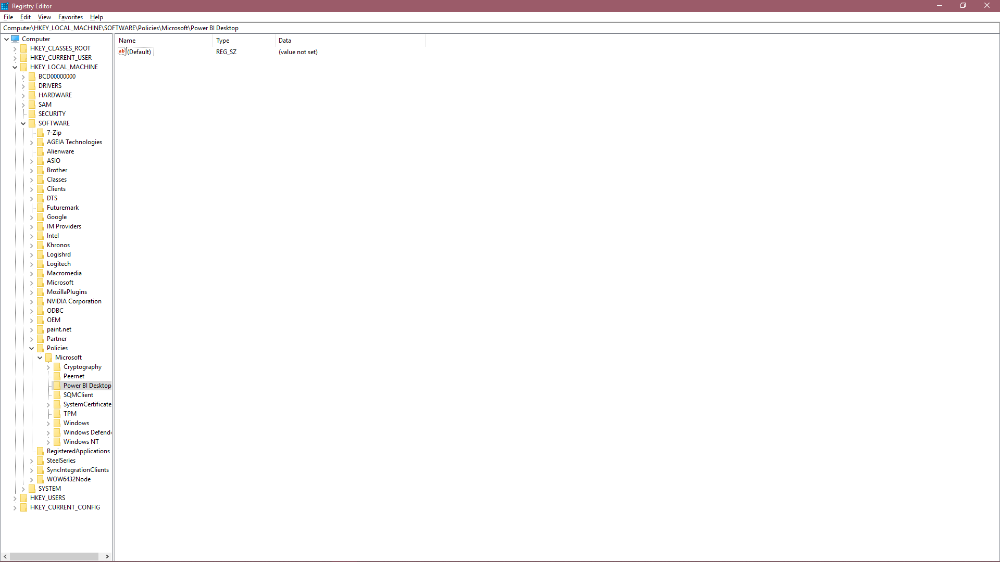

# Güvenilen üçüncü taraf bağlayıcılar

## Güvenilen üçüncü taraf bağlayıcılara neden ihtiyaç duyulur?

Power BI'da genellikle "Veri uzantısı güvenliği" düzeyinin yüksek tutulması ve bu sayede Microsoft tarafından onaylanmayan yüklenmesinin önlenmesi önerilir. Ancak kendi yazdığınız veya Microsoft onay yolu dışındaki bir danışman veya satıcı tarafından sağlanmış olan belirli bağlayıcıları yüklemek istediğiniz durumlar söz konusu olabilir.

Bağlayıcıyı geliştiren kişi bunu bir sertifika ile imzalayabilir ve güvenlik ayarlarınızı düşürmeye gerek kalmadan güvenli bir şekilde yüklemeniz için gerekli bilgileri sağlayabilir.

Güvenlik ayarları hakkında daha fazla bilgi edinmek için [bu sayfayı](./desktop-connector-extensibility.md) inceleyebilirsiniz.

## Üçüncü taraf bağlayıcılarına güvenmek için kayıt defterini kullanma

Power BI'da üçüncü taraf bağlayıcılarına güvenmek için güvenmek istediğiniz sertifikanın parmak izini belirtilen bir kayıt defteri değerinde listelemeniz gerekir. Bu parmak izinin yüklemek istediğiniz bağlayıcının sertifikasındaki parmak izi ile eşleşmesi durumunda ilgili bağlayıcıyı Power BI'da "Önerilen" güvenlik düzeyinde yükleyebilirsiniz. 

Kayıt defteri yolu: HKEY_LOCAL_MACHINE\Software\Policies\Microsoft\Power BI Desktop. Yolun var olduğundan emin olun veya oluşturun. Bu konumu seçmemizin nedeni öncelikli olarak BT ilkeleri tarafından denetlenmesi ve düzenlemek için yerel makinede yönetim izinlerinin gerekli olmasıdır. 

Yukarıda belirtilen yola yeni bir değer ekleyin. Türü “Çoklu Dize Değeri” (REG_MULTI_SZ), adı ise “TrustedCertificateThumbprints” olmalıdır. 

Güvenmek istediğiniz sertifikaların parmak izlerini ekleyin. Sınırlayıcı olarak “\0” kullanarak birden fazla sertifika ekleyebilir veya kayıt defteri düzenleyicisinde sağ tıklayıp Değiştir'i seçerek her parmak izini yeni bir satıra ekleyebilirsiniz. Örnek parmak izi, otomatik olarak imzalanan bir sertifikadan alınmıştır. 

 

Yönergeleri doğru bir şekilde takip ettiyseniz ve geliştiriciden doğru parmak izini aldıysanız ilgili sertifika ile imzalanmış olan bağlayıcılara güvenebilmeniz gerekir.

## Bağlayıcıları İmzalama

Sizin veya geliştiricinizin imzalaması gereken bir bağlayıcı varsa gerekli bilgilere [buradaki](/power-query/handlingconnectorsigning) Power Query belgesinden ulaşabilirsiniz.