# Öğretici: Power BI Desktop kullanarak Facebook verilerini analiz etme

Bu öğreticide, Facebook’tan verileri içeri aktarmayı ve Power BI Desktop’ta bunları kullanmayı öğreneceksiniz. Bağlanıp Power BI Facebook sayfasından verileri içeri aktaracak, içeri aktarılan verilere dönüştürmeler uygulayacak ve rapor görselleştirmelerinde bu verileri kullanacaksınız.

> [!WARNING]
> Facebook Uygulaması izin kısıtlamaları nedeniyle, bu makalede açıklanan bağlayıcı özellikleri şu anda düzgün çalışmamaktadır. Bu işlevselliği mümkün olan en kısa sürede geri döndürmek için Facebook ile birlikte çalışıyoruz.

## Bir Facebook sayfasına bağlanma

Bu öğreticide, [Microsoft Power BI Facebook sayfasındaki](https://www.facebook.com/microsoftbi) veriler kullanılmaktadır. Bağlanmak ve bu sayfadan verileri içeri aktarmak için kişisel Facebook hesabı dışında özel bir kimlik bilgisi gerekmez.

1. Power BI Desktop’ı açın ve **Başlarken** iletişim kutusunda **Veri al** seçeneğini belirleyin veya **Giriş** şerit sekmesinde **Veri Al**’ı ve sonra **Diğer** seçeneğini belirleyin.
   
2. **Veri Al** iletişim kutusunda, **Online Services** grubundan **Facebook**’u seçin ve **Bağlan** seçeneğini belirleyin.
   
   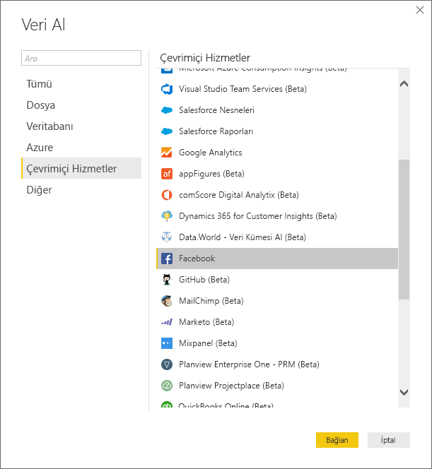
   
   Üçüncü taraf hizmetleri kullanmanın risklerini bildiren bir iletişim kutusu görüntülenir.
   
   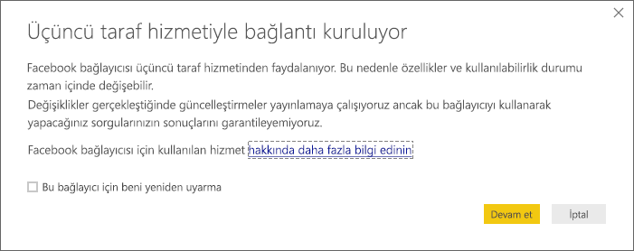
   
3. **Devam**’ı seçin. 
   
4. **Facebook** iletişim kutusunda **kullanıcı adı** alanına **microsoftbi** sayfasının adını yazın, **Bağlantı** açılan menüsünden **Gönderiler**'i seçin ve ardından **Tamam**'ı seçin.
   
   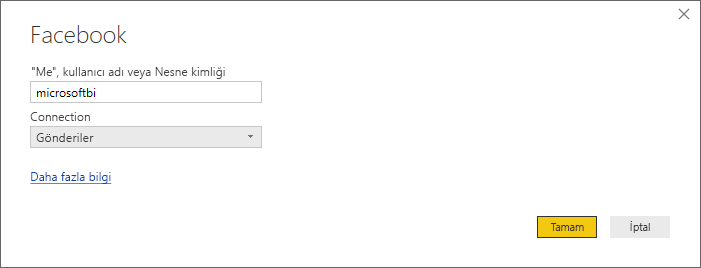
   
5. Kimlik bilgileri istendiğinde kendi Facebook hesabınızda oturum açın ve Power BI’ın hesabınıza erişmesine izin verin.
   
   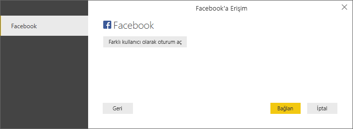

   Power BI Facebook sayfasına bağlandıktan sonra, sayfanın gönderi verilerinin önizlemesini görürsünüz. 
   
   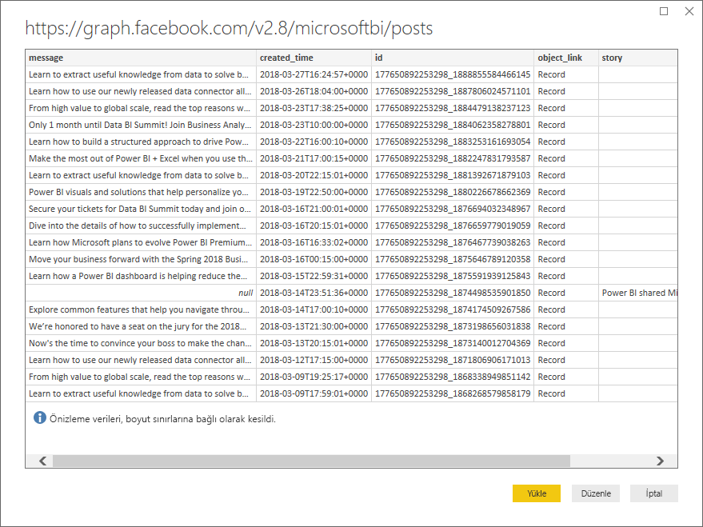
   
## İçeri aktarılan verileri şekillendirme ve dönüştürme

Zaman içinde hangi gönderilerin en çok açıklama içerdiğini görmek ve göstermek istediğinizi, ancak gönderi verileri önizlemesinde, **created_time** verilerinin okunmasının ve anlaşılmasının zor olduğunu ve herhangi bir açıklama verisi olmadığını fark ettiğinizi düşünün. En iyi şekilde yararlanmak için veriler üzerinde şekillendirme ve temizleme işlemi gerçekleştirin. Bunun için verileri Power BI Desktop’a içeri aktarmadan önce veya sonra Power BI Desktop Power Query Düzenleyicisi'ni kullanabilirsiniz. 

### Tarih/saat sütununu bölme

İlk olarak, **created_time** sütunundaki tarih ve saat değerlerini daha okunaklı olması için ayırın. 

1. Facebook veri önizlemesinde **Düzenle**’yi seçin. 
   
   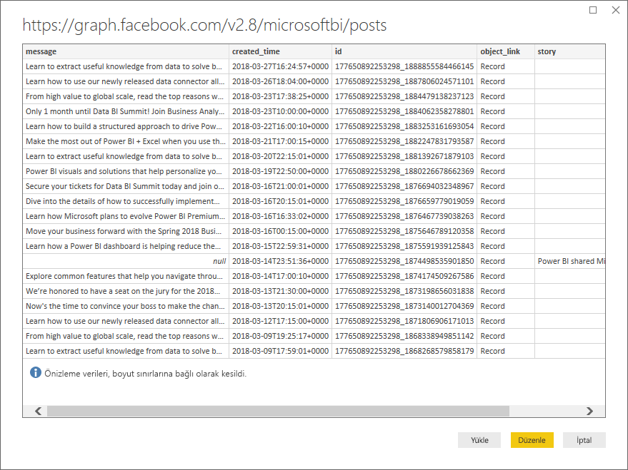
   
   Power BI Desktop Power Query Düzenleyicisi, yeni bir pencerede açılır ve Power BI Facebook sayfasından veri önizlemesini görüntüler. 
   
   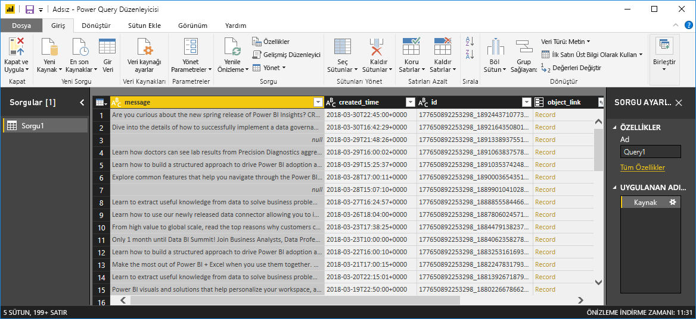
   
2. **created_time** sütununu seçin. Bunun, sütun üst bilgisindeki **ABC** simgesiyle gösterilen bir **Metin** veri türü olduğuna dikkat edin. Üst bilgiye sağ tıklayıp açılan listeden **Sütunu Böl** > **Sınırlayıcıya Göre**'yi seçin. Alternatif olarak şeridin **Giriş** sekmesindeki **Dönüşüm** grubundan da **Sütunu Böl** > **Sınırlayıcıya Göre** seçeneğini belirtebilirsiniz.  
   
   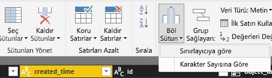
   
3. **Sütunu Sınırlayıcıyla Böl** iletişim kutusunda, açılır listeden **Özel**’i seçin, giriş alanına **T** (**created_time** değerlerinin zaman kısmının başındaki karakter) yazın ve **Tamam**’ı seçin. 
   
   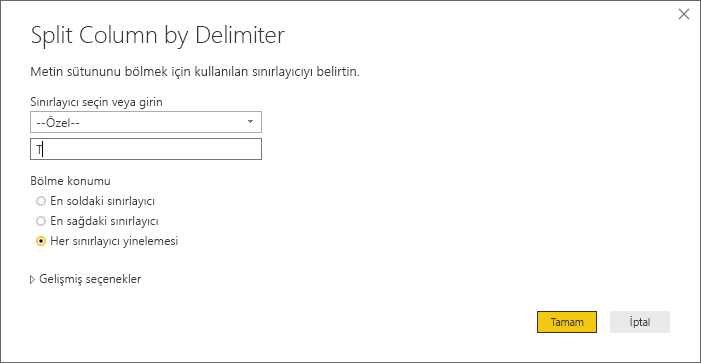
   
   Sütun, *T* sınırlayıcısından önceki ve sonraki dizeleri içeren iki sütuna ayrılır. Yeni sütunlar sırasıyla **created_time.1** ve **created_time.2** olarak adlandırılır. Power BI’ın veri türlerini otomatik olarak algıladığını ve bu veri türlerini birinci sütun için **Tarih** olarak, ikinci sütun için **Saat** olarak değiştirdiğini ve tarih ve saat değerlerini daha okunabilir olacak şekilde biçimlendirdiğini göreceksiniz.
   
4. İki sütunu yeniden adlandırın. **created_time.1** sütununu seçtikten sonra şeridin **Dönüşüm** sekmesinin **Herhangi Bir Sütun** grubundan **Yeniden Adlandır**'ı seçin. Alternatif olarak sütun üst bilgisine çift tıklayıp yeni sütun adını (**created_date**) girebilirsiniz. Bu işlemi **created_time.2** sütunu için tekrarlayarak adını **created_time** yapın.
   
   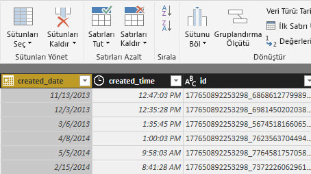
   
### İç içe geçmiş sütunu genişletme

Tarih ve saat verileri, istediğiniz şekilde olduğuna göre şimdi iç içe geçmiş bir sütunu genişleterek açıklama verilerini gösterirsiniz. 

1. **object_link** sütununun en üstündeki  simgesini seçip **Genişlet/Toplat** iletişim kutusunu açın. **Bağlantılar**’ı seçin ve sonra **Tamam** seçeneğini belirleyin. 
   
   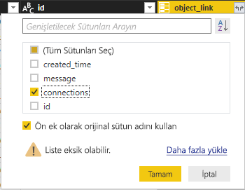
   
   Sütun başlığı, **object_link.connections** olarak değişir.
2. **object_link.connections** sütununun üst kısmındaki  simgesini seçin, **açıklamalar**’ı seçin ve sonra **Tamam** seçeneğini belirleyin. Sütun başlığı, **object_link.connections.comments** olarak değişir.
   
3. **object_link.connections.comments** sütununun üst kısmındaki  simgesini seçin ve bu defa iletişim kutusunda **Genişlet** yerine **Topla** seçeneğini belirleyin. **Kimlik # Sayısı**’nı seçin ve sonra **Tamam** seçeneğini belirleyin. 
   
   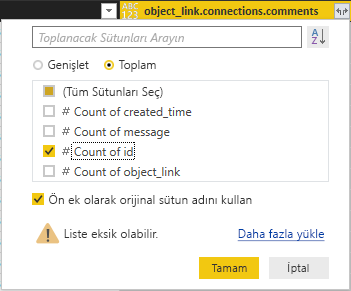
   
   Sütun şimdi her bir ileti için açıklama sayısını görüntüler. 
   
4. **object_link.connections.comments.id sayısı** sütununu **Açıklama sayısı** olarak yeniden adlandırın.
   
5. **Açıklama sayısı** sütun üst bilgisinin yanındaki aşağı oku seçin ve **Azalan Düzende Sırala** seçeneğini belirleyerek gönderileri en fazla açıklama içerenden en az içerene doğru sıralanmış şekilde görüntüleyin. 
   
   
   
### Sorgu adımlarını gözden geçirme

**Power Query Düzenleyicisi**’ndeki verileri şekillendirip dönüştürdüğünüzde her bir adım, Güç Sorgu Düzenleyicisi penceresinin sağ tarafındaki **Sorgu Ayarları** bölmesinin **Uygulanan Adımlar** alanına kaydedilmiştir. Yaptığınız değişiklikleri görmek ve gerekirse bunları düzenlemek, silmek veya yeniden sıralamak için **Uygulanan Adımlar**'da geri gidebilirsiniz. Bu adımları değiştirirken dikkatli olun. Adımların değiştirilmesi, sonraki adımları olumsuz etkileyebilir. 

Şu ana kadar veri dönüştürmelerini uygulamanızın ardından **Uygulanan Adımlar** ekranınız şöyle görünmelidir:
   
   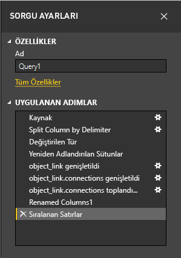
   
   >[!TIP]
   >**Uygulanan Adımlar** ekranının temelini [Power Query M formül dili](/powerquery-m/quick-tour-of-the-power-query-m-formula-language) ile yazılan formüller oluşturur. Formülleri görmek ve düzenlemek için, şeridin **Giriş** sekmesinin **Sorgu** grubunda **Gelişmiş Düzenleyici**’yi seçin. 

### Dönüştürülmüş verileri içeri aktarma

Verilerden memnun kaldığınızda, verileri Power BI Desktop’a içeri aktarmak için şeridin **Giriş** sekmesindeki **Kapat ve Uygula** > **Kapat ve Uygula** seçeneklerini belirleyin. 
   
   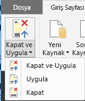
   
   Bir iletişim kutusu, verilerin Power BI Desktop veri modeline yüklenme durumunu görüntüler. 
   
   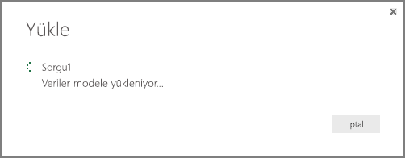
   
   Veriler yüklendikten sonra, **Rapor** görünümünde **Alanlar** bölmesinde yeni bir sorgu olarak görüntülenir.
   
   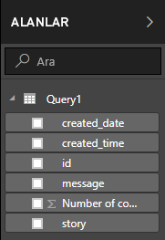
   
## Rapor görselleştirmelerindeki verileri kullanma 

Facebook sayfasındaki verileri içeri aktardığınıza göre şimdi görselleştirmeleri kullanarak hızlı ve kolayca verilerinizle ilgili öngörülere sahip olabilirsiniz. Görselleştirme oluşturmak kolaydır; tek yapmanız gereken bir alanı seçip **Alanlar** bölmesinden rapor tuvaline sürüklemektir.

### Çubuk grafik oluşturma

1. Power BI Desktop **Rapor** görünümünde, **Alanlar** bölmesinden **ileti** öğesini seçin veya tuvale sürükleyin. Tuvalde, tüm gönderi iletilerini gösteren bir tablo görüntülenir. 
   
   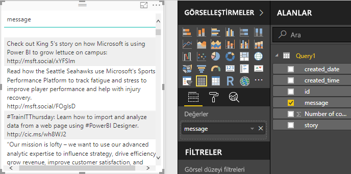
   
2. Bu tablo seçili durumdayken, **Alanlar** bölmesinden **Açıklama sayısı**’nı da seçin veya tabloya sürükleyin. 
   
3. **Görsel Öğeler** bölmesinde **Yığılmış çubuk grafik** simgesini seçin. Tablo, gönderi başına açıklama sayısını gösteren bir çubuk grafiğe dönüşür. 
   
   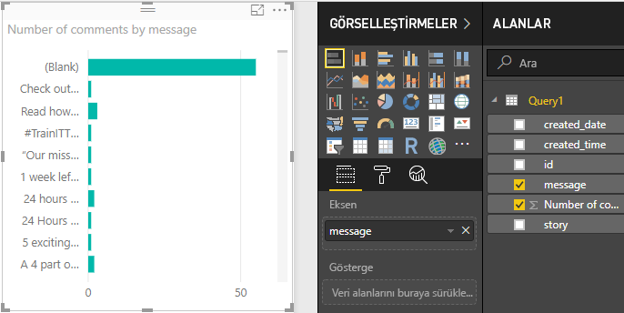
   
4. Görselleştirmenin yanındaki **Diğer seçenekler**’i (...) seçin ve sonra tabloyu açıklama sayısına göre azalan düzende sıralamak için **Sıralama ölçütü:**  > **Açıklama sayısına göre sırala** seçeneğini belirleyin. 

   Çoğu açıklamanın, **(Boş)** iletilerle ilişkilendirilmiş olduğunu unutmayın (bu gönderiler; hikayeler, bağlantılar, videolar veya metin olmayan başka içerikler olabilir). 
   
5. Boş satırı filtrelemek için, **Filtreler** bölümünden **ileti (Tümü)** seçeneğini belirleyin, **Tümünü seç** öğesini seçin ve sonra **(Boş)** öğesini seçerek seçimini kaldırın. 

   **Filtreler** bölmesindeki giriş, **ileti (Boş) değil** olarak değişir ve **(Boş)** satırı, grafik görselleştirmesinden kaybolur.
   
   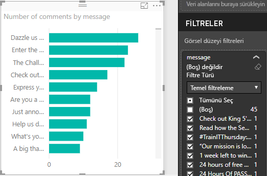
   
### Grafiği biçimlendirme

Görselleştirme daha ilginç hale geliyor, ancak grafikte gönderi metninin büyük kısmını göremiyorsunuz. Gönderi metninin daha fazlasını göstermek için:

1. Grafik görselleştirmesindeki tutamaçları kullanarak grafiği olabildiğince büyük olacak şekilde yeniden boyutlandırın. 
   
2. Grafik seçili durumdayken, **Görsel Öğeler** bölmesindeki **Biçim** simgesini (boya rulosu) seçin.
   
3. **Y ekseni**’nin yanındaki aşağı oku seçin ve **En büyük boyut** kaydırıcısını tamamen sağa ( **%50**) sürükleyin. 
4. Daha fazla metin sığdırmak için **Metin boyutu**’nu **10 nk** değerine de düşürebilirsiniz.
   
   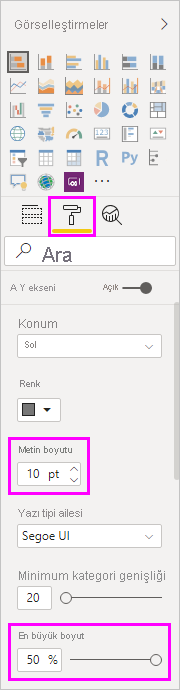
   
   Grafik şimdi daha fazla gönderi içeriği gösterir. 
   
   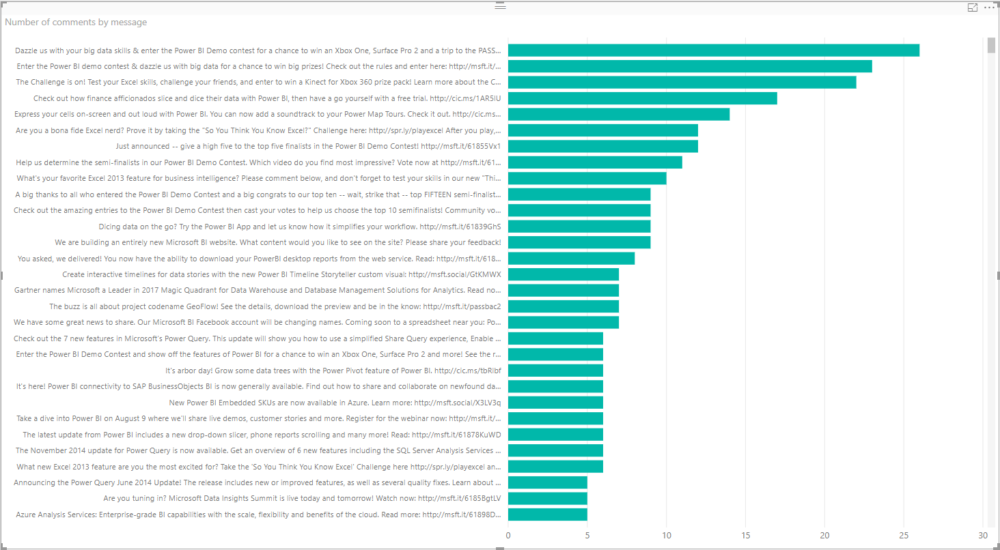
   
Grafiğin X ekseni (açıklama sayısı), tam değerleri göstermez ve grafiğin alt kısmında kaybolur. Bunun yerine veri etiketlerini kullanabilirsiniz: 

1. **Biçim** simgesini seçin ve **X ekseni** kaydırıcısını **Kapalı** duruma getirin. 
   
2. **Veri etiketleri** kaydırıcısını **Açık** duruma getirin. 

   Şimdi grafik, her bir gönderi için tam açıklama sayısını gösterir.
   
   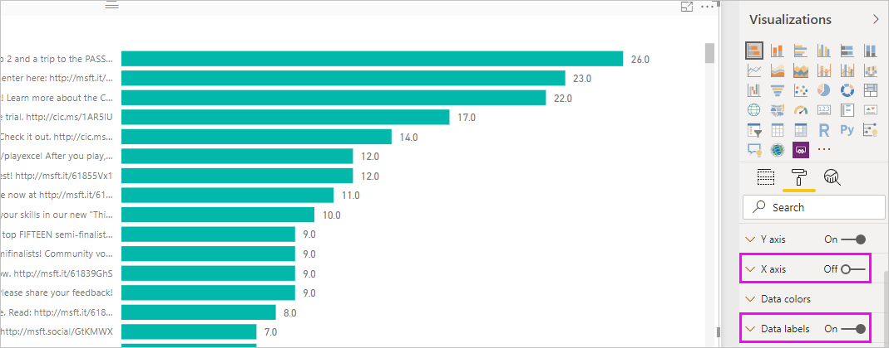
   
### Veri türünü düzenleme

Bu daha iyi, ancak **Gönderi sayısı** değerinin bir tamsayı olması gerektiğinden, tüm veri etiketlerinde dikkat dağıtabilecek ve yanıltabilecek bir **,0** ondalık basamağı vardır. Bu durumu düzeltmek için **Gönderi sayısı** sütununun veri türünü **Tam Sayı** olarak değiştirmeniz gerekir:

1. **Alanlar** bölmesinde **Query1** girişine sağ tıklayın veya üzerine gelip **Diğer seçenekler** (...) öğesini seçin. 

2. Bağlam menüsünde **Sorguyu düzenle**'yi seçin. Alternatif olarak şeridin **Giriş** sekmesindeki **Dış veriler** grubundan **Sorguları Düzenle** > **Sorguları Düzenle**'yi de seçebilirsiniz. 
   
3. **Power Query Düzenleyicisi** penceresinde **Açıklama sayısı** sütununu seçin ve aşağıdaki adımlardan birini izleyerek veri türünü değiştirin: 
   - **Açıklama sayısı** sütun üst bilgisinin yanındaki **1.2** simgesini seçip açılır listeden **Tam sayı**’yı seçin.
   - Sütun üst bilgisine sağ tıklayıp **Türü Değiştir** > **Tam Sayı** seçeneğini belirleyin.
   - **Giriş** sekmesinin **Dönüşüm** grubundan veya **Dönüşüm** sekmesinin **Herhangi Bir Sütun** grubundan **Veri türü: Ondalık Sayı**’yı seçin ve sonra da **Tam Sayı**'yı seçin.
   
   Sütun üst bilgisindeki simge, **123**’e dönüşerek **Tam Sayı** veri türünü belirtir.
   
   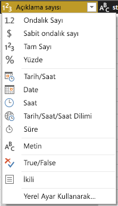
   
3. Değişiklikleri uygulamak için **Dosya** > **Kapat ve Uygula**'yı veya **Power Query Düzenleyicisi** penceresini açık tutmak için **Dosya** > **Uygula**'yı seçin. 

   Değişiklikler yüklendikten sonra grafikteki veri etiketleri tam sayıya dönüşür.
   
   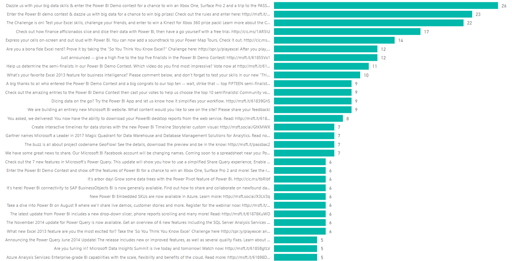
   
### Tarih dilimleyici oluşturma

Zaman içinde gönderilerdeki açıklama sayısını görselleştirmek istediğinizi düşünelim. Farklı zaman çerçevelerine yönelik grafik verilerini filtrelemek için dilimleyici görselleştirmesi oluşturabilirsiniz. 

1. Tuvalin boş bir alanını seçin ve sonra **Görsel Öğeler** bölmesindeki **Dilimleyici** simgesini seçin. 

   Boş bir dilimleyici görselleştirmesi görüntülenir.
   
   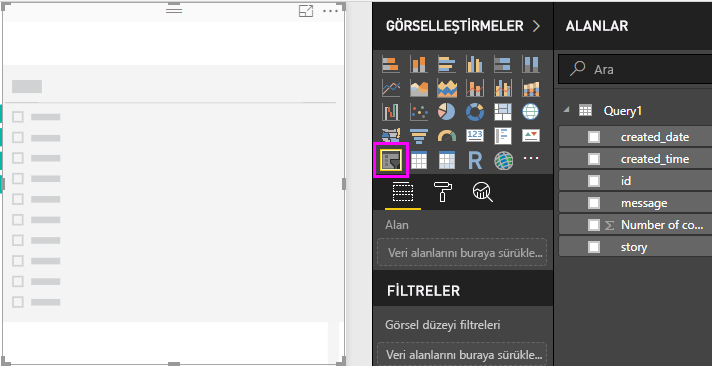
   
2. **Alanlar** bölmesinden **created_date** alanını seçin veya yeni dilimleyiciye sürükleyin. 

   Dilimleyici, alanın **Tarih** veri türüne bağlı olarak bir tarih aralığı kaydırıcısına dönüşür.
   
   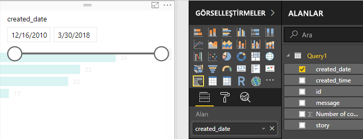
   
3. Farklı tarih aralıkları seçmek için kaydırıcı tutamaçlarını taşıyın ve grafik verilerinin nasıl uygun şekilde filtrelendiğine dikkat edin. Ayrıca, kaydırıcıdaki tarih alanlarını da seçebilir ve belirli tarihleri girebilir veya bir takvim açılır penceresinden bunları seçebilirsiniz.
    
   
   
### Görselleştirmeleri biçimlendirme

Grafiğe daha açıklayıcı ve çekici bir başlık verin: 

1. Grafik seçili durumdayken **Görsel Öğeler** bölmesindeki **Biçimlendir** simgesini seçin ve ardından **Başlık** girişinin yanındaki aşağı oku seçerek genişletin.

2. **Başlık metni**’ni **Gönderi başına açıklama sayısı** olarak değiştirin. 

3. **Yazı tipi rengi**’nin yanındaki açılır oku seçin ve görselleştirmenin yeşil çubuklarıyla eşleşmesi için yeşil renk seçin.

4. **Metin boyutu**’nu **10 nk** değerine artırın ve **Yazı tipi ailesi**’ni **Segoe (Kalın)** değerine geçirin.

5. Görselleştirmelerinizin görünümünü değiştirmek için diğer biçimlendirme seçenekleri ve ayarları ile denemeler yapın. 

   

## Daha fazla görselleştirme oluşturma

Gördüğünüz gibi verileri istediğiniz şekilde sunmak için raporunuzdaki görselleştirmeleri kolayca özelleştirebilirsiniz. Örneğin, zaman içindeki açıklama sayısını gösteren bu çizgi grafiği oluşturmak için içeri aktarılan Facebook verilerini kullanmayı deneyin.

Power BI Desktop, birçok farklı veri kaynağından veri almanın ve çözümleme ihtiyaçlarınızı karşılayacak şekilde biçimlendirmeye ek olarak bu verileri zengin ve etkileşimli bir şekilde görselleştirmeye kadar sorunsuz ve uçtan uca bir deneyim sunar. Raporunuz hazır hale geldikten sonra raporunuzu [Power BI hizmetine yükleyebilir](../create-reports/desktop-upload-desktop-files.md), bunu kullanan panolar oluşturabilir ve diğer Power BI kullanıcılarıyla paylaşabilirsiniz.

## Sonraki adımlar
* [Power BI için Microsoft Learn](/learn/powerplatform/power-bi?WT.mc_id=powerbi_landingpage-docs-link)
* [Power BI Forumu'nu ziyaret edin](https://go.microsoft.com/fwlink/?LinkID=519326)
* [Power BI Blogu'nu okuyun](https://go.microsoft.com/fwlink/?LinkID=519327)