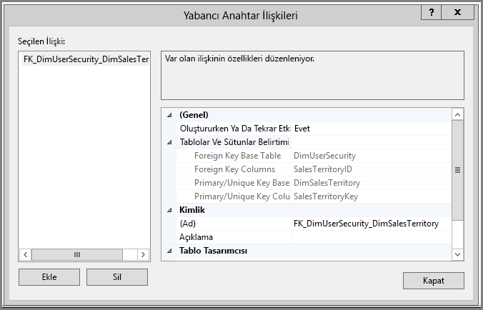
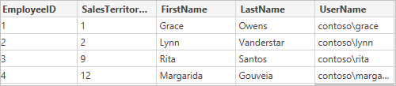
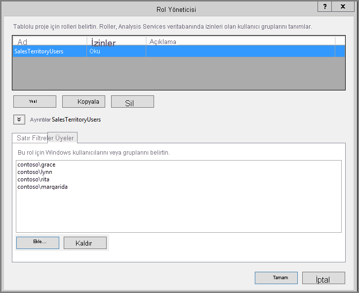
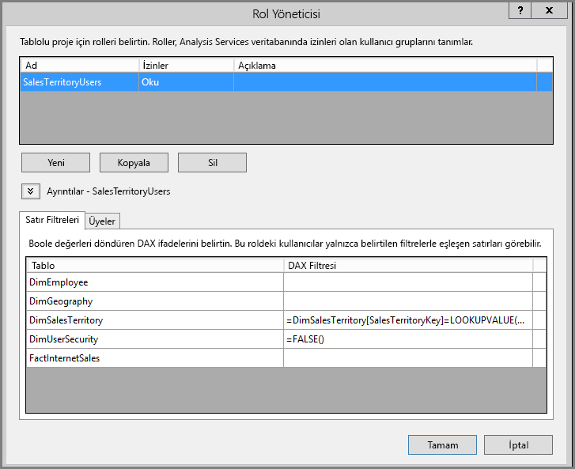
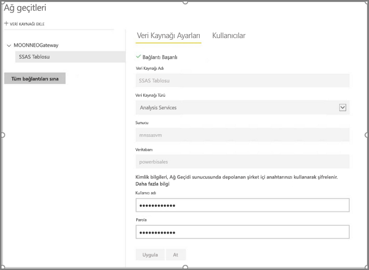
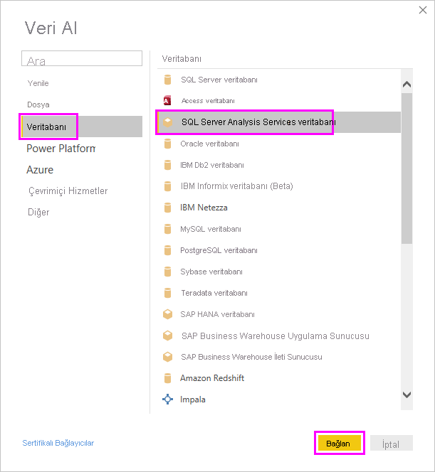
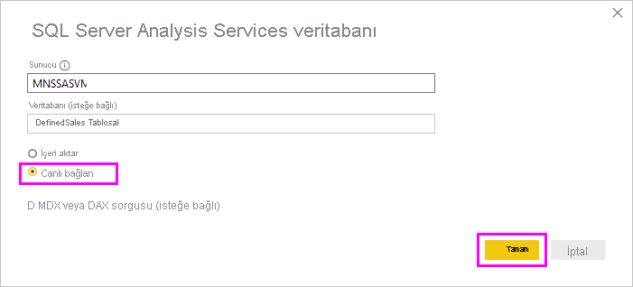
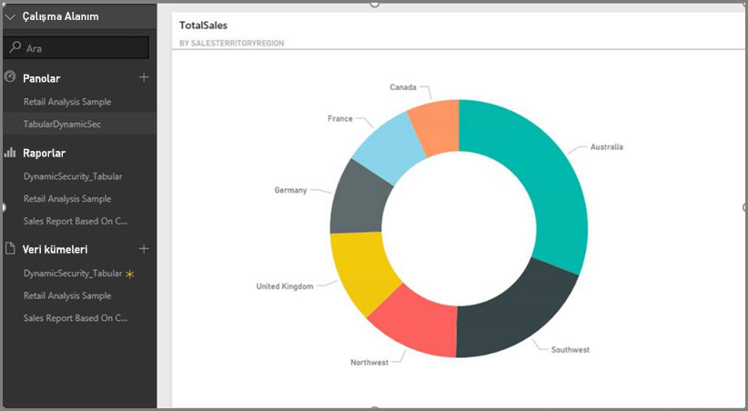
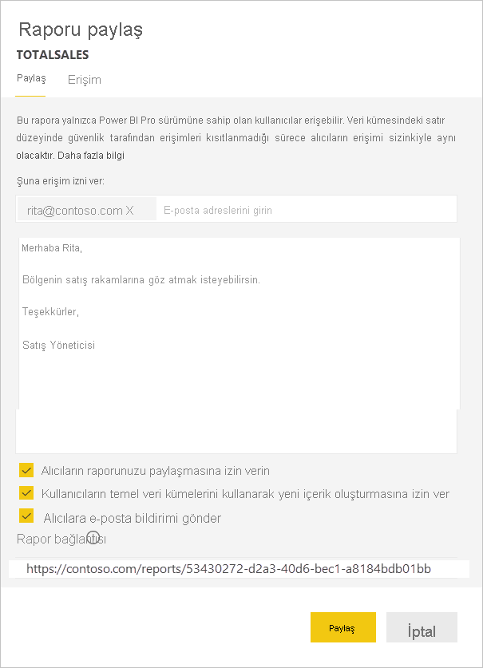

# <a name="implement-row-level-security-in-an-analysis-services-tabular-model"></a>Analysis Services tablosal modelinde satır düzeyi güvenlik uygulama

Bu öğreticide aşağıdaki adımların üzerinden geçerken örnek bir veri kümesi kullanılarak *Analysis Services Tablolu Modeli*'nde [**satır düzeyi güvenliğin**](../admin/service-admin-rls.md) uygulanması ve bunun bir Power BI raporunda kullanılması gösterilir.

* [AdventureworksDW2012 veritabanında](https://github.com/Microsoft/sql-server-samples/releases/tag/adventureworks) yeni bir güvenlik tablosu oluşturma
* Gerekli olgu ve boyut tablolarıyla tablolu modeli oluşturma
* Kullanıcı rollerini ve izinlerini tanımlama
* Modeli *Analysis Services tablolu* örneğine dağıtma
* Rapora erişen kullanıcıya göre uyarlanmış veriler gösteren bir Power BI Desktop raporu oluşturma
* Raporu *Power BI hizmetinde* yayımlama
* Raporu temel alan yeni bir pano oluşturma
* Panoyu iş arkadaşlarınızla paylaşma

Bu öğretici için [AdventureworksDW2012 veritabanı](https://github.com/Microsoft/sql-server-samples/releases/tag/adventureworks) gereklidir.

## <a name="task-1-create-the-user-security-table-and-define-data-relationship"></a>1\. Görev: Kullanıcı güvenliği tablosunu oluşturma ve veri ilişkisini tanımlama

*SQL Server Analysis Services (SSAS) tablolu* modeliyle satır düzeyi dinamik güvenliğin nasıl tanımlanacağını açıklayan birçok makale bulabilirsiniz. Bizim örneğimiz için [Satır Filtrelerini Kullanarak Dinamik Güvenlik Uygulama](/analysis-services/tutorial-tabular-1200/supplemental-lesson-implement-dynamic-security-by-using-row-filters) makalesini kullanın.

Buradaki adımlar AdventureworksDW2012 ilişkisel veritabanının kullanılmasını gerektirir.

1. AdventureworksDW2012 veritabanında aşağıda gösterildiği gibi `DimUserSecurity` tablosunu oluşturun. Tabloyu oluşturmak için [SQL Server Management Studio (SSMS)](/sql/ssms/download-sql-server-management-studio-ssms) kullanabilirsiniz.

   

1. Tabloyu oluşturup kaydettikten sonra aşağıda gösterildiği gibi `DimUserSecurity` tablosunun `SalesTerritoryID` sütunuyla `DimSalesTerritory` tablosunun `SalesTerritoryKey` sütunu arasında bir ilişki kurmanız gerekir.

   SSMS'de **DimUserSecurity** öğesine sağ tıklayın ve **Tasarım**'ı seçin. Ardından **Tablo Tasarımcısı** > **İlişkiler...** seçeneğini belirtin. İşiniz bittiğinde tabloyu kaydedin.

   

1. Tabloya kullanıcıları ekleyin. **DimUserSecurity** öğesine sağ tıklayın ve **İlk 200 Satırı Düzenle**'yi seçin. Kullanıcıları ekledikten sonra `DimUserSecurity` tablosu aşağıdaki örneğe benzer görünmelidir:

   

   Sonraki görevlerde bu kullanıcıları göreceksiniz.

1. Ardından kullanıcıyla ilişkilendirilmiş bölgelerin ayrıntılarını gösteren `DimSalesTerritory` tablosunda bir *iç birleşim* gerçekleştirin. Buradaki SQL kodu iç birleşimi gerçekleştirir ve resimde tablonun bundan sonra nasıl göründüğü gösterilir.

    ```sql
    select b.SalesTerritoryCountry, b.SalesTerritoryRegion, a.EmployeeID, a.FirstName, a.LastName, a.UserName from [dbo].[DimUserSecurity] as a join [dbo].[DimSalesTerritory] as b on a.[SalesTerritoryID] = b.[SalesTerritoryKey]
    ```

   Birleştirilmiş tabloda 2. Adımda oluşturulan ilişki sayesinde her satış bölgesinden kimin sorumlu olduğu gösterilir. Örneğin *Rita Santos*'un *Avustralya*'dan sorumlu olduğunu görebilirsiniz.

## <a name="task-2-create-the-tabular-model-with-facts-and-dimension-tables"></a>2\. Görev: Olgu ve boyut tablolarıyla tablolu modeli oluşturma

İlişkisel veri ambarınızı oluşturduktan sonra tablolu modeli tanımlamanız gerekir. Modeli [SQL Server Veri Araçları](/sql/ssdt/sql-server-data-tools)'nı (SSDT) kullanarak oluşturursunuz. Daha fazla bilgi için bkz. [Yeni Tablolu Model Projesi Oluşturma](/sql/analysis-services/lesson-1-create-a-new-tabular-model-project).

1. Aşağıda gösterilen şekilde gerekli tüm tabloları modele aktarın.

    

1. Gerekli tabloları içeri aktardıktan sonra Okuma iznine sahip *SalesTerritoryUsers* adlı rolü tanımlamanız gerekir. SQL Server Veri Araçları'nda **Model** menüsünü seçin ve sonra da **Roller**'i seçin. **Rol Yöneticisi**'nde **Yeni**'yi seçin.

1. **Rol Yöneticisi**'nin **Üyeler** sekmesinde, [1. Görevdeki](#task-1-create-the-user-security-table-and-define-data-relationship) `DimUserSecurity` tablosunda tanımladığınız kullanıcıları ekleyin.

    

1. Ardından, aşağıda **Satır Filtreleri** sekmesinin altında gösterildiği gibi hem `DimSalesTerritory` hem de `DimUserSecurity` tablosu için düzgün işlevleri ekleyin.

    

1. `LOOKUPVALUE` işlevi, Windows kullanıcı adı ile `USERNAME` işlevinin döndürdüğü adın eşleştiği sütun için değerler döndürür. Bundan sonra sorguları `LOOKUPVALUE` işlevinin döndürdüğü değerlerinin aynı veya ilişkili tablodaki değerlerle eşleştiği durumlarla sınırlayabilirsiniz. **DAX Filtresi** sütununa aşağıdaki formülü yazın:

    ```dax
        =DimSalesTerritory[SalesTerritoryKey]=LOOKUPVALUE(DimUserSecurity[SalesTerritoryID], DimUserSecurity[UserName], USERNAME(), DimUserSecurity[SalesTerritoryID], DimSalesTerritory[SalesTerritoryKey])
    ```

    Bu formülde `LOOKUPVALUE` işlevi `DimUserSecurity[SalesTerritoryID]` sütunu için tüm değerleri döndürür; burada `DimUserSecurity[UserName]` oturum açmış geçerli Windows kullanıcı adıdır ve `DimUserSecurity[SalesTerritoryID]` ile `DimSalesTerritory[SalesTerritoryKey]` aynıdır.

    > [!IMPORTANT]
    > Satır düzeyi güvenlik kullanırken [USERELATIONSHIP](/dax/userelationship-function-dax) DAX işlevi desteklenmez.

   Sales `SalesTerritoryKey`'in `LOOKUPVALUE` işlevi bundan sonra `DimSalesTerritory`'de gösterilen satırları kısıtlar. Yalnızca `SalesTerritoryKey` değeri `LOOKUPVALUE` işlevinin döndürdüğü kimlikler arasında yer alan satırlar görüntülenir.

1. `DimUserSecurity` tablosu için **DAX Filtresi** sütununa aşağıdaki formülü ekleyin:

    ```dax
        =FALSE()
    ```

    Bu formül tüm sütunların `false` olarak çözümleneceğini belirtir; başka bir deyişle `DimUserSecurity` tablosunun sütunları sorgulanamaz.

Şimdi yapmanız gereken modeli işleyip dağıtmaktır. Daha fazla bilgi için bkz. [Dağıtma](/sql/analysis-services/lesson-13-deploy).

## <a name="task-3-add-data-sources-within-your-on-premises-data-gateway"></a>3\. Görev: Şirket içi veri ağ geçidinizin içine Veri Kaynaklarını ekleme

Tablolu modeliniz dağıtıldıktan ve kullanıma hazır hale geldikten sonra şirket içi Analysis Services tablolu sunucusuna veri kaynağı bağlantısı eklemeniz gerekir.

1. Power BI hizmetinin şirket içi Analysis Services sunucunuza erişmesini sağlamak için ortamınızda yüklenmiş ve yapılandırılmış bir [şirket içi veri ağ geçidine](service-gateway-onprem.md) ihtiyacınız vardır.

1. Ağ geçidi doğru şekilde yapılandırıldıktan sonra *Analysis Services* tablolu örneğiniz için bir veri kaynağı bağlantısı oluşturmanız gerekir. Daha fazla bilgi için bkz. [Veri kaynağınızı yönetme - Analysis Services](service-gateway-enterprise-manage-ssas.md).

   

Bu yordam tamamlandığında ağ geçidi yapılandırılmış ve şirket içi Analysis Services veri kaynağınızla etkileşim kurmaya hazır hale gelmiş olur.

## <a name="task-4-create-report-based-on-analysis-services-tabular-model-using-power-bi-desktop"></a>4\. Görev: Power BI Desktop'ı kullanarak Analysis Services tablolu modeline dayanan bir rapor oluşturma

1. Power BI Desktop'ı başlatın ve **Veri Al** > **Veritabanı**'nı seçin.

1. Veri kaynakları listesinden **SQL Server Analysis Services Veritabanı**'nı ve ardından **Bağlan**'ı seçin.

   

1. Analysis Services tablolu örneğinizle ilgili bilgileri girip **Canlı bağlan**'ı seçin. Ardından **Tamam**'ı seçin.
  
   

   Power BI'da dinamik güvenlik yalnızca canlı bağlantı ile kullanılabilir.

1. Dağıtılan modelin Analysis Services örneğinde olduğunu görebilirsiniz. İlgili modeli ve ardından **Tamam**'ı seçin.

   Power BI Desktop uygulamasında tuvalin sağ tarafındaki **Alanlar** bölmesinde kullanılabilir durumdaki tüm alanlar görüntülenir.

1. **Alanlar** bölmesinde **FactInternetSales** tablosundan **SalesAmount** ölçüsünü, **SalesTerritory** tablosundan da **SalesTerritoryRegion** boyutunu seçin.

1. Basit bir rapor oluşturmak istediğimiz için şu anda başka sütun eklemeyeceğiz. Verilerin daha anlamlı bir şekilde gösterilmesi için görselleştirme türünü **Halka grafik** olarak değiştirin.

   

1. Raporunuz hazır olduğunda doğrudan Power BI portalında yayımlayabilirsiniz. Power BI Desktop uygulamasının **Giriş** şeridinden **Yayımla**'yı seçin.

## <a name="task-5-create-and-share-a-dashboard"></a>5\. Görev: Pano oluşturma ve yapılandırma

Raporu oluşturdunuz ve **Power BI** hizmetinde yayımladınız. Şimdi önceki adımlarda oluşturulan örneği kullanarak model güvenliği senaryosunu gösterebilirsiniz.

Grace adlı kullanıcı *Sales Manager*  rolünde farklı bölgelerdeki tüm satış verilerini görebilir. Grace bu raporu oluşturur ve Power BI hizmetinde yayımlar. Bu rapor önceki görevlerde oluşturulmuştur.

Grace'in raporu yayımlanınca, sonraki adım Power BI hizmetinde bu raporu temel alan *TabularDynamicSec* adlı bir pano oluşturmaktır. Aşağıdaki resimde Grace'in tüm satış bölgelerine ait verileri görebildiğine dikkat edin.

   

Şimdi Grace panoyu Avustralya bölgesinden sorumlu olan iş arkadaşı Rita ile paylaşır.

   

Rita Power BI hizmetinde oturum açıp Grace tarafından oluşturulan ve paylaşılan panoyu görüntülediğinde, yalnızca Avustralya bölgesine ait veriler görünür durumdadır.

Tebrikler! Power BI hizmeti, şirket içi Analysis Services tablolu modelinde tanımlanan dinamik satır düzeyi güvenliği gösterir. Power BI, sorgu oluşturma amacıyla şirket içi veri kaynağına geçerli Power BI kullanıcısının kimlik bilgilerini göndermek için `EffectiveUserName` özelliğini kullanır.

## <a name="task-6-understand-what-happens-behind-the-scenes"></a>6\. Görev: Arka planda gerçekleşen işlemleri anlama

Bu görevde şirket içi SSAS tablolu örneğinizde bir SQL Server Profiler izi yakalamanız gerektiği için [SQL Server Profiler](/sql/tools/sql-server-profiler/sql-server-profiler) hakkında bilgi sahibi olduğunuz kabul edilir.

Oturum, Rita adlı kullanıcı Power BI hizmetindeki panoya eriştiği anda başlatılır. **salesterritoryusers** rolünün **<EffectiveUserName>rita@contoso.com</EffectiveUserName>** olan geçerli kullanıcı adıyla aynı anda geçerli hale geldiğini görebilirsiniz

       <PropertyList><Catalog>DefinedSalesTabular</Catalog><Timeout>600</Timeout><Content>SchemaData</Content><Format>Tabular</Format><AxisFormat>TupleFormat</AxisFormat><BeginRange>-1</BeginRange><EndRange>-1</EndRange><ShowHiddenCubes>false</ShowHiddenCubes><VisualMode>0</VisualMode><DbpropMsmdFlattened2>true</DbpropMsmdFlattened2><SspropInitAppName>PowerBI</SspropInitAppName><SecuredCellValue>0</SecuredCellValue><ImpactAnalysis>false</ImpactAnalysis><SQLQueryMode>Calculated</SQLQueryMode><ClientProcessID>6408</ClientProcessID><Cube>Model</Cube><ReturnCellProperties>true</ReturnCellProperties><CommitTimeout>0</CommitTimeout><ForceCommitTimeout>0</ForceCommitTimeout><ExecutionMode>Execute</ExecutionMode><RealTimeOlap>false</RealTimeOlap><MdxMissingMemberMode>Default</MdxMissingMemberMode><DisablePrefetchFacts>false</DisablePrefetchFacts><UpdateIsolationLevel>2</UpdateIsolationLevel><DbpropMsmdOptimizeResponse>0</DbpropMsmdOptimizeResponse><ResponseEncoding>Default</ResponseEncoding><DirectQueryMode>Default</DirectQueryMode><DbpropMsmdActivityID>4ea2a372-dd2f-4edd-a8ca-1b909b4165b5</DbpropMsmdActivityID><DbpropMsmdRequestID>2313cf77-b881-015d-e6da-eda9846d42db</DbpropMsmdRequestID><LocaleIdentifier>1033</LocaleIdentifier><EffectiveUserName>rita@contoso.com</EffectiveUserName></PropertyList>

Analysis Services, geçerli kullanıcı adı isteğine göre yerel Active Directory örneğini sorguladıktan sonra isteği gerçek `contoso\rita` kimlik bilgisine dönüştürür. Analysis Services kimlik bilgilerini aldıktan sonra, kullanıcının görüntüleme ve erişme izni olan verileri döndürür.

Panoda daha fazla etkinlik gerçekleştirilirse SQL Profiler içinde Analysis Services tablolu modeline DAX sorgusu olarak gönderilen belirli bir sorgu olduğunu görebilirsiniz. Örneğin Rita panodan bağlantılı rapora giderse aşağıdaki sorgu gerçekleşir.

   

Ayrıca, rapor verilerini yerleştirmek için aşağıdaki DAX sorgusunun da yürütüldüğünü görebilirsiniz.
   
   ```dax
   EVALUATE
     ROW(
       "SumEmployeeKey", CALCULATE(SUM(Employee[EmployeeKey]))
     )
   
   <PropertyList xmlns="urn:schemas-microsoft-com:xml-analysis">``
             <Catalog>DefinedSalesTabular</Catalog>
             <Cube>Model</Cube>
             <SspropInitAppName>PowerBI</SspropInitAppName>
             <EffectiveUserName>rita@contoso.com</EffectiveUserName>
             <LocaleIdentifier>1033</LocaleIdentifier>
             <ClientProcessID>6408</ClientProcessID>
             <Format>Tabular</Format>
             <Content>SchemaData</Content>
             <Timeout>600</Timeout>
             <DbpropMsmdRequestID>8510d758-f07b-a025-8fb3-a0540189ff79</DbpropMsmdRequestID>
             <DbPropMsmdActivityID>f2dbe8a3-ef51-4d70-a879-5f02a502b2c3</DbPropMsmdActivityID>
             <ReturnCellProperties>true</ReturnCellProperties>
             <DbpropMsmdFlattened2>true</DbpropMsmdFlattened2>
             <DbpropMsmdActivityID>f2dbe8a3-ef51-4d70-a879-5f02a502b2c3</DbpropMsmdActivityID>
           </PropertyList>
   ```

## <a name="considerations"></a>Önemli noktalar

* Power BI'da şirket içi satır düzeyi güvenlik yalnızca canlı bağlantı ile kullanılabilir.

* Model işlendikten sonra veriler üzerinde yapılan tüm değişiklikler, Power BI hizmetinden canlı bağlantı aracılığıyla rapora erişen kullanıcılara anında yansıtılır.
