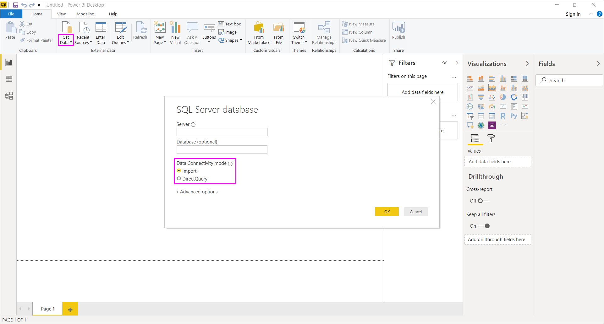
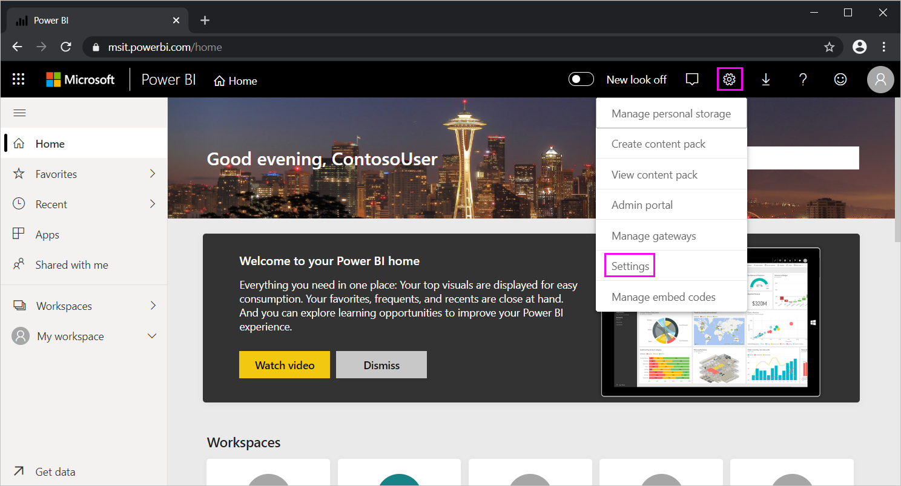

# <a name="use-directquery-in-power-bi-desktop"></a>Power BI Desktop'ta DirectQuery'yi kullanma
*Power BI Desktop* ile veri kaynağınıza bağlandığınızda verilerin bir kopyasını her zaman Power BI Desktop'a aktarabilirsiniz. Bazı veri kaynakları için alternatif bir yaklaşım da sunulmaktadır: DirectQuery'yi kullanarak veri kaynağına doğrudan bağlanma.

## <a name="supported-data-sources"></a>Desteklenen veri kaynakları
DirectQuery'yi destekleyen veri kaynaklarının tam listesi için bkz. [DirectQuery tarafından desteklenen veri kaynakları](power-bi-data-sources.md).

## <a name="how-to-connect-using-directquery"></a>DirectQuery'yi kullanarak bağlanma
DirectQuery tarafından desteklenen bir veri kaynağına bağlanmak için **Veri Al** seçeneğini kullandığınızda bağlantı iletişim kutusunda, nasıl bağlanmak istediğinizi seçebilirsiniz. Örneğin Power BI Desktop'ta **Giriş** şeridinin altında **Veri Al** > **SQL Server**'ı seçin. **SQL Server Veritabanı** iletişim kutusunda **Veri Bağlantısı modu**, **İçeri Aktarma** ve **DirectQuery** şeklindedir:



**İçeri Aktarma** ve **DirectQuery** arasındaki farklar şunlardır:

- **İçeri Aktarma**: Seçilen tablolar ve sütunlar Power BI Desktop'a aktarılır. Bir görselleştirme oluşturduğunuzda veya mevcut bir görselleştirme ile etkileşim kurduğunuzda Power BI Desktop, içeri aktarılan verileri kullanır. İlk içeri aktarma veya son yenileme işleminden sonra, temel alınan verilerde gerçekleştirilen değişiklikleri görmek için verileri yenilemeniz ve veri kümesinin tamamını yeniden içeri aktarmanız gerekir.

- **DirectQuery**: Power BI Desktop'a herhangi bir veri aktarılmaz veya kopyalanmaz. İlişkisel kaynaklar için **Alanlar** listesinde, seçilen tablolar ve sütunlar görünür. SAP Business Warehouse gibi çok boyutlu kaynaklar için **Alanlar** listesinde, seçilen küpün boyutları ve ölçüleri görünür. Siz bir görselleştirme oluşturduğunuzda veya mevcut bir görselleştirme ile etkileşim kurduğunuzda Power BI Desktop, temel alınan veri kaynağını sorgular. Bu, mevcut verileri her zaman görüntülediğiniz anlamına gelir.

Bazı sınırlamalar olsa da DirectQuery ile kullanabileceğiniz çok sayıda veri modelleme ve veri dönüştürme seçeneği mevcuttur. Görselleştirme oluştururken veya bir görselleştirme ile etkileşim kurarken, temel alınan kaynağı sorgulamanız gerekir. Görselleştirmenin yenilenme süresi temel alınan veri kaynağının performansına bağlıdır. İsteğin karşılanması için gereken veriler kısa bir süre önce istendiğinde Power BI Desktop, görselleştirmenin görüntülenmesi için gereken süreyi azaltmak üzere en son verileri kullanır. **Giriş** şeridindeki **Yenile** seçeneğini belirleyerek, tüm görselleştirmelerin geçerli verilerle yenilenmesini sağlayabilirsiniz.

[Power BI ve DirectQuery](desktop-directquery-about.md) makalesinde DirectQuery ayrıntılı olarak ele alınmıştır. Ayrıca DirectQuery kullanımıyla ilgili avantajlar, sınırlamalar ve önemli noktalar hakkında daha fazla bilgi edinmek için aşağıdaki bölümlere göz atabilirsiniz.

## <a name="benefits-of-using-directquery"></a>DirectQuery özelliğini kullanmanın avantajları
DirectQuery özelliğini kullanmanın bazı avantajları vardır:

- DirectQuery, tüm verileri önceden toplayarak içeri aktarmanın mümkün olmayacağı çok büyük veri kümeleri söz konusu olduğunda görselleştirmeler oluşturmanıza olanak sağlar.
- Temel alınan verilerde yapılan değişiklikler nedeniyle verilerin yenilenmesi gerekebilir. Bazı raporlarda, mevcut verilerin görüntülenmesi için büyük veri aktarımları gerekebilir. Bunlar, verilerin yeniden içeri aktarılmasını olanaksız hale getirmektedir. Bunun aksine DirectQuery raporları her zaman mevcut verileri kullanır.
- Veri kümeleri için uygulanan 1 GB'lık sınırlama DirectQuery için geçerli *değildir*.

## <a name="limitations-of-directquery"></a>DirectQuery kullanımıyla ilgili sınırlamalar
Şu anda DirectQuery kullanımıyla ilgili bazı sınırlamalar mevcuttur:

- **Sorgu Düzenleyicisi** sorgusunun çok karmaşık olması halinde hata oluşur. Hatayı gidermek için **Sorgu Düzenleyicisi**'nde soruna yola açan adımı silmeniz veya verilere bağlanmak için DirectQuery yerine *İçeri Aktarma* seçeneğini kullanmanız gerekir. SAP Business Warehouse gibi çok boyutlu kaynaklar için **Sorgu Düzenleyicisi** kullanılmaz.

- DirectQuery'de akıllı zaman gösterimi özellikleri kullanılamaz. Örneğin, tarih sütunlarının (yıl, çeyrek, ay veya gün gibi) özel olarak değerlendirilmesi, DirectQuery modunda desteklenmez.

- Çoklu oturum açma (SSO) özelliğine sahip bir veri kaynağında bulunan bir DirectQuery tablosuna başvuran hesaplanan tablolar ve hesaplanmış sütunlar Power BI hizmetinde desteklenmez.

- Temel alınan veri kaynağına gönderilen sorguların kabul edilebilir düzeyde bir performansa sahip olmasını sağlamak için, ölçümlerde izin verilen DAX ifadelerine sınırlamalar koyulur.

- Bulut kaynakları için bir milyon satırlık bir limit vardır ve şirket içi kaynaklar satır başına yaklaşık 4 MB tanımlanmış yük (özel sıkıştırma algoritmasına göre) veya görselin tamamı için 16 MB veri boyutu ile sınırlıdır. Premium kapasiteyi kullandığınızda belirli limitler artırılabilir. Bu sınır, DirectQuery ile döndürülen veri kümesini oluşturmak için kullanılan toplamaları veya hesaplamaları etkilemez. Yalnızca döndürülen satırları etkiler. Premium kapasiteler [bu gönderide](https://powerbi.microsoft.com/blog/five-new-power-bi-premium-capacity-settings-is-available-on-the-portal-preloaded-with-default-values-admin-can-review-and-override-the-defaults-with-their-preference-to-better-fence-their-capacity/) açıklandığı gibi en fazla satır sınırları ayarlayabilir. 

    Örneğin sorgunuzda, veri kaynağını temel alan 10 milyon satırı toplayabilirsiniz. Döndürülen Power BI verileri 1 milyon satırdan azsa sorgu, bu toplamanın sonucunu DirectQuery kullanarak Power BI'a doğru bir şekilde döndürür. DirectQuery’den 1 milyonun üzerinde satır döndürülürse Power BI hata döndürür (Premium kapasitede yer almadığı ve satır sayısı yönetici tarafından ayarlanan sınırın altında kalmadığı sürece).


## <a name="important-considerations-when-using-directquery"></a>DirectQuery kullanımında dikkat edilmesi gereken önemli noktalar
DirectQuery kullanımında aşağıdaki üç nokta göz önünde bulundurulmalıdır:

- **Performans ve yük**: Tüm DirectQuery istekleri kaynak veritabanına gönderilir. Bu nedenle, bir görselin yenilenmesi için gereken süre; söz konusu arka uç kaynağının, sorgu sonuçlarıyla birlikte ne kadar sürede yanıt vereceğine bağlıdır. Görseller için DirectQuery kullanıldığında (istenen verilerin döndürülmesi için) önerilen yanıt süresi en fazla beş saniyedir. Önerilen maksimum yanıt süresi ise 30 saniyedir. Bu sınır aşıldığında, kullanıcıların rapor kullanma deneyimi kabul edilemez bir noktaya gelir. Bir rapor Power BI hizmetinde yayımlandığında beş dakikadan uzun süren tüm sorgular zaman aşımına uğrar ve kullanıcı bir hatayla karşılaşır.
  
    Yayımlanan raporu kullanacak olan Power BI kullanıcılarının sayısına bağlı olarak, kaynak veritabanı üzerindeki yükün de göz önünde bulundurulması gerekir. **Satır Düzeyi Güvenlik** (RLS) kullanımının da önemli bir etkisi olabilir. Birden fazla kullanıcı tarafından paylaşılan, RLS kullanılmayan bir pano kutucuğu için veritabanına tek bir sorgu gönderilir. RLS kullanılan pano kutucuklarında ise bir kutucuğun yenilenmesi için genellikle *kullanıcı başına* bir sorgu gerekir. Bu da kaynak veritabanının yükünü önemli ölçüde artırır ve performansı etkileyebilir.
  
    Power BI, mümkün olduğunca etkili sorgular oluşturur. Ancak belirli durumlarda, oluşturulan sorgu yeterince etkili olmaz ve yenileme başarısız olur. Oluşturulan bir sorgunun, arka uç veri kaynağından çok yüksek miktarda satır alması bu duruma verilebilecek bir örnektir. Böyle bir durumda aşağıdaki hatayla karşılaşılır:

    ```output
    The resultset of a query to external data source has exceeded
    ```
  
    Bu durum, kardinalitenin çok yüksek olduğu bir sütun içeren, toplama seçeneği **Özetleme** olarak ayarlanmış basit bir grafikte ortaya çıkabilir. Görselde yalnızca, kardinalite değeri 1 milyondan az olan sütunlar bulunmalı veya uygun filtreler uygulanmış olmalıdır.

- **Güvenlik**: Varsayılan olarak yayımlanan bir raporu kullanan tüm kullanıcılar arka uç veri kaynağına, Power BI hizmetinde yayımlama işleminin ardından girilen kimlik bilgilerini kullanarak bağlanır. Bu süreç, içeri aktarılan veriler için de geçerlidir: Tüm kullanıcılar, arka uç kaynağında tanımlanan herhangi bir güvenlik kuralından bağımsız olarak aynı verileri görür.

    DirectQuery kaynaklarında kullanıcı tabanlı güvenlik uygulamaları kullanmak isteyen müşteriler, RLS kullanabilir veya kaynakta Kerberos kısıtlı kimlik doğrulamasını yapılandırabilir. Kerberos tüm kaynaklar için kullanılamaz. [RLS hakkında daha fazla bilgi edinin](../admin/service-admin-rls.md). [DirectQuery'de Kerberos hakkında daha fazla bilgi edinin](service-gateway-sso-kerberos.md).

- **Desteklenen özellikler**: Power BI Desktop'taki özelliklerin bazıları DirectQuery modunda desteklenmez veya bazı sınırlamalar mevcuttur. Power BI hizmetindeki bazı özellikler de (*Hızlı İçgörüler* gibi) DirectQuery modunda veri kümeleri için kullanılamaz. DirectQuery'yi kullanma kararını verirken bu özellik sınırlamalarını göz önünde bulundurmanız gerekir.

> [!NOTE]
> Azure SQL Veritabanı ve özel IP adresi ile DirectQuery kullanmak için şirket içi ağ geçidi gerekir. 

## <a name="publish-to-the-power-bi-service"></a>Power BI hizmetinde yayımlama
DirectQuery kullanılarak oluşturulan raporlar Power BI hizmetinde yayımlanabilir.

Kullanılan veri kaynağı için **Şirket içi veri ağ geçidinin** (**Azure SQL Veritabanı**, **Azure SQL Veri Ambarı** veya **Redshift**) gerekli olmaması halinde, Power BI hizmetinin yayımlanan raporu gösterebilmesi için gerekli kimlik bilgilerini sağlamanız gerekir. Kimlik bilgilerini sağlamak için şu yönergeleri izleyin:

1. [Power BI](https://www.powerbi.com/)'da oturum açın.
2. Power BI hizmetinde **Ayarlar** dişli simgesini ve ardından **Ayarlar** menü öğesini seçin.

    

3. Power BI hizmetinin **Ayarlar** sayfasında **Veri kümeleri** sekmesini ve ardından DirectQuery'yi kullanan veri kümesini seçtikten sonra, **Kimlik bilgilerini düzenle**'yi seçin.

4. Kimlik bilgilerini ekleyin. Aksi takdirde yayımlanmış bir raporu açtığınızda veya DirectQuery bağlantısıyla oluşturulmuş bir veri kümesini araştırdığınızda bir hata oluşur.

**Azure SQL Veritabanı**, **Azure SQL Veri Ambarı**, **Redshift** veya **Snowflake Data Warehouse** dışında DirectQuery kullanan veri kaynakları için veri bağlantısı oluşturmak isterseniz **Şirket içi veri ağ geçidi** yükleyip veri kaynağını kaydedin. Daha fazla bilgi için bkz. [Şirket içi veri ağ geçidi nedir?](service-gateway-onprem.md)

## <a name="next-steps"></a>Sonraki adımlar
DirectQuery hakkında daha fazla bilgi için aşağıdaki kaynaklara bakın:

- [Power BI'da DirectQuery kullanma](desktop-directquery-about.md)
- [DirectQuery tarafından desteklenen veri kaynakları](power-bi-data-sources.md)
- [DirectQuery ve SAP Business Warehouse (BW)](desktop-directquery-sap-bw.md)
- [DirectQuery ve SAP HANA](desktop-directquery-sap-hana.md)
- [Şirket içi veri ağ geçidi nedir?](service-gateway-onprem.md)
