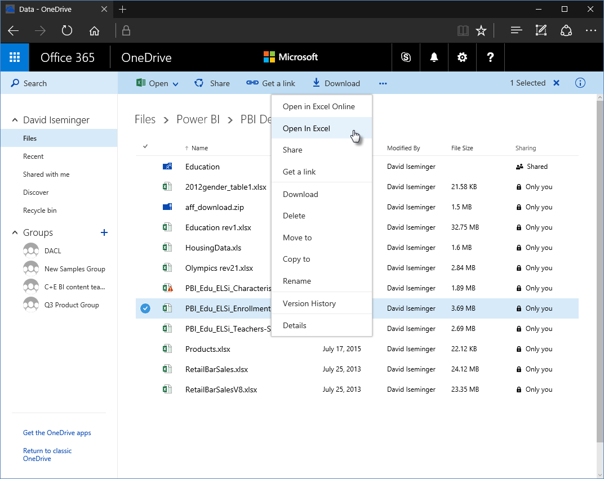
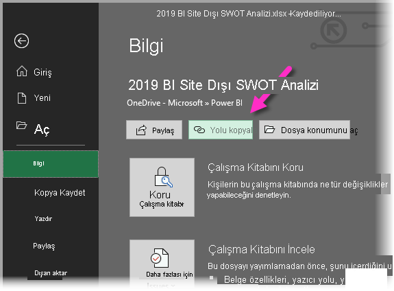
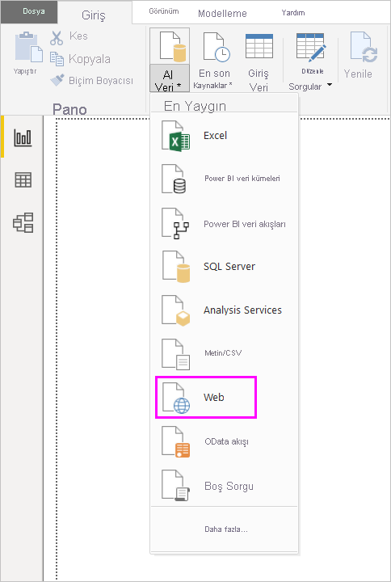
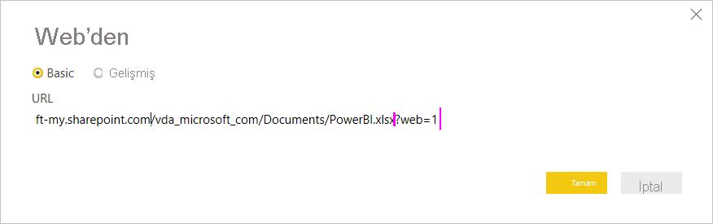
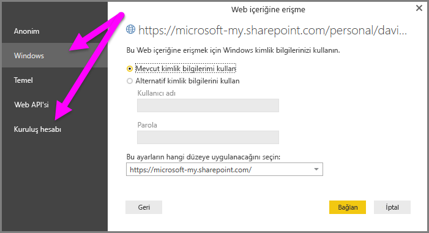

# Power BI Desktop'ta OneDrive İş bağlantılarını kullanma
Pek çok kullanıcının OneDrive İş'te depolanan Excel çalışma kitapları bulunur, bunlar Power BI Desktop'ta kullanmak için harika bir seçimdir. Power BI Desktop ile rapor ve görsel oluşturmak için OneDrive İş'te kayıtlı Excel dosyalarına ilişkin çevrimiçi bağlantıları kullanabilirsiniz. Bir OneDrive İş grup hesabını veya bireysel OneDrive İş hesabınızı kullanabilirsiniz.

OneDrive İş'ten çevrimiçi bir bağlantı almak için uygulamanız gereken belirli birkaç adım bulunur. Aşağıdaki bölümlerde gruplar arasında, farklı makineler arasında ve iş arkadaşlarınızla dosya bağlantısı paylaşmanıza olanak sağlayan bu adımlar açıklanmaktadır.

## Excel'den bağlantı alma
1. Tarayıcıyı kullanarak OneDrive iş konumunuza gidin. Kullanmak istediğiniz dosyaya sağ tıklayıp **Excel'de Aç**'ı seçin.
   
   > [!NOTE]
   > Tarayıcı arabiriminiz tamamen aşağıdaki gibi görünmeyebilir. OneDrive İş tarayıcı arabiriminizdeki dosyalar için **Excel'de Aç**'ı seçmenin pek çok yolu vardır. Dosyayı Excel'de açmanıza olanak sağlayan tüm seçenekleri kullanabilirsiniz.
   > 
   > 
   
   
2. Excel'de **Dosya** > **Bilgi**'yi ve sonra da **Çalışma Kitabını Koru**'nun üst kısmında **Yolu kopyala**'yı seçin.
   
   

## Power BI Desktop'ta bağlantıyı kullanma
Power BI Desktop'ta, panoya kopyaladığınız bağlantıyı kullanabilirsiniz. Aşağıdaki adımları uygulayın:

1. Power BI Desktop’ta **Veri Al** > **Web**’i seçin.
   
   
2. **Temel** seçeneği seçili durumdayken, bağlantıyı **Web'den** iletişim kutusuna yapıştırın.
3. Bağlantının sonundaki *?web=1* dizesini kaldırarak Power BI Desktop'ın dosyanıza düzgün bir şekilde gidebilmesini sağlayın ve sonra da **Tamam**'ı seçin.
   
     
4. Power BI Desktop kimlik bilgilerini girmenizi isterse **Windows** (şirket içi SharePoint siteleri için) ya da **Kuruluş Hesabı** (Office 365 veya OneDrive İş siteleri için) seçeneğini belirleyin.
   
   

   Excel çalışma kitabında bulunan tablolardan, sayfalardan ve aralıklardan oluşan listeden seçim yapmanıza olanak sağlayan **Gezgin** iletişim kutusu görüntülenir. Burada, OneDrive İş dosyasını aynı diğer Excel dosyaları gibi kullanabilirsiniz. Raporlar oluşturabilir ve başka herhangi bir veri kaynağıyla yapabileceğiniz gibi bunu veri kümelerinde kullanabilirsiniz.

> [!NOTE]
> OneDrive İş dosyasını, söz konusu dosya için **Hizmeti Yenile** özelliği etkinleştirilmiş şekilde Power BI hizmetinde bir veri kaynağı olarak kullanmak için, yenileme ayarlarınızı yapılandırırken **Kimlik doğrulama yöntemi** olarak **OAuth2**'yi seçtiğinizden emin olun. Aksi takdirde, bağlanma veya yenileme işlemi gerçekleştirmeye çalıştığınızda bir hata (örneğin *Veri kaynağı kimlik bilgileri güncelleştirilemedi*) ile karşılaşabilirsiniz. Kimlik doğrulama yöntemi olarak **OAuth2** seçeneği belirlenerek bu kimlik bilgileri hatası önlenebilir.
> 
> 

