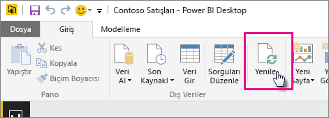

# Yerel sürücüdeki bir Power BI Desktop dosyasından oluşturulan veri kümelerini yenileme

## Desteklenenler

Power BI'da Şimdi Yenile ve Yenilemeyi Zamanla işlemleri, aşağıdaki veri kaynaklarından birine bağlanmak ve bunlardan veri yüklemek için Veri Al/Sorgu Düzenleyicisi seçeneğinin kullanıldığı durumlarda bir yerel sürücüden içeri aktarılan Power BI Desktop dosyalarından oluşturulmuş veri kümeleri için desteklenir:

### Power BI Gateway - Personal

- Power BI Desktop'taki Veri Al ve Sorgu Düzenleyicisi bölümlerinde gösterilen tüm çevrimiçi veri kaynakları.
- Hadoop dosyası (HDFS) ve Microsoft Exchange dışında, Power BI Desktop'taki Veri Al ve Sorgu Düzenleyicisi bölümlerinde gösterilen tüm şirket içi veri kaynakları.

<!-- Refresh Data sources-->
[!INCLUDE [refresh-datasources](../includes/refresh-datasources.md)]

> [!NOTE]
> Power BI'ın şirket içi veri kaynaklarına bağlanması ve veri kümesini yenilemesi için bir ağ geçidinin yüklenmesi ve çalışıyor olması gerekmektedir.
>
>

Giriş şeridinden **Yenile**'yi seçerek Power BI Desktop'ta tek seferlik el ile yenileme gerçekleştirebilirsiniz. Burada **Yenile**'yi seçtiğinizde *dosya* modelindeki veriler özgün veri kaynağındaki güncel verilerle yenilenir. Tamamen Power BI Desktop uygulamasından gerçekleştirilen bu yenileme işlemi Power BI'daki el ile veya zamanlanan yenileme işlemlerinden farklıdır ve aradaki farkı kavramak önemlidir.

Yerel sürücüde bulunan Power BI Desktop dosyanızı içeri aktardığınızda verilerin yanı sıra modelle ilgili diğer bilgiler Power BI hizmetindeki veri kümesine yüklenir. Power BI Desktop uygulamasından farklı olarak Power BI hizmetinde, Power BI hizmetindeki raporlarınızın temelini oluşturan, veri kümesindeki verileri yenilemek istersiniz. Veri kaynakları dışarıda olduğu için **Şimdi yenile** işlevini kullanarak veri kümesini el ile yenileyebilir veya **Yenilemeyi Zamanla** özelliğini kullanarak yenileme zamanı ayarlayabilirsiniz.

Veri kümesini yenilediğinizde Power BI güncelleştirilmiş verileri sorgulamak için yerel sürücüdeki dosyaya bağlanmaz. Veri kümesindeki bilgileri kullanarak, güncelleştirilmiş verileri sorgulamak için doğrudan veri kaynaklarına bağlanır ve bu verileri veri kümesine yükler.

> [!NOTE]
> Veri kümesindeki yenilenmiş veriler, yerel sürücüdeki dosyayla eşitlenmez.
>
>

## Yenileme işlemini nasıl zamanlarım?

Bir yenileme zamanlaması belirlediğinizde, Power BI güncelleştirilen verileri sorgulamak için veri kümesindeki kimlik bilgilerini ve bağlantı bilgilerini kullanarak doğrudan veri kaynaklarına bağlanır ve ardından, güncelleştirilen verileri veri kümesine yükler. Power BI hizmetinde ilgili veri kümesini temel alan rapor ve panolardaki tüm görselleştirmeler de güncelleştirilir.

Zamanlanmış yenileme ayarlamayla ilgili daha fazla bilgi için bkz. [Zamanlanmış yenilemeyi yapılandırma](refresh-scheduled-refresh.md).

## Bir şeyler ters gittiğinde

Bir şeyler ters gittiğinde, sorun genellikle Power BI'ın veri kaynaklarında oturum açamamasından veya veri kümesi bir şirket içi veri kaynağına bağlandığında ağ geçidinin çevrimdışı olmasından kaynaklanır. Power BI'ın veri kaynaklarında oturum açabildiğinden emin olun. Bir veri kaynağında oturum açmak için kullandığınız parola değişirse veya Power BI'ın bir veri kaynağındaki oturumu kapanırsa, Veri Kaynağı Kimlik Bilgilerini kullanarak veri kaynaklarınızda yeniden oturum açmayı deneyin.

**Yenileme hatası bildirim e-postası almak istiyorum** seçeneğinin işaretlenmiş olduğundan emin olun. Bir zamanlanmış yenilemenin başarısız olup olmadığını hemen öğrenmenizde yarar vardır.

## Sorun Giderme

Bazen verileri yenileme işlemi beklendiği gibi gitmeyebilir. Bu, genellikle ağ geçidiyle bağlantılı bir sorundan kaynaklanır. Araçlar ve bilinen sorunlara yönelik sorun giderme makalelerine göz atın.

- [Şirket içi veri ağ geçidi sorunlarını giderme](service-gateway-onprem-tshoot.md)
- [Power BI Gateway - Personal ile ilgili sorunları giderme](service-admin-troubleshooting-power-bi-personal-gateway.md)

Başka bir sorunuz mu var? [Power BI Topluluğu'na sorun](https://community.powerbi.com/)
