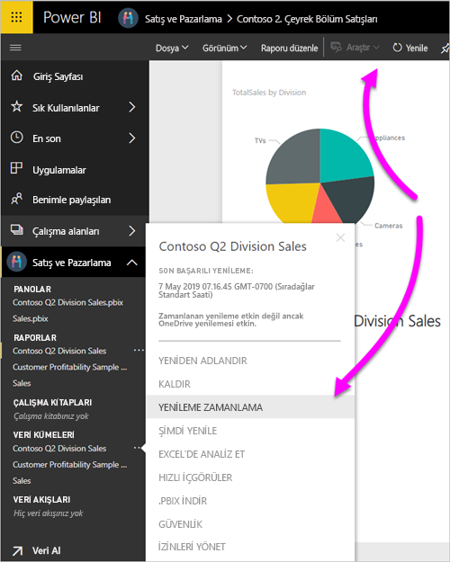

# OneDrive veya SharePoint Online'da depolanan veri kümelerini yenileme
Dosyaların OneDrive veya SharePoint Online'dan Power BI hizmetine aktarılması, Power BI Desktop'ta yaptığınız çalışmaların Power BI hizmetiyle eşitlenmiş durumda kalmasını sağlamak için mükemmel bir yöntemdir.

## Power BI Desktop dosyalarını OneDrive veya SharePoint Online'da depolamanın avantajları
Power BI Desktop dosyalarını OneDrive veya SharePoint Online'da depoladığınızda, dosyanızın modeline yüklediğiniz tüm veriler veri kümesinde içeri aktarılır. Dosyada oluşturduğunuz tüm raporlar, Power BI hizmetindeki **Raporlar** bölümüne yüklenir. OneDrive veya SharePoint Online'da dosyanızda değişiklik yaptığınızı varsayalım. Bunlar yeni ölçümler eklemek, sütun adlarını değiştirmek veya görselleştirmeleri düzenlemek gibi değişiklikler olabilir. Dosyayı kaydettiğinizde Power BI hizmeti genellikle yaklaşık bir saat içinde bu değişiklikleri de eşitler.

**Giriş** şeridinden **Yenile**'yi seçerek Power BI Desktop'ta tek seferlik el ile yenileme gerçekleştirebilirsiniz. **Yenile**'yi seçtiğinizde dosya modelindeki verileri özgün veri kaynağındaki güncel verilerle yenilemiş olursunuz. Bu tür bir yenileme tamamen Power BI Desktop uygulamasının içinde gerçekleşir. Power BI'daki el ile veya zamanlanmış yenilemeden farklıdır ve aradaki farkı anlamak önemlidir.

Power BI Desktop dosyanızı OneDrive veya SharePoint Online'dan içeri aktardığınızda verileri ve model bilgilerini Power BI'daki veri kümesine yüklersiniz. Power BI hizmetindeki veri kümesini yenilemek istersiniz çünkü raporlarınızda bu veri kümesi temel alınır. Veri kaynakları dışarıda olduğu için **Şimdi yenile** işlevini kullanarak veri kümesini el ile yenileyebilir veya **Yenilemeyi Zamanla** özelliğini kullanarak yenileme zamanı ayarlayabilirsiniz. 

Veri kümesini yenilediğinizde Power BI güncelleştirilmiş verileri sorgulamak için OneDrive veya SharePoint Online'daki dosyaya bağlanmaz. Veri kümesindeki bilgileri kullanarak, güncelleştirilmiş verileri sorgulamak için doğrudan veri kaynaklarına bağlanır. Ardından söz konusu verileri veri kümesine yükler. Veri kümesindeki bu yenilenmiş veriler, OneDrive veya SharePoint Online'daki dosyayla geri eşitlenmez.

## Hangi veri kümeleri desteklenir?
Power BI'da **Yenile** ve **Yenilemeyi Zamanla** işlemleri, aşağıdaki veri kaynaklarından birine bağlanmak ve bunlardan veri yüklemek için **Veri Al** veya **Sorgu Düzenleyicisi** seçeneğini kullandığınız durumlarda bir yerel sürücüden içeri aktarılan Power BI Desktop dosyalarından oluşturulmuş veri kümeleri için desteklenir.

> [!NOTE]
> Canlı bağlantı veri kümelerinde OneDrive yenilemesi desteklenir. Öte yandan OneDrive yenileme senaryosunda zaten yayımlanmış bir raporda canlı bağlantı veri kümesinin (bir veri kümesinden diğerine) değiştirilmesi desteklenmez.

### Power BI Gateway - Personal
* Power BI Desktop'taki **Veri Al** ve **Sorgu Düzenleyicisi** bölümlerinde gösterilen tüm çevrimiçi veri kaynakları.
* Hadoop Dosyası (HDFS) ve Microsoft Exchange dışında, Power BI Desktop'taki **Veri Al** ve **Sorgu Düzenleyicisi** bölümlerinde gösterilen tüm şirket içi veri kaynakları.

<!-- Refresh Data sources-->
[!INCLUDE [refresh-datasources](../includes/refresh-datasources.md)]

> [!NOTE]
> Power BI'ın şirket içi veri kaynaklarına bağlanması ve veri kümesini yenilemesi için bir ağ geçidinin yüklenmesi ve çalışıyor olması gerekmektedir.
> 
> 

## OneDrive veya OneDrive İş. Fark nedir?
Hem kişisel OneDrive hem de OneDrive İş kullanıyorsanız Power BI'a aktarmak istediğiniz dosyaları OneDrive İş hesabınızda tutmalısınız. Nedeni bu hesaplarda oturum açmak için muhtemelen farklı hesaplar kullanıyor olmanızdır.

Power BI'da OneDrive İş'e bağlandığınızda, Power BI hesabınız genellikle OneDrive İş hesabınızla aynı olduğundan bağlantı kolayca kurulabilir. Kişisel OneDrive hesabınızda oturum açmak için genellikle farklı bir [Microsoft hesabı](https://account.microsoft.com) kullanırsınız.

Microsoft hesabınızda oturum açtığınızda **Oturumumu açık bırak** seçeneğini belirtmeyi unutmayın. Böylece Power BI, Power BI Desktop'taki dosyada yaptığınız tüm güncelleştirmeleri, Power BI'daki veri kümeleriyle eşitleyebilir.

Microsoft kimlik bilgilerinizi değiştirdiyseniz OneDrive'daki dosyanızla Power BI'daki veri kümesi arasında değişiklikleri eşitleyemezsiniz. OneDrive'a bağlanmanız ve dosyanızı yeniden içeri aktarmanız gerekir.

## Yenileme işlemini nasıl zamanlarım?
Yenileme zamanlaması ayarladığınızda Power BI doğrudan veri kaynaklarına bağlanır. Power BI veri kümesindeki bağlantı bilgilerini ve kimlik bilgilerini kullanarak güncelleştirilmiş verileri sorgular. Ardından Power BI güncelleştirilmiş verileri veri kümesine yükler. Sonra da Power BI hizmetinde ilgili veri kümesini temel alan rapor görselleştirmelerini ve panoları güncelleştirilir.

Zamanlanmış yenileme ayarlamayla ilgili daha fazla bilgi için bkz. [Zamanlanmış yenilemeyi yapılandırma](refresh-scheduled-refresh.md).

## Bir şeyler ters gittiğinde
Bir şeyler ters gittiğinde bunun nedeni çoğunlukla Power BI'ın veri kaynaklarında oturum açamamasıdır. Ayrıca veri kümesi şirket içi bir veri kaynağına bağlanmaya çalışıyorsa ama ağ geçidi çevrimdışıysa işler ters gidebilir. Bu sorunlardan kaçınmak için Power BI'ın veri kaynaklarında oturum açabildiğinden emin olun. **Veri Kaynağı Kimlik Bilgileri**'nde veri kaynaklarınızda oturum açmayı deneyin. Bazen bir veri kaynağında oturum açarken kullandığınız parola değişir veya Power BI'ın veri kaynağındaki oturumu kapatılır.

OneDrive'da bulunan Power BI Desktop dosyasında değişikliklerinizi kaydettiğinizde bu değişiklikleri bir saat kadar bir süre içinde Power BI'da görmüyorsanız, Power BI OneDrive'ınıza bağlanamıyor olabilir. OneDrive'daki dosyaya yeniden bağlanmayı deneyin. Oturum açmanız istenirse **Oturumumu açık bırak**'ı seçmeyi unutmayın. Power BI, dosyayı eşitlemek üzere OneDrive hesabınıza bağlanamadığı için dosyanızı yeniden içeri aktarmanız gerekir.

**Yenileme hatası bildirim e-postası almak istiyorum** seçeneğinin işaretlenmiş olduğundan emin olun. Bir zamanlanmış yenilemenin başarısız olup olmadığını hemen öğrenmenizde yarar vardır.

## Sorun giderme
Bazen verileri yenileme işlemi beklendiği gibi gitmeyebilir. Ağ geçidiyle bağlandığınızda veri yenileme sorunlarıyla karşılaşırsınız. Araçlar ve bilinen sorunlara yönelik sorun giderme makalelerine göz atın.

[Şirket içi veri ağ geçidiyle ilgili sorunları giderme](service-gateway-onprem-tshoot.md)

[Power BI Gateway - Personal ile ilgili sorunları giderme](service-admin-troubleshooting-power-bi-personal-gateway.md)

Başka bir sorunuz mu var? [Power BI Topluluğu](https://community.powerbi.com/)'na sorun.
