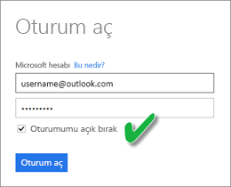
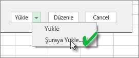
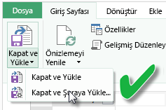
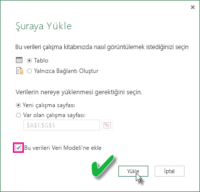

# Bir Excel çalışma kitabından oluşturulan veri kümelerini OneDrive'da veya SharePoint Online'da yenileme

Yerel makinenizde veya OneDrive İş ya da SharePoint Online gibi bulut depolama alanlarında depolanan Excel çalışma kitaplarını içeri aktarabilirsiniz. Bu makalede, Excel dosyalarınız için bulut depolama alanı kullanımının avantajları anlatılır. Excel dosyalarını Power BI'a aktarma hakkında daha fazla bilgi için bkz. [Excel çalışma kitabı dosyalarından veri alma](service-excel-workbook-files.md).

## Avantajları nelerdir?

OneDrive veya SharePoint Online gibi bulut depolama alanlarından dosya aktarmak, Excel'de yaptığınız çalışmaların Power BI hizmeti ile eşitlenmiş durumda kalmasını sağlamak için mükemmel bir yöntemdir. Dosyanızın modeline yüklediğiniz tüm veriler veri kümesine aktarılır ve dosyada oluşturduğunuz tüm raporlar, Power BI'daki Raporlar bölümüne yüklenir. OneDrive veya SharePoint Online'daki dosyanızda yeni ölçü ekleme, sütun adlarını değiştirme veya görselleştirmeleri düzenleme gibi değişiklikler yaparsanız bu değişiklikler, kaydedilmelerinin ardından genellikle yaklaşık bir saat içinde Power BI'da da güncelleştirilir.

Kişisel OneDrive'ınızdaki bir Excel çalışma kitabını içeri aktardığınızda, çalışma kitabındaki tüm veriler (çalışma sayfalarındaki tablolar ve/veya Excel veri modeline yüklenen veriler ve veri modelinin yapısı gibi), Power BI'da yeni bir veri kümesine aktarılır. Tüm Power View görselleştirmeleri, Raporlar bölümünde yeniden oluşturulur. Power BI, güncelleştirmeleri denetlemek için yaklaşık bir saatlik aralıklarla OneDrive veya SharePoint Online'daki çalışma kitabına otomatik olarak bağlanır. Çalışma kitabınızda değişiklik yapıldıysa Power BI hizmetindeki veri kümesi ve raporlar da yenilenir.

Power BI hizmetinden de veri kümesini yenileyebilirsiniz. Yenilemeyi veri kümesi üzerinde el ile veya yenilemeyi zamanla seçeneği ile yaptığınızda Power BI, güncelleştirilmiş verileri sorgulamak için doğrudan dış veri kaynaklarına bağlanır ve ardından bunları veri kümesine yükler. Bir veri kümesini Power BI'dan yenilemek, OneDrive veya SharePoint Online'daki çalışma kitabında yer alan verileri yenilemez. 

## Desteklenenler

Power BI'da **Şimdi Yenile** ve **Yenilemeyi Zamanla** işlemleri, aşağıdaki veri kaynaklarından birine bağlanmak ve bunlardan veri yüklemek için Veri Al/Sorgu Düzenleyicisi seçeneğinin kullanıldığı durumlarda bir yerel sürücüden içeri aktarılan Power BI Desktop dosyalarından oluşturulmuş veri kümeleri için desteklenir:  

### Power BI Gateway - Personal

* Power BI Desktop'taki Veri Al ve Sorgu Düzenleyicisi bölümlerinde gösterilen tüm çevrimiçi veri kaynakları.
* Hadoop dosyası (HDFS) ve Microsoft Exchange dışında, Power BI Desktop'taki Veri Al ve Sorgu Düzenleyicisi bölümlerinde gösterilen tüm şirket içi veri kaynakları.

<!-- Refresh Data sources-->
[!INCLUDE [refresh-datasources](../includes/refresh-datasources.md)]

> [!NOTE]
> Power BI'ın şirket içi veri kaynaklarına bağlanması ve veri kümesini yenilemesi için bir ağ geçidinin yüklenmesi ve çalışıyor olması gerekmektedir.
>
>

## OneDrive veya OneDrive İş. Fark nedir?

Hem kişisel OneDrive hem de OneDrive İş kullanıyorsanız Power BI'a aktarmak istediğiniz dosyaları OneDrive İş hesabınızda tutmanız önerilir. Nedeni bu hesaplarda oturum açmak için muhtemelen farklı hesaplar kullanıyor olmanızdır.

Power BI'da oturum açmak için kullandığınız hesap, OneDrive İş'te oturum açmak için kullandığınız hesapla genellikle aynı olduğundan, Power BI'da OneDrive İş'e kesintisiz bir şekilde bağlanabilirsiniz. Ancak kişisel OneDrive hesabınızda oturum açmak için muhtemelen farklı bir [Microsoft hesabı](https://account.microsoft.com) kullanıyorsunuzdur.

Microsoft hesabınızda oturum açtığınızda **Oturumumu açık bırak** seçeneğini belirtmeyi unutmayın. Böylece Power BI, Power BI Desktop'taki dosyada yaptığınız tüm güncelleştirmeleri, Power BI'daki veri kümeleriyle eşitleyebilir.  

Microsoft hesabı kimlik bilgileriniz değiştirilmiş olabileceğinden, OneDrive'daki dosyanızda yaptığınız değişikliklerin Power BI'daki veri kümesi veya raporlarla eşitlenememesi durumunda kişisel OneDrive hesabınızdaki dosyaya yeniden bağlanmanız ve dosyanızı tekrar içeri aktarmanız gerekir.

## Excel dosyalarına bağlanma seçenekleri

OneDrive İş veya SharePoint Online üzerindeki bir Excel çalışma kitabına bağlandığınızda, çalışma kitabınızdaki içeriği Power BI'a almaya yönelik iki seçeneğiniz vardır.

[**Excel verilerini Power BI'a aktarma** ](service-excel-workbook-files.md#import-or-connect-to-an-excel-workbook-from-power-bi): OneDrive İş veya SharePoint Online hesabınızdaki bir Excel çalışma kitabını içeri aktardığınızda yukarıda açıklanan şekilde çalışır.

[**Power BI'da Excel'e bağlanma, Excel verilerini yönetme ve görüntüleme**](service-excel-workbook-files.md#one-excel-workbook--two-ways-to-use-it): Bu seçeneği kullandığınızda Power BI'dan OneDrive İş veya SharePoint Online hesabınızdaki çalışma kitabınıza doğrudan bir bağlantı oluşturursunuz.

Bir Excel çalışma kitabına bu şekilde bağlandığınızda Power BI'da bir veri kümesi oluşturulmaz. Ancak çalışma kitabı, adının yanında bir Excel simgesi ile Power BI hizmetindeki Raporlar bölümü altında görünür. Excel Online'ın aksine çalışma kitabınıza Power BI'dan bağlandığınızda çalışma kitabınızın, Excel veri modeline veri yükleyen dış veri kaynaklarına bağlantısı varsa bir yenileme zamanlaması ayarlayabilirsiniz.

Bu şekilde bir yenileme zamanlaması ayarladığınızda oluşan tek fark, yenilenen verilerin Power BI'daki bir veri kümesi yerine OneDrive veya SharePoint Online'daki çalışma kitabının veri modeline gitmesidir.

## Verilerin Excel veri modeline yüklendiğinden nasıl emin olurum?

Bir veri kaynağına bağlanmak için Power Query (Excel 2016'da **Al ve Dönüştür**) kullandığınızda, verilerin yükleneceği yer konusunda birkaç seçeneğiniz vardır. Verileri veri modeline veri yüklediğinizden emin olmak için, **Hedefe Yükle** iletişim kutusundaki **Bu verileri Veri Modeline ekle** seçeneğini belirlemelisiniz.

> [!NOTE]
> Buradaki görüntü Excel 2016'dan alınmıştır.
>
>

**Gezgin**'de, **Hedefe Yükle…** seçeneğine tıklayın.  

Alternatif olarak, **Gezgin**'de **Düzenle**'ye tıklayıp Sorgu Düzenleyicisi'ni açabilirsiniz. Burada **Kapat ve Hedefe Yükle...** seçeneğine tıklayabilirsiniz.  

Ardından, **Hedefe Yükle** seçeneğinde, **Bu verileri Veri Modeline ekle**'yi seçtiğinizden emin olun.  

### Power Pivot'ta Dış Veri Alma özelliğini kullanırsam ne olur?

Hiç sorun değil. Şirket içi veya çevrimiçi veri kaynaklarına bağlanmak veya bu kaynaklardaki verileri sorgulamak için Power Pivot'u her kullandığınızda, veriler otomatik olarak veri modeline yüklenir.

## Yenileme işlemini nasıl zamanlarım?

Bir yenileme zamanlaması belirlediğinizde, Power BI güncelleştirilen verileri sorgulamak için veri kümesindeki kimlik bilgilerini ve bağlantı bilgilerini kullanarak doğrudan veri kaynaklarına bağlanır ve ardından, güncelleştirilen verileri veri kümesine yükler. Power BI hizmetinde ilgili veri kümesini temel alan rapor ve panolardaki tüm görselleştirmeler de güncelleştirilir.

Zamanlanmış yenileme ayarlamayla ilgili daha fazla bilgi için bkz. [Zamanlanmış yenilemeyi yapılandırma](refresh-scheduled-refresh.md).

## Bir şeyler ters gittiğinde

Bir şeyler ters gittiğinde, sorun genellikle Power BI'ın veri kaynaklarında oturum açamamasından veya veri kümesi bir şirket içi veri kaynağına bağlandığında ağ geçidinin çevrimdışı olmasından kaynaklanır. Power BI'ın veri kaynaklarında oturum açabildiğinden emin olun. Bir veri kaynağında oturum açmak için kullandığınız parola değişirse veya Power BI'ın bir veri kaynağındaki oturumu kapanırsa, Veri Kaynağı Kimlik Bilgilerini kullanarak veri kaynaklarınızda yeniden oturum açmayı deneyin.

**Yenileme hatası bildirim e-postası almak istiyorum** seçeneğinin işaretlenmiş olduğundan emin olun. Bir zamanlanmış yenilemenin başarısız olup olmadığını hemen öğrenmenizde yarar vardır.

## Önemli notlar

Yenileme işlemi, Power Pivot'a bağlı ve Power Pivot'tan sorgulanan OData akışları için desteklenmemektedir. Veri kaynağı olarak bir OData akışı kullanırken Power Query kullanın.

## Sorun Giderme

Bazen verileri yenileme işlemi beklendiği gibi gitmeyebilir. Bu, genellikle ağ geçidiyle bağlantılı bir sorundan kaynaklanır. Araçlar ve bilinen sorunlara yönelik sorun giderme makalelerine göz atın:

- [Şirket içi veri ağ geçidi sorunlarını giderme](service-gateway-onprem-tshoot.md)
- [Power BI Gateway - Personal ile ilgili sorunları giderme](service-admin-troubleshooting-power-bi-personal-gateway.md)

Başka bir sorunuz mu var? [Power BI Topluluğu'na başvurun](https://community.powerbi.com/)
