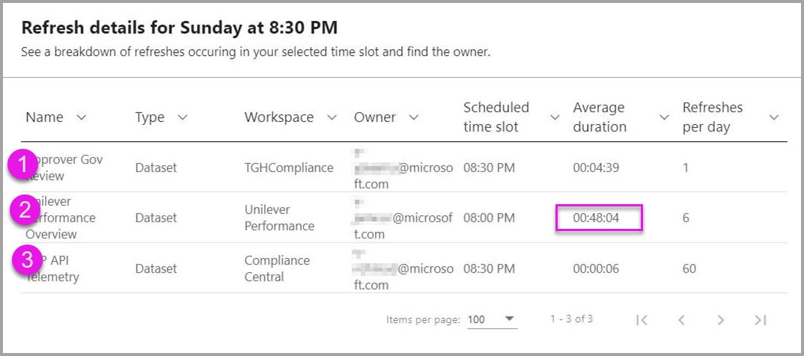

# Power BI için yenileme özetleri

Power BI Yönetim portalında yer alan Power BI **yenileme özetleri** sayfası yenileme zamanlamalarınız, kapasiteleriniz ve olası yenileme zamanlaması çakışmalarınızla ilgili denetim ve içgörü sağlar. Yenileme zamanlamalarını ayarlamanız gerekip gerekmediğini saptamak, yenileme sorunlarıyla ilişkili hata kodlarını öğrenmek ve veri yenileme zamanlamanızı düzgün yönetmek için yenileme özetleri sayfasını kullanabilirsiniz. 

Yenileme özetleri sayfasının iki görünümü vardır:

* **Geçmiş** - Yöneticisi olduğunuz Power BI Premium kapasitelerinin yenileme özeti geçmişini görüntüler.

* **Zamanlama** - Zamanlanmış yenilemenin zamanlama görünümünü gösterir ve ayrıca fazla ayrılmış saat ve sürelerle ilgili sorunları ortaya çıkarabilir.

Yenileme olayı hakkındaki bilgileri .CSV dosyasına dışarı aktarabilirsiniz. Bu dosya yenileme olaylarıyla ilgili önemli bilgiler ve içgörüler sağlayabilir ya da zamanlanmış yenileme olaylarının performansını veya tamamlanmasını etkileyebilecek hataları gösterebilir.

Aşağıdaki bölümlerde bu görünümleri sırayla gözden geçirilir. 

## Yenileme geçmişi

Yenileme özetleri sayfasında **Geçmiş**’e tıklayarak **Geçmiş** görünümünü seçebilirsiniz.

Geçmiş görünümü son zamanlanmış yenilemelerin yönetici ayrıcalığına sahip olduğunuz kapasiteler üzerindeki sonuçlarına genel bir bakış sağlar. Herhangi bir sütuna tıklayarak görünümü o sütuna göre sıralayabilirsiniz. Görünümü seçilen sütuna göre artan düzende, azalan düzende veya metin filtrelerini kullanarak sıralamayı seçebilirsiniz.

Geçmiş görünümünde belirli bir yenilemeyle ilişkilendirilmiş verilerde, her zamanlanmış yenilemenin en son 60 kaydı temel alınır.

Ayrıca zamanlanmış her yenilemenin bilgilerini .CSV dosyasına aktarabilirsiniz ve bu dosya her yenileme olayıyla ilgili hata iletileri de dahil olmak üzere ayrıntılı bilgiler içerir. Bir .CSV dosyasına aktardığınızda dosyayı sütunlardan herhangi birine göre sıralama, sözcükler için arama yapma, hata kodları veya sahiplere göre sıralama gibi işlemler yapabilirsiniz. Aşağıdaki resimde dışarı aktarılmış örnek bir .CSV dosyası gösterilir. 

Dışarı aktarılan dosyadaki bilgilerle, yenileme örneği için kaydedilmiş kapasiteyi, süreyi ve hata iletilerini gözden geçirebilirsiniz. 

## Yenileme zamanlaması

Yenileme özetlerinde **Zamanlama**’ya tıklayarak **Zamanlama** görünümünü seçebilirsiniz. Zamanlama görünümü, haftanın zamanlama bilgilerini 30 dakikalık zaman aralıklarına bölünmüş olarak görüntüler. 

Zamanlama görünümü, tüm yenilemelerin çakışmadan tamamlanmasını sağlamak için zamanlanmış yenileme olaylarının düzgün aralıklı ayarlanıp ayarlanmadığını veya fazla uzun süren ve kaynak çekişmesi oluşturabilecek yenileme olayları zamanlayıp zamanlamadığınızı saptama açısından çok yararlıdır. Bu tür bir kaynak çekişmesi bulursanız, zamanlanmış yenilemelerinizin başarıyla tamamlanabilmesi için yenileme zamanlamalarınızı çakışmaları veya örtüşmeleri önleyecek şekilde ayarlamalısınız. 

*Ayrılmış yenileme süresi (dakika)* sütunu her ilişkili veri kümesi için en çok 60 kaydın ortalamasının hesaplamasıdır. Her 30 dakikalık zaman aralığının sayısal değeri, söz konusu zaman aralığında başlayacak şekilde zamanlanmış tüm yenilemeler **ve** *önceki* zaman aralığında başlayacak şekilde zamanlanmış ama ortalama süresi seçilmiş olan zaman aralığına taşan yenilemeler için hesaplanan dakika sayısının toplamıdır.

*Kullanılabilir yenileme süresi (dakika)* sütunu, her bir zaman aralığında kullanılabilecek dakikalardan ilgili zaman aralığı için zamanlanmış olan yenileme süresinin çıkarılmasıyla elde edilen sonucu gösterir. Örneğin P2 aboneliğiniz 12 yenileme işleminin eşzamanlı olarak çalıştırılmasını destekliyorsa 12 adet 30 dakikalık zaman aralığına sahip olursunuz ve bu da ilgili zaman aralığında 12 yenileme x 30 dakika = 360 dakika yapar. Bu zaman aralığında 20 dakika süren bir yenileme zamanlandıysa ilgili zaman aralığındaki *Kullanılabilir yenileme süresi (dakika)* değeriniz 340 dakika olur (360 toplam kullanılabilir dakika eksi 20 dakika ayrılmış süre = 340 dakika kalan süre). 

Bir zaman aralığı seçebilir ve sonra da bununla ilişkili **ayrıntılar** düğmesini seçerek hangi zamanlanmış yenileme olaylarının ayrılmış yenileme süresine denk geldiğini, bu olayların sahiplerini ve ne kadar sürede tamamlandıklarını görebilirsiniz.

Nasıl çalıştığını görmek için şimdi bir örneği gözden geçirelim. Pazar günü 8:30 PM zaman aralığını seçtiğinizde aşağıdaki iletişim kutusu görüntülenir. **Ayrıntılar**’a tıklayın.

Bu zaman aralığında gerçekleşen üç zamanlanmış yenileme olayı var. 

Zamanlanmış yenileme #1 ve #3’ün her ikisi de bu 8:30 PM zaman aralığı için zamanlanmış; bunu **Zamanlanmış zaman aralığı** sütunundaki değere bakarak saptayabiliyoruz. Bunların ortalama süreleri sırasıyla 4:39 dakika ve alt saniye (0:06). Burada sorun yok.

Öte yandan zamanlanmış yenileme #2, 8:00 PM zaman aralığı için zamanlanmış ama bu yenilemenin tamamlanması ortalama olarak 48 dakikadan uzun sürdüğü için (**Ortalama süre** sütununda görünüyor) bu yenileme olayı sonraki 30 dakikalık zaman aralığına taşıyor. 

Burada bir sorun var. Böyle bir durumda yöneticinin söz konusu zamanlanmış yenileme örneğinin sahibiyle görüşüp farklı bir zaman aralığı bulmasını önermesi ya da diğer yenilemelerini örtüşmelerini önleyecek şekilde yeniden zamanlaması veya böyle bir örtüşmeyi önleyecek başka bir çözüm bulması gerekir. 

## Sonraki adımlar

- [Power BI'da veri yenileme](refresh-data.md)  
- [Power BI Gateway - Personal](service-gateway-personal-mode.md)  
- [Şirket içi veri ağ geçidi (kişisel mod)](service-gateway-onprem.md)  
- [Şirket içi veri ağ geçidiyle ilgili sorunları giderme](service-gateway-onprem-tshoot.md)  
- [Power BI Gateway - Personal ile ilgili sorunları giderme](service-admin-troubleshooting-power-bi-personal-gateway.md)  

Başka bir sorunuz mu var? [Power BI Topluluğu'na sorun](https://community.powerbi.com/)