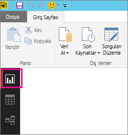
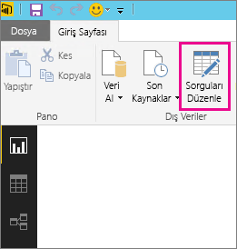
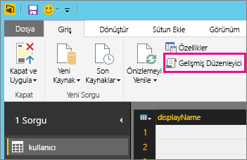
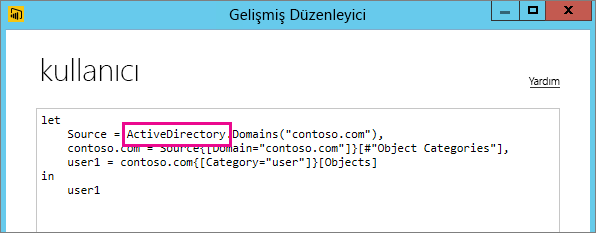

# Yenileme için desteklenmeyen veri kaynaklarıyla ilgili sorunları giderme
Veri kümelerini zamanlanmış yenileme için yapılandırmaya çalışırken bir hatayla karşılaşabilirsiniz.

        You cannot schedule refresh for this dataset because it gets data from sources that currently don’t support refresh.

Bu, Power BI Desktop'ta kullandığınız veri kaynağı için yenileme desteği sunulmaması halinde ortaya çıkar. Kullanmakta olduğunuz veri kaynağını bulmanız ve [Power BI'da verileri yenileme](refresh-data.md) makalesinde bulunan, desteklenen veri kaynakları listesinde aramanız gerekir. 

## Veri kaynağını bulma
Hangi veri kaynağının kullanıldığından emin değilseniz Power BI Desktop'ta aşağıdaki adımları uygulayarak veri kaynağını bulabilirsiniz.  

1. Power BI Desktop'ta, **Rapor** bölmesinde bulunduğunuzdan emin olun.  
   
2. Şerit çubuğunda **Sorguları Düzenle**'yi seçin.  
   
3. **Gelişmiş Düzenleyici** seçeneğini belirleyin.  
   
4. Kaynak için belirtilen sağlayıcıyı not edin.  Bu örnekteki sağlayıcı Active Directory'dir.  
   
5. Sağlayıcıyı, [Power BI veri kaynakları](power-bi-data-sources.md) makalesindeki desteklenen veri kaynakları listesinde arayın.

> [!NOTE]
> El ile yazılmış sorgular içeren veri kaynakları da dahil olmak üzere dinamik veri kaynaklarıyla ilgili yenileme sorunları için, bkz. [yenileme ve dinamik veri kaynakları](refresh-data.md#refresh-and-dynamic-data-sources).

## Sonraki adımlar
[Veri Yenileme](refresh-data.md)  
[Power BI Gateway - Personal](service-gateway-personal-mode.md)  
[On-premises data gateway (Şirket içi veri ağ geçidi)](service-gateway-onprem.md)  
[Şirket içi veri ağ geçidiyle ilgili sorunları giderme](service-gateway-onprem-tshoot.md)  
[Power BI Gateway - Personal ile ilgili sorunları giderme](service-admin-troubleshooting-power-bi-personal-gateway.md)  

Başka bir sorunuz mu var? [Power BI Topluluğu'na sorun](https://community.powerbi.com/)
