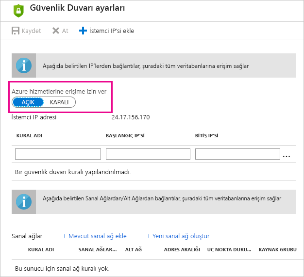

# Power BI'da Azure SQL Veritabanları için zamanlanmış yenileme ile ilgili sorunları giderme

Yenileme hakkında ayrıntılı bilgi için bkz. [Power BI’da verileri yenileme](refresh-data.md) ve [Zamanlanmış yenilemeyi yapılandırma](refresh-scheduled-refresh.md).

Azure SQL veritabanı için zamanlanmış yenilemeyi ayarlama sırasında kimlik bilgilerini düzenlerken hata kodu 400 ile karşılaşıyorsanız uygun güvenlik duvarı kurallarını ayarlamak için aşağıdaki işlemleri gerçekleştirmeyi deneyin:

1. [Azure Portal](https://portal.azure.com) oturum açın.

1. Yenilemeyi yapılandırdığınız Azure SQL veritabanına gidin.

1. **Genel bakış** dikey penceresinin üst kısmında **Sunucu güvenlik duvarı ayarla**’yı seçin.

1. **Güvenlik duvarı ayarları** dikey penceresinde **Azure hizmetlerine erişime izin ver** seçeneğinin **AÇIK** olarak ayarlandığından emin olun.

      

Başka bir sorunuz mu var? [Power BI Topluluğu'na başvurun](https://community.powerbi.com/)
