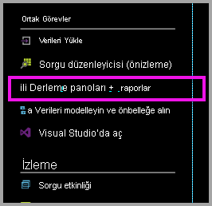
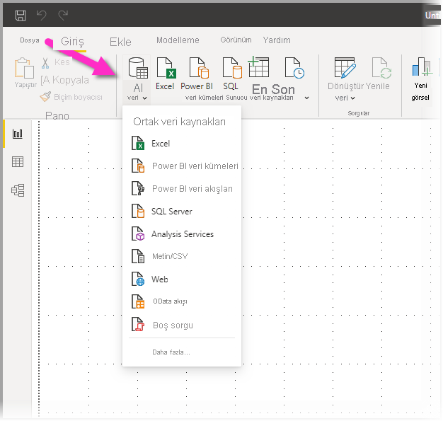
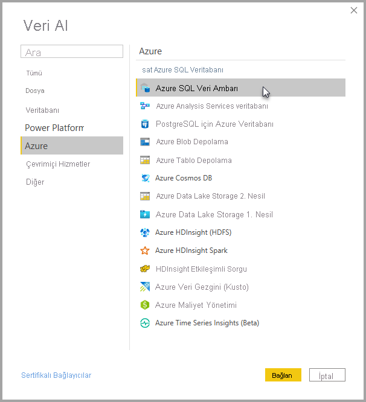
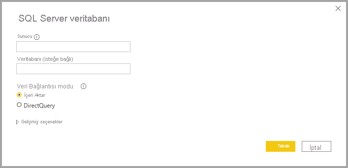
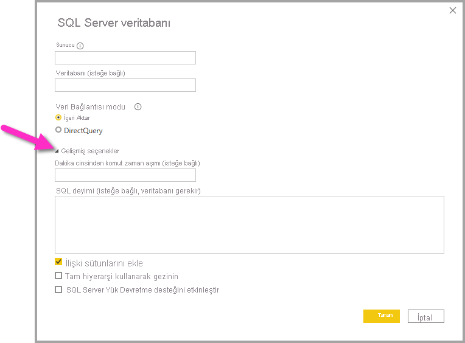
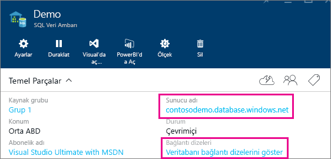

# DirectQuery ile Azure SQL Veri Ambarı

DirectQuery ile Azure SQL Veri Ambarı, Azure SQL Veri Ambarı'ndaki hazır verilerinizi ve ölçümlerinizi temel alan dinamik raporlar oluşturmanızı sağlar. DirectQuery ile, siz verileri keşfederken sorgular Azure SQL Veri Ambarı'nıza gerçek zamanlı olarak geri gönderilir. Gerçek zamanlı sorgular, SQL Veri Ambarı’nın ölçeğiyle birleştirildiğinde kullanıcıların terabaytlarca veriden birkaç dakika içinde dinamik rapor oluşturmasını sağlar. Ayrıca **Panolar ve raporlar oluşturun** bağlantısı, kullanıcıların SQL Veri Ambarları’nı kullanarak Power BI raporları oluşturmalarına olanak verir.

SQL Veri Ambarı bağlayıcısını kullanırken:

* Bağlanırken tam sunucu adını belirtin (ayrıntılar için aşağıya bakın)
* Sunucu güvenlik duvarı kurallarının "Azure hizmetlerine erişime izin ver" şeklinde yapılandırıldığından emin olun
* Sütun seçme veya filtre ekleme gibi her işlem, veri ambarına doğrudan sorgu gönderir
* Kutucuklar yaklaşık olarak 15 dakikada bir yenilenecek şekilde ayarlanmıştır ve yenileme işleminin zamanlanması gerekmez.  Yenileme özelliği, bağlantı kurulduktan sonra Gelişmiş ayarlar’da ayarlanabilir.
* DirectQuery veri kümeleri için Soru-Cevap özelliği kullanılamaz
* Şema değişiklikleri otomatik olarak alınmaz

Bu kısıtlamalar ve notlar, biz deneyimi iyileştirmeye devam ettikçe değişebilir. Bağlanma adımları aşağıda ayrıntılı şekilde verilmiştir.

## Power BI’da panolar ve raporlar oluşturma

> [!Important]
> Azure SQL Veri Ambarı ile bağlantımızı geliştirdik. Azure SQL Veri Ambarı veri kaynağınıza en iyi bağlanma deneyimi için Power BI Desktop kullanın. Modelinizi ve raporunuzu oluşturduktan sonra, bunu Power BI hizmetine yayımlayabilirsiniz. Power BI hizmetindeki Azure SQL Veri Ambarı’na yönelik önceki doğrudan bağlayıcı artık kullanılamıyor.

SQL Veri Ambarınız ve Power BI arasında veri alışverişi yapmanın en kolay yolu, Power BI Desktop’ta raporlar oluşturmaktır. Azure portalındaki **Panolar ve raporlar oluşturun** düğmesini kullanabilirsiniz.

1. Kullanmaya başlamak için Power BI Desktop’ı indirip yükleyin. İndirme ve yükleme hakkında bilgi almak için [Power BI Desktop’ı edinin](../fundamentals/desktop-get-the-desktop.md) makalesine bakın veya doğrudan sonraki adıma geçin.

2. Power BI Desktop’ı indirmek için **Panolar ve raporlar oluşturun** bağlantısına da tıklayabilirsiniz.

    

## Power BI Desktop aracılığıyla bağlanma

Power BI Desktop’taki **Veri Al** düğmesini kullanarak bir SQL Veri Ambarı’na bağlanabilirsiniz. 

1. **Giriş** menüsünden **Veri Al**’ı seçin.  

    

2. Tüm kullanılabilir veri kaynaklarını görmek için **Daha fazla...** seçeneğini belirleyin. Görüntülenen pencerede soldaki bölmeden **Azure**’ı, sağdaki bölmede yer alan kullanılabilir bağlayıcılar listesinden **Azure SQL Veri Ambarı**’nı seçin.

    

3. Görüntülenen pencerede sunucunuzu ve isteğe bağlı olarak bağlanmak istediğiniz veritabanını girin. Veri bağlantısı modunuzu da seçebilirsiniz: İçeri aktarma veya DirectQuery. Azure SQL Veri Ambarınızdaki bilgilere gerçek zamanlı bir şekilde erişmek için DirectQuery’yi kullanın.

    

4. Azure SQL Veri Ambarı bağlantısına yönelik gelişmiş seçenekler için, bağlantınıza ilişkin ek seçenekleri görüntülemek üzere **Gelişmiş seçeneklerin** yanındaki aşağı oku seçin.

    

Sonraki bölümde, bağlantınıza yönelik parametre değerlerini nasıl bulacağınız açıklanmaktadır. 

## Parametre Değerlerini Bulma

Tam sunucu adınız ve veritabanınızın adı Azure portalda bulunabilir. SQL Veri Ambarı’nın şu anda yalnızca Azure portalında bulunduğunu unutmayın.

> [!NOTE]
> Power BI kiracınız Azure SQL Veri Ambarı ile aynı bölgedeyse çıkış ücreti uygulanmaz. [Bu yönergeleri](https://docs.microsoft.com/power-bi/service-admin-where-is-my-tenant-located) kullanarak Power BI kiracınızın bulunduğu yeri belirleyebilirsiniz.

[!INCLUDE [direct-query-sso](../includes/direct-query-sso.md)]

## Sonraki adımlar

* [Power BI'da DirectQuery kullanma hakkında](desktop-directquery-about.md)
* [Power BI nedir?](../fundamentals/power-bi-overview.md)  
* [Power BI için veri alma](service-get-data.md)  
* [Azure SQL Veri Ambarı](/azure/sql-data-warehouse/sql-data-warehouse-overview-what-is/)

Başka bir sorunuz mu var? [Power BI Topluluğu'na başvurun](https://community.powerbi.com/)
