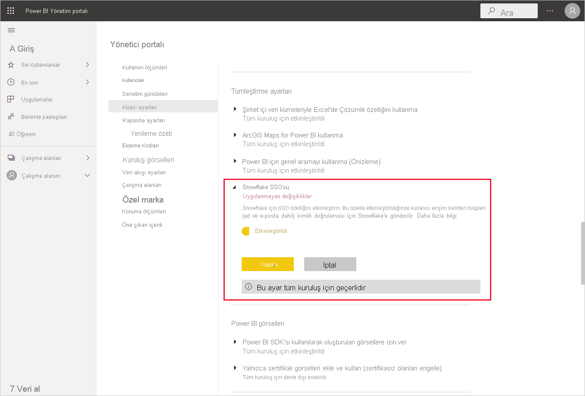
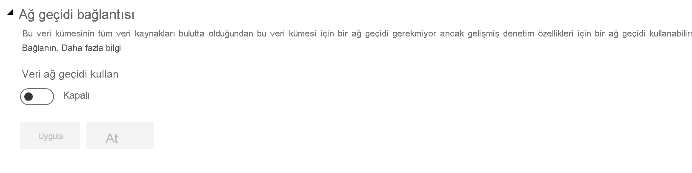
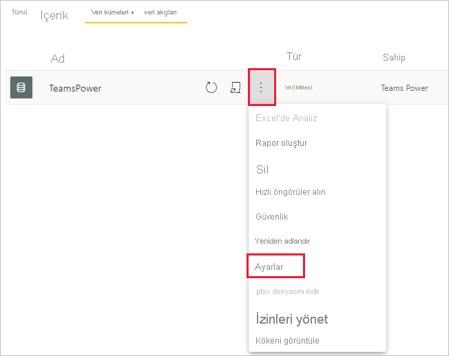
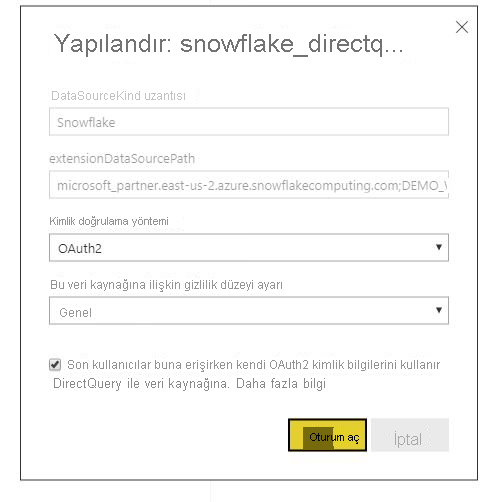

# Power BI hizmetinde Snowflake’e bağlanma

## Tanıtım

Power BI hizmetinde Snowflake’e bağlanmak, diğer bağlayıcılardan bağlanmaktan yalnızca tek bir yönüyle farklıdır. Snowflake, SSO seçeneğiyle birlikte Azure Active Directory’ye (AAD) yönelik ek bir özelliğe sahiptir. Tümleştirmenin bölümlerinde Snowflake, Power BI ve Azure için farklı yönetici rollerine ihtiyaç duyulur. SSO kullanmadan da AAD kimlik doğrulamasını etkinleştirebilirsiniz. Temel kimlik doğrulaması, hizmetteki diğer bağlayıcılara benzer şekilde çalışır.

AAD tümleştirmesini yapılandırmak ve SSO’yu isteğe bağlı olarak etkinleştirmek için bu makaledeki adımları izleyin:

* Snowflake yöneticisiyseniz Snowflake belgelerindeki [Snowflake için Power BI SSO - Kullanmaya Başlama](https://docs.snowflake.com/en/user-guide/oauth-powerbi.html) makalesini okuyun.
* Power BI yöneticisiyseniz SSO’yu etkinleştirmeyi öğrenmek için [Power BI Hizmet yapılandırması - Yönetici Portalı](service-connect-snowflake.md#admin-portal) makalesine başvurun.
* Power BI veri kümesi oluşturucusuysanız SSO’yu etkinleştirmeyi öğrenmek için [Power BI Hizmet yapılandırması - AAD ile veri kümesi yapılandırma](service-connect-snowflake.md#configuring-a-dataset-with-aad) makalesine başvurun.

## Power BI Hizmeti yapılandırması

### Yönetici portalı

SSO’yu etkinleştirmek için bir genel yöneticinin Power BI Yönetim portalındaki ayarı açması gerekir. Bu ayar, tüm kuruluşta kimlik doğrulaması için AAD kimlik bilgilerinin Snowflake’e gönderilmesini onaylar. SSO’yu etkinleştirmek için bu adımları izleyin:

1. Genel yönetici kimlik bilgilerini kullanarak [Power BI’da oturum açın](https://app.powerbi.com).
1. Sayfa üst bilgisi menüsünde **Ayarlar**’ı ve sonra **Yönetim portalı**’nı seçin.
1. **Kiracı ayarları**’nı seçin ve sonra **Tümleştirme ayarları**’nı bulmak için kaydırın.

   

4. **Snowflake SSO**’yu genişletin, ayarı **Etkin** olarak değiştirin ve **Uygula**’yı seçin.

Bu adım, AAD belirtecinizi Snowflake sunucularına göndermeyi onaylamak açısından gereklidir. Etkinleştirildikten sonra ayarın etkili olması bir saat kadar sürebilir.

SSO etkinleştirildikten sonra, raporları SSO ile kullanabilirsiniz.

### AAD ile veri kümesi yapılandırma

Snowflake bağlayıcısını temel alan bir rapor Power BI hizmetinde yayımlandıktan sonra, veri kümesi oluşturucusunun SSO kullanması için ayarları uygun çalışma alanı için güncelleştirmesi gerekir.

Power BI’ın çalışma şekli nedeniyle SSO yalnızca şirket içi veri ağ geçidi aracılığıyla çalıştırılan veri kaynakları olmadığında çalışır. Sınırlamalar aşağıda listelenmiştir:

* Veri modelinizde yalnızca bir Snowflake kaynağı kullanıyorsanız şirket içi veri ağ geçidini kullanmama şartıyla SSO özelliğini kullanabilirsiniz.
* Veri modelinizde Snowflake kaynağı ve başka bir kaynak kullanıyorsanız bu kaynakların hiçbirinin şirket içi veri ağ geçidini kullanmaması şartıyla SSO özelliğini kullanabilirsiniz.
* Şirket içi veri ağ geçidi üzerinden Snowflake kaynağı kullanılan durumlar için şu anda AAD kimlik bilgileri desteklenmez. Bu durum bir sanal ağa Power BI IP aralığının tamamından değil ağ geçidi yüklü olan tek bir IP adresinden erişmeye çalıştığınız durumlarda geçerli olabilir.
* Snowflake kaynağı ile ağ geçidine ihtiyaç duyan başka bir kaynak kullanıyorsanız Snowflake’i şirket içi veri ağ geçidi üzerinden de kullanmanız gerekir. Bu durumda SSO kullanamazsınız.

Şirket içi veri ağ geçidini kullanma hakkında daha fazla bilgi için bkz. [Şirket içi veri ağ geçidi nedir?](service-gateway-onprem.md)

Ağ geçidi kullanmıyorsanız yapmanız gereken başka işlem yoktur. Şirket içi veri ağ geçidinizde Snowflake kimlik bilgileri yapılandırıldıysa ancak modelinizde yalnızca o veri kaynağını kullanıyorsanız, Veri kümesi ayarları sayfasındaki düğmeye tıklayarak ağ geçidini o veri modeli için kapatabilirsiniz.

Veri kümesinde SSO’yu açmak için şu adımları izleyin:

1. Veri kümesi oluşturucu kimlik bilgilerini kullanarak [Power BI’da oturum açın](https://app.powerbi.com).
1. Uygun çalışma alanını seçin ve sonra veri kümesinin adının yanında bulunan Diğer seçenekler menüsünden **Ayarlar**’ı seçin.
  
1. **Veri kaynağı kimlik bilgilerini** seçip oturum açın. Veri kümesinin Snowflake'te oturum açması için Temel veya OAuth2 (AAD) kimlik bilgileri kullanılabilir. AAD kullanıyorsanız bir sonraki adımda SSO’yu etkinleştirebilirsiniz.
1. **DirectQuery ile bu veri kaynağına erişirken son kullanıcılar kendi OAuth2 kimlik bilgilerini kullanır** seçeneğini belirleyin. Bu ayar, AAD SSO’yu etkinleştirir. İlk kullanıcının Temel kimlik doğrulaması veya OAuth2 (AAD) ile oturum açma durumundan bağımsız olarak SSO için AAD kimlik bilgileri gönderilir.

    

Bu adımlar tamamlandıktan sonra diğer kullanıcıların aynı Snowflake veri kümesindeki verilere bağlanmak için otomatik olarak AAD kimlik doğrulamalarını kullanmaları gerekir.

SSO'yu etkinleştirmezseniz raporu yenileyen kullanıcılar, diğer çoğu Power BI raporunda olduğu gibi oturum açmış olan kullanıcının kimlik bilgilerini kullanır.

### Sorun giderme

Tümleştirme konusunda herhangi bir sorunla karşılaşırsanız Snowflake [sorun giderme kılavuzunu](https://docs.snowflake.com/en/user-guide/oauth-powerbi.html#troubleshooting) inceleyin.

## Sonraki adımlar

* [Power BI hizmeti için veri kaynakları](service-get-data.md)
* [Power BI Desktop’tan Power BI hizmetindeki veri kümelerine bağlanma](desktop-report-lifecycle-datasets.md)
* [Bir Snowflake bilgi işlem ambarına bağlanma](desktop-connect-snowflake.md)