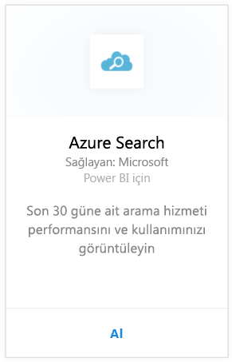
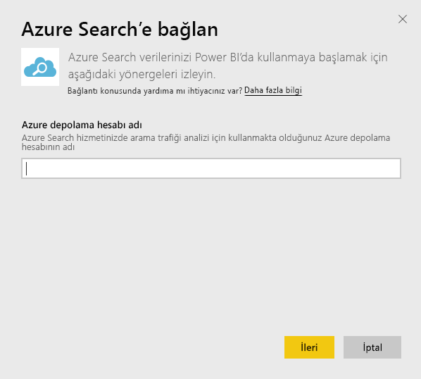
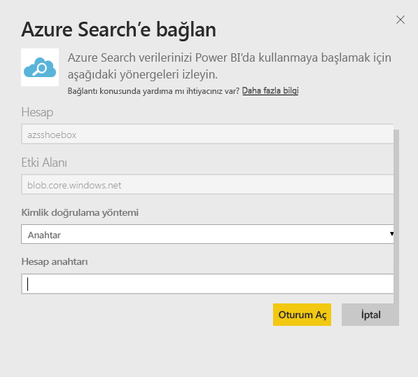
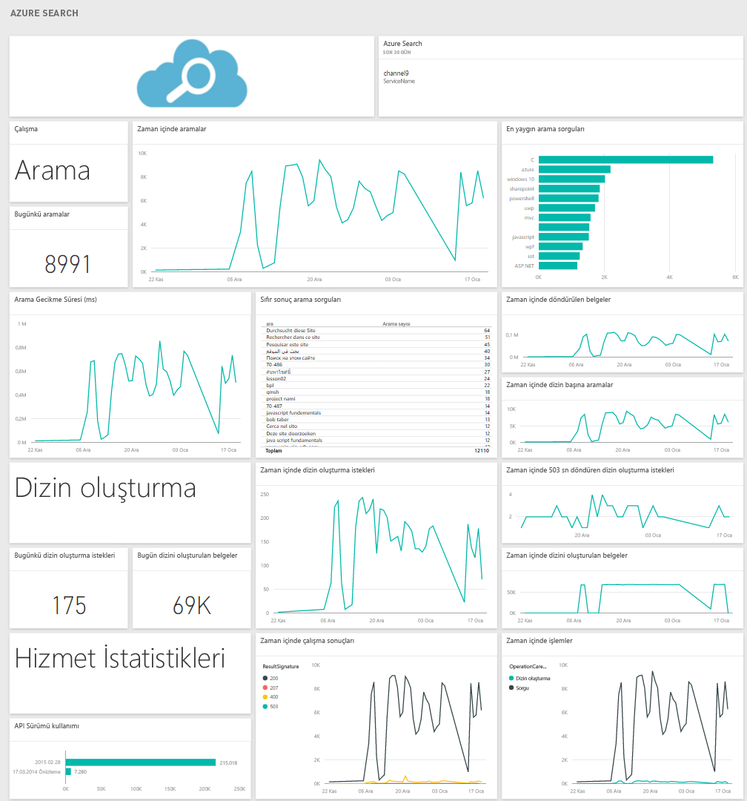

# Power BI ile Azure Search'e bağlanma
Azure Search Trafik Analizi, Azure Search hizmetinize ilişkin trafiği izleyip anlamanıza olanak sağlar. Power BI için Azure Search içerik paketi, son 30 güne ait Arama ve Dizin Oluşturma verilerinin yanı sıra Hizmet İstatistikleri ve Gecikme Süreleri de dahil olmak üzere Search verilerinize ilişkin ayrıntılı öngörüler sağlar. Daha ayrıntılı bilgiye [Azure blog gönderisinden](https://azure.microsoft.com/blog/analyzing-your-azure-search-traffic/) ulaşabilirsiniz.

[!INCLUDE [include-short-name](../includes/service-deprecate-content-packs.md)]

Power BI için [Azure Search içerik paketine](https://app.powerbi.com/getdata/services/azure-search) bağlanın.

## Bağlanma
1. Gezinti bölmesinin alt kısmında bulunan **Veri Al**'ı seçin.
   
    
2. **Hizmetler** kutusundaki **Al** seçeneğini belirleyin.
   
    
3. **Azure Search** \> **Al**’ı seçin.
   
   
4. Azure Search analizinizin depolandığı tablo depolama hesabının adını girin.
   
   
5. Kimlik Doğrulama Yöntemi olarak **Anahtar** seçeneğini belirleyin ve depolama hesabı anahtarınızı girin. **Oturum Aç**'a tıklayın ve yükleme işlemine başlayın.
   
   
6. Yükleme işlemi tamamlandığında gezinti bölmesinde yeni bir pano, rapor ve model görünür. İçeri aktarılan verilerinizi görüntülemek için panoyu seçin.
   
    

**Sırada ne var?**

* Panonun üst tarafındaki [Soru-Cevap kutusunda soru sormayı](../consumer/end-user-q-and-a.md) deneyin
* Panodaki [kutucukları değiştirin](../create-reports/service-dashboard-edit-tile.md).
* Bağlantılı raporu açmak için [bir kutucuk seçin](../consumer/end-user-tiles.md).
* Veri kümeniz günlük olarak yenilenecek şekilde zamanlanır ancak yenileme zamanlamasında değişiklik yapabilir veya **Şimdi Yenile** seçeneğini kullanarak istediğinizde veri kümenizi kendiniz de yenileyebilirsiniz.

## Sistem Gereksinimleri
Azure Search içerik paketi için hesapta Azure Search Trafik Analizi'nin etkinleştirilmesi gerekir.

## Sorun giderme
Depolama hesabı adının, tam erişim anahtarıyla birlikte doğru şekilde sağlandığından emin olun. Depolama hesabı adı, Azure Search Trafik Analizi ile yapılandırılan hesaba karşılık gelmelidir.

## Sonraki adımlar
[Power BI nedir?](../fundamentals/power-bi-overview.md)

[Power BI hizmetinde tasarımcılara yönelik temel kavramlar](../fundamentals/service-basic-concepts.md)
