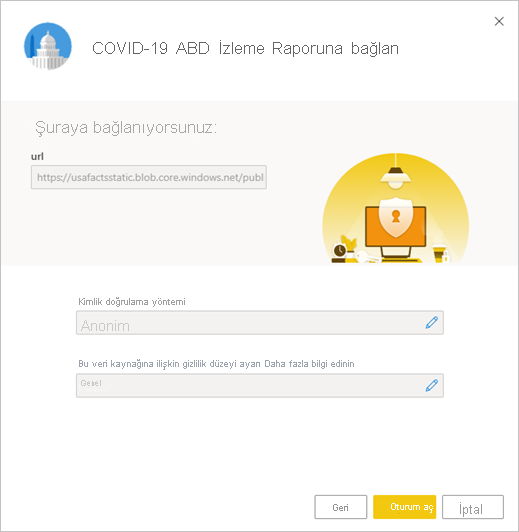

# COVID-19 ABD izleme raporuna bağlanma
Bu makalede COVID-19 izleme raporuna yönelik şablon uygulamasını yükleme ve veri kaynaklarına bağlanma yöntemi açıklanır.

Sorumluluk reddi ve veriler hakkındaki bilgiler de dahil olmak üzere raporun kendisiyle ilgili ayrıntılı bilgiler için bkz. [ABD eyalet ve yerel hükümetlere yönelik COVID-19 izleme örneği](../create-reports/sample-covid-19-us.md).

Şablon uygulamasını yükleyip veri kaynaklarına bağlandıktan sonra, raporu ihtiyaçlarınıza göre özelleştirebilirsiniz. Daha sonra bunu, kuruluşunuzdaki iş arkadaşlarınıza bir uygulama olarak dağıtabilirsiniz.

## Uygulamayı yükleme

1. Uygulamaya ulaşmak için aşağıdaki bağlantıya tıklayın: [COVID-19 ABD İzleme Raporu şablon uygulaması](https://appsource.microsoft.com/en-us/product/power-bi/pbi-contentpacks.covid19ms)

1. Uygulamanın AppSource sayfasına ulaştığınızda [**ŞİMDİ EDİNİN**](https://appsource.microsoft.com/en-us/product/power-bi/pbi-contentpacks.covid19ms)’e tıklayın.

    

1. Sorulduğunda **Yükle**’ye tıklayın. Uygulamayı yükledikten sonra Uygulamalarınız sayfasında görebilirsiniz.

   

## Veri kaynaklarına bağlanma

1. Uygulamanızı açmak için Uygulamalar sayfanızdaki simgeye tıklayın.

1. Görüntülenen karşılama ekranında **Bağlan**’ı seçin.

   

1. Art arda iki oturum açma iletişim kutusu açılır. Gizlilik düzeyini her ikisinde de Genel olarak ayarlayın.

   

   Rapor veri kaynaklarına bağlanıp güncel verilerle doldurulur. Bu sırada, etkinlik izleyicisi açılır.

   

## Rapor yenilemeyi zamanlama

Veri yenileme tamamlandığında uygulamayla ilişkilendirilen çalışma alanında olursunuz. Raporu güncel tutmak için [yenileme zamanlaması belirleyin](../refresh-scheduled-refresh.md).

## Özelleştirin ve paylaşın

Ayrıntılar için bkz. [Uygulamayı özelleştirme ve paylaşma](../service-template-apps-install-distribute.md#customize-and-share-the-app). Uygulamayı yayımlamadan veya dağıtmadan önce [rapor sorumluluk reddini](../create-reports/sample-covid-19-us.md#disclaimers) gözden geçirdiğinizden emin olun.

## Sonraki adımlar
* [ABD eyalet ve yerel hükümetlere yönelik COVID-19 izleme örneği](../create-reports/sample-covid-19-us.md)
* Sorularınız mı var? [Power BI Topluluğu'na sorun](https://community.powerbi.com/)
* [Power BI şablon uygulamaları nedir?](../service-template-apps-overview.md)
* [Kuruluşunuzda şablon uygulamalarını yükleme ve dağıtma](../service-template-apps-install-distribute.md)
