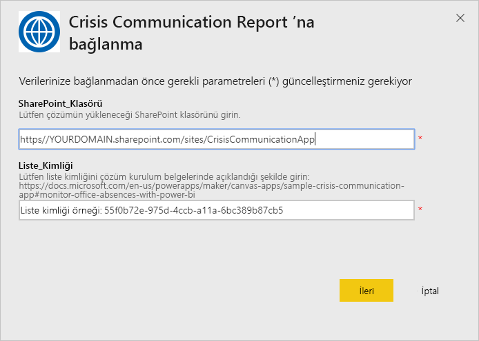

# Kriz İletişimi Durum Raporu’na Bağlanma

Bu Power BI uygulaması, Kriz İletişimi için Microsoft Power Platform çözümündeki rapor/pano yapıtıdır. Kriz İletişimi uygulaması kullanıcıları için çalışanların konumunu izler. Çözüm Power Apps, Power Automate, Teams, SharePoint ve Power BI’ın özelliklerini bir araya getirir. Web üzerinde, mobilde veya Teams’de kullanılabilir.

Sağlık sistemleri genelindeki verileri toplayan bu pano, acil durum yöneticilerinin zamanında ve doğru kararlar almasına yardımcı olur.

Bu makalede, uygulamayı yükleme ve veri kaynaklarına bağlanma işlemleri açıklanır. Kriz İletişimi uygulaması hakkında daha fazla bilgi için bkz. [Power Apps’te Kriz İletişimi örnek şablonunu ayarlama ve bunun hakkında bilgi edinme](/powerapps/maker/canvas-apps/sample-crisis-communication-app)

Şablon uygulamasını yükleyip veri kaynaklarına bağlandıktan sonra, raporu ihtiyaçlarınıza göre özelleştirebilirsiniz. Daha sonra bunu, kuruluşunuzdaki iş arkadaşlarınıza bir uygulama olarak dağıtabilirsiniz.

## Önkoşullar

Bu şablon uygulamasını yüklemeden önce, [Kriz İletişimi örneğini](/powerapps/maker/canvas-apps/sample-crisis-communication-app) yükleyip ayarlamanız gerekir. Bu çözüm yüklendiğinde, uygulamayı verilerle doldurmak için gereken veri kaynağı başvuruları oluşturulur.

Kriz İletişimi örneğini yüklerken [“CI_Employee Status” SharePoint listesi klasör yolunu ve liste kimliğini](/powerapps/maker/canvas-apps/sample-crisis-communication-app#monitor-office-absences-with-power-bi) not edin.

## Uygulamayı yükleme

1. Uygulamaya ulaşmak için aşağıdaki bağlantıya tıklayın: [Kriz İletişimi Durum Raporu şablon uygulaması](https://appsource.microsoft.com/en-us/product/power-bi/pbi-contentpacks.crisiscomms)

1. Uygulamanın AppSource sayfasında [**ŞİMDİ EDİNİN**](https://appsource.microsoft.com/en-us/product/power-bi/pbi-contentpacks.crisiscomms)’i seçin.

    

1. **Bir şey daha ...** penceresindeki bilgileri okuyup **Devam et**’i seçin.

    

1. **Yükle**'yi seçin. 

    

    Uygulamayı yükledikten sonra Uygulamalarınız sayfasında görebilirsiniz.

   

## Veri kaynaklarına bağlanma

1. Uygulamanızı açmak için Uygulamalar sayfanızdaki simgeyi seçin.

1. Karşılama ekranında **Keşfet**’i seçin.

   

   Uygulama, örnek verileri göstererek açılır.

1. Sayfanın üst kısmındaki başlıkta yer alan **Verilerinize bağlanın** seçeneğini belirleyin.

   

1. İletişim kutusunda:
   1. SharePoint_Folder alanına [“CI_Employee Status” SharePoint listesi yolunu](/powerapps/maker/canvas-apps/sample-crisis-communication-app#monitor-office-absences-with-power-bi) girin.
   1. List_ID alanına, liste ayarlarından aldığınız liste kimliğinizi girin. İşiniz bittiğinde **İleri**’ye tıklayın.

   

1. Karşınıza çıkan sonraki iletişim kutusunda, kimlik doğrulaması yöntemini **OAuth2** olarak belirleyin. Gizlilik düzeyi ayarlarında bir şey yapmanız gerekmez.

   **Oturum aç**'ı seçin.

   

1. Microsoft oturum açma ekranında, Power BI’da oturum açın.

   

   Oturum açtıktan sonra rapor veri kaynaklarına bağlanıp güncel verilerle doldurulur. Bu sırada, etkinlik izleyicisi açılır.

   

## Rapor yenilemeyi zamanlama

Veri yenileme tamamlandığında, raporu güncel tutmak için [yenileme zamanlaması belirleyin](../connect-data/refresh-scheduled-refresh.md).

1. Üst başlık çubuğunda **Power BI**’ı seçin.

   

1. Sol gezinti bölmesinde, **Çalışma Alanları** bölümünde Hastanede Acil Durum Yanıtlamada Karar Desteği Panosu çalışma alanını bulup [Zamanlanan yenileme yapılandırma](../connect-data/refresh-scheduled-refresh.md) makalesinde açıklanan yönergeleri izleyin.

## Özelleştirin ve paylaşın

Ayrıntılar için bkz. [Uygulamayı özelleştirme ve paylaşma](../connect-data/service-template-apps-install-distribute.md#customize-and-share-the-app). Uygulamayı yayımlamadan veya dağıtmadan önce [rapor sorumluluk reddini](../create-reports/sample-covid-19-us.md#disclaimers) gözden geçirdiğinizden emin olun.

## Sonraki adımlar
* [Power Apps’teki Kriz İletişimi örnek şablonunu ayarlama ve bunun hakkında bilgi edinme](/powerapps/maker/canvas-apps/sample-crisis-communication-app)
* Sorularınız mı var? [Power BI Topluluğu'na sorun](https://community.powerbi.com/)
* [Power BI şablon uygulamaları nedir?](../connect-data/service-template-apps-overview.md)
* [Kuruluşunuzda şablon uygulamalarını yükleme ve dağıtma](../connect-data/service-template-apps-install-distribute.md)