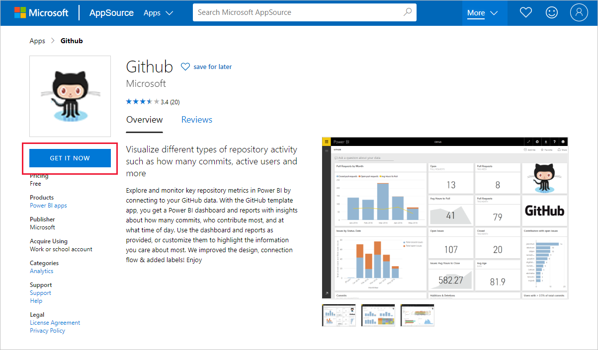
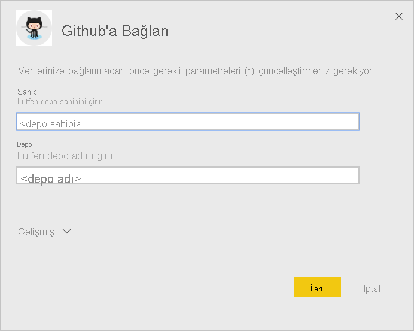
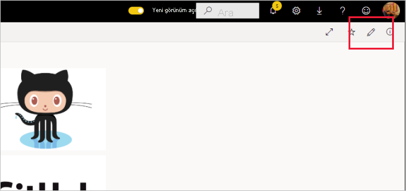

# <a name="connect-to-github-with-power-bi"></a>Power BI ile GitHub'a bağlanma
Bu makalede, verileri GitHub hesabınızdan Power BI şablon uygulamasıyla çekme işlemi adım adım açıklanmaktadır. Şablon uygulaması, GitHub verilerinizi araştırmanıza olanak tanımak için pano, rapor kümesi ve veri kümesi içeren bir çalışma alanı oluşturur. Power BI için GitHub uygulaması; yapılan katkılar, sorunlar, çekme istekleri ve etkin kullanıcılar ile ilgili veriler içeren bir GitHub deposuna (depo olarak da bilinir) ilişkin içgörüler gösterir.


Şablon uygulamasını yükledikten sonra panoyu ve raporu değiştirebilirsiniz. Daha sonra bunu, kuruluşunuzdaki iş arkadaşlarınıza bir uygulama olarak dağıtabilirsiniz.

[GitHub şablon uygulamasına](https://app.powerbi.com/groups/me/getapps/services/pbi-contentpacks.pbiapps-github) bağlanın veya Power BI ile [GitHub tümleştirmesi](https://powerbi.microsoft.com/integrations/github) hakkında daha fazla bilgi edinin.

Ayrıca [GitHub öğreticisini](service-tutorial-connect-to-github.md) de deneyebilirsiniz. Power BI belgeleri için ortak depoyla ilgili gerçek GitHub verilerini yükler.

>[!NOTE]
>Bu şablon uygulaması, depoya erişim için bir GitHub hesabı gerektirir. Aşağıda, gereksinimlerle ilgili daha ayrıntılı bilgi verilmiştir.
>
>Bu şablon uygulaması GitHub Enterprise desteği sunmaz.

## <a name="install-the-app"></a>Uygulamayı yükleme

1. Uygulamaya ulaşmak için aşağıdaki bağlantıya tıklayın: [GitHub şablon uygulaması](https://app.powerbi.com/groups/me/getapps/services/pbi-contentpacks.pbiapps-github)

1. Uygulamanın AppSource sayfasında [**ŞİMDİ EDİNİN**](https://app.powerbi.com/groups/me/getapps/services/pbi-contentpacks.pbiapps-github)’i seçin.

    [](https://app.powerbi.com/groups/me/getapps/services/pbi-contentpacks.pbiapps-github)

1. **Yükle**'yi seçin. 

    

    Uygulamayı yükledikten sonra Uygulamalarınız sayfasında görebilirsiniz.

   

## <a name="connect-to-data-sources"></a>Veri kaynaklarına bağlanma

1. Uygulamanızı açmak için Uygulamalar sayfanızdaki simgeyi seçin.

1. Karşılama ekranında **Uygulamayı keşfet**’i seçin.

   

   Uygulama, örnek verileri göstererek açılır.

1. Sayfanın üst kısmındaki başlıkta yer alan **Verilerinize bağlanın** seçeneğini belirleyin.

   

1. Görüntülenen iletişim kutusunda depo adını ve deponun sahibini girin. [Bu parametreleri bulmaya](#FindingParams) ilişkin ayrıntılı bilgi için aşağıya bakın. İşiniz bittiğinde **İleri**’ye tıklayın.

   

1. Karşınıza çıkan sonraki iletişim kutusunda kimlik doğrulaması yönteminin **OAuth2** olarak ayarlandığından emin olun. Gizlilik ayarında bir şey yapmanız gerekmez. Hazır olduğunuzda **Oturum aç**’a tıklayın.

   

1. GitHub kimlik bilgilerinizi girin ve GitHub kimlik doğrulama işlemini izleyin (tarayıcınızda önceden oturum açtıysanız bu adımı atlayabilirsiniz).

   


Oturum açtıktan sonra rapor veri kaynaklarına bağlanıp güncel verilerle doldurulur. Bu sırada, etkinlik izleyicisi açılır.


Oturum açma işlemi sırasında bu ayarı devre dışı bırakmadığınız sürece, rapor verileriniz günde bir kere otomatik olarak yenilenir. Dilerseniz, rapor verilerinizi güncel tutmak için [kendi yenileme zamanlamanızı da ayarlayabilirsiniz](./refresh-scheduled-refresh.md).

## <a name="customize-and-share"></a>Özelleştirin ve paylaşın

Uygulamanızı özelleştirmek ve paylaşmak için sayfanın sağ üst köşesindeki kalem simgesini seçin.




Çalışma alanındaki yapıtları düzenlemeyle ilgili bilgi için bkz.
* [Power BI’da rapor düzenleyicisi turu](../create-reports/service-the-report-editor-take-a-tour.md)
* [Power BI hizmetinde tasarımcılara yönelik temel kavramlar](../fundamentals/service-basic-concepts.md)

Çalışma alanındaki yapıtlara istediğiniz değişiklikleri yapmanızın ardından uygulamayı yayımlamaya ve paylaşmaya hazır olursunuz. Bunun nasıl yapılacağını öğrenmek için bkz. [Uygulamanızı yayımlama](../collaborate-share/service-create-distribute-apps.md#publish-your-app).

## <a name="whats-included-in-the-app"></a>Uygulamaya dahil olan özellikler
Aşağıdaki verilere Power BI ile GitHub'dan erişilebilir:     

| Tablo adı | Açıklama |
| --- | --- |
| Katkılar |Katkılar tablosunda, katkıda bulunan kişi tarafından gerçekleştirilen ve haftalık olarak hesaplanan toplam ekleme, silme ve yürütme işlemi sayısı gösterilir. En çok katkıda bulunan 100 kişi tabloya dahil edilir. |
| Sorunlar |Seçili depo ile ilgili tüm sorunları listeler ve bir sorunun kapatılmasına kadar geçen toplam ve ortalama süre, toplam açık sorun sayısı ve toplam kapalı sorun sayısı gibi hesaplar içerir. Depoda herhangi bir sorun olmadığında bu tablo boş olur. |
| Pull requests |Bu tabloda, depo için gerçekleştirilen tüm Çekme İstekleri ve çekme isteğini kimin gerçekleştirdiği gösterilir. Açık, kapalı ve toplam çekme isteği sayısı, çekme isteklerinin gerçekleştirilmesinin ne kadar sürdüğü ve bir çekme isteğinin ortalama ne kadar sürdüğü ile ilgili hesaplamalar da içerir. Depoda çekme isteği olmadığında bu tablo boş olur. |
| Kullanıcılar |Bu tabloda katkı yapmış, sorun bildirmiş veya seçili depo için Çekme isteklerini çözmüş GitHub kullanıcılarının ya da katkıda bulunan kişilerin bir listesi bulunmaktadır. |
| Milestones |Seçili depo ile ilgili tüm kilometre taşlarını gösterir. |
| DateTable |Bu tabloda, GitHub verilerinizi tarihe göre çözümleme konusunda yararlanabileceğiniz, güncel ve geçmiş tarihler bulunur. |
| ContributionPunchCard |Bu tablo, seçili depo için yapılan katkıları gösteren bir ödül kartı olarak kullanılabilir. Haftanın günlerine ve saatlere göre yürütmeleri gösterir. Bu tablo, modeldeki diğer tablolara bağlı değildir. |
| RepoDetails |Bu tabloda, seçili depo ile ilgili ayrıntılar sunulur. |

## <a name="system-requirements"></a>Sistem Gereksinimleri
* Depoya erişimi bulunan bir GitHub hesabı.  
* İlk oturum açma işlemi sırasında Power BI için GitHub uygulamasına izin verme. Erişim iptali ile ilgili aşağıdaki ayrıntılı bilgilere bakın.  
* Veri çekme ve yenileme için kullanılabilen yeterli miktarda API çağrısı.
>[!NOTE]
>Bu şablon uygulaması GitHub Enterprise desteği sunmaz.

### <a name="de-authorize-power-bi"></a>Power BI yetkisini kaldırma
Power BI'ın GitHub deponuza bağlanma yetkisini kaldırmak üzere GitHub için Erişimi iptal et işlemini gerçekleştirebilirsiniz. Ayrıntılar için [GitHub yardımı](https://help.github.com/articles/keeping-your-ssh-keys-and-application-access-tokens-safe/#reviewing-your-authorized-applications-oauth) konusuna bakın.

<a name="FindingParams"></a>
## <a name="finding-parameters"></a>Parametreleri bulma
GitHub'daki depoya bakarak sahibi ve depoyu belirlemeniz mümkündür:


İlk parça olan "Azure" sahibi, ikinci parça olan "azure-sdk-for-php" ise depoyu göstermektedir.  Depo URL'sinde aynı iki öğeyi görürsünüz:

```console
<https://github.com/Azure/azure-sdk-for-php> .
```

## <a name="troubleshooting"></a>Sorun giderme
Gerekirse GitHub kimlik bilgilerinizi doğrulayabilirsiniz.  

1. Başka bir tarayıcı penceresinde GitHub web sitesine gidin ve GitHub'da oturum açın. GitHub sitesindeyken sağ üst köşeye bakarak, oturum açmış olduğunuzu görebilirsiniz.    
2. GitHub'da, Power BI'ı kullanarak erişmek istediğiniz deponun URL'sine gidin. Örneğin: https://github.com/dotnet/corefx.  
3. Power BI'da GitHub'a bağlanmayı deneyin. GitHub Yapılandırma iletişim kutusunda, deponun ve sahibinin adını kullanın.  

## <a name="next-steps"></a>Sonraki adımlar

* [Öğretici: Power BI ile bir GitHub deposuna bağlanma](service-tutorial-connect-to-github.md)
* [Power BI'da yeni çalışma alanları oluşturma](../collaborate-share/service-create-the-new-workspaces.md)
* [Power BI'da uygulamaları yükleme ve kullanma](../consumer/end-user-apps.md)
* [Dış hizmetler için Power BI uygulamalarına bağlanma](service-connect-to-services.md)
* Sorularınız mı var? [Power BI Topluluğu'na sorun](https://community.powerbi.com/)
