# Hastanede Acil Durum Yanıtlamada Karar Desteği Panosuna Bağlanma
Hastanede Acil Durum Yanıtlamada Karar Desteği Panosu şablon uygulaması, [Sağlık hizmetlerinde acil müdahale için Microsoft Power Platform çözümünün](https://powerapps.microsoft.com/blog/emergency-response-solution-a-microsoft-power-platform-solution-for-healthcare-emergency-response/) raporlama bileşenidir. Sağlık sistemleri genelindeki verileri toplayan bu pano, acil durum yöneticilerinin zamanında ve doğru kararlar almasına yardımcı olur.

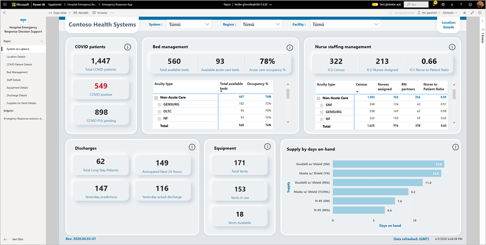

Bu makalede, uygulamayı yükleme ve veri kaynaklarına bağlanma işlemleri açıklanır. Bu uygulamada göreceğiniz raporu kullanmayı öğrenmek için bkz. [Hastanede Acil Durum Yanıtlamada Karar Desteği Panosu belgeleri](https://docs.microsoft.com/powerapps/sample-apps/emergency-response/deploy-configure#view-the-power-bi-dashboard).

Şablon uygulamasını yükleyip veri kaynaklarına bağlandıktan sonra, raporu ihtiyaçlarınıza göre özelleştirebilirsiniz. Daha sonra bunu, kuruluşunuzdaki iş arkadaşlarınıza bir uygulama olarak dağıtabilirsiniz.

## Önkoşullar

Bu şablon uygulamasını yüklemeden önce [Hastane Acil Durum Yanıtı Power Platform çözümünü](https://docs.microsoft.com/powerapps/sample-apps/emergency-response/deploy-configure) yükleyip ayarlamanız gerekir. Bu çözüm yüklendiğinde, uygulamayı verilerle doldurmak için gereken veri kaynağı başvuruları oluşturulur.

Hastane Acil Durum Yanıtı Power Platform çözümünü yüklerken [Common Data Service ortam örneğinizin URL’sini](https://docs.microsoft.com/powerapps/sample-apps/emergency-response/deploy-configure#publish-the-power-bi-dashboard) not edin. Şablon uygulamasını verilere bağlamak için bu URL’ye ihtiyacınız olacak.

## Uygulamayı yükleme

1. Uygulamaya ulaşmak için aşağıdaki bağlantıya tıklayın: [Hastanede Acil Durum Yanıtlamada Karar Desteği Panosu şablon uygulaması](https://appsource.microsoft.com/en-us/product/power-bi/pbi-contentpacks.powerapps_healthcare)

1. Uygulamanın AppSource sayfasında [**ŞİMDİ EDİNİN**](https://appsource.microsoft.com/en-us/product/power-bi/pbi-contentpacks.powerapps_healthcare)’i seçin.

    [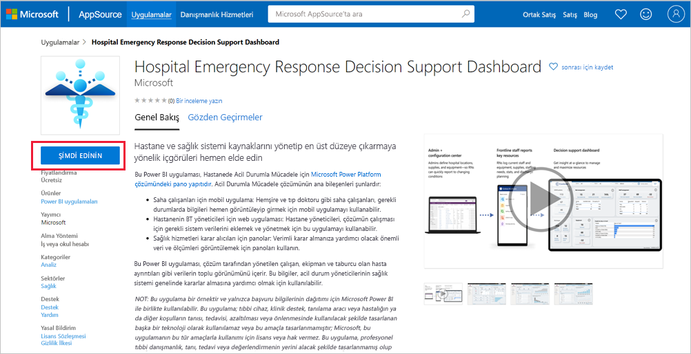](https://appsource.microsoft.com/en-us/product/power-bi/pbi-contentpacks.powerapps_healthcare)

1. **Bir şey daha ...** penceresindeki bilgileri okuyup **Devam et**’i seçin.

    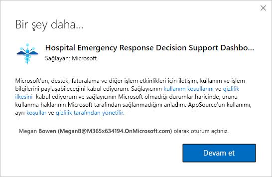

1. **Yükle**'yi seçin. 

    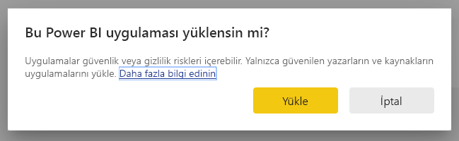

    Uygulamayı yükledikten sonra Uygulamalarınız sayfasında görebilirsiniz.

   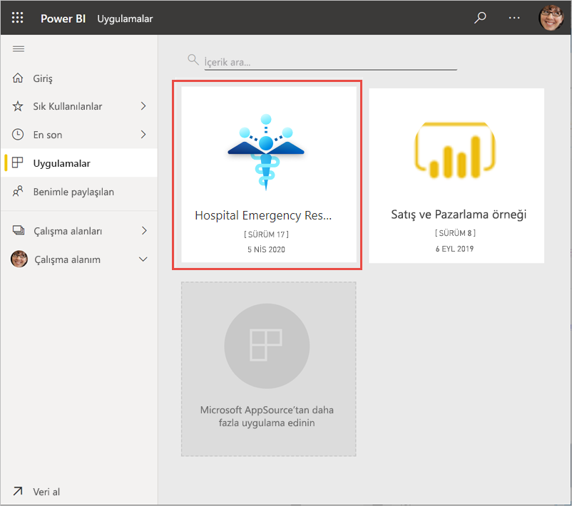

## Veri kaynaklarına bağlanma

1. Uygulamanızı açmak için Uygulamalar sayfanızdaki simgeyi seçin.

1. Karşılama ekranında **Keşfet**’i seçin.

   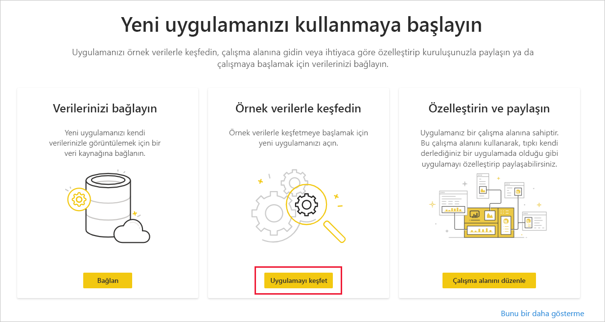

   Uygulama, örnek verileri göstererek açılır.

1. Sayfanın üst kısmındaki başlıkta yer alan **Verilerinize bağlanın** seçeneğini belirleyin.

   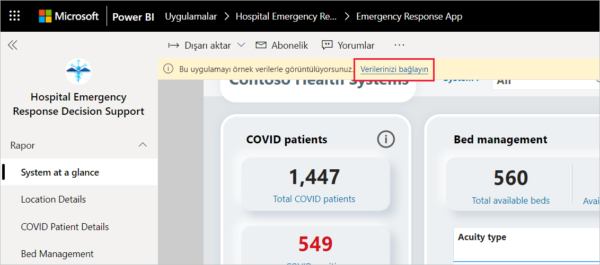

1. İletişim kutusunda:
   1. Kuruluş adı alanına kuruluşunuzun adını (ör. “Contoso Sağlık Sistemleri”) girin. Bu alan isteğe bağlıdır. Bu ad, panonun sol üst kısmında görünür.
   1. CDS_base_solution alanına [Common Data Service ortam örneğinizin URL’sini](https://docs.microsoft.com/powerapps/sample-apps/emergency-response/deploy-configure#publish-the-power-bi-dashboard) yazın. Örneğin: https://[myenv].crm.dynamics.com. İşiniz bittiğinde **İleri**’ye tıklayın.

   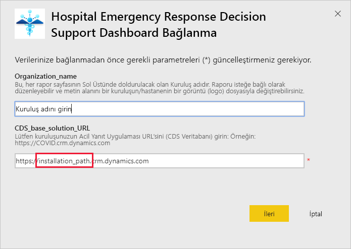

1. Karşınıza çıkan sonraki iletişim kutusunda, kimlik doğrulaması yöntemini **OAuth2** olarak belirleyin. Gizlilik düzeyi ayarlarında bir şey yapmanız gerekmez.

   **Oturum aç**'ı seçin.

   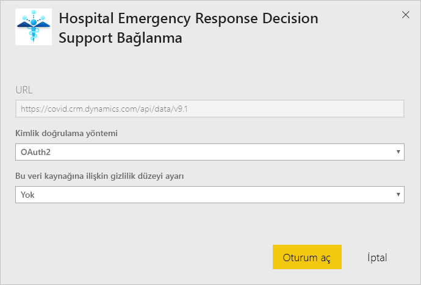

1. Microsoft oturum açma ekranında, Power BI’da oturum açın.

   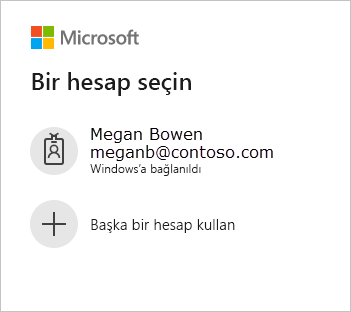

   Oturum açtıktan sonra rapor veri kaynaklarına bağlanıp güncel verilerle doldurulur. Bu sırada, etkinlik izleyicisi açılır.

   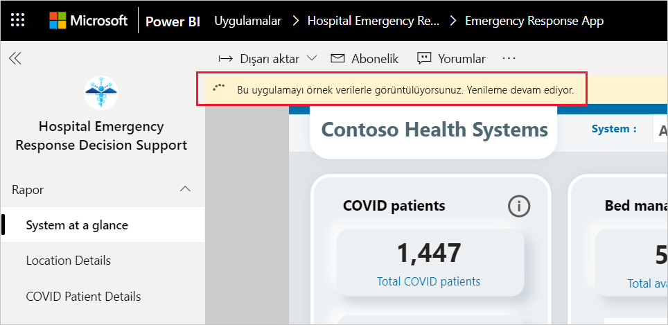

## Rapor yenilemeyi zamanlama

Veri yenileme tamamlandığında, raporu güncel tutmak için [yenileme zamanlaması belirleyin](../refresh-scheduled-refresh.md).

1. Üst başlık çubuğunda **Power BI**’ı seçin.

   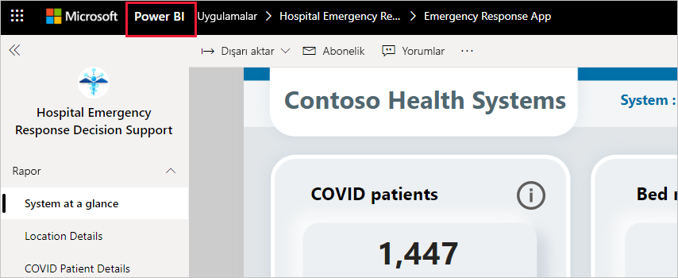

1. Sol gezinti bölmesinde, **Çalışma Alanları** bölümünde Hastanede Acil Durum Yanıtlamada Karar Desteği Panosu çalışma alanını bulup [Zamanlanan yenileme yapılandırma](../refresh-scheduled-refresh.md) makalesinde açıklanan yönergeleri izleyin.

## Özelleştirin ve paylaşın

Ayrıntılar için bkz. [Uygulamayı özelleştirme ve paylaşma](../service-template-apps-install-distribute.md#customize-and-share-the-app). Uygulamayı yayımlamadan veya dağıtmadan önce [rapor sorumluluk reddini](../create-reports/sample-covid-19-us.md#disclaimers) gözden geçirdiğinizden emin olun.

## Sonraki adımlar
* [Hastane Acil Durum Yanıtı raporunu anlama](https://docs.microsoft.com/powerapps/sample-apps/emergency-response/deploy-configure#view-the-power-bi-dashboard)
* [Power Apps’teki Kriz İletişimi örnek şablonunu ayarlama ve bunun hakkında bilgi edinme](https://docs.microsoft.com/powerapps/maker/canvas-apps/sample-crisis-communication-app)
* Sorularınız mı var? [Power BI Topluluğu'na sorun](https://community.powerbi.com/)
* [Power BI şablon uygulamaları nedir?](../service-template-apps-overview.md)
* [Kuruluşunuzda şablon uygulamalarını yükleme ve dağıtma](../service-template-apps-install-distribute.md)
