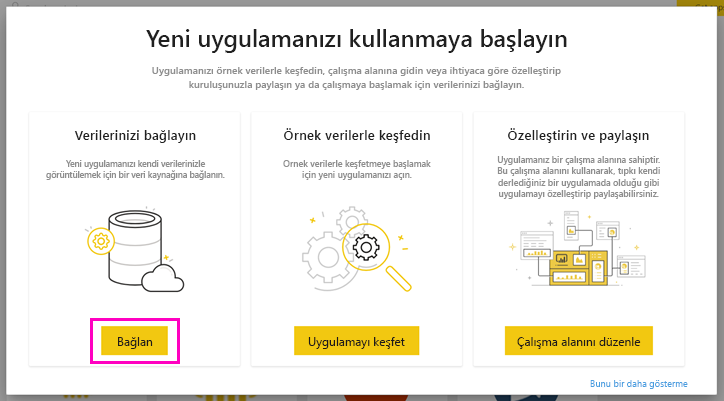
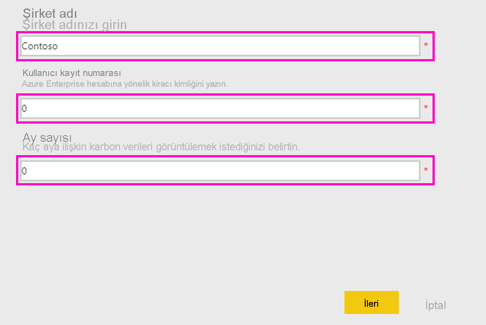
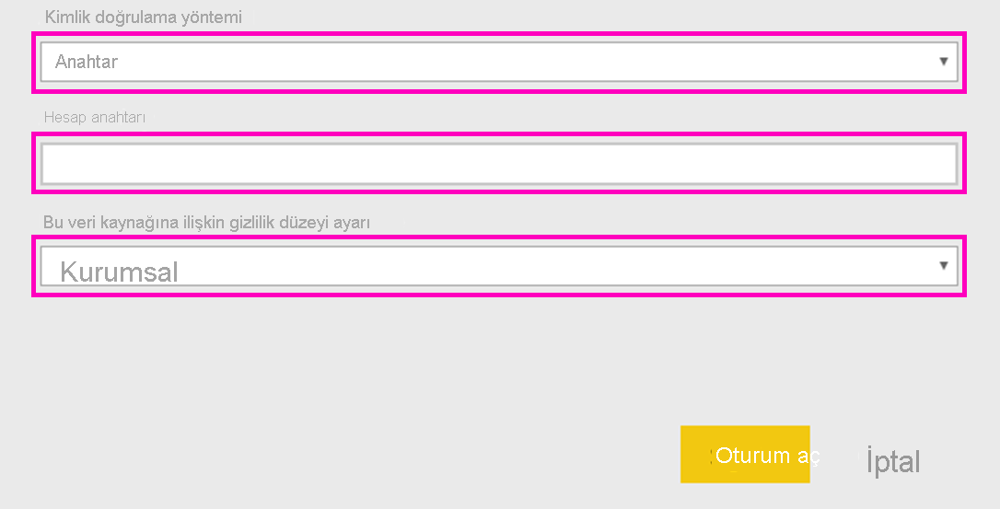
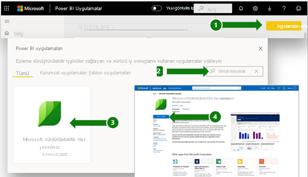
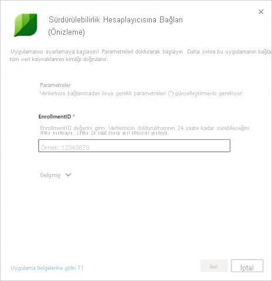
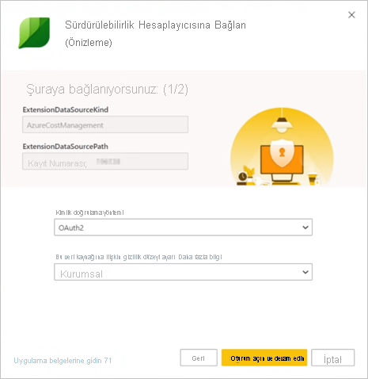
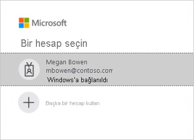

# Microsoft Sustainability Calculator Destek Sayfası

Microsoft Sürdürülebilirlik Hesaplayıcısı, Azure hizmetleriyle ilişkili karbon emisyonlarını verileri için yeni içgörüler sağlar. Kuruluşlarında sürdürülebilirliği sağlamaktan ve bu konuda rapor vermekten sorumlu olan çalışanlar artık her Azure aboneliğinin karbon etkisini belirleyebilir ve bu iş yüklerini Azure'da çalıştırmanın şirket içi veri merkezlerine kıyasla tahmini olarak ne kadar karbon tasarrufu sağlayabileceğini görebilir. Bu veriler, Kapsam 3 emisyonlarının sera gazı raporları için kullanılabilir.

> [!NOTE]
> Bu bağlayıcı sürümü yalnızca [Azure Kurumsal portaldan](https://ea.azure.com) gelen kayıtları destekler. Çin'e ait kayıtlar şu anda desteklenmemektedir.

## Önkoşullar

Microsoft Sustainability Calculator'a erişmek için kuruluşunuzun Azure yöneticisinden aşağıdaki bilgileri almanız gerekir:

- Kiracı Kimliği
- Erişim anahtarı
- Kayıt numarası

Şirketinizin kayıt numarasını bulmak için:

1. [Azure Kurumsal portalda](https://ea.azure.com) yönetici olarak oturum açın.
2. Sol taraftaki gezinti çubuğunda **Active Directory**'yi veya **Yönet**'i seçin. Şirketinizin kayıt numarası görüntülenir.

   

Şirketinizin erişim anahtarını bulmak için:

1. [Azure Kurumsal portalda](https://ea.azure.com) yönetici olarak oturum açın.
2. Birincil kayıt hesabı anahtarını almak için **Raporlar**'ı ve sonra da **API Erişim Anahtarı**'nı seçin.

## Microsoft Sustainability Calculator Sürümü Ocak 2020

### Bağlanma

[!INCLUDE [powerbi-service-apps-get-more-apps](../includes/powerbi-service-apps-get-more-apps.md)]

3. **Microsoft Sustainability Calculator**'ı ve sonra da **Şimdi edinin**'i seçin.

4. **Bu Power BI uygulaması yüklensin mi?** iletişim kutusunda **Yükle**’yi seçin.

5. **Uygulamalar** bölmesinde **Microsoft Sürdürülebilirlik Hesaplayıcısı** kutucuğunu seçin.

6. **Yeni uygulamanızı kullanmaya başlayın** alanında **Bağlan** seçeneğini belirleyin.

   

7. **Şirket adı**, **Kullanıcı kayıt numarası** ve **Ay sayısı** bilgilerini girin. Kayıt numaranızı alma hakkında bilgi için bkz. [Önkoşullar](#prerequisites). **İleri**’yi seçin.

   

8. Aşağıdaki bilgileri girin:

   | Alan | Değer |
   | --- | --- |
   | **Kimlik doğrulama yöntemi** | **Anahtar**'ı seçin. |
   | **Hesap anahtarı** | Erişim anahtarınızı girin. |
   | **Bu veri kaynağına ilişkin gizlilik düzeyi ayarı** | **Kurumsal**'ı seçin. |

   

9. **Oturum aç**'ı seçin.

10. İçeri aktarma işlemi otomatik olarak başlar. İşlem tamamlandığında **Gezinti Bölmesinde** yeni bir pano, rapor ve model görünür. İçeri aktarılan verilerinizi görüntülemek için raporu seçin.

### Uygulamayı kullanma

Parametreleri güncelleştirmek için:

1. **Veri kümesi** ayarlarına gidin ve uygulama çalışma alanıyla ilişkilendirilmiş ayarlara erişin.
2. **Şirket adı**, **Kullanıcı kayıt numarası** veya **Ay sayısı** bilgilerini gerektiği gibi güncelleştirin.
3. Yeni parametreler uygulandıktan sonra verileri yeniden yüklemek için **Yenile**'ye tıklayın.

## Microsoft Sustainability Calculator Sürümü (Önizleme) Aralık 2020

Microsoft Sustainability Calculator'la bugün bulut tabanlı karbon emisyonlarınızı hesaplayın.

Doğru karbon hesaplaması için iş ortaklarından, satıcılardan ve tedarikçilerden iyi bilgiler almak gerekir. Microsoft Sustainability Calculator size, Azure ve Microsoft Dynamics kullanımınız sonucu oluşturulan karbon emisyonlarıyla ilgili saydamlık getirir.

Microsoft’un karbon hesaplaması, 2018'de Stanford Üniversitesi tarafından doğrulanan bir yöntemle üç emisyon kapsamının üçünü de içerir. Microsoft bulut hizmetlerinin müşterilerin çevresel ayak izi üzerindeki etkisini ölçmek için tutarlı ve doğru bir karbon hesaplaması kullanır. Müşterilere bu düzeyde bir saydamlık sağlayan tek bulut hizmeti sağlayıcısı olan Microsoft, ihtiyari veya kanuni raporlama gereksinimleri için raporlar derler.

### Başlamadan önce

Microsoft Sustainability Calculator Power BI Pro üzerinde çalışır. Power BI Pro'nuz yoksa [şimdi ücretsiz deneme sürümünü alın](https://powerbi.microsoft.com/power-bi-pro).

Azure kayıt numaranız gerekir. Kayıt numaranızı bilmiyorsanız kuruluşunuzun Azure yöneticisinden yardım isteyin. Daha fazla bilgi için bkz. [Önkoşullar](#prerequisites).

### Hesaplayıcıyı bağlama: Karbon hesaplamasının beş kolay adımı

1. Uygulamayı [AppSource](https://go.microsoft.com/fwlink/?linkid=2151690)'tan indirin.

   

   Ayrıca uygulamayı Power BI'da da arayabilirsiniz.

   

2. Uygulamayı açın.

3. Kayıt numaranızı girin. **Verilerinizi bağlayın** ve sonra da kayıt numaranızı girin. Kayıt numaranızı alma hakkında daha fazla bilgi için bkz. [Önkoşullar](#prerequisites).

   

4. Hesabınızı bağlama:
   - **Bağlantınız (1 / 2)** alanındaki **Kimlik doğrulama yöntemi**'nin altında **OAuth2** öğesini ve **Bu veri kaynağının gizlilik düzeyi ayarı**'nın altında **Kurumsal** öğesini seçin.

      
 
   - Kullanıcı hesabını seçin.

      
       
   - **Bağlantınız (2 / 2)** alanındaki **Kimlik doğrulama yöntemi**'nin altında **Anonim** öğesini ve **Bu veri kaynağının gizlilik düzeyi ayarı**'nın altında **Kurumsal** öğesini seçin.

     
    
5. Görünümün derlenmesini bekleyin; bu işlem 24 saat kadar sürebilir.

### Ek kaynaklar

- [Nasıl yapılır videosu](https://go.microsoft.com/fwlink/?linkid=2151608)
- [Bulut bilişimin karbon avantajları: Microsoft Bulut'un WSP ile ortaklığı konusunda bir çalışma](https://download.microsoft.com/download/7/3/9/739BC4AD-A855-436E-961D-9C95EB51DAF9/Microsoft_Cloud_Carbon_Study_2018.pdf)

### SSS

#### Uygulama kurulumu

**Verilerimi hesaplayıcıya bağladığım sırada bir hata alıyorum. Ne yapabilirim?**

İlk olarak Azure Maliyet Yönetimi'nde BT Yöneticisi ayrıcalıklarınızın olup olmadığını denetleyin. Yoksa, yöneticinizden bu erişimi isteyin. Ardından doğru kayıt numarasını kullandığınızdan emin olun.

**Kayıt numaramı girdim ama şirket verilerim yüklenmiyor. Sorun nedir?**

Sustainability Calculator Genel Önizlemesi'nin verilerinizi yüklemesi 24 saat kadar sürebilir. 24 saat sonra yeniden gelin ve Power BI'da **Yenile** düğmesini seçin.

**Microsoft emisyonların sorumluluğunu Microsoft'tan bana aktarmaya mı çalışıyor?**

Hayır. Azure hizmetlerinin karbon emisyonları, endüstri standardı [Sera Gazı (GHG) Protokolü](https://ghgprotocol.org/)'ne uygun olarak Microsoft'un kapsam 1 ve 2 emisyonları olarak bildirilir. GHG Protokolü kapsam 3 emisyonlarını başka bir varlığın sizin adınıza yaptığı ve iki kez hesaba katılan emisyonlar olarak tanımlar. Microsoft Sustainability Calculator Azure hizmetlerinin kullanımıyla ilişkilendirilmiş kapsam 3 emisyonlarınıza, özel olarak Kapsam 3 Kategori 1 "Satın alınan mal ve hizmetler" ile ilişkili olanlara yeni bir saydamlık getirir.

**Microsoft bulutunun kullanımından kaynaklanan emisyonlarım neden şirket içi çözümü kullanmama göre bu kadar düşük oluyor?**

Microsoft'un yürüttüğü [2018'de yayımlanan bir çalışmada](https://blogs.microsoft.com/on-the-issues/2018/05/17/microsoft-cloud-delivers-when-it-comes-to-energy-efficiency-and-carbon-emission-reductions-study-finds/) Microsoft bulutu ile şirket içi veya geleneksel veri merkezleri arasındaki fark değerlendiriliyordu. Sonuçlar karşılaştırma yapılan şirket içi alternatifinin fazla düşük, orta veya yüksek verimlilikte olmasına bağlı olarak, Azure İşlem ve Depolama'nın geleneksel kurumsal veri merkezlerine göre yüzde 52 ile 79 arasında daha yüksek bir enerji verimliliğine sahip olduğunu gösterdi. Yenilenebilir enerji satın almalarımız hesaba katıldığında Azure yüzde 79 ile 98 arasında daha fazla karbon verimliliğine sahiptir. Bu tasarruflar Microsoft Bulut'un dört önemli özelliğinden kaynaklanır: BT operasyon verimliliği, BT donanım verimliliği, veri merkezi altyapısı verimliliği ve yenilenebilir elektrik.

**Microsoft'un operasyonlar karbon içermiyorsa ve yenilenebilir enerjilerle çalıştırılıyorsa Azure hizmetlerinden ölçülen müşteri emisyonları neden sıfır değil?**

Microsoft'tan müşteri emisyonlarının sıfır olmamasının başlıca iki nedeni vardır. Birincisi GHG hesaplama uygulamalarıyla, ikincisi ise bu analizin sınırlarıyla ilgilidir. Karbon içermeyen operasyonlara ulaşmak için Microsoft yedek jeneratörler, soğutucular ve araç filolarındaki yakıt yakımı gibi bazı emisyon kaynaklarını azaltmak amacıyla karbon dengelemeleri kullanır. Bunlar Microsoft'un *net* emisyonlarını sıfıra düşürür. Hesaplayıcı bu dengelemeler uygulanmadan önceki *brüt* GHG emisyonlarını bildirir. Öte yandan uygulanan dengelemelerin hacmi ve net emisyonlar **GHG Raporlama** sekmesinde bildirilerek daha da fazla saydamlık sağlanır. İkinci neden emisyon ayak izinin, Microsoft'un veri merkezlerindeki operasyonla ilişkilendirilmiş enerji ve emisyonlara ek olarak Microsoft'un operasyon sınırları dışındaki İnternet Servis Sağlayıcılar tarafından verileri Microsoft veri merkezleriyle Azure müşterileri arasında iletirken kullanılan enerjiyi de içermesidir.

**Bu verileri nasıl kullanmalıyım ve nerede bildirmeliyim?**

Emisyonlarınız, şirketinizin kapsam 3 dolaylı karbon emisyonlarının bir parçası olarak bildirilebilir. Kapsam 3 emisyonları genellikle sürdürülebilirlik raporlarında, CDP iklim değişikliği ve diğer raporlama kanallarında açıklanır. Emisyon toplamlarına ek olarak emisyon tasarrufları da, şirketinizin Microsoft Azure hizmetlerini kullanma kararının küresel emisyonu azaltmaya nasıl katkıda bulunduğunu gösteren net bir örnek sağlar. Bağlamı netleştirmek için, uygulama Ocak 2020 itibarıyla EPA'nın denklik hesaplayıcısı faktörleri temelinde, önlenen eşdeğer araç yakıt tüketimine karşılık gelen GHG emisyonlarındaki düşüşü gösterir.

**Emisyonları daha da azaltmak için ne yapabilirim?**

Azure'da kaynak ve maliyet verimliliğini korumak Azure kullanımınızın çevre üzerindeki etkisini azaltacaktır. Örneğin kullanılmayan sanal makineler hem bulutta hem de şirket içinde savurganlıktır. İşlem kullanım faktörlerini (CUF) geliştirecek şekilde sanal makineleri doğru boyutlandırmak, aynı fiziksel sunucularda olduğu gibi yararlı sonuç başına enerji kullanımını azaltır. [Azure Maliyet Yönetimi](https://docs.microsoft.com/azure/cost-management-billing/costs/cost-mgt-best-practices), bulut yatırımınızı en üst düzeye çıkarmak için harcamaları planlamanızı, analiz etmenizi ve azaltmanızı sağlayacak araçları sunar.

#### Yöntem

**Aracın ardında hangi yöntem vardır?**

Microsoft Sustainability Calculator tüketilen belirli bulut hizmetlerini ve bunlarla ilişkili enerji gereksinimlerini, bu hizmetleri sağlayan veri merkezlerinin verimliliğini, söz konusu veri merkezlerinin faaliyet gösterdiği bölgelerdeki elektrik yakıt bileşimlerini ve Microsoft'un yenilenebilir enerji alımlarını yansıtır. Uygulamanın geliştirilmesi kapsamında kullanılan yöntem ve bu yöntemin uygulanması, Dünya Kaynakları Enstitüsü (WRI)/Sürdürülebilir Gelişme için Dünya İş Konseyi (WBCSD) Sera Gazı (GHG) Protokolü Kurumsal Hesaplama ve Raporlama Standardı'na uygun olduğundan emin olmak için üçüncü tarafların doğrulamasından geçirilmiştir. ISO 14064-3: Sera gazları--Bölüm 3'e uygun olarak yürütülen doğrulama kapsamı: Azure hizmetlerinden kaynaklanan emisyon tahmini dahil edilerek ancak bu tahminin karşıolgusal yapısından dolayı şirket içi emisyon tahmini hariç tutularak, sera gazı bildirimlerinin doğrulanması için sağlanan yönergelerle yapılan belirtim. Karbon hesaplamasının daha ayrıntılı bir açıklaması, aracın **Hesaplama Yöntemi** sekmesinde belgelenmiştir.

**Azure karbon ayak izini hesaplamak için hangi veriler gerekiyor? Şirketimin verilerine erişiyor musunuz?**

Tahmini karbon hesaplamaları, Azure Tüketim Geliri kullanılarak erişilen Azure hizmetleri tüketimi temelinde gerçekleştirilir. Hesaplayıcı depolanan müşteri verilerinizden hiçbirine erişmez. Azure hizmetleri tüketiminizle ilişkili tahmini emisyonları, söz konusu hizmetleri sağlayan veri merkezlerine dayanarak hesaplamak için tüketim verileri Microsoft'un enerji ve karbon izleme verileriyle birleştirilir.

**Bu hesaplama tüm Azure hizmetlerini ve tüm Azure bölgelerini içeriyor mu?**

Tahminler, kurulum sırasında sağlanan kiracı kimliğiyle ilişkili tüm Azure bölgelerindeki tüm Azure hizmetlerini içerir.

#### Şirket içi emisyonlarının özelliklerini belirleme

**Microsoft Sustainability Calculator şirket içi emisyonlarım ve operasyonlarımla ilgili verileri nereden alır?**

Microsoft Sustainability Calculator, sizin sağladıklarınız *dışında* özellikle şirket içi veri merkezlerinizle ilgili hiçbir bilgi almaz. İzleyen SSS sorularında açıklandığı gibi, Microsoft Sustainability Calculator şirket içi emisyonlarıyla ilgili bir tahmin geliştirmek için şirket içi alternatiflerinin verimliliği ve enerji bileşimi hakkındaki sektör araştırmalarını ve kullanıcı girişlerini kullanır.

**Şirket içi tahminleriyle ilgili varsayımlar nelerdir? Verimlilik tasarrufları yalnızca Güç Kullanımı Verimliliği (PUE) alanındaki geliştirmelerden mi elde ediliyor?**

Microsoft bulut hizmetleriyle ilişkilendirilen verimlilikler geliştirilmiş PUE'den çok daha fazlasını içerir. Microsoft veri merkezlerinde PUE'yi iyileştirme çalışmaları yapılıyor olsa da, asıl verimlilik geliştirmeleri veri merkezi altyapısı verimliliğinin (PUE geliştirmeleri) yanı sıra BT operasyonel verimliliğinden (dinamik sağlama, çok kiracılı yapı, sunucu kullanımı) ve BT donanım verimliliğinden (donanımı hizmetlere uyarlayarak enerjinin daha büyük bölümünün kullanışlı sonuçlara yönlendirilmesi) kaynaklanır. [2018 çalışmamızda](https://blogs.microsoft.com/on-the-issues/2018/05/17/microsoft-cloud-delivers-when-it-comes-to-energy-efficiency-and-carbon-emission-reductions-study-finds/) bu tasarruflar, düşük verimlilikten yüksek verimliliğe kadar değişen şirket içi veri merkezi alternatifleriyle karşılaştırmalı olarak hesaplanmıştır. Bu bulgular her müşterinin Microsoft bulutunda kullandığı hizmetlerin aynılarını sağlamak için ilgili şirket içi veri merkezine gereken enerji kullanımını tahmin etmek amacıyla kullanılır.

**Şirket içi altyapısında varsayılan enerji bileşimi nedir?**

Varsayılan olarak Microsoft Sustainability Calculator şebeke üzerindeki yenilenebilir ve yenilenemez enerji kaynaklarının bir bileşimi temelinde şirket içi emisyonlarını tahmin eder. Şirket içi veri merkezinin Microsoft'un veri merkezleriyle aynı şebeke üzerinde bulunduğu varsayılır. Öte yandan şebekede sağlanana *ek olarak* yenilenebilir elektrik satın alan (örneğin Güç Satın Alma Anlaşmaları aracılığıyla) müşteriler için, kullanıcılar yenilenebilir elektrik oranını seçebilir ve Microsoft Sustainability Calculator şirket içi emisyonlarını buna göre ayarlar.

**Şirket içi altyapısının verimliliği için Düşük, Orta veya Yüksek verimlilik düzeyini ne zaman seçmeliyim?**

Kullanıcıların buradaki donanım ve veri merkezi özellikleri temelinde karşılaştırma yapmak istedikleri şirket içi dağıtımını en iyi temsil eden verimlilik düzeyini seçmeleri gerekir:

- **Düşük**: Yerelleştirilmiş küçük bir veri merkezindeki (46-186 metre kare) fiziksel sunucular ve doğrudan bağlı depolama
- **Orta**: Orta katman bir dahili veri merkezindeki (187-1857 metre kare) fiziksel/sanal sunucularla bağlı/ayrılmış depolamanın bir bileşimi
- **Yüksek**: Yüksek donanımlı bir dahili veri merkezindeki (>1858 metre kare) sanallaştırılmış sunucular ve ayrılmış depolama
