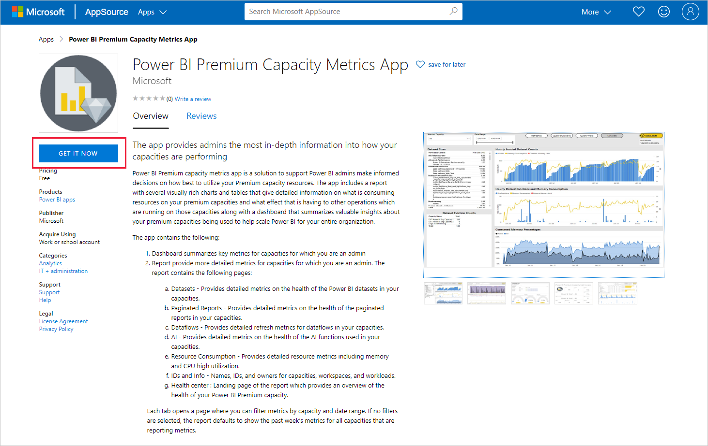
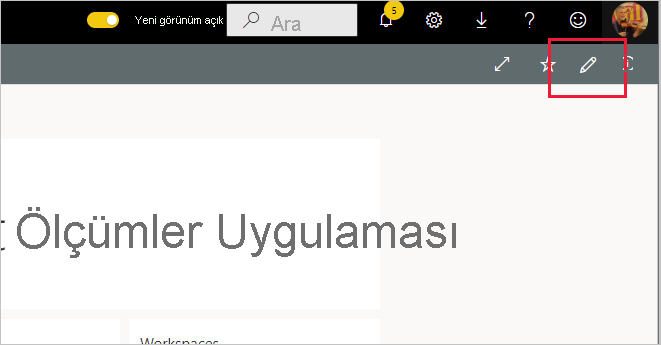

# Power BI Premium Kapasite Ölçümlerine Bağlanma

Premium kapasite kaynaklarını en iyi şekilde kullanma konusunda bilinçli kararlar alabilmek için kapasitelerinizi izlemek temel önem taşır. Power BI Premium Kapasite Ölçümleri uygulaması kapasitenizin performansıyla ilgili en ayrıntılı bilgileri sağlar.

Bu makalede uygulamayı yükleme ve veri kaynaklarına bağlanma işlemleri açıklanır. Raporun içeriği ve nasıl kullanılacağı hakkında bilgi için bkz. [Uygulama ile Premium kapasiteleri izleme](../admin/service-admin-premium-monitor-capacity.md) ve [Premium Kapasite Ölçümleri uygulaması blog gönderisi](https://powerbi.microsoft.com/blog/premium-capacity-metrics-app-new-health-center-with-kpis-to-explore-relevant-metrics-and-steps-to-mitigate-issues/).

Uygulamayı yükleyip veri kaynaklarına bağlandıktan sonra, raporu ihtiyaçlarınıza göre özelleştirebilirsiniz. Daha sonra bunu, kuruluşunuzdaki iş arkadaşlarınıza dağıtabilirsiniz.

> [!NOTE]
> Şablon uygulamalarını yüklemek için [izinler](./service-template-apps-install-distribute.md#prerequisites) gerekir. İzinlerinizin yeterli olmadığını fark ederseniz Power BI yöneticinizle iletişime geçin.

## Uygulamayı yükleme

1. Uygulamaya ulaşmak için aşağıdaki bağlantıya tıklayın: [Power BI Premium Kapasite Ölçümleri şablon uygulaması](https://app.powerbi.com/groups/me/getapps/services/pbi_pcmm.capacity-metrics-dxt)

1. Uygulamanın AppSource sayfasında [**ŞİMDİ EDİNİN**](https://app.powerbi.com/groups/me/getapps/services/pbi_pcmm.capacity-metrics-dxt)’i seçin.

    

1. **Yükle**'yi seçin. 

    

    > [!NOTE]
    > Uygulamayı daha önce yüklediyseniz, [o uygulamanın üzerine yazmak](./service-template-apps-install-distribute.md#update-a-template-app) mı yoksa yeni bir çalışma alanına yüklemek mi istediğiniz sorulur.

    Uygulamayı yükledikten sonra Uygulamalarınız sayfasında görebilirsiniz.

   

## Veri kaynaklarına bağlanma

1. Uygulamanızı açmak için Uygulamalar sayfanızdaki simgeyi seçin.

1. Karşılama ekranında **Keşfet**’i seçin.

   

   Uygulama, örnek verileri göstererek açılır.

1. Sayfanın üst kısmındaki başlıkta yer alan **Verilerinize bağlanın** seçeneğini belirleyin.

   

1. Görüntülenen iletişim kutusunda UTC farkını ayarlayın. UTC farkı, Eşgüdümlü Evrensel Saat ile sizin konumunuzun saati arasındaki saat farkıdır. Ardından **İleri**'ye tıklayın.
  
   
   **Not: Yarım saat biçimi ondalık olmalıdır (örneğin 5,5; 2,5 vb.).**

1. Görüntülenen sonraki iletişim kutusunda hiçbir şey yapmanız gerekmez. **Oturum aç**’ı seçmeniz yeterlidir.

   

1. Microsoft oturum açma ekranında, Power BI’da oturum açın.

   

   Oturum açtıktan sonra rapor veri kaynaklarına bağlanıp güncel verilerle doldurulur. Bu sırada, etkinlik izleyicisi açılır.

   

   Oturum açma işlemi sırasında bu ayarı devre dışı bırakmadığınız sürece, rapor verileriniz günde bir kere otomatik olarak yenilenir. Dilerseniz, rapor verilerinizi güncel tutmak için [kendi yenileme zamanlamanızı da ayarlayabilirsiniz](./refresh-scheduled-refresh.md).

## Özelleştirin ve paylaşın

Uygulamayı özelleştirmeye başlamak için sağ üst köşedeki kalem simgesine tıklayın.

 

Ayrıntılar için bkz. [Uygulamayı özelleştirme ve paylaşma](./service-template-apps-install-distribute.md#customize-and-share-the-app).

## Sonraki adımlar
* [Uygulama ile Premium kapasiteleri izleme](../admin/service-admin-premium-monitor-capacity.md)
* [Premium Kapasite Ölçümleri uygulaması blog gönderisi](https://powerbi.microsoft.com/blog/premium-capacity-metrics-app-new-health-center-with-kpis-to-explore-relevant-metrics-and-steps-to-mitigate-issues/)
* [Power BI şablon uygulamaları nedir?](./service-template-apps-overview.md)
* [Kuruluşunuzda şablon uygulamalarını yükleme ve dağıtma](./service-template-apps-install-distribute.md)
* Sorularınız mı var? [Power BI Topluluğu'na sorun](https://community.powerbi.com/)