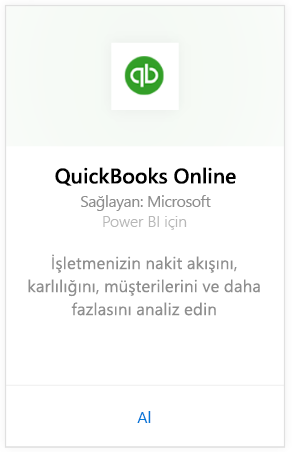
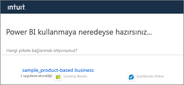
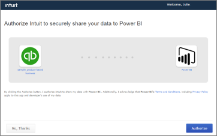
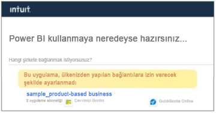

# Power BI ile QuickBooks Online'a bağlanma
Power BI'dan QuickBooks Online verilerine bağlandığınızda işletmenizin nakit akışına, kârlılığına, müşterilerine ve daha fazlasına yönelik öngörüler içeren bir Power BI panosu ve Power BI raporları alırsınız. Panoyu ve raporları olduğu gibi kullanabilir ya da en çok değer verdiğiniz bilgiler vurgulanacak şekilde özelleştirebilirsiniz. Veriler günde bir kez otomatik olarak yenilenir.

Power BI için [QuickBooks Online şablon uygulamasına](https://dxt.powerbi.com/getdata/services/quickbooks-online) bağlanın.

>[!NOTE]
>QuickBooks Online verilerinizi Power BI'a aktarmak için QuickBooks Online hesabınızda bir yönetici olmanız ve yönetici hesabı kimlik bilgilerinizle oturum açmanız gerekir. Bu bağlayıcıyı QuickBooks Desktop yazılımı ile birlikte kullanamazsınız. 

## Bağlanma

[!INCLUDE [powerbi-service-apps-get-more-apps](../includes/powerbi-service-apps-get-more-apps.md)]

3. **QuickBooks Online**'ı ve ardından **Al**'ı seçin.
   
   

4. **Bu Power BI uygulaması yüklensin mi?** iletişim kutusunda **Yükle**’yi seçin.

    

4. **Uygulamalar** bölmesinde **QuickBooks** kutucuğunu seçin.

   

6. **Yeni uygulamanızı kullanmaya başlayın** alanında **Bağlan** seçeneğini belirleyin.

    

4. Kimlik doğrulama yöntemi için **OAuth2** seçeneğini belirleyin ve **Oturum aç**'ı seçin. 
5. İstendiğinde QuickBooks Online kimlik bilgilerinizi girin ve QuickBooks Online kimlik doğrulaması işlemindeki diğer adımları uygulayın. Tarayıcınızda önceden QuickBooks Online oturumu açtıysanız kimlik bilgileriniz istenmeyebilir.
   >[!NOTE]
   >QuickBooks Online hesabınızın yönetici kimlik bilgileri gereklidir.
6. Sonraki ekranda, Power BI'a bağlamak istediğiniz şirketi seçin.
   
   

7. İçeri aktarma işlemini başlatmak için sonraki ekranda bulunan **Authorize** (Yetkilendir) seçeneğini belirleyin. Bu işlem, şirket verilerinizin boyutuna bağlı olarak birkaç dakika sürebilir. 
   
   
   
8. Veriler Power BI tarafından içeri aktarıldıktan sonra QuickBooks uygulamanızın içerik listesini görürsünüz: yeni bir pano, rapor ve veri kümesi.
9. Araştırma sürecini başlatmak için QuickBooks panosunu seçin. Bu, içeri aktarılan verilerinizi görüntülemek için Power BI tarafından otomatik olarak oluşturulan panodur.

    

**Sırada ne var?**

* Panonun üst tarafındaki [Soru-Cevap kutusunda soru sormayı](../consumer/end-user-q-and-a.md) deneyin
* Panodaki [kutucukları değiştirin](../create-reports/service-dashboard-edit-tile.md).
* Bağlantılı raporu açmak için [bir kutucuk seçin](../consumer/end-user-tiles.md).
* Veri kümeniz günlük olarak yenilenecek şekilde zamanlanır ancak yenileme zamanlamasında değişiklik yapabilir veya **Şimdi Yenile** seçeneğini kullanarak istediğinizde veri kümenizi kendiniz de yenileyebilirsiniz.

## Sorun giderme
**"Oops! An error has occurred"** ("Hata! Bir hata oluştu")

**Authorize** (Yetkilendir) seçeneğini belirledikten sonra bu iletiyi alırsanız:

"Oops! An error has occurred." Close this window and try again.

The application has already been subscribed to by another user for this company. Contact [admin email] to make changes to this subscription." (Hata! Bir sorun oluştu. Bu kapatın ve tekrar deneyin. Bu şirket için başka bir kullanıcı uygulamaya zaten abone oldu. Bu abonelik ile ilgili değişiklik yapmak için [yönetici e-postası] ile irtibat kurun.)

... bu hata, şirketinizdeki başka bir yöneticinin Power BI ile şirket verilerinize zaten bağlandığı anlamına gelir. İlgili yöneticiden panoyu sizinle paylaşmasını isteyin. Şu anda yalnızca bir yönetici kullanıcı, belirli bir QuickBooks Online şirket veri kümesini Power BI'a bağlayabilir. Power BI panoyu oluşturduktan sonra yönetici, bu panoyu aynı Power BI kiracılarındaki birden çok iş arkadaşıyla paylaşabilir.

**"This app is not set up to allow connections from your country"** ("Bu uygulama, ülkenizden yapılan bağlantılara izin verecek şekilde ayarlanmadı")

Power BI şu anda yalnızca QuickBooks Online'ın ABD sürümlerini desteklemektedir. 

## Sonraki adımlar
[Power BI nedir?](../fundamentals/power-bi-overview.md)

[Power BI hizmetinde tasarımcılara yönelik temel kavramlar](../fundamentals/service-basic-concepts.md)
