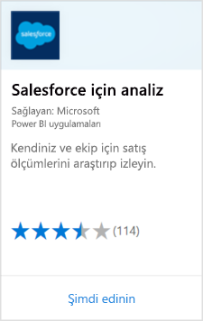
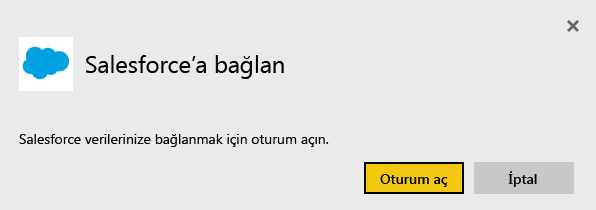
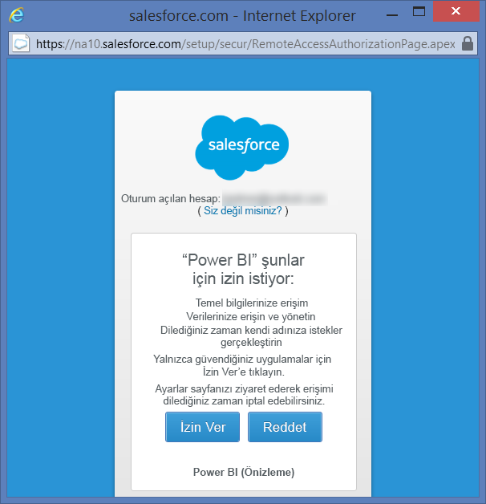
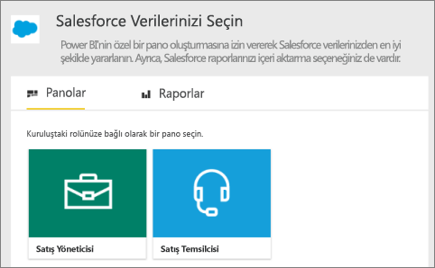
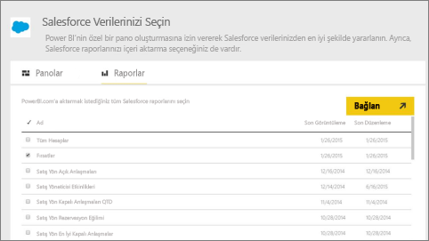
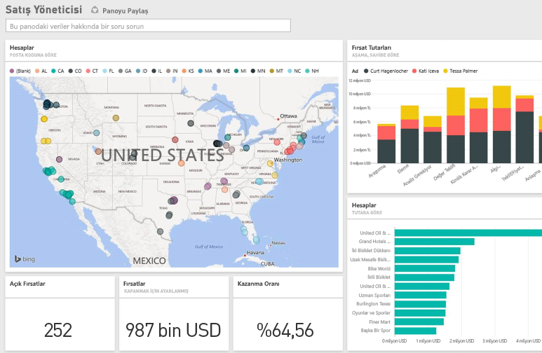

# Power BI ile Salesforce'a bağlanma
Power BI ile Salesforce.com hesabınıza kolayca bağlanabilirsiniz. Bu bağlantıyla Salesforce verilerinizi alabilirsiniz ve panoyla raporlar otomatik olarak sağlanır.

Power BI ile [Salesforce tümleştirmesi](https://powerbi.microsoft.com/integrations/salesforce) hakkında daha fazla bilgi edinin.

## Bağlanma
1. Power BI gezinti bölmesinin alt kısmında bulunan **Veri Al**'ı seçin.
   
    
2. **Hizmetler** kutusundaki **Al** seçeneğini belirleyin.
   
    
3. **Analytics for Salesforce**'u ve **Al**'ı seçin.  
   
   
4. **Oturum Aç**'ı seçerek oturum açma akışını başlatın.
   
    
5. İstendiğinde Salesforce kimlik bilgilerinizi girin. **İzin Ver**'i seçin ve Power BI'ın temel Salesforce bilgilerinizle verilerinize erişmesini sağlayın.
   
   
6. Açılan menüdeki seçenekleri kullanarak Power BI'a aktarmak istediğiniz verileri yapılandırın:
   
   * **Pano**
     
     Belirli bir kişiyi (**Satış Yöneticisi** gibi) temel alan önceden tanımlı panolardan birini seçin. Bu panolar belirli bir Salesforce standart veri kümesini alır; özel alanlar dahil edilmez.
     
     
   * **Raporlar**
     
     Salesforce hesabınızdan bir veya daha fazla özel rapor seçin. Bu raporlar Salesforce hizmetindeki görünümlerinizle eşleşir ve özel alan veya nesne verilerini içerebilir.
     
     
     
     Herhangi bir rapor görmüyorsanız Salesforce hesabınızda ekleyebilir veya oluşturabilir ve tekrar bağlanmayı deneyebilirsiniz.

7. İçeri aktarma işlemini başlatmak için **Bağlan**'ı seçin. İçeri aktarma sırasında içeri aktarma işleminin devam ettiğini gösteren bir bildirim görürsünüz. İçeri aktarma işlemi tamamlandığında gezinti bölmesinde Salesforce verilerinizden oluşturulan bir pano, rapor ve veri kümesi görürsünüz.
   
   

Panoyu, verilerinizi istediğiniz gibi görüntüleyecek şekilde değiştirebilirsiniz. Soru-Cevap ile sorular sorabilir veya [bir kutucuk seçip](../consumer/end-user-tiles.md) bağlantılı raporu açabilir ve [panodaki kutucukları düzenleyebilir veya kaldırabilirsiniz](../create-reports/service-dashboard-edit-tile.md).

**Sırada ne var?**

* Panonun üst tarafındaki [Soru-Cevap kutusunda soru sormayı](../consumer/end-user-q-and-a.md) deneyin
* Panodaki [kutucuğu düzenleme veya kaldırma](../create-reports/service-dashboard-edit-tile.md)
* Bağlantılı raporu açmak için [bir kutucuk seçin](../create-reports/service-dashboard-tiles.md)
* Veri kümeniz günlük olarak yenilenecek şekilde zamanlanır ancak yenileme zamanlamasında değişiklik yapabilir veya **Şimdi Yenile** seçeneğini kullanarak istediğinizde veri kümenizi kendiniz de yenileyebilirsiniz

## Sistem gereksinimleri ve önemli noktalar

- API erişimi etkinleştirilmiş ve etkin olarak kullanılan bir Salesforce hesabına bağlantı

- Oturum açma işlemi sırasında Power BI uygulamasına erişim izni

- Hesapta veri çekme ve yenileme için kullanılabilecek yeterli miktarda API çağrısı olması

- Yenileme için geçerli bir kimlik doğrulama belirteci. Salesforce hizmetinde uygulama başına beş kimlik doğrulama belirteci sınırı olduğu için beş veya daha az sayıda Salesforce veri kümesinin içeri aktarıldığından emin olun.

- Salesforce Raporları API’si, en fazla 2.000 veri satırını destekleyen bir kısıtlamaya sahiptir.

## Sorun giderme

Herhangi bir hatayla karşılaşırsanız lütfen yukarıdaki gereksinimleri inceleyin. 

Özel veya korumalı alan etki alanında oturum açma işlemi şu anda desteklenmemektedir.

### "Uzak sunucuya bağlanılamıyor" iletisi

Salesforce hesabınıza bağlanmaya çalışırken "Uzak sunucuya bağlanılamıyor" iletisi alırsanız, aşağıdaki forumunda bu çözüme bakın: [Salesforce Bağlayıcısı Oturum Açma Hata İletisi: Uzak sunucuya bağlanılamıyor](https://www.outsystems.com/forums/Forum_TopicView.aspx?TopicId=17674&TopicName=log-in-error-message-unable-to-connect-to-the-remote-server&)

## Sonraki adımlar
[Power BI nedir?](../fundamentals/power-bi-overview.md)

[Power BI hizmeti için veri kaynakları](service-get-data.md)
