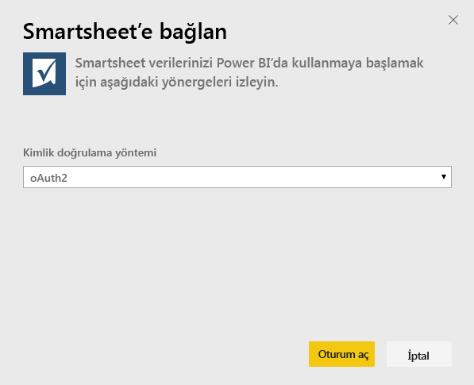
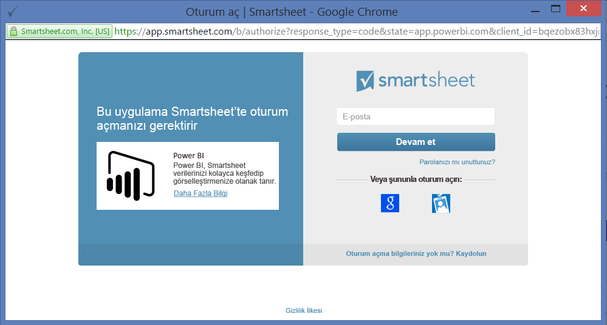
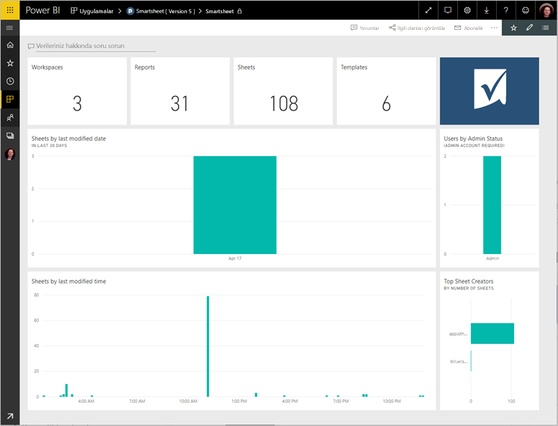
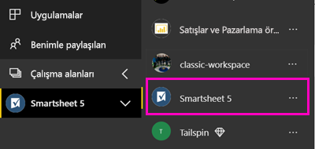
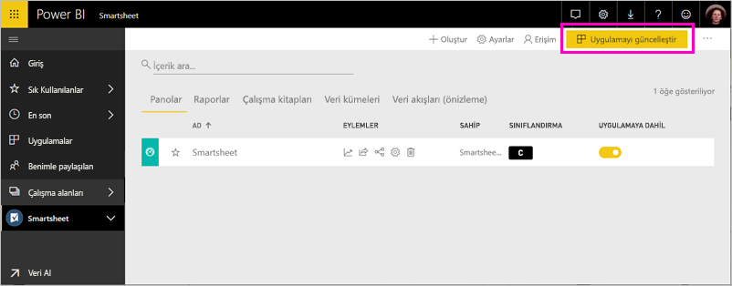

# Power BI ile Smartsheet'e bağlanma
Bu makalede, verileri Smartsheet hesabınızdan Power BI şablon uygulamasıyla çekme işlemi adım adım açıklanmaktadır. Smartsheet, işbirliği ve dosya paylaşımı için basit bir platform sunar. Power BI için Smartsheet şablon uygulaması, Smartsheet hesabınıza genel bakış bilgilerini gösteren bir pano, raporlar ve veri kümesi sağlar. Ayrıca, [Power BI Desktop](desktop-connect-to-data.md)'ı kullanarak hesabınızdaki her bir sayfaya doğrudan bağlanabilirsiniz. 

Şablon uygulamasını yükledikten sonra panoyu ve raporu değiştirebilirsiniz. Daha sonra bunu, kuruluşunuzdaki iş arkadaşlarınıza bir uygulama olarak dağıtabilirsiniz.

Power BI için [Smartsheet şablon uygulamasına](https://app.powerbi.com/groups/me/getapps/services/pbi-contentpacks.pbiapps-smartsheet) bağlanın.

>[!NOTE]
>Ek erişim ayrıcalığı olduğundan, Power BI şablon uygulamasına bağlanılması ve içerik paketinin yüklenmesi için Smartsheet yönetici hesabı tercih edilir.

## Bağlanma

[!INCLUDE [powerbi-service-apps-get-more-apps](../includes/powerbi-service-apps-get-more-apps.md)]

3. **Smartsheet** \> **Şimdi edinin**'i seçin.
4. **Bu Power BI uygulaması yüklensin mi?** iletişim kutusunda **Yükle**’yi seçin.
4. **Uygulamalar** bölmesinde **Smartsheet** kutucuğunu seçin.

    

6. **Yeni uygulamanızı kullanmaya başlayın** alanında **Bağlan** seçeneğini belirleyin.

    

4. Kimlik Doğrulama Yöntemi için **OAuth2\> Oturum aç** seçeneğini belirleyin.
   
   İstendiğinde Smartsheet kimlik bilgilerinizi girin ve kimlik doğrulaması işlemindeki diğer adımları uygulayın.
   
   
   
   

5. Power BI verileri içeri aktardıktan sonra Smartsheet panosu açılır.
   
   

## Uygulamanızı değiştirme ve dağıtma

Smartsheet şablon uygulamasını yüklediniz. Yani Smartsheet uygulama çalışma alanını da oluşturmuş oldunuz. Çalışma alanında, raporu ve panoyu değiştirebilir ve sonra kuruluşunuzdaki iş arkadaşlarınıza bir *uygulama* olarak dağıtabilirsiniz. 

1. Yeni Smartsheet çalışma alanınızın tüm içeriğini görüntülemek için gezinti bölmesinde **Çalışma Alanları** > **Smartsheet**'i seçin. 

    

    Bu görünüm çalışma alanı için içerik listesidir. Sağ üst köşede, **Uygulamayı güncelleştir** seçeneğini görürsünüz. Uygulamanızı iş arkadaşlarınıza dağıtmaya hazır olduğunuzda, buradan başlayacaksınız. 

    

2. Çalışma alanındaki diğer öğeleri görmek için **Raporlar**’ı ve **Veri kümeleri**’ni seçin.

    İş arkadaşlarınıza [uygulama dağıtma](../collaborate-share/service-create-distribute-apps.md) hakkında bilgi edinin.

## Neleri kapsar?
Power BI için Smartsheet şablon uygulaması; Smartsheet hesabınıza yönelik olarak, sahip olduğunuz çalışma alanı, rapor ve sayfa sayısı ve bunların ne zaman değiştirildiği gibi bilgileri içeren bir genel bakış sunar. Yönetici kullanıcılar, en çok sayfa oluşturanlar gibi, sistemlerindeki kullanıcılar ile ilgili bazı bilgileri de görür.  

Hesabınızdaki her bir sayfaya doğrudan bağlanmak için [Power BI Desktop](desktop-connect-to-data.md)'taki Smartsheet bağlayıcısını kullanabilirsiniz.  

## Sonraki adımlar

* [Power BI'da yeni çalışma alanları oluşturma](../collaborate-share/service-create-the-new-workspaces.md)
* [Power BI'da uygulamaları yükleme ve kullanma](../consumer/end-user-apps.md)
* [Dış hizmetler için Power BI uygulamalarına bağlanma](service-connect-to-services.md)
* Sorularınız mı var? [Power BI Topluluğu'na sorun](https://community.powerbi.com/)