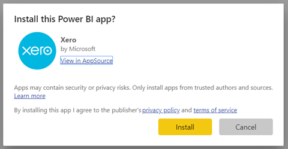
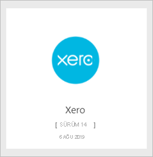
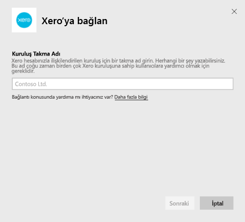
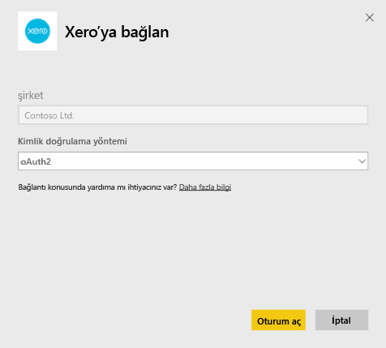
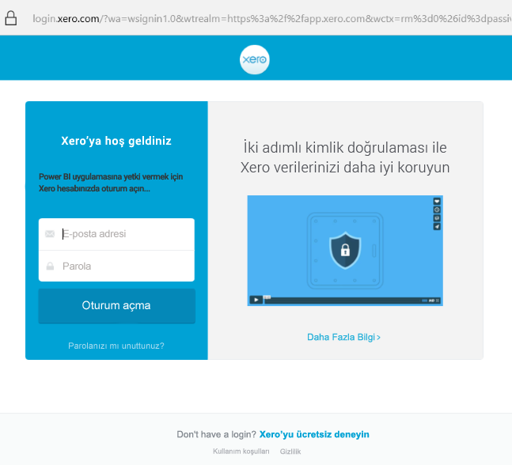

# Power BI ile Xero'ya bağlanma
Xero, özellikle küçük ölçekli işletmeler için tasarlanmış kullanımı kolay bir çevrimiçi muhasebe yazılımıdır. Bu Power BI şablon uygulamasıyla, Xero finansal bilgilerinizi temel alan ilgi çekici görselleştirmeler oluşturun. Varsayılan panonuz nakit pozisyonu, geliri ve giderleri, kâr zarar eğilimi, borçlu günleri ve yatırım getirisi gibi çok sayıda küçük işletme ölçümleri içerir.

Power BI için [Xero şablon uygulamasına](https://app.powerbi.com/getdata/services/xero) bağlanın veya [Xero ve Power BI](https://help.xero.com/Power-BI) tümleştirmesi hakkında daha fazla bilgi edinin.

## Bağlanma

[!INCLUDE [powerbi-service-apps-get-more-apps](../includes/powerbi-service-apps-get-more-apps.md)]

3. **Xero** \> **Şimdi edinin**'i seçin.
4. **Bu Power BI uygulaması yüklensin mi?** iletişim kutusunda **Yükle**’yi seçin.

    

4. **Uygulamalar** bölmesinde **Xero** kutucuğunu seçin.

   

6. **Yeni uygulamanızı kullanmaya başlayın** alanında **Bağlan** seçeneğini belirleyin.

    

4. Xero hesabınızla ilişkilendirilen kuruluş için bir takma ad girin. Herhangi bir şey yazabilirsiniz; bu, birden çok Xero kuruluşuna sahip kullanıcılara yardımcı olmak için yapılmaktadır. Ayrıntılar için bu makalenin devamındaki [parametreleri bulma](#FindingParams) bölümünü inceleyin.

    

5. **Kimlik Doğrulama Yöntemi** alanında **OAuth**'u seçin. İstendiğinde Xero hesabınızda oturum açıp bağlanacağınız kuruluşu seçin. Oturum açma işlemi tamamlandığında, yükleme işlemini başlatmak için **Oturum Aç**'ı seçin.
   
    
   
    
6. Onay vermenizin ardından, içeri aktarma işlemi otomatik olarak başlar. İşlem tamamlandığında gezinti bölmesinde yeni bir pano, rapor ve model görünür. İçeri aktarılan verilerinizi görüntülemek için panoyu seçin.
   
     

**Sırada ne var?**

* Panonun üst tarafındaki [Soru-Cevap kutusunda soru sormayı](../consumer/end-user-q-and-a.md) deneyin
* Panodaki [kutucukları değiştirin](../create-reports/service-dashboard-edit-tile.md).
* Bağlantılı raporu açmak için [bir kutucuk seçin](../consumer/end-user-tiles.md).
* Veri kümeniz günlük olarak yenilenecek şekilde zamanlanır ancak yenileme zamanlamasında değişiklik yapabilir veya **Şimdi Yenile** seçeneğini kullanarak istediğinizde veri kümenizi kendiniz de yenileyebilirsiniz.

## Neleri kapsar?
Şablon uygulaması panosu çeşitli alanlarda kutucuklar ve ölçümler ile bunlar hakkında daha fazla bilgi edinmek için raporlar içerir:  

| Alan | Pano Kutucukları | Rapor |
| --- | --- | --- |
| Nakit |Günlük nakit akışı  Nakit girişi  Nakit çıkışı  Hesaba göre kapanış bakiyesi  Bugün kapanış bakiyesi |Banka hesabı |
| Müşteri |Faturalanan Satışlar  Müşteri tarafından Faturalanan Satışlar  Faturalanan Satış artışı eğilimi  Son faturalar  Bekleyen Alacaklar  Vadesi dolmuş Alacaklar |Müşteri  Sayım |
| Sağlayıcı |Faturalandırılan satın alma işlemleri  Sağlayıcı tarafından faturalanan satın alma  Faturalandırılan satın alma işlemleri büyüme eğilimi   Son faturalar  Ödenmemiş Borçlar  Vadesi geçmiş Borçlar |Üreticiler  Sayım |
| Sayım |Aylık, ürüne göre satış miktarı |Sayım |
| Kar ve zarar |Aylık kar ve zarar  NET kar Bu mali yıl  NET kar bu ay  En çok harcama hesapları |Kar ve zarar |
| Bilanço |Toplam varlıklar  Toplam Borçlar  Hisse senedi |Bilanço |
| Sistem durumu |Cari Oran  Brüt kâr yüzdesi   Toplam varlıklar üzerinde döndürür  Toplam Borçlar hisse senedi/oranı |Sistem durumu  Sözlük ve teknik notlar |

Veri kümesi, raporlarınızı ve panolarınızı özelleştirmek için şu tabloları da içerir:  

* Adresleri  
* Uyarılar  
* Banka deyimi günlük bakiyesi  
* Banka deyimleri  
* Kişiler  
* Harcama talepleri  
* Fatura Satır öğeleri  
* Faturalar  
* Öğeleri  
* Ay sonu  
* Kuruluş  
* Deneme bakiyesi  
* Xero hesapları

## Sistem Gereksinimleri
Xero şablon uygulamasına erişmek için şu roller gereklidir: "Standard + Reports" (Standart + Raporlar) veya "Advisor" (Danışman).

## Parametreleri bulma
Kuruluşunuza Power BI'da izlemek için bir ad sağlayın. Ad belirlemek, birden çok farklı kuruluşa bağlanmanıza olanak sağlar. Zamanlanmış yenilemeyi etkileyeceğinden birden çok kez aynı kuruluşa bağlanamazsınız.   

## Sorun giderme
* Xero kullanıcılarının Power BI için Xero şablon uygulamasına erişmeleri için şu rollere sahip olması gerekir: "Standard + Reports" (Standart + Raporlar) veya "Advisor" (Danışman). Şablon uygulaması, Power BI aracılığıyla raporlama verilerine erişmek için kullanıcı temelli izinler kullanır.
* Yükleme sırasında panodaki kutucuklar genel yükleme durumunda olur. Yükleme tamamlanana kadar bu şekilde kalır. Yüklemenizin tamamlandığı ancak kutucukların yüklenmeye devam ettiğiyle ilgili bir bildirim alırsanız panonuzun en üst sağında bulunan ... simgesini kullanarak pano kutucuklarını yenilemeyi deneyin.
* Şablon uygulamanız yenilenmezse Power BI'da aynı kuruluşa birden fazla kez bağlanıp bağlanmadığınızı kontrol edin. Xero bir kuruluşa yalnızca tek bir etkin bağlantı kurulmasına izin verir ve aynı kuruluşa birden fazla kez bağlanırsanız kimlik bilgilerinizin geçersiz olduğunu belirten bir hata görebilirsiniz.  
* Hata iletileri veya uzun yükleme süreleri gibi, Power BI için Xero şablon uygulamasıyla bağlantı kurma konusundaki sorunlar için, ilk olarak önbelleği/tanımlama bilgilerini temizleyin ve tarayıcıyı yeniden başlayıp Power BI'a yeniden bağlanın.  

Sorun devam ederse diğer sorunlar için https://support.powerbi.com adresinde bir bilet oluşturun.

## Sonraki adımlar
[Power BI ile çalışmaya başlama](../fundamentals/service-get-started.md)

[Power BI'da veri alma](service-get-data.md)
