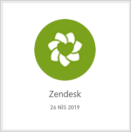
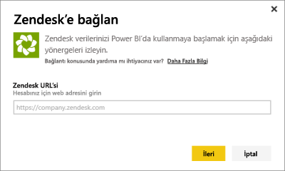
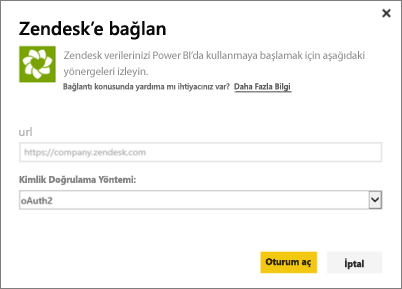
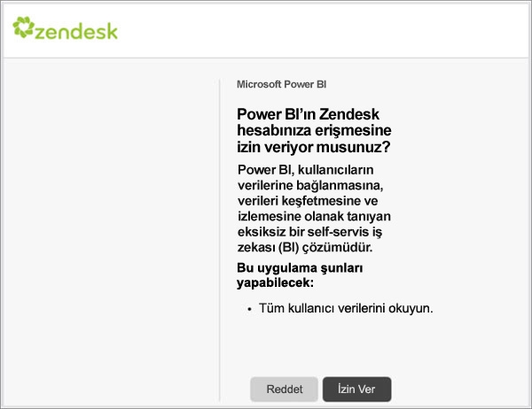
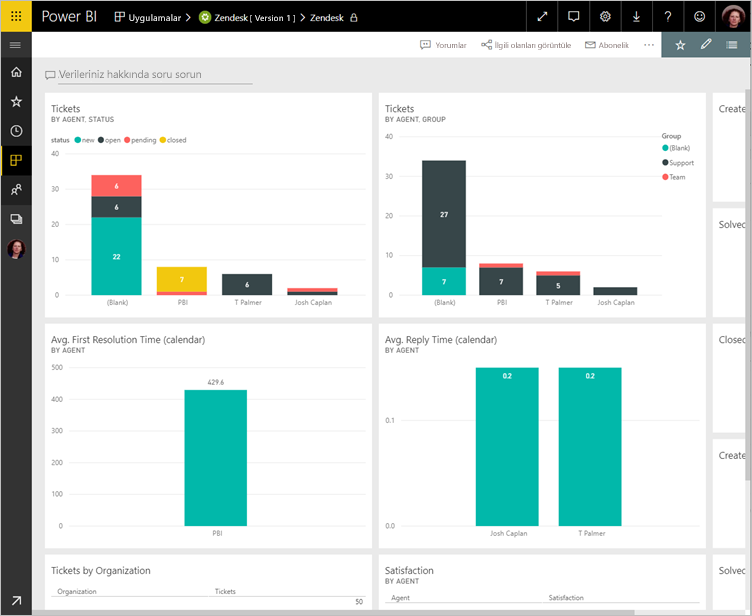
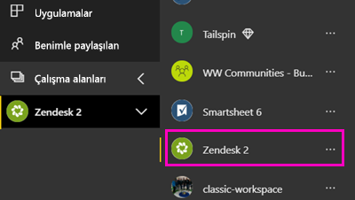
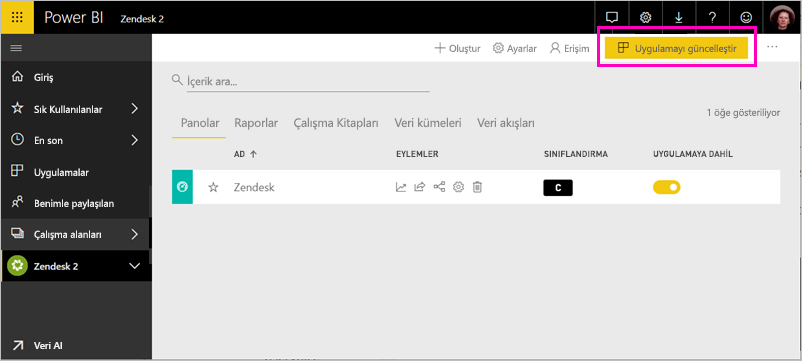

# Power BI ile Zendesk'e bağlanma

Bu makalede, verileri Zendesk hesabınızdan Power BI şablon uygulamasıyla çekme işlemi adım adım açıklanmaktadır. Zendesk uygulaması, bilet hacimleriniz ve temsilci performansınızla ilgili bilgiler sunan bir Power BI panosunun yanı sıra bir dizi Power BI raporu sağlar. Veriler günde bir kez otomatik olarak yenilenir. 

Şablon uygulamasını yükledikten sonra en çok önem verdiğiniz bilgileri vurgulamak için panoyu ve raporu özelleştirebilirsiniz. Daha sonra bunu, kuruluşunuzdaki iş arkadaşlarınıza bir uygulama olarak dağıtabilirsiniz.

[Zendesk şablon uygulamasına](https://app.powerbi.com/getdata/services/zendesk) bağlanın veya Power BI ile [Zendesk tümleştirmesi](https://powerbi.microsoft.com/integrations/zendesk) hakkında daha fazla bilgi edinin.

Şablon uygulamasını yükledikten sonra panoyu ve raporu değiştirebilirsiniz. Daha sonra bunu, kuruluşunuzdaki iş arkadaşlarınıza bir uygulama olarak dağıtabilirsiniz.

>[!NOTE]
>Bağlanmak için bir Zendesk yönetici hesabına sahip olmanız gerekir. Aşağıda, [gereksinimler](#system-requirements) ile ilgili daha ayrıntılı bilgi verilmiştir.

>[!WARNING]
>15 Ekim 2019'dan önce Zendesk Support Search API'si büyük sorguların sayfalandırmasıyla toplam 200.000 sonucun alınmasına izin veriyordu. Arama kullanımını amaçlanan kapsamıyla uygun hale getirmek için Zendesk artık döndürülen maksimum sonuç sayısını 1.000 toplam sonuçla ve sayfa başına maksimum 100 sonuçla sınırlandırmıştır. Ancak geçerli Power BI Zendesk bağlayıcısı bu yeni sınırları aşabilen ve bunun sonucunda yanıltıcı olabilecek sonuçlar veren API çağrıları oluşturmaya devam etmektedir.

## Bağlanma

[!INCLUDE [powerbi-service-apps-get-more-apps](../includes/powerbi-service-apps-get-more-apps.md)]

3. **Zendesk** \> **Şimdi edinin**'i seçin.
4. **Bu Power BI uygulaması yüklensin mi?** iletişim kutusunda **Yükle**’yi seçin.
4. **Uygulamalar** bölmesinde **Zendesk** kutucuğunu seçin.

    

6. **Yeni uygulamanızı kullanmaya başlayın** alanında **Bağlan** seçeneğini belirleyin.

    

4. Hesabınızla ilişkili URL'yi girin. URL, **https://company.zendesk.com** biçimindedir. [Bu parametreleri bulmaya](#finding-parameters) ilişkin ayrıntılı bilgi için aşağıya bakın.
   
   

5. İstendiğinde Zendesk kimlik bilgilerinizi girin.  Kimlik doğrulama yöntemi olarak **OAuth2**'yi seçin ve **Oturum Aç**'a tıklayın. Zendesk kimlik doğrulaması akışını takip edin. (Tarayıcınızda daha önce Zendesk'te oturum açtıysanız kimlik bilgileriniz istenmeyebilir.)
   
   > [!NOTE]
   > Bu şablon uygulaması için bir Zendesk Yönetici hesabı ile bağlanmanız gereklidir. 
   > 
   
   
6. Power BI'ın, Zendesk verilerinize erişmesine izin vermek için **İzin ver**'e tıklayın.
   
   
7. İçeri aktarma işlemini başlatmak için **Connect**'e (Bağlan) tıklayın. 
8. Veriler Power BI tarafından içeri aktarıldıktan sonra Zendesk uygulamanızın içerik listesini görürsünüz: yeni bir pano, rapor ve veri kümesi.
9. Araştırma sürecini başlatmak için panoyu seçin.

    
   
## Uygulamanızı değiştirme ve dağıtma

Zendesk şablon uygulamasını yüklediniz. Yani Zendesk çalışma alanını da oluşturmuş oldunuz. Çalışma alanında, raporu ve panoyu değiştirebilir ve sonra kuruluşunuzdaki iş arkadaşlarınıza bir *uygulama* olarak dağıtabilirsiniz. 

1. Yeni Zendesk çalışma alanınızın tüm içeriğini görüntülemek için gezinti bölmesinde **Çalışma Alanları** > **Zendesk**'i seçin. 

    

    Bu görünüm çalışma alanı için içerik listesidir. Sağ üst köşede, **Uygulamayı güncelleştir** seçeneğini görürsünüz. Uygulamanızı iş arkadaşlarınıza dağıtmaya hazır olduğunuzda, buradan başlayacaksınız. 

    

2. Çalışma alanındaki diğer öğeleri görmek için **Raporlar**’ı ve **Veri kümeleri**’ni seçin.

    İş arkadaşlarınıza [uygulama dağıtma](../collaborate-share/service-create-distribute-apps.md) hakkında bilgi edinin.

## Sistem Gereksinimleri
Zendesk şablon uygulamasına erişmek için bir Zendesk Yönetici hesabı gereklidir. Temsilci veya son kullanıcıysanız ve Zendesk verilerinizi görüntülemek istiyorsanız bir öneri ekleyip [Power BI Desktop](desktop-connect-to-data.md)'ta Zendesk bağlayıcısını gözden geçirin.

## Parametreleri bulma
Zendesk URL'niz, Zendesk hesabınızda oturum açmak için kullandığınız URL ile aynı olacaktır. Zendesk URL'nizin ne olduğundan emin değilseniz Zendesk [oturum açma yardımını](https://www.zendesk.com/login/) kullanabilirsiniz.

## Sorun giderme
Bağlanmayla ilgili sorunlar yaşıyorsanız Lütfen Zendesk URL'nizi kontrol edin ve bir Zendesk yönetici hesabı kullandığınızı onaylayın.

## Sonraki adımlar

* [Power BI'da yeni çalışma alanları oluşturma](../collaborate-share/service-create-the-new-workspaces.md)
* [Power BI'da uygulamaları yükleme ve kullanma](../consumer/end-user-apps.md)
* [Dış hizmetler için Power BI uygulamalarına bağlanma](service-connect-to-services.md)
* Sorularınız mı var? [Power BI Topluluğu'na sorun](https://community.powerbi.com/)
