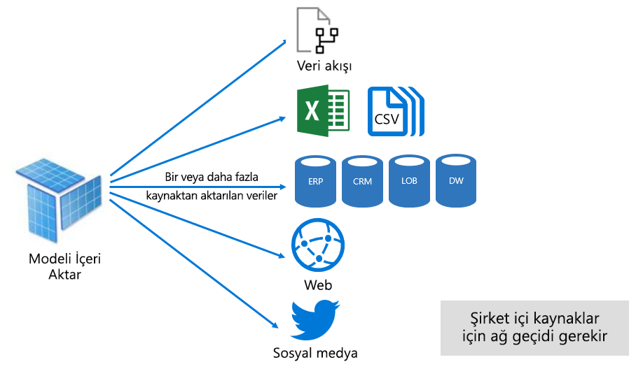
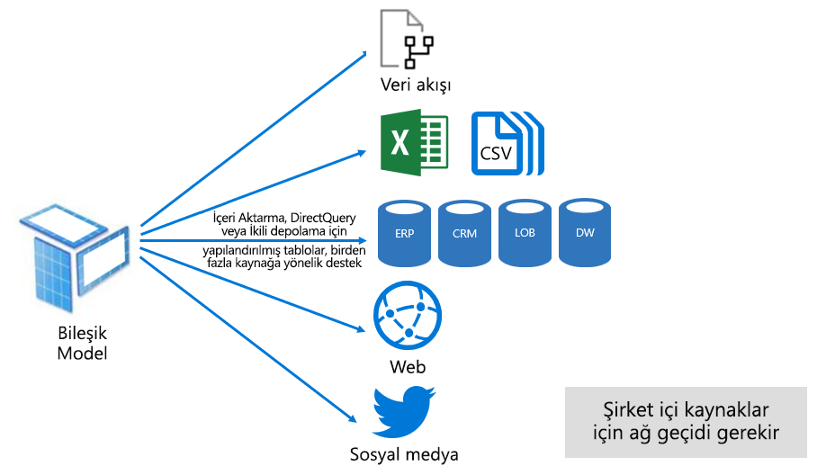

# Power BI hizmetindeki veri kümesi modları

Bu makalede Power BI veri kümesi modlarının teknik açıklaması sağlanır. Dışarıda barındırılan bir Analysis Services modeline ve ayrıca Power BI Desktop'ta geliştirilen modellere canlı bağlantıyı temsil eden veri kümeleri için geçerlidir. Makalede her modun mantığı ve Power BI kapasite kaynakları üzerindeki olası etkileri vurgulanır.

Üç veri kümesi modu vardır:

- [İçeri Aktarma](#import-mode)
- [DirectQuery](#directquery-mode)
- [Bileşik](#composite-mode)

## İçeri aktarma modu

_İçeri Aktarma_ modu model geliştirirken en yaygın kullanılan moddur. Bu mod bellek içi sorgulama sayesinde son derece hızlı bir performans getirir. Ayrıca modelleyicilere tasarım esnekliği ve belirli Power BI hizmeti özellikleri (Soru-Cevap, Hızlı İçgörüler vb.) için destek sunar. Bu güçlü yönlerinden dolayı yeni Power BI Desktop çözümü oluştururken varsayılan moddur.

İçeri aktarılan verilerin her zaman diskte depolandığını anlamanız önemlidir. Sorgulanırken veya yenilenirken verilerin Power BI kapasitesinin belleğine tümüyle yüklenmesi gerekir. Veriler belleğe yüklendikten sonra İçeri Aktarma modelleri çok hızlı sorgu sonuçları alabilir. Ayrıca İçeri Aktarma modelinde belleğe kısmen yüklenmiş olma kavramının olmadığını anlamak da önemlidir.

Yenilendiğinde veriler sıkıştırılır ve iyileştirilir, sonra da VertiPaq depolama motoru tarafından diskte depolanır. Diskten belleğe yüklenirken 10 kat sıkıştırma görmek mümkündür. Dolayısıyla 10 GB kaynak verinin yaklaşık 1 GB'lık bir boyuta sıkıştırılması beklenebilir. Diskteki depolama boyutu sıkıştırılmış boyuttan %20 daha az olabilir. (Boyuttaki bu değişiklik Power BI Desktop dosya boyutunu dosyanın Görev Yöneticisi bellek kullanımıyla karşılaştırılarak saptanabilir.)

Tasarım esnekliği üç yoldan elde edilebilir. Veri modelleyicileri:

- Veri kaynağı türü ne olursa olsun, veri akışlarından ve dış veri kaynaklarından verileri önbelleğe alarak tümleştirebilir
- Veri hazırlama sorguları oluştururken eksiksiz [Power Query Formül Dili](/powerquery-m/) (M olarak da adlandırılır) işlev kümesinden yararlanabilir
- Modeli iş mantığıyla geliştirmek için eksiksiz [Veri Çözümleme İfadeleri (DAX)](/dax/) işlev kümesinden yararlanabilir. Hesaplanmış sütunlar, hesaplanmış tablolar ve ölçüler için destek sağlanır.

Aşağıdaki resimde gösterildiği gibi İçeri Aktarma modeli istenen sayıda desteklenen veri kaynağı türünden verileri tümleştirilebilir.

Öte yandan İçeri Aktarma modelinin cazip avantajlarının yanı sıra dezavantajları da vardır:

- Power BI'ın modeli sorgulayabilmesi için önce modelin tamamının belleğe yüklenmesi gerekir ve bu da özellikle İçeri Aktarma modellerinin sayısı ve boyutu büyüdükçe kullanılabilir kapasite kaynakları üzerinde baskı yaratabilir
- Model verileri ancak en son yenileme kadar günceldir ve İçeri Aktarma modellerinin genellikle belirli bir zamanlamaya göre yenilenmesi gerekir
- Tam yenileme, tüm tablolardaki tüm verileri kaldırır ve bunları veri kaynağından yeniden yükler. Bu işlem Power BI hizmeti ve veri kaynakları için zaman ve kaynaklar açısından pahalıya gelebilir.

    > [!NOTE]
    > Power BI tabloların tamamının kesilmesini ve yeniden yüklenmesini önlemek için artımlı yenileme yapılabilir. Öte yandan bu özellik yalnızca Premium kapasitelerde barındırılan çalışma alanlarında desteklenir. Daha fazla bilgi için [Power BI Premium'da artımlı yenileme](../admin/service-premium-incremental-refresh.md) makalesine bakın.

Power BI hizmeti kaynağı açısından İçeri Aktarma modelleri şunları gerektirir:

- Sorgulandığında veya yenilendiğinde modeli yüklemek için yeterli bellek
- Verileri yenilemek için kaynakları ve ek bellek kaynaklarını işleme

## DirectQuery modu

_DirectQuery_ modu İçeri Aktarma modunun alternatifidir. DirectQuery modunda geliştirilen modeller verileri içeri aktarmaz. Bunun yerine yalnızca model yapısını tanımlayan meta verilerden oluşurlar. Model sorgulandığında, yerel sorgular kullanılarak veriler temel veri kaynağından alınır.

DirectQuery modeli geliştirmeyi göz önünde bulundurmanın iki ana nedeni vardır:

- Modele yüklemek veya pratik bir şekilde yenilemek için [veri azaltma yöntemleri](../guidance/import-modeling-data-reduction.md) uygulandığında bile veri hacimleri fazla büyük olduğunda
- Raporların ve panoların zamanlanmış yineleme sınırlarıyla elde edilemeyecek kadar "neredeyse gerçek zamanlı" veriler sağlaması gerektiğinde. (Zamanlanmış yenileme sınırları paylaşılan kapasite için günde sekiz kez ve Premium kapasite için günde 48 kezdir.)

DirectQuery modellerinin çeşitli avantajları vardır:

- İçeri Aktarma modeli boyut sınırları geçerli değildir
- Modellerin yenilenmesi gerekmez
- Rapor kullanıcıları rapor filtreleri ve dilimleyicileriyle etkileşimli çalışırken en son verileri görür. Ayrıca rapor kullanıcıları geçerli verileri almak üzere raporun tamamını yenileyebilir.
- [Otomatik sayfa yenileme](../create-reports/desktop-automatic-page-refresh.md) özelliği kullanılarak gerçek zamanlı raporlar geliştirilebilir
- DirectQuery modellerini temel alan pano kutucukları 15 dakikada bir kadar sıklıkta otomatik olarak güncelleştirilebilir

Öte yandan DirectQuery modellerinin bazı sınırlamaları vardır:

- DAX formülleri yalnızca veri kaynağı tarafından anlaşılabilen yerel sorgulara dönüştürülebilecek işlevlerin kullanımıyla sınırlanmıştır. Hesaplanan tablolar desteklenmez.
- Hızlı İçgörüler özellikler desteklenmez

Power BI hizmeti kaynağı açısından DirectQuery modelleri şunları gerektirir:

- Sorgulandığında modeli (yalnızca meta verileri) yüklemek için çok az bellek
- Bazen Power BI hizmetinin veri kaynağına gönderilen sorguları oluşturmak ve işlemek için önemli miktarda işlemci kaynağı kullanması gerekebilir. Böyle bir durum olduğunda, özellikle de modeli sorgulayan eşzamanlı kullanıcılar varsa işleme hızı etkilenebilir.

Daha fazla bilgi için bkz. [Power BI Desktop’ta Direct Query'yi kullanma](desktop-use-directquery.md).

## Bileşik mod

_Bileşik_ mod İçeri Aktarma ile DirectQuery modlarını karma kullanabilir veya birden çok DirectQuery veri kaynağını tümleştirebilir. Bileşik modda geliştirilen modeller her model tablosu için depolama modunu yapılandırmayı destekler. Bu mod hesaplanmış tabloları da (DAX ile tanımlanan) destekler.

Tablo depolama modu İçeri Aktarma, DirectQuery veya İkili olarak yapılandırılabilir. İkili depolama modunda yapılandırılan bir tablo hem İçeri Aktarma hem de DirectQuery'dir ve bu ayar Power BI hizmetinin tek tek sorgu temelinde en verimli modu saptamasına olanak tanır.

Bileşik modeller İçeri Aktarma ve DirectQuery modlarının en iyisini sağlamaya çalışır. Uygun yapılandırıldığında, bellek içi modellerinin yüksek sorgu performansıyla veri kaynaklarından neredeyse gerçek zamanlı veri alma özelliğini birleştirebilir.

Bileşik modeller geliştiren veri modelleyicileri boyut türündeki tabloları İçeri Aktarma ile İkili depolama modunda ve olgu türündeki tabloları da DirectQuery modunda yapılandırma eğilimi gösterir. Model tablo rolleri hakkında daha fazla bilgi için bkz. [Yıldız şemasını ve Power BI için önemini anlama](../guidance/star-schema.md).

Örneğin boyut türündeki **Ürün** tablosunun İkili modda ve olgu türündeki **Satış** tablosunun DirectQuery modunda olduğu bir model düşünün. Bir rapor dilimleyicisi işlemek için **Ürün** tablosu bellek içinden verimli ve hızlı bir şekilde sorgulanabilir. **Satış** tablosu da ilgili **Ürün** tablosuyla DirectQuery modunda sorgulanabilir. İkinci sorgu **Ürün** ve **Satış** tablolarını birleştiren ve dilimleyici değerlerine göre filtreleyen tek bir verimli yerel SQL sorgusu oluşturabilir.

Daha fazla bilgi için bkz. [Power BI Desktop’ta bileşik modelleri kullanma](../transform-model/desktop-composite-models.md).

## Sonraki adımlar

- [Power BI hizmetindeki veri kümeleri](service-dataset-modes-understand.md)
- [Power BI Desktop’ta depolama Modu](../transform-model/desktop-storage-mode.md)
- [Power BI'da DirectQuery kullanma](desktop-directquery-about.md)
- [Power BI Desktop’ta bileşik modeller kullanma](../transform-model/desktop-composite-models.md)
- Başka bir sorunuz mu var? [Power BI Topluluğu'na sorun](https://community.powerbi.com/)
