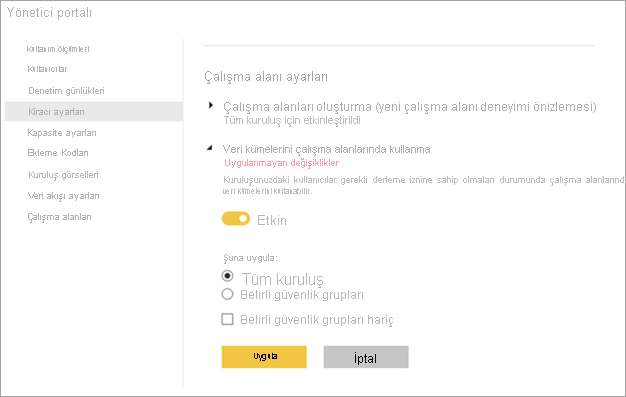

# Çalışma alanları genelinde veri kümeleri kullanımını denetleme

Çalışma alanları genelinde veri kümeleri kullanma, bir kuruluştaki veri kültürü ve veri demokratikleştirmesini teşvik etmenin güçlü bir yoludur. Yine de, bir Power BI yöneticisiyseniz bazen bilgi akışını Power BI kiracınızda kısıtlamak istersiniz. **Çalışma alanları genelinde veri kümeleri kullanma** kiracı ayarıyla, veri kümesini yeniden kullanılmasını güvenlik grubu başına tamamen veya kısmen kısıtlayabilirsiniz.

Bu ayarı kapatırsanız, rapor oluşturucularda şöyle etkileri olur:

- Çalışma alanları genelindeki raporları kopyalama düğmesi kullanılamaz. 
- Paylaşılan veri kümesini temel alan bir raporda, **Raporu düzenle** düğmesi kullanılamaz.
- Power BI hizmetinde, bulma deneyimini yalnızca geçerli çalışma alanındaki veri kümelerini gösterir.
- Power BI Desktop'ta, bulma deneyimi yalnızca üyesi olduğunuz çalışma alanlarındaki veri kümelerini gösterir.
- Power BI Desktop’ta, kullanıcılar üyesi oldukları herhangi bir çalışma alanının dışındaki veri kümesine canlı bağlantıyla bir .pibx dosyası açarsa, farklı bir veri kümesine bağlanmalarını isteyen bir hata iletisi görürler.

## Onaylama süreci için bağlantı sağlama

Kiracı yöneticisi olarak, **Onay** ayarı sayfasındaki **Daha fazla bilgi edinin** bağlantısı için bir URL sağlayabilirsiniz.  Bu bağlantı onaylama süreciniz hakkındaki belgelere gidebilir. **Daha fazla bilgi edinin** bağlantısı için bir hedef sağlamazsanız, bağlantı varsayılan olarak [veri kümesi onaylama](service-datasets-certify.md) makalesine işaret eder.

## Sonraki adımlar

- [Veri kümelerini çalışma alanları arasında kullanma](service-datasets-across-workspaces.md)
- Sorularınız mı var? [Power BI Topluluğu'na sorun](https://community.powerbi.com/)
