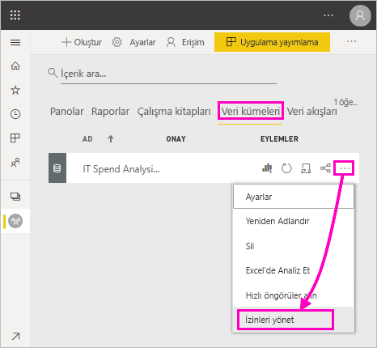
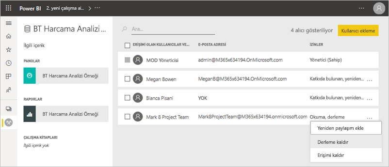
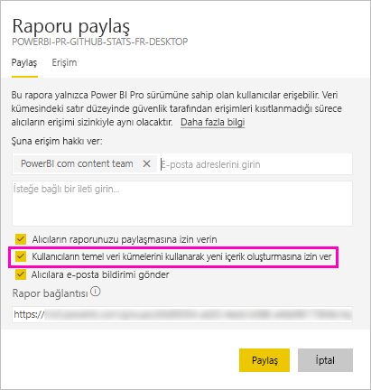
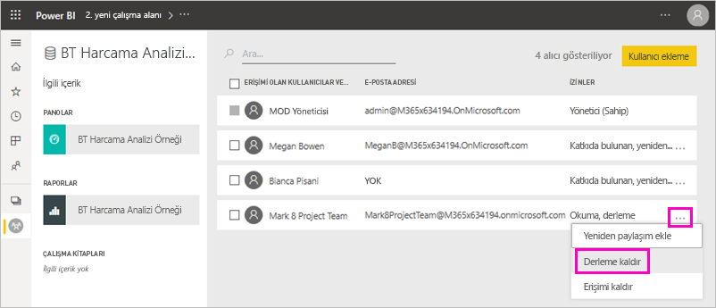
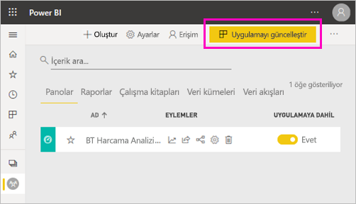
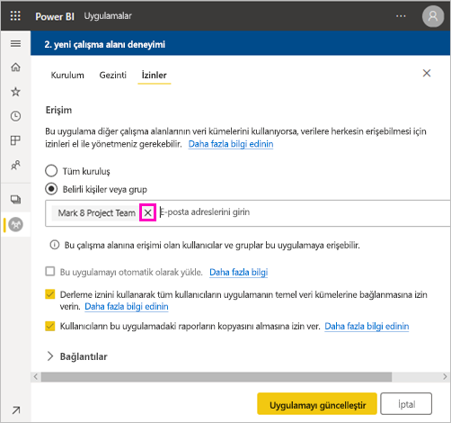
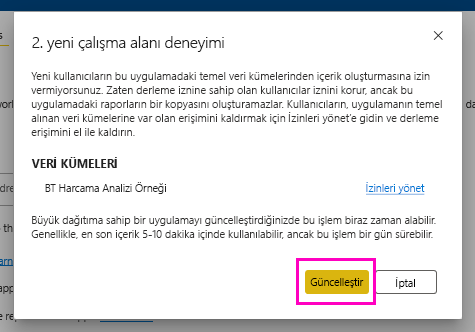

# Paylaşılan veri kümeleri için oluşturma izni

Power BI Desktop'ta bir rapor oluşturduğunuzda bu rapordaki veriler bir *veri modelinde* depolanır. Raporlarınızı Power BI hizmetine yayımladığınızda verileri de bir *veri kümesi* olarak yayımlamış olursunuz. Bu rapor için başkalarına *Oluşturma izni* vererek paylaştığınız veri kümesini keşfetmelerini ve yeniden kullanmalarını sağlayabilirsiniz. Bu makalede Oluşturma iznini kullanarak verilere kimin erişebileceğini denetleme konusunda bilgi verilmektedir.

Oluşturma izni, veri kümeleri için geçerlidir. Oluşturma izni verdiğiniz kullanıcılar, raporlar, panolar, Soru-Cevap bölmesindeki sabitlenmiş kutucuklar ve Insights Discovery gibi veri kümenizde yeni içerik oluşturabilir. 

Kullanıcıların verilerle Power BI *dışında* çalışabilmesi için de Oluşturma iznine sahip olması gerekir:

- Temel alınan verileri dışarı aktarma.
- [Excel'de Çözümle](../collaborate-share/service-analyze-in-excel.md) gibi araçlarla veri kümesini temel alan yeni içerik oluşturma.
- Verilere XMLA uç noktasından erişme.

## Oluşturma izni vermenin yolları

Bir veri kümesi için Oluşturma izni vermenin farklı yolları bulunur:

- Bir çalışma alanının en az bir Katkıda bulunan rolüne sahip olan üyelerine otomatik olarak bu çalışma alanındaki veri kümeleri için Oluşturma ve rapor kopyalama izni verilir.
 
- Veri kümesinin bulunduğu çalışma alanının üyeleri, izin merkezindeki belirli kullanıcılara veya güvenlik gruplarına izni atayabilir. Çalışma alanına üyeyseniz bir veri kümesinin yanındaki **Diğer seçenekler** (...) > **İzinleri Yönet**’i seçin.

    

    Bu, izinleri ayarlayabildiğiniz ve değiştirebildiğiniz İzin merkezini o veri kümesi için açar.

    

- Veri kümesinin bulunduğu iş alanının yöneticisi veya üyesi, uygulama için izni olan kullanıcıların temel alınan veri kümeleri için de izni olup olmayacağına uygulamanın yayımlanması esnasında karar verebilir. Ayrıntılar için bkz. [Veri kümesi paylaşma](service-datasets-share.md).

- Bir veri kümesinde Yeniden Paylaşma ve Oluşturma izinlerinizin olduğunu varsayalım. Bu veri kümesinde oluşturulmuş bir raporu veya panoyu paylaştığınızda, alıcıların temel alınan veri kümesi için de Oluşturma izni alacağını belirtebilirsiniz.

    

Kişinin bir veri kümesine yönelik Oluşturma iznini kaldırabilirsiniz. Bunu yaparsanız, paylaşılan veri kümesinde derlenen raporu görebilirler ancak bunu artık düzenleyemezler. Ayrıntılar için sonraki bölüme bakın.

## Veri kümesi için Oluşturma iznini kaldırma

Bazı durumlarda, bir veri kümesinin bazı kullanıcılarının Oluşturma iznini kaldırmanız gerekebilir. 

1. Çalışma alanında **Veri kümeleri** listesi sayfasına gidin. 
1. Veri kümesinin yanındaki **Diğer seçenekler** (...) > **İzinleri yönet**’i seçin.

    

1. Bir adın yanındaki **Diğer seçenekler** (...) > **Derlemeyi kaldır**’ı seçin.

    

    Paylaşılan veri kümesinde derlenen raporu görürler ancak bunu artık düzenleyemezler.

### Bir uygulamada veri kümesi için Oluşturma iznini kaldırma

Bir çalışma alanından bir kişi grubuna uygulama dağıttığınızı varsayalım. Daha sonra, bazı kişilerin uygulamaya erişimini kaldırmaya karar verdiniz. Uygulamaya erişimi kaldırdığınızda oluşturma ve yeniden paylaşma izinleri otomatik olarak kaldırılmaz. Bu ayrı bir adımdır. 

1. Çalışma alanı listesi sayfasında **Uygulamayı güncelleştir** seçeneğini belirleyin. 

    

1. Kişiyi veya grubu silmek için **İzinler** sekmesinde **X**’i seçin. 

    
1. **Uygulamayı güncelleştir**’i seçin.

    Mevcut erişimi olan kullanıcıların Oluşturma iznini kaldırmak için **İzinleri yönet** bölümüne gitmeniz gerektiğini açıklayan bir ileti görürsünüz. 

    

1. **Güncelleştir** seçeneğini belirleyin.

1. Çalışma alanında **Veri kümeleri** listesi sayfasına gidin. 
1. Veri kümesinin yanındaki **Diğer seçenekler** (...) > **İzinleri yönet**’i seçin.

    

1. Adının yanındaki **Diğer seçenekler** (...) > **Derlemeyi kaldır**’ı seçin.

    

    Paylaşılan veri kümesinde derlenen raporu görürler ancak bunu artık düzenleyemezler.

## Daha ayrıntılı izinler

Power BI, zaten sağlanan Okuma ve Yeniden paylaşma izinlerini tamamlayıcı nitelikteki Oluşturma iznini Haziran 2019’da kullanıma sundu. Bu tarihte uygulama izinleri, paylaşım veya çalışma alanı erişimi aracılığıyla veri kümeleri için Okuma iznine sahip olan tüm kullanıcılar aynı veri kümeleri için Oluşturma iznine de sahip oldu. Okuma izni, Excel’de Çözümleme veya Dışarı aktarma kullanarak veri kümesinde yeni içerik oluşturma hakkını onlara zaten tanıdığı için Oluşturma iznine otomatik olarak sahip oldular.

Daha ayrıntılı bu Oluşturma izni ile mevcut rapor veya panodaki içeriği kimlerin görüntüleyebileceğini ve temel alınan veri kümelerine bağlı olan içerikleri kimlerin oluşturabileceğini seçebilirsiniz.

Veri kümeniz veri kümesi çalışma alanının dışındaki bir rapor tarafından kullanılıyorsa o veri kümesini silemezsiniz. Bunun yerine bir hata iletisi görürsünüz.

Oluşturma iznini kaldırabilirsiniz. Bunu yaparsanız, izinlerini iptal ettiğiniz kişiler raporu görmeye devam eder ancak raporu artık düzenleyemez veya temel verileri dışarı aktaramaz. Yalnızca okuma izni olan kullanıcılar özetlenmiş verileri yine dışarı aktarabilir. 

## Sonraki adımlar

- [Veri kümelerini çalışma alanları arasında kullanma](service-datasets-across-workspaces.md)
- Sorularınız mı var? [Power BI Topluluğu'na sorun](https://community.powerbi.com/)
