# Diğer çalışma alanlarından raporları kopyalama

Çalışma alanında veya uygulamada hoşunuza giden bir rapor bulduğunuzda kopyasını alabilir ve bunu farklı bir çalışma alanına kaydedebilirsiniz. Ardından, raporun kopyasını değiştirebilir veya görselleri ve diğer öğeleri ekleyip silebilirsiniz. Veri modelini oluşturmaya kafa yormanız gerekmez. Bu zaten sizin için oluşturulur. Mevcut raporu değiştirmek, en baştan başlamaktan çok daha kolaydır. Ancak, bazı durumlarda çalışma alanınızdan bir uygulama oluştururken rapor kopyanızı uygulamada yayımlayamazsınız. Ayrıntılar için ["Veri kümelerini çalışma alanları arasında kullanma" makalesinde diğer dikkate alınacak noktalar ve sınırlamalara](service-datasets-across-workspaces.md#considerations-and-limitations) bakın.

## Önkoşullar

- Bir raporu kopyalamak için, özgün rapor Premium kapasitesi içindeki bir çalışma alanında olsa bile bir Pro lisansı gereklidir.
- Raporu kopyalamak veya bu çalışma alanındaki veri kümesini temel alarak başka bir çalışma alanında rapor oluşturmak için veri kümesine yönelik Oluşturma iznine sahip olmanız gerekir. Özgün çalışma alanındaki veri kümeleri için Yönetici, Üye ve Katkıda Bulunan rollerine sahip kişilerin çalışma alanı rolleri aracılığıyla otomatik olarak Oluşturma izinleri olur. Ayrıntılar için [Yeni çalışma alanlarındaki roller](../collaborate-share/service-new-workspaces.md#roles-in-the-new-workspaces) bölümüne bakın.

## Çalışma alanında raporun bir kopyasını kaydetme

1. Çalışma alanında Raporlar liste görünümüne gidin.

    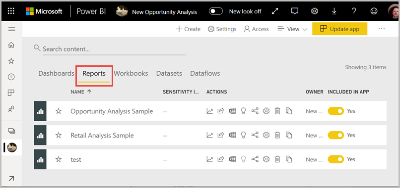

1. **Eylemler**’in altından **Bir kopyasını kaydet** seçeneğini belirleyin.

    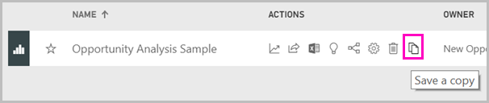

    **Bir kopyasını kaydet** simgesi, rapor bir yeni deneyim çalışma alanında bulunuyorsa ve [Oluşturma izniniz](service-datasets-build-permissions.md) varsa görünür. Çalışma alanına erişiminiz olsa bile veri kümesi için Oluşturma izninizin bulunması gerekir.

3. **Bu raporun bir kopyasını kaydet** seçeneğinde rapora bir ad verin ve hedef çalışma alanını belirleyin.

    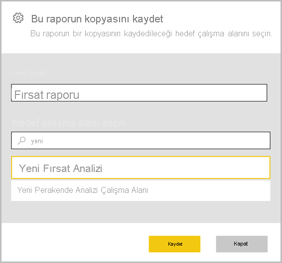

    Raporu, mevcut çalışma alanına veya Power BI hizmetindeki farklı bir çalışma alanına kaydedebilirsiniz. Sadece üyesi olduğunuz yeni deneyim çalışma alanları olan çalışma alanlarını görürsünüz. 
  
4. **Kaydet**'i seçin.

    Rapor çalışma alanının dışındaki bir veri kümesini temel alıyorsa, Power BI otomatik olarak raporun bir kopyasını oluşturur ve veri kümeleri listesine bir girdi ekler. Bu veri kümesinin simgesi, çalışma alanındaki veri kümelerinin simgesinden farklıdır: 
    
    Böylece, çalışma alanının üyeleri hangi raporların ve panoların çalışma alanının dışındaki veri kümelerini kullandığını ayırt edebilir. Giriş veri kümesiyle ilgili bilgileri ve birkaç seçme eylemini gösterir.

    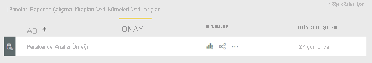

    Rapor ve ilgili veri kümesi hakkında daha fazla bilgi için bu makalenin [Rapor kopyanız](#your-copy-of-the-report) bölümüne bakın.

## Uygulamaya rapor kopyalama

1. Uygulamada, kopyalamak istediğiniz raporu açın.
2. Menü çubuğunda **Diğer seçenekler** ( **...** ) > **Kopyasını kaydet**’i seçin.

    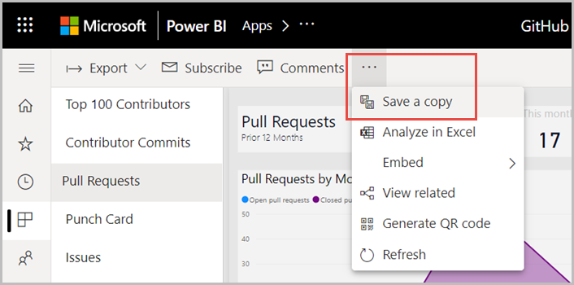

    **Kopyasını kaydet** seçeneği, rapor yeni çalışma alanı deneyiminde bulunuyorsa ve [Oluşturma izniniz](service-datasets-build-permissions.md) varsa görünür.

3. Raporunuza bir ad verin > **Kaydet**’i seçin.

    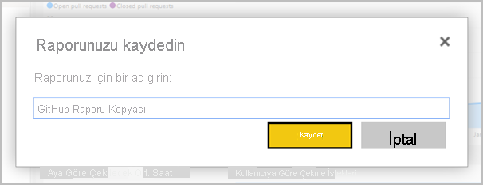

    Kopyanız otomatik olarak Çalışma Alanım’a kaydedilir.

4. Kopyanızı açmak için **Rapora git**’i seçin.

## Rapor kopyanız

Raporun bir kopyasını kaydettiğinizde, veri kümesiyle canlı bir bağlantı oluşturursunuz ve rapor oluşturma deneyimini kullanılabilir olan tam veri kümesi ile açabilirsiniz. 

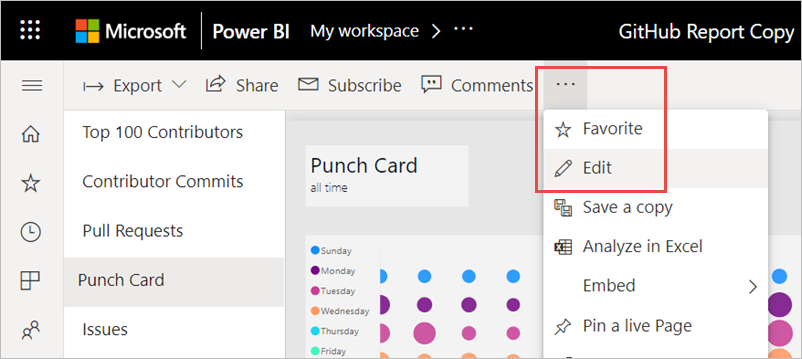

Veri kümesinin bir kopyasını oluşturmadınız. Bu veri kümesi hala özgün konumunda bulunuyor. Veri kümesinde bulunan tüm tabloları ve ölçümleri kendi raporunuzda kullanabilirsiniz. Veri kümenizde satır düzeyi güvenlik (RLS) kısıtlamaları uygulandığı için, sadece RLS rolünüzün görme izni bulunan izinleri görürsünüz.

## İlgili veri kümelerini görüntüle

Bir çalışma alanında yer alan ve başka bir çalışma alanındaki veri kümesini temel alan bir raporunuz olduğunda, raporun temel aldığı veri kümesi hakkında daha fazla bilginiz olmalıdır.

1. Raporlar liste görünümünde **İlgili olanları görüntüle** seçeneğini belirleyin.

    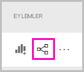

1. **İlgili içerik** iletişim kutusu tüm ilgili öğeleri gösterir. Veri kümesi bu listede diğerleri gibi görünür. Farklı bir çalışma alanında bulunduğunu ayırt edemezsiniz. Bu sorun biliniyor.
 
    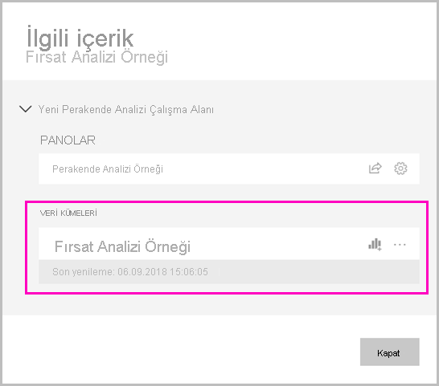

## Raporu ve raporun paylaşılan veri kümesini silme

Raporu ve raporla ilişkilendirilmiş paylaşılan veri kümesini artık çalışma alanında istemediğinize karar verebilirsiniz.

1. Raporu silin. Çalışma alanındaki rapor listesinde **Sil** simgesini seçin.

    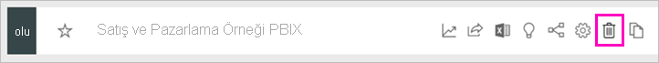

2. Veri kümesi listesinde paylaşılan veri kümeleri için **Sil** simgelerinin olmadığını görürsünüz. Sayfayı yenileyin veya başka bir sayfaya gidin geri dönün. Veri kümesi görüntüden kaldırılır. Aksi takdirde **İlişkilileri görüntüle**'ye bakın. Çalışma alanınızdaki başka bir tabloyla ilişkili olabilir.

    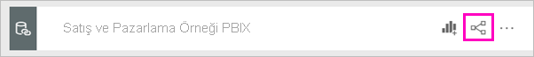

    > [!NOTE]
    > Bu çalışma alanındaki paylaşılan veri kümesinin silinmesi, veri kümesini silmez. Yalnızca bu veri kümesine başvuruyu siler.

## Sonraki adımlar

- [Veri kümelerini çalışma alanları arasında kullanma](service-datasets-across-workspaces.md)
- Sorularınız mı var? [Power BI Topluluğu'na sorun](https://community.powerbi.com/)
