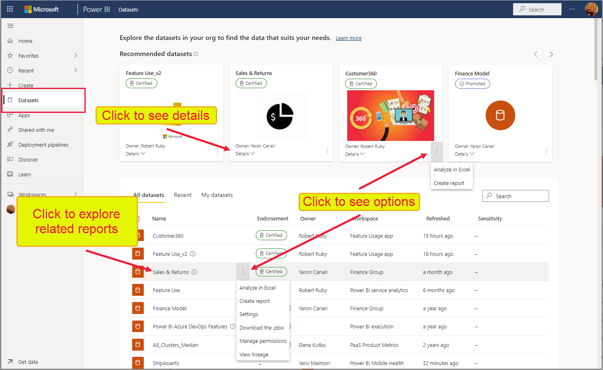

# Veri kümesi merkezini kullanarak veri kümelerini bulma (önizleme)

Veri kümeleri merkezi kuruluşunuzdaki veri kümelerini bulmanızı, incelemenizi ve kullanmanızı kolaylaştırır. Ayrıca hem veri kümeleri hakkında bilgi hem de bu veri kümeleri üzerinde raporlar oluşturmak ve Excel'de Analiz Et özelliğiyle bu veri kümelerini kullanmak için giriş noktaları sağlar.

Veri kümeleri merkezi birçok senaryoda yararlı olabilir:
* Veri kümesi sahipleri veri kümelerinin izlenmesine ve yönetimine yardımcı olması için veri kümesi kullanım ölçümlerini, yenileme durumunu, ilgili raporları ve kökeni görebilir.
* Rapor oluşturucuları bu merkezi kullanarak raporlarını oluştururken temel alabilecekleri uygun veri kümelerini bulabilir ve bağlantıları kullanarak kolayca sıfırdan veya şablonlardan veri kümesini temel alan raporlar oluşturabilirsiniz.
* Rapor tüketicileri güvenilir veri kümelerini temel alan raporları bulmak için bu sayfayı kullanabilir.

Kaliteli veri kümelerini ve onlarla ilgili raporları bulmayı kolaylaştırmak için veri kümeleri merkezi gereksiz raporların oluşturulmasını önlemeye yardımcı olur. Ayrıca yeni rapor oluştururken başlangıç noktası olarak kullanmak üzere iyi raporlar bulmayı da kolaylaştırır.

Bu makalede veri kümeleri merkezinde neler göreceğiniz açıklanır ve merkezin nasıl kullanılacağı anlatılır. Veri kümesi sahiplerine yönelik olarak, [veri kümelerinin bulunabilirliğini ve kullanılabilirliğini iyileştirme](#make-your-dataset-discoverable) hakkında da bir dizi ipucu bulunur.

**Veri kümeleri merkezinde hangi veri kümelerini görebilirim?**
* Bir veri kümesinin veri kümeleri merkezinde gösterilmesi için [yeni bir çalışma alanı deneyiminde](../collaborate-share/service-new-workspaces.md) yer alıyor olması gerekir.
* Veri kümeleri merkezinde görebildiğiniz veri kümeleri, üzerinde en azından [derleme izinlerine](service-datasets-build-permissions.md) sahip olduklarınızdır.
* Ücretsiz kullanıcıysanız, yalnızca *Çalışma Alanım* bölümünüzde bulunan veri kümelerini veya Premium kapasiteli çalışma alanlarında yer alan ve [derleme izinleriniz](service-datasets-build-permissions.md) olan veri kümelerini görürsünüz.

## İhtiyacınız olan veri kümesini bulma

Veri kümesi bulma deneyimi veri kümeleri merkezi sayfasında başlar. Veri kümeleri merkezi sayfasına ulaşmak için:
* Power BI hizmetinde: Gezinti bölmesinde **Veri kümeleri**'ni seçin.
* Teams'deki Power BI uygulamasında: **Veri kümeleri** sekmesini veya gezinti bölgesinden **Veri kümeleri** öğesini seçin.

Aşağıdaki resimde Power BI hizmetindeki veri kümeleri merkezi gösterilir.

Veri kümeleri merkezi size önerilen veri kümelerinden bir grubu ve kuruluştaki erişim izniniz olan tüm veri kümelerinin listesini gösterir.

Aşağıdaki bölümlerde bu bölümler ve gerçekleştirebileceğiniz eylemler açıklanır.

### Önerilen veri kümeleri

Önerilen veri kümeleri; ne kadar yakın zamanda yenilendikleri ve bunlarla ilgili raporları ve/veya panoları ne kadar yakın zamanda ziyaret ettiğiniz hesaba katılarak yapılan bir hesaplama temelinde size gösterilen onaylı (tanıtılan ve onaylanmış) veri kümeleridir.

### Veri kümesi listesi

Veri kümesi listesi kuruluşta bulunan ve üzerinde en azından [derleme izinlerine](service-datasets-build-permissions.md) sahip olduğunuz veri kümelerini gösterir. Veri kümesi listesini filtrelemek için listenin üç sekmesi vardır.
* **Tüm veri kümeleri**: Kuruluşta bulunan ve üzerinde en azından [derleme izinlerine](service-datasets-build-permissions.md) sahip olduğunuz tüm veri kümelerini gösterir.
* **En son**: İlgili raporlarına en son eriştiğiniz veri kümelerini gösterir. Bir rapora eriştiğinizde, ilgili veri kümesi En son sütununda gösterilmeden önce birkaç dakikalık bir gecikme olabilir.
* **Veri kümelerim**: Sahibi olduğunuz veri kümelerini gösterir. 

Geçerli sekmedeki öğelere daha fazla filtre uygulamak için arama kutusunu kullanın.

Listenin sütunları aşağıdaki açıklanmıştır. Belirli bir sütuna göre sıralamak için o sütunun üst bilgisine tıklayın. 
* **Ad**: Veri kümesinin adı. Bir veri kümesi kullanılarak oluşturulan raporları incelemek için veri kümesinin adına tıklayın.
* **Onay**: Onay durumu.
* **Sahip**: Veri kümesinin sahibi.
* **Çalışma alanı**: Veri kümesinin bulunduğu çalışma alanı.
* **Yenilendi**: Son yenileme zamanı (saate, güne, aya ve yıla yuvarlanır. Son yenilemenin tam zamanı için veri kümesi ayrıntı sayfasındaki veri kümesi bilgilerine bakın).
* **Duyarlılık**: Ayarlandıysa, duyarlılık. Duyarlılık etiketi açıklamasını görüntülemek için bilgi simgesine tıklayın.

### Yeni rapor oluşturma veya Excel’de Analiz Et özelliğiyle verileri Excel'e çekme

Veri kümesini temel alan yeni bir rapor oluşturmak veya [Excel'de Analiz Et](../collaborate-share/service-analyze-in-excel.md) özelliğiyle verilere Excel'e çekmek için, önerilen veri kümesi kutucuğunun sağ alt köşesinde veya veri kümesi listesindeki bir veri kümesinin satırında **Diğer seçenekler (...)** öğesini seçin. Veri kümesi üzerindeki izinlerinize bağlı olarak, açılan menüde başka eylemler görüntülenebilir.

Veri kümesini temel alan yeni bir rapor oluştururken, rapor düzenleme tuvali açılır. Yeni raporu kaydettiğinizde, bu rapor veri kümesini içeren çalışma alanına (bu çalışma alanı üzerinde yazma izinlerinizin olması koşuluyla) kaydedilir. Söz konusu çalışma alanı üzerinde yazma izinleriniz yoksa veya ücretsiz kapasite kullanıcısıysanız ve veri kümesi bir Premium kapasite çalışma alanında tutuluyorsa, yeni rapor *Çalışma alanım* bölümüne kaydedilir.

## Veri kümesi ayrıntılarını görüntüleme ve ilgili raporları inceleme

Veri kümesi hakkında daha fazla bilgi görmek, ilgili raporları incelemek ya da sıfırdan veya şablondan veri kümesini temel alan yeni bir rapor oluşturmak için, önerilen veri kümeleri arasından ya da veri kümeleri listesinden bir veri kümesi seçin. Size veri kümesi hakkındaki bilgileri gösteren, veri kümesi üzerinde oluşturulan raporları listeleyen ve veri kümesini temel alan yeni raporlar oluşturmak veya [Excel'de Analiz Et](../collaborate-share/service-analyze-in-excel.md) özelliğiyle verileri Excel'e çekmek için giriş noktaları sağlayan bir sayfa açılır.

Sayfa üst bilgisinde veri kümesi adı, onay (varsa) ve veri kümesi sahibi görüntülenir. Veri kümesi sahibine veya veri kümesini onaylayana (varsa) bir e-posta göndermek için üst bilgiye tıklayın ve sonra da sahibin adına tıklayın.

### Veri kümesi ayrıntıları

Veri kümesi ayrıntıları bölümünde veri kümesinin bulunduğu çalışma alanının adı, son yenilemenin tam zamanı, duyarlılık (ayarlandıysa), veri kümesi açıklaması (varsa) ve onaylayanın adı (onaylandıysa) gösterilir. Buradan veri kümesinin kökenini de açabilirsiniz.

### İlgili raporlar

İlgili raporları incele bölümünde, seçili veri kümesini temel alan tüm raporlar gösterilir. Listede raporun satırını seçerek ve ardından Bu raporun bir kopyasını kaydet simgesine tıklayarak raporun bir kopyasını oluşturabilirsiniz.

İlgili raporlar listesindeki sütunlar şunlardır:
* **Ad**: Rapor adı. Adın sonunda (şablon) terimi varsa, bu rapor özellikle şablon olarak kullanılacak şekilde oluşturulmuştur.
* **Onay**: Onay durumu.
* **Çalışma alanı**: Raporun bulunduğu çalışma alanının adı.

### Veri kümesini temel alan bir rapor oluşturma

Rapor oluştur bölümünde **Oluştur** düğmesine tıklayın. Veri kümesi için bir rapor şablonu varsa, açılan menüde iki seçenek sunulur:
* **Şablondan**: *Çalışma alanım* bölümünde şablonun bir kopyasını oluşturur.
* **Sıfırdan**: Veri kümesi üzerinde oluşturulan yeni rapor için rapor düzenleme tuvalini açar. Yeni raporunuzu kaydettiğinizde, bu rapor veri kümesini içeren çalışma alanına (bu çalışma alanı üzerinde yazma izinlerinizin olması koşuluyla) kaydedilir. Çalışma alanı üzerinde yazma izinleriniz yoksa veya ücretsiz kapasite kullanıcısıysanız ve veri kümesi bir Premium kapasite çalışma alanında tutuluyorsa, yeni rapor *Çalışma alanım* bölümüne kaydedilir.

Rapor şablonu yoksa, **Oluştur**'a tıklandığında doğrudan rapor düzenleme tuvali açılır.

>[!NOTE]
> Bu veri kümesi için birden çok rapor şablonu olsa bile Rapor oluştur açılan listesinde tek bir şablon gösterilir. 

### Excel'de Analiz Et özelliğiyle veri kümesini Excel'e çekme

Excel'de Analiz Et özelliğiyle veri kümesini Excel'e çekmek için Excel'de Analiz Et bölümünde **Analiz Et**'i seçin.

## Veri kümenizin bulunabilir olmasını sağlama

Veri kümelerinizin bulunabilirliğini geliştirmenizin çeşitli yolları vardır:
* **Veri kümenizi onaylama**: Kullanıcılar tarafından daha kolay bulunmasını sağlamak ve kullanıcılara bunun güvenilir bir veri kaynağı olduğunu bildirmek için veri kümenizi tanıtabilir veya onaylayabilirsiniz. Onaylanan veri kümeleri rozetlerle etiketlenir ve Power BI'da hemen belirlenebilir. Veri kümeleri merkezindeki önerilen veri kümeleri bölümünde yalnızca onaylanan veri kümeleri gösterilir ve veri kümesi listesinde varsayılan olarak önce onaylanan veri kümeleri listelenir.

    [Veri kümelerinizi onaylamayı öğrenin](../collaborate-share/service-endorse-content.md). 
* **Veri kümesinin anlamlı bir açıklama yazın**: Veri kümelerinizin kullanışlı, anlamlı açıklamalarını yazarak kullanıcıların kendilerine uygun veri kümesini bulmasına yardım edebilirsiniz. [Açıklamayı, veri kümesini onaylama işleminin bir parçası olarak sağlarsınız](../collaborate-share/service-endorse-content.md#promote-content). 
* **Veri kümenize akılda kalacak bir görüntü ekleyin**: Veri kümenize akılda kalacak bir görüntü ekleyerek kullanıcıların veri kümenizi bulmasını ve anımsamasını kolaylaştırabilirsiniz. Bu görüntü veri kümeleri merkezi sayfasında ve veri kümesi görüntülerinin gösterilmesini destekleyen diğer konumlarda veri kümenizin göze çarpmasını sağlar. Veri kümenize bir görüntü eklemek için veri kümenizin ayarlarını açın ve veri kümesi görüntüsü bölümünü genişletin.
* **Veri kümesini temel alan bir rapor şablonu oluşturun**: Kullanıcıların veri kümenize dayanarak kendi raporlarını oluşturmaya başlarken kullanabilecekleri bir rapor şablonu oluşturabilirsiniz. Bu şablon, sizin tasarladığınız ve bu arada şablon olacağını da göz önünde bulundurduğunuz normal bir rapordur. Raporu kaydederken rapor adına "(şablon)" sonekini eklemeniz gerekir, örneğin *Aylık Satışlar (şablon)* .

    Kullanıcı veri kümeleri merkezinin veri kümesi ayrıntıları görünümündeki rapor oluşturma bölümünde **Oluştur > Şablondan** öğesini seçtiğinde, kullanıcının *Çalışma alanım* bölümünde şablonun bir kopyası oluşturulur ve ardından rapor düzenleme tuvalinde açılır.

    Rapor şablonları, veri kümeleri merkezinin veri kümesi ayrıntıları görünümündeki ilgili raporlar listesinde de kolayca belirlenebilir.
  
## Sonraki adımlar
* [Veri kümelerini çalışma alanları arasında kullanma](service-datasets-across-workspaces.md)
* [Farklı çalışma alanlarını temel alarak raporlar oluşturma](service-datasets-discover-across-workspaces.md)
* [Veri kümenizi onaylama](../collaborate-share/service-endorse-content.md)
* Sorularınız mı var? [Power BI Topluluğu'na sorun](https://community.powerbi.com/)
