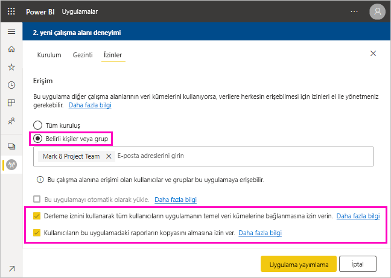
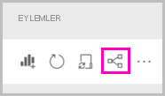
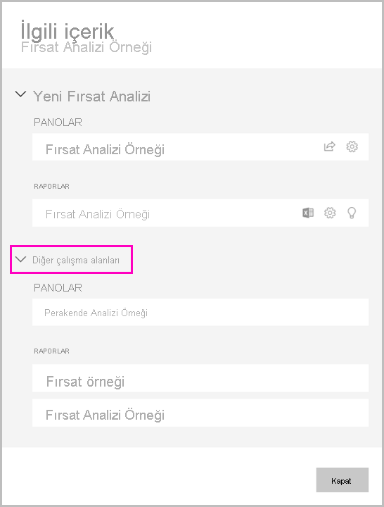

# Veri kümesi paylaşma (önizleme)

Power BI Desktop’ta *veri modeli* oluşturucusu olarak Power BI hizmetinde dağıtabileceğiniz *veri kümeleri* oluşturuyorsunuz. Böylece, diğer rapor oluşturucuları veri kümelerinizi kendi raporlarının temeli olarak kullanabilir. Bu makalede veri kümelerinizi paylaşmayı öğreneceksiniz. Paylaşılan veri kümelerinize erişim vermeyi ve bu erişimi kaldırmayı öğrenmek için [Oluşturma izni](service-datasets-build-permissions.md) bölümüne bakın.

## Veri kümenizi paylaşmaya yönelik adımlar

1. Power BI Desktop’taki bir veri modelinde .pbix dosyası oluşturarak başlayın. Bu veri kümesini diğerlerinin rapor oluşturması için sunmayı planlıyorsanız .pbix dosyasında rapor tasarlamasanız da olur.

    .pbix dosyasını bir Microsoft 365 grubuna kaydetmek en iyi yöntemlerden biridir.

1. .pbix dosyasını Power BI hizmetindeki bir [yeni deneyim çalışma alanında](../collaborate-share/service-create-the-new-workspaces.md) yayımlayın.
    
    Bu çalışma alanının diğer üyeleri, zaten bu veri kümesini temel alarak diğer çalışma alanlarında rapor oluşturabiliyor.

1. Ayrıca, bu çalışma alanından [bir uygulama yayımlayabilirsiniz](../collaborate-share/service-create-distribute-apps.md). Bunu yaptığınızda, kimlerin izinleri olduğunu ve neler yapabileceklerini **İzinler** sayfasından siz belirlersiniz.

    > [!NOTE]
    > **Tüm kuruluş** seçeneğini belirlerseniz kuruluştaki kimsenin Oluşturma izni olmaz. Bu sorun zaten biliniyor. Bunun yerine, **Belirli bireyler ve gruplardaki** e-posta adreslerini belirtin.  Kuruluşunuzdaki herkesin Oluşturma izni olmasını istiyorsanız, tüm kuruluş için bir e-posta diğer adı belirtin.

    

1. **Uygulamayı yayımla**seçeneğini belirleyin. Uygulama zaten yayımlandıysa, **Uygulamayı güncelleştir**’i seçin.

## Veri kümesi kullanımınızı izleme

Çalışma alanınızda bir paylaşılan veri kümesi bulunduğunda, diğer çalışma alanlarındaki hangi raporların bunu temel aldığını bilmeniz gerekebilir.

1. Veri kümeleri liste görünümünde **İlgili olanları görüntüle** seçeneğini belirleyin.

    

1. **İlgili içerik** iletişim kutusu tüm ilgili öğeleri gösterir. Bu çalışma alanı ve **Diğer çalışma alanlarındaki** ilgili öğeleri bu listede görürsünüz.
 
    

## Sonraki adımlar

- [Çalışma alanları genelinde veri kümeleri kullanma (Önizleme)](service-datasets-across-workspaces.md)
- Sorularınız mı var? [Power BI Topluluğu'na sorun](https://community.powerbi.com/)
