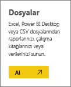
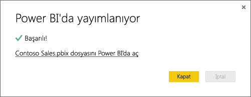

# Power BI Desktop dosyalarından veri alma

**Power BI Desktop**, iş zekasını ve raporlamayı kolay hale getirir. Farklı birçok veri kaynağına bağlanmaktan tutun da verileri sorgulamaya ve dönüştürmeye, verilerinizi modellemeye ve hem etkileyici hem de dinamik raporlar oluşturmaya kadar birçok işlem için, iş zekası görevleri **Power BI Desktop** ile sezgisel ve hızlı hale gelir. **Power BI Desktop**'a aşina değilseniz [Power BI Desktop ile çalışmaya başlama](../fundamentals/desktop-getting-started.md) başlıklı makaleye göz atın.

**Power BI Desktop**'a veri aktardığınıza ve birkaç rapor oluşturduğunuza göre, kaydettiğiniz dosyayı artık **Power BI hizmetine** aktarabiliriz.

## Dosyanızı nereye kaydettiğiniz önemlidir
**Yerel**: Dosyanızı bilgisayarınızdaki bir yerel sürücüye veya kuruluşunuzdaki başka bir konuma kaydettiyseniz, içerdiği verileri ve raporları Power BI'a aktarmak için dosyanızı *içeri aktarabilir* ya da Power BI Desktop'tan *yayımlayabilirsiniz*. Dosyanız gerçekte yerel sürücünüzde kalır. Böylece, dosyanın tamamı Power BI'a taşınmamış olur. Burada gerçekleştirilen asıl işlem, Power BI'da yeni bir veri kümesinin oluşturulması ve Power BI Desktop dosyasındaki verilerin ve veri modelinin söz konusu veri kümesine yüklenmesidir. Dosyanızın içerdiği raporlar, Power BI sitenizdeki Raporlar bölümünde görünür.

**OneDrive - İş**: OneDrive İş hesabınız varsa ve hem OneDrive İş'te hem de Power BI'da aynı hesabı kullanarak oturum açıyorsanız bu; Power BI Desktop'taki çalışmalarınızı Power BI'daki veri kümeniz, raporlarınız ve panolarınızla eşitlenmiş halde tutmanın açık ara en etkili yoludur. Hem Power BI hem de OneDrive, bulutta olduğundan Power BI, OneDrive'daki dosyanıza hemen hemen her saatte bir *bağlanır*. Herhangi bir değişiklik bulunması durumunda veri kümeniz, raporlarınız ve panolarınız Power BI'da da otomatik olarak güncelleştirilir.

**OneDrive - Bireysel**: Dosyalarınızı kendi OneDrive hesabınıza kaydederseniz OneDrive İş ile ilgili olarak elde ettiğiniz avantajların pek çoğundan yararlanırsınız. En büyük fark şudur: Dosyanıza ilk kez bağlanırken (Veri Al > Dosyalar > OneDrive – Bireysel adımlarını kullanarak) OneDrive oturumunuzu Microsoft hesabınızla açmanız gerekir. Bu hesap genellikle, Power BI'da oturum açarken kullandığınızdan farklı bir hesaptır. OneDrive'da Microsoft hesabınız ile oturum açarken Oturumumu açık bırak seçeneğini belirlediğinizden emin olun. Bu şekilde Power BI, yaklaşık olarak her saatte bir dosyanıza bağlanabilir ve Power BI'daki veri kümenizin eşitlenmiş durumda kalmasını sağlayabilir.

**SharePoint - Ekip Siteleri**: Power BI Desktop dosyalarınızı SharePoint - Ekip Siteleri'ne kaydetmek, OneDrive İş'e kaydetmeye çok benzer. En büyük fark, Power BI'dan dosyaya bağlanma şeklinizdir. Bir URL belirtebilir veya kök klasöre bağlanabilirsiniz.

## Bir Power BI Desktop dosyasını Power BI'a aktarma veya Power BI'dan bu dosyaya bağlanma
>[!IMPORTANT]
>Power BI'a aktarabileceğiniz en büyük dosya boyutu 1 gigabayttır.

1. Power BI'daki gezinti bölmesinde ** Veri Al** seçeneğini tıklayın.
   
   
2. **Dosyalar**'da, **Al**'a tıklayın.
   
   
3. Dosyanızı bulun. Power BI Desktop dosyalarında .PBIX uzantısı bulunur.
   
   

## Power BI Desktop'taki bir dosyayı Power BI sitenizde yayımlama
Power BI Desktop'taki Yayımla'yı kullanmak, başlangıçta yerel bir sürücüdeki dosyanızı içeri aktarmak için Power BI'da Veri Al'ı kullanmaya veya bu dosyayla OneDrive üzerinden bağlanmaya benzer. Öte yandan farklılıkları da vardır: Yerel sürücüden karşıya yüklerseniz, verilerin çevrimiçi ve yerel kopyalarının karşılıklı olarak güncel kaldığından emin olmak için verileri sık sık yenilemek istersiniz. 

Bu, işlemin ana hatlarıyla açıklandığı bir nasıl yapılır makalesidir, ancak dilerseniz daha fazla bilgi edinmek için [Power BI Desktop'tan yayımlama](../create-reports/desktop-upload-desktop-files.md) makalesine de bakabilirsiniz.

1. Power BI Desktop'ta, **Dosya** > **Yayımla** > **Power BI'da yayımla** seçeneğine veya şeritteki **Yayımla** seçeneğine tıklayın.
   
   
2. Power BI'da oturum açın. Bu, yalnızca ilk seferde gerçekleştireceğiniz bir işlemdir.
   
   Bu işlemin ardından, Power BI sitenizde raporunuzu açmanızı sağlayan bir bağlantı edinirsiniz.
   
   

## Sonraki adımlar
**Verilerinizi araştırma**: Dosyanızdaki verileri ve raporları Power BI'a aktardığınıza göre artık araştırmaya başlayabilirsiniz. Dosyanızda raporlar yer alıyorsa bunlar gezinti bölmesindeki **Raporlar** bölümünde görünür. Dosyanızda yalnızca veriler bulunuyorsa yeni raporlar oluşturabilirsiniz; yeni veri kümesine sağ tıklayıp **Araştır**'a tıklamanız yeterli.

**Dış veri kaynaklarını yenileme**: Power BI Desktop dosyanız ile dış veri kaynakları arasında bağlantı kuruluyorsa veri kümelerinizin her zaman güncel hallerine sahip olduğunuzdan emin olmak için zamanlanmış yenileme ayarlayabilirsiniz. Çoğu durumda, zamanlanmış yenileme ayarlamak oldukça kolaydır ancak bu makalede ayrıntılara yer vermek amaçlanmamıştır. Daha fazla bilgi edinmek için bkz. [Power BI'da veri yenileme](refresh-data.md).
