# Veri kaynaklarını yönetme

[!INCLUDE [gateway-rewrite](../includes/gateway-rewrite.md)]

Power BI, her biri kendi gereksinimlerine sahip olan birçok [şirket içi veri kaynağını](power-bi-data-sources.md) destekler. Bir ağ geçidi tek bir veri kaynağı ya da birden çok veri kaynağı için kullanılabilir. Bu örnekte veri kaynağı olarak SQL Server'ın nasıl ekleneceğini gösteriyoruz. Adımlar diğer veri kaynaklarında da benzerdir.

Veri kaynağı yönetimi işlemlerinin çoğu API’ler kullanılarak da gerçekleştirilebilir. Daha fazla bilgi için bkz. [REST API’ler (Ağ Geçitleri)](/rest/api/power-bi/gateways).

## Veri kaynağı ekleme

1. Power BI hizmetinin sağ üst köşesinde  > **Ağ geçitlerini yönet** öğesini seçin.

    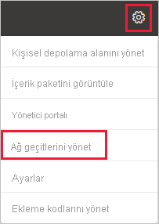

2. Bir ağ geçidi seçin ve sonra da **Veri kaynağı ekle**'yi seçin. İsterseniz **Ağ Geçitleri** > **Veri kaynağı ekle**'ye gidin.

    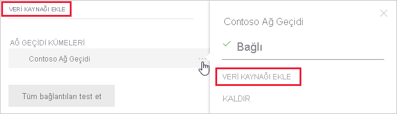

3. **Veri Kaynağı Türü**’nü seçin.

    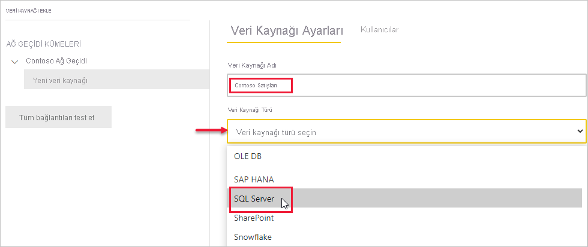

4. Veri kaynağı bilgilerini girin. Bu örnekte **Sunucu**, **Veritabanı** ve diğer bilgiler gereklidir. 

    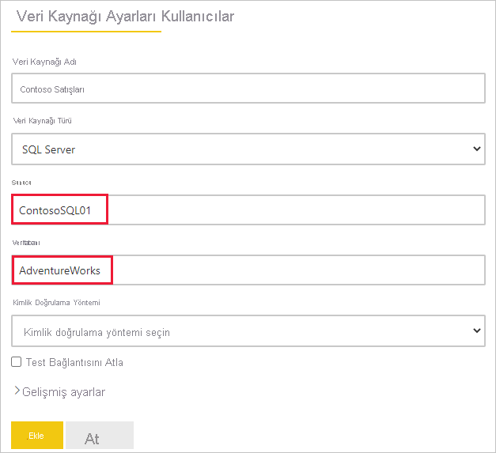

5. SQL Server için **Kimlik Doğrulama Yöntemi** olarak **Windows** veya **Temel**  (SQL Kimlik Doğrulaması) seçeneğini belirtirsiniz. **Temel**’i seçerseniz veri kaynağınızın kimlik bilgilerini girin.

6. **Gelişmiş ayarlar**'ın altında veri kaynağınız için [Çoklu Oturum Açma (SSO)](service-gateway-sso-overview.md) yapılandırmasını yapabilirsiniz. 

    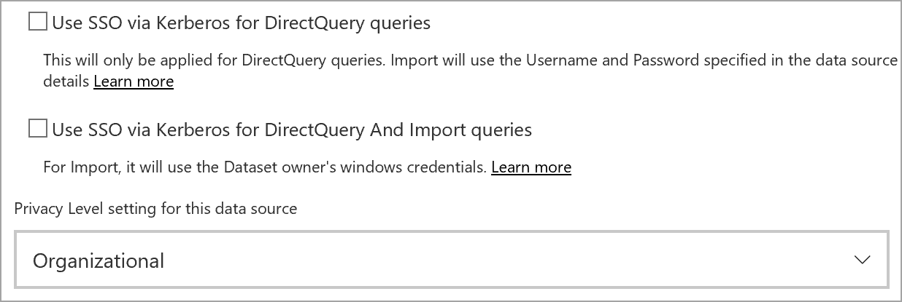

DirectQuery tabanlı raporlar için **DirectQuery sorguları için Kerberos üzerinden SSO kullanın** veya **DirectQuery Ve İçe Aktarma sorguları için Kerberos üzerinden SSO kullan** ve Yenileme tabanlı raporlar için **DirectQuery Ve İçe Aktarma sorguları için Kerberos üzerinden SSO kullan** seçeneklerini yapılandırabilirsiniz.

**DirectQuery sorguları için Kerberos üzerinden SSO kullanın** seçeneğini işaretler ve bu veri kaynağını DirectQuery tabanlı bir rapor için kullanırsanız, Power BI hizmetinde oturum açan (Azure) Active Directory kullanıcısıyla eşlenmiş olan kullanıcı kullanılır. Yenileme tabanlı rapor için **Kullanıcı adı** ve **Parola** alanlarına girdiğiniz kimlik bilgilerini kullanır.

**DirectQuery Ve İçe Aktarma sorguları için Kerberos üzerinden SSO kullan** seçeneğini kullanırsanız kimlik bilgisi belirtmeniz gerekmez. Bu veri kaynağı DirectQuery tabanlı bir rapor için kullanılırsa, Power BI hizmetinde oturum açan (Azure) Active Directory kullanıcısıyla eşlenmiş olan kullanıcı kullanılır.  Yenileme tabanlı rapor için veri kümesi sahibinin güvenlik bağlamı kullanılır.

> [!NOTE]
>İçeri Aktarma Sorguları için SSO yalnızca [Kerberos kısıtlanmış temsil](service-gateway-sso-kerberos.md) kullanan SSO veri kaynaklarının listesiyle kullanılabilir.

7. **Gelişmiş ayarlar** bölümünde, isteğe bağlı olarak veri kaynağınızın [gizlilik düzeyini](https://support.office.com/article/Privacy-levels-Power-Query-CC3EDE4D-359E-4B28-BC72-9BEE7900B540) yapılandırın ([DirectQuery](desktop-directquery-about.md) için geçerli değildir).

    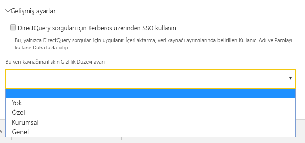

8. **Ekle**'yi seçin. İşlem başarılı olursa *Bağlantı Başarılı* ifadesini görürsünüz.

    

Şimdi bu veri kaynağını kullanarak SQL Server verilerinizi Power BI pano ve raporlarına ekleyebilirsiniz.

## Veri kaynaklarını kaldırma

Artık kullanmıyorsanız veri kaynağını kaldırabilirsiniz. Bir veri kaynağını kaldırmak, o veri kaynağını kullanan panoların ve raporların çalışmamasına yol açar.

Veri kaynağını kaldırmak için veri kaynağına gidin ve **Kaldır**’ı seçin.

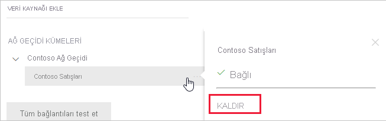

## Veri kaynağını zamanlanmış yenileme veya DirectQuery için kullanma

Veri kaynağı, oluşturulduktan sonra DirectQuery bağlantılarıyla veya zamanlanmış yenileme yoluyla kullanılabilir.

> [!NOTE]
>Şirket içi veri ağ geçidinde bulunan veri kaynağındaki ve Power BI Desktop’taki sunucu ve veritabanı adları eşleşmelidir.

Ağ geçidindeki veri kaynağı ve veri kümeniz arasındaki bağlantı, sunucu ve veritabanı adınızı temel alır. Bu adların eşleşmesi gerekir. Örneğin, Power BI Desktop'ta sunucu adı için bir IP Adresi sağlarsanız bu IP adresini ağ geçidi yapılandırmasındaki veri kaynağında da kullanmanız gerekir. Power BI Desktop'ta *SUNUCU\ÖRNEK* yapılandırmasını kullanırsanız ağ geçidi için yapılandırılan veri kaynağında da aynısını kullanmanız gerekir.

Ağ geçidinde yapılandırılan veri kaynağının **Kullanıcılar** sekmesinde listeleniyorsanız ve sunucu ile veritabanı adı eşleşiyorsa ağ geçidini zamanlanmış yenileme ile kullanılabilen bir seçenek olarak görürsünüz.

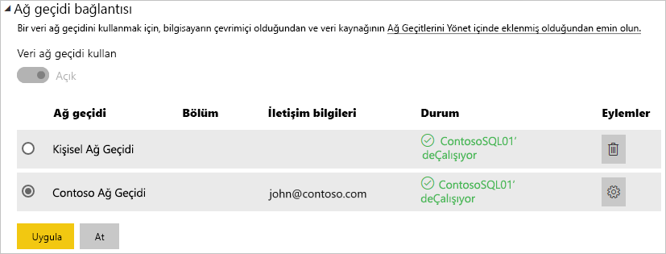

> [!WARNING]
> Veri kümeniz birden çok veri kaynağı içeriyorsa her bir veri kaynağı, ağ geçidine eklenmelidir. Ağ geçidine bir veya daha fazla veri kaynağı eklenmezse ağ geçidini zamanlanmış yenileme için kullanılabilir olarak göremezsiniz.

### Sınırlamalar

OAuth, yalnızca şirket içi veri ağ geçidine sahip özel bağlayıcılara yönelik bir desteklenen kimlik doğrulamasıdır. OAuth kimlik doğrulamasını gerekli kılan diğer veri kaynaklarını ekleyemezsiniz. Veri kümeniz OAuth kimlik doğrulaması gerektiren bir veri kaynağı içeriyorsa ve bu veri kaynağı bir özel bağlayıcı değilse, ağ geçidini zamanlanmış yenileme için kullanamazsınız.

## Kullanıcıları yönetme

Bir ağ geçidine veri kaynağı ekledikten sonra, kullanıcılara ve e-posta özellikli güvenlik gruplarına ilgili veri kaynağı (tüm ağ geçidi değil) için erişim verirsiniz. Veri kaynağı kullanıcı listesi yalnızca veri kaynağından verileri içeren raporları yayımlamasına izin verilen kullanıcıları denetler. Rapor sahipleri panolar, içerik paketleri ve uygulamalar oluşturabilir ve sonra bu öğeleri diğer kullanıcılarla paylaşabilir.

Ayrıca, kullanıcılara ve güvenlik gruplarına ağ geçidi için yönetim erişimi verebilirsiniz.

### Veri kaynağına kullanıcı ekleme

1. Power BI hizmetinin sağ üst köşesinde  > **Ağ geçitlerini yönet** öğesini seçin.

2. Kullanıcıları eklemek istediğiniz veri kaynağını seçin.

3. **Kullanıcılar**’ı seçin ve kuruluşunuzda seçili veri kaynağına erişim vermek istediğiniz kullanıcıyı girin. Örneğin, aşağıdaki ekranda Maggie ve Adam'ı ekliyorsunuz.

    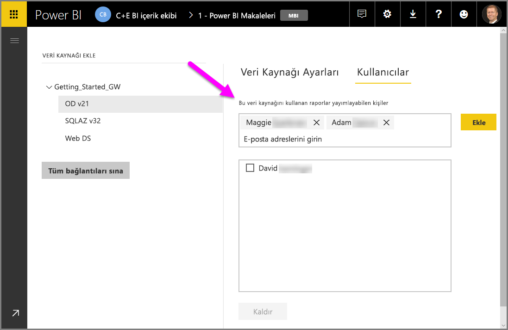

4. **Ekle**’yi seçtiğinizde kutuda eklenen üyenin adı gösterilir.

    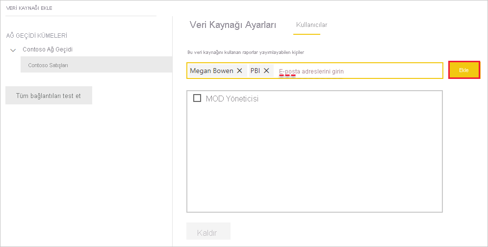

Kullanıcıları, erişim izni vermek istediğiniz her bir veri kaynağına eklemeniz gerektiğini unutmayın. Her veri kaynağının ayrı kullanıcı listesi vardır. Kullanıcıları her veri kaynağına ayrı ayrı ekleyin.

### Veri kaynağından kullanıcıları kaldırma

Veri kaynağının **Kullanıcılar** sekmesinde, bu veri kaynağını kullanan kullanıcıları ve güvenlik gruplarını kaldırabilirsiniz.

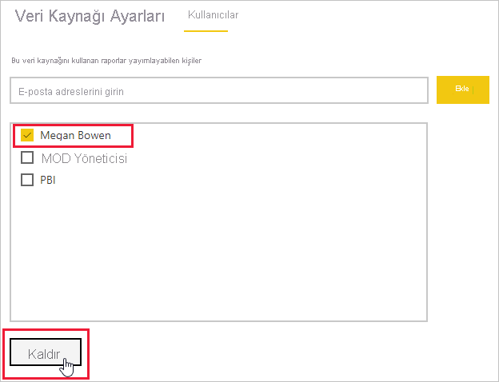

## Şifrelenmiş kimlik bilgilerini bulutta depolama

Ağ geçidine bir veri kaynağı eklediğinizde bu veri kaynağına yönelik kimlik bilgilerini sağlamanız gerekir. Veri kaynağına yönelik tüm sorgular bu kimlik bilgileri kullanılarak çalıştırılır. Kimlik bilgileri güvenli bir şekilde şifrelenir. Bunlar bulutta depolanmadan önce simetrik şifrelemeyle şifrelenir. Böylece bulutta şifrelerinin çözülmesi önlenir. Kimlik bilgileri, şirket içinde ağ geçidini çalıştıran, veri kaynaklarına erişildiği zaman şifrelerinin çözüldüğü makineye gönderilir.

## Kullanılabilir veri kaynağı türlerinin listesi

Şirket içi veri ağ geçidinin desteklediği veri kaynakları hakkında daha fazla bilgi için bkz. [Power BI veri kaynakları](power-bi-data-sources.md).

## Sonraki adımlar

* [Veri kaynağınızı yönetme - Analysis Services](service-gateway-enterprise-manage-ssas.md)
* [Veri kaynağınızı yönetme - SAP HANA](service-gateway-enterprise-manage-sap.md)
* [Veri kaynağınızı yönetme - SQL Server](service-gateway-enterprise-manage-sql.md)
* [Veri kaynağınızı yönetme - Oracle](service-gateway-onprem-manage-oracle.md)
* [Veri kaynağınızı yönetme - İçeri aktarma/Zamanlanmış yenileme](service-gateway-enterprise-manage-scheduled-refresh.md)
* [Veri ağ geçidi dağıtmaya ilişkin yönergeler](service-gateway-deployment-guidance.md)

Başka bir sorunuz mu var? [Power BI Topluluğu](https://community.powerbi.com/)'nu deneyin.
