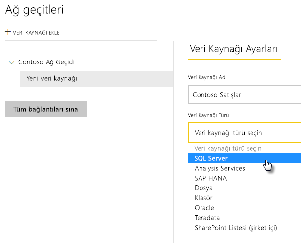
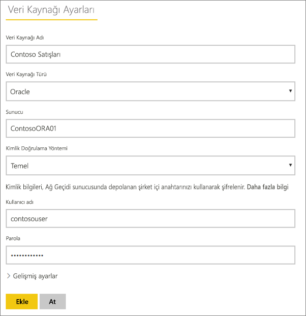

# Veri kaynağınızı yönetme - İçeri aktarma/zamanlanmış yenileme

[!INCLUDE [gateway-rewrite](../includes/gateway-rewrite.md)]

[Şirket içi veri ağ geçidini yükledikten](/data-integration/gateway/service-gateway-install) sonra ağ geçidi ile kullanılabilecek [veri kaynaklarını](service-gateway-data-sources.md#add-a-data-source) eklemeniz gerekir. Bu makale, DirectQuery veya canlı bağlantılardan farklı olarak, zamanlanmış yenileme için kullanılan veri kaynakları ve ağ geçitleri ile nasıl çalışılacağını inceler.

## Veri kaynağı ekleme

Veri kaynağı ekleme hakkında daha fazla bilgi için bkz. [Veri kaynağı ekleme](service-gateway-data-sources.md#add-a-data-source). Veri kaynağı türü seçin.

Listelenen tüm veri kaynağı türleri, şirket içi veri ağ geçidi ile zamanlanmış yenileme için kullanılabilir. Analysis Services, SQL Server ve SAP HANA zamanlanmış yenileme veya DirectQuery/canlı bağlantılar için kullanılabilir.

Ardından, kaynak bilgilerini ve veri kaynağına erişmek için kullanılan kimlik bilgilerini içeren veri kaynağı bilgilerini doldurun.

> [!NOTE]
> Veri kaynağına yönelik tüm sorgular bu kimlik bilgileri kullanılarak çalıştırılır. Kimlik bilgilerinin nasıl depolandığı hakkında daha fazla bilgi edinmek için bkz. [Şifrelenmiş kimlik bilgilerini bulutta depolama](service-gateway-data-sources.md#store-encrypted-credentials-in-the-cloud).

Zamanlanmış yenileme ile kullanabilir olan veri kaynağı türlerinin listesi için [Kullanılabilir veri kaynağı türlerinin listesine](service-gateway-data-sources.md#list-of-available-data-source-types) bakın.

Tüm bilgileri doldurduktan sonra **Ekle**'yi seçin. Artık bu veri kaynağını şirket içi verilerinizle zamanlanmış yenileme için kullanabilirsiniz. İşlem başarılı olursa *Bağlantı Başarılı* iletisini görürsünüz.

### Gelişmiş ayarlar

İsteğe bağlı olarak, veri kaynağınızın gizlilik düzeyini yapılandırabilirsiniz. Bu ayar verilerin nasıl birleştirilebileceğini denetler. Bu ayar yalnızca zamanlanmış yenileme için kullanılır. Veri kaynağınıza ilişkin gizlilik düzeyleri hakkında daha fazla bilgi edinmek için bkz. [Gizlilik düzeyleri (Power Query)](https://support.office.com/article/Privacy-levels-Power-Query-CC3EDE4D-359E-4B28-BC72-9BEE7900B540).

## Veri kaynağını zamanlanmış yenileme için kullanma

Veri kaynağı, oluşturulduktan sonra DirectQuery bağlantılarıyla veya zamanlanmış yenileme yoluyla kullanılabilir.

> [!NOTE]
> Şirket içi veri ağ geçidinde bulunan veri kaynağındaki ve Power BI Desktop’taki sunucu ve veritabanı adları eşleşmelidir.

Ağ geçidindeki veri kaynağı ve veri kümeniz arasındaki bağlantı, sunucu ve veritabanı adınızı temel alır. Bu adların eşleşmesi gerekir. Örneğin, Power BI Desktop'ta sunucu adı için bir IP adresi sağlarsanız ağ geçidi yapılandırmasındaki veri kaynağında da bu IP adresini kullanmanız gerekir. Power BI Desktop'ta *SUNUCU\ÖRNEK* yapılandırmasını kullanırsanız ağ geçidi için yapılandırılan veri kaynağının içinde de bunu kullanmanız gerekir.

Ağ geçidinde yapılandırılan veri kaynağının **Kullanıcılar** sekmesinde yer alıyorsanız ve sunucu adı ile veritabanı adı eşleşiyorsa ağ geçidini zamanlanmış yenileme ile kullanılabilen bir seçenek olarak görürsünüz.

> [!WARNING]
> Veri kümeniz birden çok veri kaynağı içeriyorsa her bir veri kaynağı, ağ geçidine eklenmelidir. Ağ geçidine bir veya daha fazla veri kaynağı eklenmezse ağ geçidini zamanlanmış yenileme için kullanılabilir olarak göremezsiniz.

## Sınırlamalar

OAuth, şirket içi veri ağ geçidi ile desteklenen bir kimlik doğrulama düzeni değildir. OAuth kimlik doğrulamasını gerekli kılan veri kaynakları ekleyemezsiniz. Veri kümeniz OAuth kimlik doğrulaması gerektiren bir veri kaynağı içeriyorsa ağ geçidini zamanlanmış yenileme için kullanamazsınız.

## Sonraki adımlar

* [Şirket içi veri ağ geçidiyle ilgili sorunları giderme](/data-integration/gateway/service-gateway-tshoot)
* [Ağ geçidiyle ilgili sorunları giderme - Power BI](service-gateway-onprem-tshoot.md)

Başka bir sorunuz mu var? [Power BI Topluluğu](https://community.powerbi.com/)'nu deneyin.
