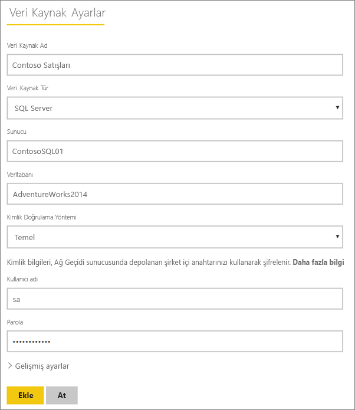
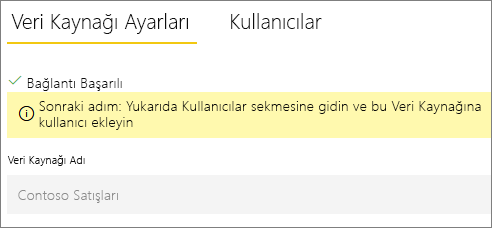
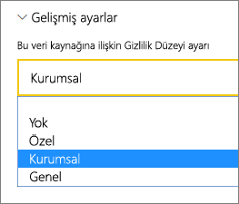
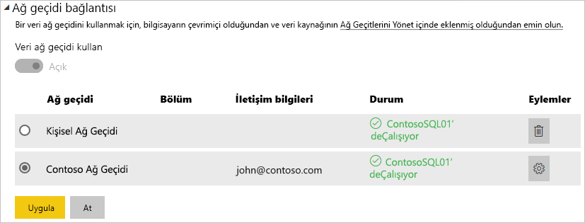

# Manage your data source - SQL Server (Veri kaynağınızı yönetme - SQL Server)

[!INCLUDE [gateway-rewrite](../includes/gateway-rewrite.md)]

[Şirket içi veri ağ geçidini yükledikten](/data-integration/gateway/service-gateway-install) sonra ağ geçidi ile kullanılabilecek [veri kaynaklarını](service-gateway-data-sources.md#add-a-data-source) ekleyebilirsiniz. Bu makalede, zamanlanmış yenileme veya DirectQuery için kullanılan ağ geçitleri ve SQL Server veri kaynaklarıyla nasıl çalışılacağı açıklanır.

## Veri kaynağı ekleme

Veri kaynağı ekleme hakkında daha fazla bilgi için bkz. [Veri kaynağı ekleme](service-gateway-data-sources.md#add-a-data-source). **Veri Kaynağı Türü**’nün altından **SQL Server**’ı seçin.

> [!NOTE]
> DirectQuery kullanılırken, ağ geçidi yalnızca **SQL Server 2012 SP1** ve sonraki sürümlerini destekler.

Ardından, **Sunucu** ve **Veritabanı** bilgilerini de içeren veri kaynağına ilişkin bilgileri doldurun. 

**Kimlik Doğrulama Yöntemi** olarak **Windows** veya **Temel** seçeneklerinden birini belirleyin. Windows kimlik doğrulaması yerine SQL kimlik doğrulamasını kullanmayı düşünüyorsanız **Temel**’i seçin. Ardından, bu veri kaynağı için kullanılacak kimlik bilgilerini girin.

> [!NOTE]
> Kerberos çoklu oturum açma (SSO) özelliği, veri kaynağı için yapılandırılmadığı ve etkinleştirilmediği sürece veri kaynağına yönelik tüm sorgular bu kimlik bilgileri kullanılarak çalıştırılır. SSO ile oturum açıldığında, içeri aktarılan veri kümeleri depolanan kimlik bilgilerini kullanır, ancak DirectQuery veri kümeleri SSO ile sorgu yürütmek için geçerli Power BI kullanıcısını kullanır. Kimlik bilgilerinin nasıl depolandığı hakkında daha fazla bilgi edinmek için bkz. [Şifrelenmiş kimlik bilgilerini bulutta depolama](service-gateway-data-sources.md#store-encrypted-credentials-in-the-cloud). Veya, [Power BI’dan şirket içi veri kaynaklarına kadar SSO (çoklu oturum açma) için Kerberos’u kullanmayı](service-gateway-sso-kerberos.md) açıklayan makaleye göz atın.

Tüm bilgileri doldurduktan sonra **Ekle**'yi seçin. Artık bu veri kaynağını bir şirket içi SQL Server'da zamanlanmış yenileme veya DirectQuery için kullanabilirsiniz. İşlem başarılı olursa *Bağlantı Başarılı* iletisini görürsünüz.

### Gelişmiş ayarlar

İsteğe bağlı olarak, veri kaynağınızın gizlilik düzeyini yapılandırabilirsiniz. Bu ayar verilerin nasıl birleştirilebileceğini denetler. Bu ayar yalnızca zamanlanmış yenileme için kullanılır. Gizlilik düzeyi ayarı DirectQuery için geçerli değildir. Veri kaynağınıza ilişkin gizlilik düzeyleri hakkında daha fazla bilgi edinmek için bkz. [Gizlilik düzeyleri (Power Query)](https://support.office.com/article/Privacy-levels-Power-Query-CC3EDE4D-359E-4B28-BC72-9BEE7900B540).

## Veri kaynağını kullanma

Veri kaynağı, oluşturulduktan sonra DirectQuery bağlantılarıyla veya zamanlanmış yenileme yoluyla kullanılabilir.

> [!NOTE]
> Şirket içi veri ağ geçidinde bulunan veri kaynağındaki ve Power BI Desktop’taki sunucu ve veritabanı adları eşleşmelidir.

Ağ geçidindeki veri kaynağı ve veri kümeniz arasındaki bağlantı, sunucu ve veritabanı adınızı temel alır. Bu adların eşleşmesi gerekir. Örneğin, Power BI Desktop'ta sunucu adı için bir IP adresi sağlarsanız ağ geçidi yapılandırmasındaki veri kaynağında da bu IP adresini kullanmanız gerekir. Power BI Desktop'ta *SUNUCU\ÖRNEK* yapılandırmasını kullanırsanız ağ geçidi için yapılandırılan veri kaynağının içinde bunu kullanmanız gerekir.

Bu gereksinim hem DirectQuery hem de zamanlanmış yenileme için geçerlidir.

### Veri kaynağını DirectQuery bağlantılarıyla kullanma

Sunucu ve veritabanı adlarının, Power BI Desktop'ta ve ağ geçidinin yapılandırılmış veri kaynağında eşleştiğinden emin olun. Ayrıca, DirectQuery veri kümelerini yayımlamak için kullanıcınızın, veri kaynağının **Kullanıcılar** sekmesinde listelendiğinden emin olmanız gerekir. DirectQuery'ye yönelik seçim, Power BI Desktop'ta verileri ilk kez içeri aktardığınız sırada gerçekleşir. DirectQuery’yi kullanma hakkında daha fazla bilgi için [Power BI Desktop'ta DirectQuery’yi kullanma](desktop-use-directquery.md) başlıklı makaleye bakın.

Power BI Desktop'tan veya **Veri Al** seçeneğini kullanarak yayımladığınız raporlarınızla hemen çalışmaya başlayabilirsiniz. Siz ağ geçidinde veri kaynağını oluşturduktan sonra bağlantının kullanılabilir duruma gelmesi için birkaç dakika beklemeniz gerekebilir.

### Zamanlanmış yenileme ile veri kaynağını kullanma

Ağ geçidinde yapılandırılan veri kaynağının **Kullanıcılar** sekmesinde yer alıyorsanız ve sunucu adı ile veritabanı adı eşleşiyorsa ağ geçidini zamanlanmış yenileme ile kullanılabilen bir seçenek olarak görürsünüz.

## Sonraki adımlar

* [SQL Server’da şirket içi verilere bağlanma](service-gateway-sql-tutorial.md)
* [Şirket içi veri ağ geçidiyle ilgili sorunları giderme](/data-integration/gateway/service-gateway-tshoot)
* [Ağ geçidiyle ilgili sorunları giderme - Power BI](service-gateway-onprem-tshoot.md)
* [Power BI’dan şirket içi veri kaynaklarına kadar SSO (çoklu oturum açma) için Kerberos’u kullanma](service-gateway-sso-kerberos.md)

Başka bir sorunuz mu var? [Power BI Topluluğu](https://community.powerbi.com/)'na sorun.
