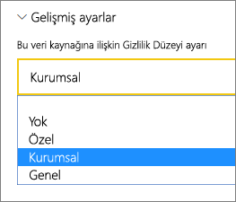

# <a name="manage-your-data-source---analysis-services"></a>Veri kaynağınızı yönetme - Analysis Services

[!INCLUDE [gateway-rewrite](../includes/gateway-rewrite.md)]

[Şirket içi veri ağ geçidini yükledikten](/data-integration/gateway/service-gateway-install) sonra ağ geçidi ile kullanılabilecek [veri kaynaklarını](service-gateway-data-sources.md#add-a-data-source) eklemeniz gerekir. Bu makalede, zamanlanmış yenileme veya canlı bağlantılar için kullanılan ağ geçitleri ve SQL Server Analysis Services (SSAS) veri kaynaklarıyla nasıl çalışılacağı açıklanır.

Analysis Services'e canlı bağlantı ayarlama hakkında daha fazla bilgi edinmek için [bu videoyu izleyin](https://www.youtube.com/watch?v=GPf0YS-Xbyo&feature=youtu.be).

> [!NOTE]
> Bir Analysis Services veri kaynağınız varsa, ağ geçidini Analysis Services sunucunuz ile aynı ormana/etki alanına katılmış bir bilgisayara yüklemeniz gerekir.

## <a name="add-a-data-source"></a>Veri kaynağı ekleme

Veri kaynağı ekleme hakkında bilgi edinmek için bkz. [Veri kaynağı ekleme](service-gateway-data-sources.md#add-a-data-source). Çok boyutlu veya tablolu bir sunucuya bağlanıyorsanız **Veri Kaynağı Türü** olarak **Analysis Services**'i seçin.


Veri kaynağına ilişkin **Sunucu** ve **Veritabanı** bilgilerini doldurun. **Kullanıcı Adı** ve **Parola** için girdiğiniz bilgiler ağ geçidi tarafından Analysis Services örneğine bağlanmak için kullanılır.

> [!NOTE]
> Girdiğiniz Windows hesabı, bağlandığınız Analysis Services örneğindeki Sunucu Yöneticisi rolünün bir üyesi olmalıdır. Bu hesabın parolası, süresi dolacak şekilde ayarlanmışsa kullanıcılar, parolanın veri kaynağı için güncelleştirilmemesi durumunda bağlantı hatası alabilir. Kimlik bilgilerinin nasıl depolandığı hakkında daha fazla bilgi edinmek için bkz. [Şifrelenmiş kimlik bilgilerini bulutta depolama](service-gateway-data-sources.md#store-encrypted-credentials-in-the-cloud).


Tüm bilgileri doldurduktan sonra **Ekle**'yi seçin. Şirket içi bir Analysis Services örneğine yönelik zamanlanmış yenileme veya canlı bağlantılar için bu veri kaynağını kullanabilirsiniz. İşlem başarılı olursa *Bağlantı Başarılı* iletisini görürsünüz.


### <a name="advanced-settings"></a>Gelişmiş ayarlar

İsteğe bağlı olarak, veri kaynağınızın gizlilik düzeyini yapılandırabilirsiniz. Bu ayar verilerin nasıl birleştirilebileceğini denetler. Bu ayar yalnızca zamanlanmış yenileme için kullanılır. Gizlilik düzeyi ayarı canlı bağlantılar için geçerli değildir. Veri kaynağınıza ilişkin gizlilik düzeyleri hakkında daha fazla bilgi edinmek için bkz. [Gizlilik düzeyleri (Power Query)](https://support.office.com/article/Privacy-levels-Power-Query-CC3EDE4D-359E-4B28-BC72-9BEE7900B540).



## <a name="user-names-with-analysis-services"></a>Analysis Services ile kullanıcı adları

<iframe width="560" height="315" src="https://www.youtube.com/embed/Qb5EEjkHoLg" frameborder="0" allowfullscreen></iframe>

Bir kullanıcının Analysis Services'e bağlı bir raporla kurduğu her etkileşimde etkin kullanıcı adı ağ geçidine ve ardından şirket içi Analysis Services sunucunuza geçirilir. Power BI'da oturum açarken kullandığınız e-posta adresi etkin kullanıcı olarak Analysis Services'e geçirilir. Bu adres [EffectiveUserName](/analysis-services/instances/connection-string-properties-analysis-services#bkmk_auth) bağlantı özelliğine geçirilir. 

E-posta adresinin, yerel Active Directory etki alanında tanımlı bir kullanıcı asıl adı (UPN) ile eşleşmesi gerekir. UPN, Active Directory hesabının bir özelliğidir. Windows hesabının bir Analysis Services rolünde yer alması gerekir. Active Directory'de eşleşme bulunamazsa oturum açma işlemi başarılı olmaz. Active Directory ve kullanıcı adlandırması hakkında daha fazla bilgi edinmek için bkz. [Kullanıcı adlandırma öznitelikleri](/windows/win32/ad/naming-properties).

Ayrıca [Power BI oturum açma adınızı yerel dizin UPN'si ile eşleyebilirsiniz](service-gateway-enterprise-manage-ssas.md#map-user-names-for-analysis-services-data-sources).

## <a name="map-user-names-for-analysis-services-data-sources"></a>Analysis Services veri kaynakları için kullanıcı adlarını eşleme

<iframe width="560" height="315" src="https://www.youtube.com/embed/eATPS-c7YRU" frameborder="0" allowfullscreen></iframe>

Power BI, Analytics Services veri kaynakları için kullanıcı adı eşlemesine olanak sağlar. Power BI'da oturum açarken kullanılan bir kullanıcı adını, Analysis Services bağlantısında EffectiveUserName için geçirilen adla eşlemeye yönelik kurallar yapılandırabilirsiniz. Kullanıcı adlarını eşleme özelliği, Azure Active Directory'deki (Azure AD) kullanıcı adınız yerel Active Directory örneğinizdeki bir UPN ile eşleşmediğinde bu sorunu çözmenin etkili bir yoludur. Örneğin e-posta adresiniz nancy@contoso.onmicrsoft.com ise bunu nancy@contoso.com ile eşler ve elde edilen değer ağ geçidine geçirilir.

Analysis Services için kullanıcı adlarını iki farklı şekilde eşleyebilirsiniz:

* Kullanıcıları el ile yeniden eşleme
* Azure AD UPN'lerini Active Directory kullanıcıları ile yeniden eşlemeye (Active Directory arama eşlemesi) yönelik şirket içi Active Directory özellik araması

İkinci yaklaşımı kullanarak el ile eşleme yapmak mümkündür ama bunu yapmak zaman alıcıdır ve bakımı zordur. Desen eşleştirme yeterli olmadığında özellikler zor olur. Örnek olarak Azure AD ile şirket içi Active Directory arasında etki alanı adlarının farklı olması veya Azure AD ile Active Directory arasında kullanıcı hesabı adlarının farklı olması verilebilir. İşte bu nedenle, ikinci yaklaşım kullanılarak el ile eşleme önerilmez.

Bu iki yaklaşımı sırasıyla aşağıdaki iki bölümde açıklayacağız.

### <a name="manual-user-name-remapping"></a>El ile kullanıcı adı yeniden eşlemesi

Analysis Services veri kaynakları için özel UPN kuralları yapılandırabilirsiniz. Power BI hizmeti oturum açma adlarınızın yerel dizin UPN'nizle eşleşmemesi durumunda özel kurallar yardımcı olur. Örneğin, Power BI'da john@contoso.com ile oturum açtığınızda ama yerel dizin UPN'niz john@contoso.local olduğunda john@contoso.local adresinin Analysis Services'e geçirilmesini sağlayacak bir eşleme kuralı yapılandırabilirsiniz.

UPN eşleme ekranına ulaşmak için aşağıdaki adımları izleyin.

1. Dişli simgesine gidip **Ağ Geçitlerini Yönet**'i seçin.
2. Analysis Services veri kaynağını içeren ağ geçidini genişletin. Alternatif olarak, Analysis Services veri kaynağını oluşturmadıysanız bu işlemi bu noktada gerçekleştirebilirsiniz.
3. Veri kaynağını ve ardından **Kullanıcılar** sekmesini seçin.
4. **Kullanıcı adlarını eşle** seçeneğini belirleyin.

    

Belirli bir kullanıcı için kural ekleme ve test etmeye yönelik seçenekler görürsünüz.

> [!NOTE]
> Değiştirmeyi amaçlamadığınız bir kullanıcıyı değiştirebilirsiniz. Örneğin **Değiştir (özgün değer)** contoso.com ve **Şununla (Yeni ad)** @contoso.local olduğunda, oturum açma adında @contoso.com bulunan tüm kullanıcılar @contoso.local ile değiştirilir. Ayrıca **Değiştir (Özgün ad)** dave@contoso.com ve **Şununla (Yeni ad)** dave@contoso.local olduğunda, oturum açma adı v-dave@contoso.com olan kullanıcı v-dave@contoso.local olarak gönderilir.

### <a name="active-directory-lookup-mapping"></a>Active Directory arama eşlemesi

Azure AD UPN'lerini Active Directory kullanıcılarıyla yeniden eşlemek için şirket içi Active Directory özellik arama işlemi gerçekleştirmek üzere bu bölümdeki adımları uygulayın. Başlangıç olarak bunun nasıl çalıştığını gözden geçirelim.

Power BI hizmetinde aşağıdakiler gerçekleşir:

* Bir Power BI Azure AD kullanıcısı tarafından şirket içi SSAS sunucusuna yapılan her sorgu için firstName.lastName@contoso.com gibi bir UPN dizesi geçirilir.

> [!NOTE]
> Power BI veri kaynağı yapılandırmasında tanımlanmış tüm el ile UPN kullanıcı eşlemeleri yine de kullanıcı adı dizesi şirket içi veri ağ geçidine gönderilmeden *önce* uygulanır.

Yapılandırılabilir özel kullanıcı eşlemesi olan şirket içi veri ağ geçidinde bu adımları izleyin.

1. Arama yapılacak Active Directory'yi bulun. Otomatik veya yapılandırılabilir seçeneğini kullanabilirsiniz.
2. Power BI hizmetinden Active Directory kişisinin özniteliğini (örneğin E-posta) arayın. Öznitelik, firstName.lastName@contoso.com gibi bir gelen UPN dizesini temel alır.
3. Active Directory araması başarısız olursa SSAS'ye EffectiveUser olarak geçirilen UPN'yi kullanmayı dener.
4. Active Directory araması başarılı olursa söz konusu Active Directory kullanıcısının UserPrincipalName değerini alır.
5. UserPrincipalName e-postasını SSAS'ye Alias@corp.on-prem.contoso gibi EffectiveUser olarak geçirir.

Active Directory araması yapmak üzere ağ geçidinizi yapılandırmak için:

1. [En yeni ağ geçidini indirin ve yükleyin](/data-integration/gateway/service-gateway-install).

2. Ağ geçidinde şirket içi veri ağ geçidi hizmetini yerel hizmet hesabı yerine bir etki alanı hesabıyla çalışacak şekilde değiştirin. Aksi takdirde Active Directory araması çalışma zamanında düzgün çalışmaz. Makinenizde [şirket içi veri ağ geçidi uygulamasına](/data-integration/gateway/service-gateway-app) ve sonra da **Hizmet ayarları** > **Hizmet hesabını değiştir**'e gidin. Yeni bir ağ geçidi oluşturmak istemediğiniz sürece bu ağ geçidini aynı makinede geri yüklemeniz gerekeceğinden ağ geçidine ilişkin kurtarma anahtarını bildiğinizden emin olun. Değişikliğin geçerli olması için ağ geçidi hizmetini yeniden başlatın.

3. Yazma izinlerine sahip olduğunuzdan emin olmak için ağ geçidinin yüklendiği klasöre (*C:\Program Files\On-premises data gateway*) yönetici olarak gidin. *Microsoft.PowerBI.DataMovement.Pipeline.GatewayCore.dll.config* dosyasını açın.

4. Active Directory kullanıcılarınıza ilişkin Active Directory özniteliği *yapılandırmalarınıza* göre aşağıdaki iki yapılandırma değerini düzenleyin. Aşağıdaki yapılandırma değerleri örnek olarak verilmiştir. Active Directory yapılandırmanız temelinde değerleri belirtin. Bu yapılandırmalar büyük/küçük harfe duyarlıdır, bu nedenle Active Directory'deki değerlerle eşleştiğinden emin olun.

    

    ADServerPath yapılandırması için değer verilmemişse, ağ geçidi varsayılan genel kataloğu kullanır. Ayrıca, ADServerPath için birden çok değer belirtebilirsiniz. Her değer, aşağıdaki örnekte gösterildiği gibi noktalı virgülle ayrılmalıdır:

    ```xml
    <setting name="ADServerPath" serializeAs="String">
        <value> >GC://serverpath1; GC://serverpath2;GC://serverpath3</value>
    </setting>
    ```

    Ağ geçidi, ADServerPath değerlerini bir eşleşme bulana kadar soldan sağa ayrıştırır. Eşleşme bulunmazsa özgün UPN kullanılır. Ağ geçidi hizmetini (PBIEgwService) çalıştıran hesabın, ADServerPath’te belirttiğiniz tüm Active Directory sunucularına yönelik sorgu izinlerine sahip olduğundan emin olun.

    Ağ geçidi aşağıdaki örneklerde gösterildiği gibi iki tür ADServerPath'i destekler:

    **WinNT**

    ```xml
    <value="WinNT://usa.domain.corp.contoso.com,computer"/>
    ```

    **GC**

    ```xml
    <value> GC://USA.domain.com </value>
    ```

5. Yapılandırma değişikliğinin geçerli olması için şirket içi veri ağ geçidi hizmetini yeniden başlatın.

### <a name="work-with-mapping-rules"></a>Eşleme kuralları ile çalışma

Eşleme kuralı oluşturmak için **Özgün ad** ve **Yeni ad** değerlerini belirtmeniz ve ardından **Ekle** seçeneğini belirtmeniz gerekir.

| Alan | Açıklama |
| --- | --- |
| Değiştir (Özgün ad) |Power BI'da oturum açarken kullandığınız e-posta adresi. |
| Şununla (Yeni ad) |Özgün adın yerini almasını istediğiniz değer. Değiştirme işleminin sonucu Analysis Services bağlantısı için EffectiveUserName özelliğine geçirilen değerdir. |


Listede bir öğe seçtiğinizde köşeli çift ayraç simgelerini kullanarak öğeyi yeniden sıralamayı tercih edebilirsiniz. Ayrıca isterseniz girdiyi silebilirsiniz.


### <a name="use-a-wildcard"></a>Joker karakter kullanma

**Değiştir (Özgün ad)** dizeniz için joker karakter (*) kullanabilirsiniz. Joker karakter yalnızca tek başına kullanılabilir, diğer herhangi bir dize bölümüyle kullanılamaz. Tüm kullanıcılarınızı alıp veri kaynağına tek bir değer geçirmek istiyorsanız joker karakter kullanın. Bu yaklaşım, kuruluşunuzdaki tüm kullanıcıların yerel ortamınızda aynı kullanıcı adını kullanmasını istediğinizde yararlıdır.

### <a name="test-a-mapping-rule"></a>Bir eşleme kuralını test etme

Hangi özgün adın değiştirileceğini doğrulamak için **Özgün ad** alanına bir değer girin. **Kuralı test et**'i seçin.


> [!NOTE]
> Kurallar kaydedildikten sonra hizmetin bunları kullanmaya başlaması birkaç dakika sürer. Kural tarayıcıda anında çalışmaya başlar.

### <a name="limitations-for-mapping-rules"></a>Eşleme kurallarına ilişkin sınırlamalar

Eşleme, yapılandırılmakta olan belirli bir veri kaynağına yönelik olarak gerçekleştirilir. Bu genel bir ayar değildir. Birden çok Analysis Services veri kaynağınız varsa kullanıcıları her veri kaynağına yönelik olarak eşlemeniz gerekir.

## <a name="authentication-to-a-live-analysis-services-data-source"></a>Canlı bir Analysis Services veri kaynağına yönelik kimlik doğrulaması

Bir kullanıcı Analysis Services ile her etkileşim kurduğunda, etkin kullanıcı adı ağ geçidi üzerinden şirket içi Analysis Services sunucunuza iletilir. Genellikle bulutta oturum açarken kullandığınız e-posta adresi olan UPN etkin kullanıcı olarak Analysis Services'e geçirilir. UPN, EffectiveUserName bağlantı özelliği ile geçirilir. 

Bu e-posta adresinin, yerel Active Directory etki alanında tanımlı bir UPN ile eşleşmesi gerekir. UPN, Active Directory hesabının bir özelliğidir. İlgili Windows hesabının, sunucu erişimi kazanmak için bir Analysis Services rolünde olması gerekir. Active Directory'de eşleşme bulunmazsa oturum açma işlemi başarılı olmaz.

Ayrıca, Analysis Services bu hesaba dayalı filtreleme olanağı sağlayabilir. Fitreleme, rol tabanlı güvenlikle veya satır düzeyi güvenlikle gerçekleşebilir.

## <a name="role-based-security"></a>Rol tabanlı güvenlik

Modeller, kullanıcı rollerine göre güvenlik sağlar. Roller, belirli bir model projesi için SQL Server Veri Araçları - Business Intelligence'ta yazma sırasında veya model dağıtıldıktan sonra SQL Server Management Studio kullanılarak tanımlanır. Roller, Windows kullanıcı adı veya Windows grubuna göre üyeler içerir. Roller, bir kullanıcının modelde sorgulama yapma veya eylem gerçekleştirme izinlerini tanımlar. Çoğu kullanıcı okuma izinlerine sahip bir role aittir. Diğer roller; öğeleri işleme, veritabanı işlevlerini yönetme ve diğer rolleri yönetme izinlerine sahip yöneticilere yöneliktir.

## <a name="row-level-security"></a>Satır düzeyi güvenlik

Satır düzeyi güvenlik, Analysis Services satır düzeyi güvenliğine özgüdür. Modeller dinamik, satır düzeyi güvenlik sağlayabilir. Kullanıcıların ait olduğu en az bir rol bulunan durumların aksine dinamik güvenlik, herhangi bir tablolu model için gerekli değildir. Üst düzeyde ele alındığında dinamik güvenlik, kullanıcıların bir tablodaki belirli bir satıra ilişkin verilere okuma erişimini tanımlar. Rollere benzer şekilde dinamik satır düzeyi güvenlik, kullanıcıların Windows kullanıcı adlarını kullanır.

Kullanıcının model verilerini sorgulayabilme ve görüntüleyebilme becerisi şunlara bağlıdır:

- Windows kullanıcı hesaplarının üye olduğu roller.
- Yapılandırıldıysa, dinamik satır düzeyi güvenlik.

Modellerde rol ve dinamik satır düzeyi güvenlik uygulaması, bu makalede ele alınmamıştır. Daha fazla bilgi edinmek için MSDN'deki [Roller (SSAS Tablosu)](/analysis-services/tabular-models/roles-ssas-tabular) ve [Güvenlik Rolleri (Analysis Services - Çok boyutlu veriler)](/analysis-services/multidimensional-models/olap-logical/security-roles-analysis-services-multidimensional-data) konularını gözden geçirin. Tablolu model güvenliğini en ayrıntılı şekilde kavramak için [Tablolu BI Anlam Modelinin Güvenliğini Sağlama teknik incelemesini](https://download.microsoft.com/download/D/2/0/D20E1C5F-72EA-4505-9F26-FEF9550EFD44/Securing%20the%20Tabular%20BI%20Semantic%20Model.docx) indirin ve okuyun.

## <a name="what-about-azure-ad"></a>Azure AD için ne söylenebilir?

Microsoft bulut hizmetleri, kullanıcıların kimliklerini doğrulamak için [Azure AD](/azure/active-directory/fundamentals/active-directory-whatis)'yi kullanır. Azure AD, kullanıcı adlarının ve güvenlik gruplarının bulunduğu kiracıdır. Genellikle, kullanıcının oturum açmak için kullandığı e-posta adresi hesabın UPN'si ile aynıdır.

## <a name="what-is-the-role-of-my-local-active-directory-instance"></a>Yerel Active Directory örneğimin rolü nedir?

Analysis Services'in, buraya bağlanan bir kullanıcının veri okuma izinlerine sahip bir role ait olup olmadığını belirlemesi için sunucunun Azure AD'den ağ geçidine ve daha sonra Analysis Services sunucusuna geçirilen etkin kullanıcı adını dönüştürmesi gerekir. Analysis Services sunucusu, etkin kullanıcı adını bir Windows Active Directory etki alanı denetleyicisine (DC) geçirir. Ardından Active Directory DC etkin kullanıcı adının yerel hesapta geçerli bir UPN olduğunu onaylar. Söz konusu kullanıcının Windows kullanıcı adını Analysis Services sunucusuna geri döndürür.

EffectiveUserName, etki alanına katılmamış bir Analysis Services sunucusunda kullanılamaz. Oturum açma hatalarından kaçınmak için Analysis Services sunucusunun bir etki alanına katılmış olması gerekir.

## <a name="how-do-i-tell-what-my-upn-is"></a>UPN'min ne olduğunu nasıl anlarım?

UPN'nizin ne olduğunu bilmeyebilir ve bir etki alanı yöneticisi olmayabilirsiniz. Hesabınızın UPN'sini bulmak için iş istasyonunuzdan aşağıdaki komutu çalıştırabilirsiniz.

```dos
whoami /upn
```

Sonuç e-posta adresi gibi görünür ama bu etki alanı hesabınızdaki UPN'dir. Canlı bağlantılar için Analysis Services veri kaynağı kullanıyorsanız ve bu UPN Power BI'da oturum açmak için kullandığınız e-posta adresiyle eşleşmiyorsa [kullanıcı adlarını eşlemeyi](#map-user-names-for-analysis-services-data-sources) öğrenmek isteyebilirsiniz.

## <a name="synchronize-an-on-premises-active-directory-with-azure-ad"></a>Bir şirket içi Active Directory hesabını Azure AD ile eşitleme

Analysis Services canlı bağlantıları kullanmayı planlıyorsanız yerel Active Directory hesaplarınız Azure AD ile eşleşmelidir. UPN'nin hesaplar arasında eşleşmesi gerekir.

Bulut hizmetleri yalnızca Azure AD'deki hesapları tanır. Yerel Active Directory örneğinize bir hesap eklemeniz önemli değildir. Hesap Azure AD'de bulunmuyorsa kullanılamaz. Yerel Active Directory hesaplarınızı Azure AD ile eşlemeye yönelik farklı yöntemler bulunmaktadır:

- Hesapları Azure AD'ye el ile ekleyebilirsiniz.

   Azure portalı veya Microsoft 365 yönetim merkezinde bir hesap oluşturabilirsiniz. Böylece hesap adı, yerel Active Directory hesabının UPN’si ile eşleşir.

- Yerel hesapları Azure AD kiracınızla eşitlemek için [Azure AD Connect](/azure/active-directory/hybrid/how-to-connect-sync-whatis) aracını kullanabilirsiniz.

   Azure AD Connect aracı, dizini eşitlemeye ve kimlik doğrulamasını ayarlamaya yönelik seçenekler sunar. Seçenekler parola karması eşitlemeyi, geçiş kimlik doğrulamasını ve federasyonu içerir. Yönetici veya yerel etki alanı yöneticisi değilseniz, yapılandırmada yardım almak için BT yöneticinize başvurun.

   Azure AD Connect, UPN'nin Azure AD ile yerel Active Directory örneğiniz arasında eşleşmesini sağlar.

> [!NOTE]
> Hesapların Azure AD Connect aracı ile eşitlenmesi, Azure AD kiracınızda yeni hesaplar oluşturur.

## <a name="use-the-data-source"></a>Veri kaynağını kullanma

Veri kaynağı, oluşturulduktan sonra canlı bağlantılarla veya zamanlanmış yenileme yoluyla kullanılabilir.

> [!NOTE]
> Şirket içi veri ağ geçidinde bulunan veri kaynağındaki ve Power BI Desktop’taki sunucu ve veritabanı adı eşleşmelidir.

Ağ geçidindeki veri kaynağı ve veri kümeniz arasındaki bağlantı, sunucu ve veritabanı adınızı temel alır. Bu adların eşleşmesi gerekir. Örneğin, Power BI Desktop'ta sunucu adı için bir IP adresi sağlarsanız ağ geçidi yapılandırmasındaki veri kaynağında da bu IP adresini kullanmanız gerekir. Power BI Desktop'ta *SUNUCU\ÖRNEK* yapılandırmasını kullanırsanız ağ geçidi için yapılandırılan veri kaynağının içinde de bunu kullanmanız gerekir.

Bu gereksinim hem canlı bağlantılar hem de zamanlanmış yenileme için geçerlidir.

### <a name="use-the-data-source-with-live-connections"></a>Veri kaynağını canlı bağlantılarla kullanma

Sunucu ve veritabanı adının, Power BI Desktop'ta ve ağ geçidinin yapılandırılmış veri kaynağında eşleştiğinden emin olun. Ayrıca, canlı bağlantı veri kümelerini yayımlamak için veri kaynağının **Kullanıcılar** sekmesinde kullanıcınızın listelendiğinden emin olmanız gerekir. Canlı bağlantılara yönelik seçim, verileri ilk kez içeri aktardığınızda Power BI Desktop içinde gerçekleşir.

Power BI Desktop'tan veya **Veri Al** seçeneğini kullanarak yayımladığınız raporlarınızla hemen çalışmaya başlayabilirsiniz. Siz ağ geçidinde veri kaynağını oluşturduktan sonra bağlantının kullanılabilir duruma gelmesi için birkaç dakika beklemeniz gerekebilir.

### <a name="use-the-data-source-with-scheduled-refresh"></a>Zamanlanmış yenileme ile veri kaynağını kullanma

Ağ geçidinde yapılandırılan veri kaynağının **Kullanıcılar** sekmesinde yer alıyorsanız ve sunucu ile veritabanı adı eşleşiyorsa ağ geçidini zamanlanmış yenileme ile kullanılabilen bir seçenek olarak görürsünüz.


### <a name="limitations-of-analysis-services-live-connections"></a>Analysis Services canlı bağlantılarına ilişkin sınırlamalar

Tablolu veya çok boyutlu örnekler için bir canlı bağlantı kullanabilirsiniz.

| **Sunucu sürümü** | **Gerekli SKU** |
| --- | --- |
| 2012 SP1 CU4 veya sonraki sürümler |İş Zekası ve Enterprise SKU'su |
| 2014 |İş Zekası ve Enterprise SKU'su |
| 2016 |Standart SKU veya sonraki sürümleri |

* Hücre düzeyinde biçimlendirme ve çeviri özellikleri desteklenmez.
* Eylemler ve adlandırılmış kümeler Power BI'ın kullanımına sunulmaz. Yine de eylemleri veya adlandırılmış kümeleri de içeren çok boyutlu küplere bağlanabilir, görseller ve raporlar oluşturabilirsiniz.

## <a name="next-steps"></a>Sonraki adımlar

* [Şirket içi veri ağ geçidiyle ilgili sorunları giderme](/data-integration/gateway/service-gateway-tshoot)
* [Ağ geçidiyle ilgili sorunları giderme - Power BI](service-gateway-onprem-tshoot.md)

Başka bir sorunuz mu var? [Power BI Topluluğu](https://community.powerbi.com/)'nu deneyin.
