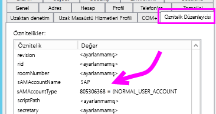
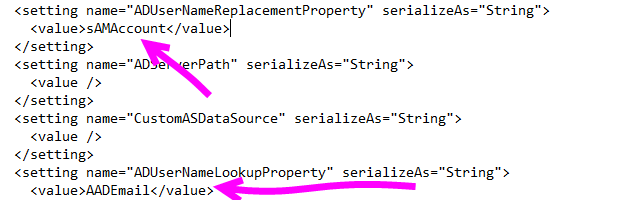
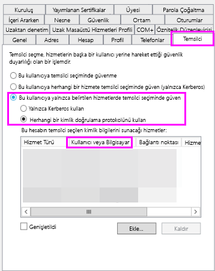
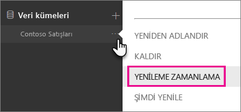
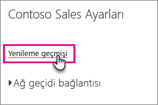
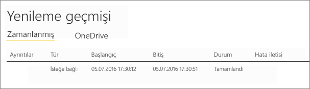
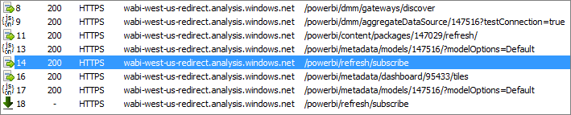

# <a name="troubleshoot-gateways---power-bi"></a>Ağ geçidiyle ilgili sorunları giderme - Power BI

[!INCLUDE [gateway-rewrite](../includes/gateway-rewrite.md)]

Bu makalede, şirket içi veri ağ geçidini Power BI ile kullanırken karşılaştığınız bazı yaygın sorunlar ele alınır. Burada listelenmeyen bir sorunla karşılaşırsanız Power BI [Topluluk](https://community.powerbi.com) sitesini kullanabilirsiniz. Öte yandan bir [destek bileti](https://powerbi.microsoft.com/support) de oluşturabilirsiniz.

## <a name="configuration"></a>Yapılandırma

### <a name="error-power-bi-service-reported-local-gateway-as-unreachable-restart-the-gateway-and-try-again"></a>Hata: Power BI hizmeti yerel ağ geçidine erişilemediğini bildirdi. Ağ geçidini yeniden başlatıp bir kez daha deneyin.

Yapılandırma işleminin sonunda Power BI hizmeti, ağ geçidini doğrulamak için tekrar çağrılır. Power BI hizmeti ağ geçidinin durumunu canlı olarak bildirmez. Windows hizmetinin yeniden başlatılması, iletişimin başarılı olmasını sağlayabilir. Daha fazla bilgi edinmek için [Şirket içi veri ağ geçidi uygulamasından günlükleri toplama](/data-integration/gateway/service-gateway-tshoot#collect-logs-from-the-on-premises-data-gateway-app) bölümünde açıklandığı gibi günlükleri toplayıp gözden geçirebilirsiniz.

## <a name="data-sources"></a>Veri kaynakları

### <a name="error-unable-to-connect-details-invalid-connection-credentials"></a>Hata: Bağlanılamıyor. Ayrıntılar: "Bağlantı kimlik bilgileri geçersiz"

**Ayrıntıları göster** bölümünde, veri kaynağından alınan hata iletisi görüntülenir. SQL Server için aşağıdakine benzer bir hata iletisiyle karşılaşırsınız:

    Login failed for user 'username'.

Doğru kullanıcı adına ve parolaya sahip olduğunuzdan emin olun. Ayrıca, bu kimlik bilgileriyle veri kaynağına başarılı bir şekilde bağlanabildiğinizi de doğrulayın. Kullanılmakta olan hesabın, kimlik doğrulama yöntemiyle eşleştiğinden emin olun.

### <a name="error-unable-to-connect-details-cannot-connect-to-the-database"></a>Hata: Bağlanılamıyor. Ayrıntılar: "Veritabanına bağlanılamıyor"

Sunucuya bağlanabildiğinizi ancak belirtilen veritabanına bağlanamadığınızı gösterir. Veritabanının adını ve kullanıcı kimlik bilgilerinin söz konusu veritabanına erişmek için uygun izinlere sahip olduğunu doğrulayın.

**Ayrıntıları göster** bölümünde, veri kaynağından alınan hata iletisi görüntülenir. SQL Server için aşağıdakine benzer bir hata iletisiyle karşılaşırsınız:

    Cannot open database "AdventureWorks" requested by the login. The login failed. Login failed for user 'username'.

### <a name="error-unable-to-connect-details-unknown-error-in-data-gateway"></a>Hata: Bağlanılamıyor. Ayrıntılar: "Veri ağ geçidinde bilinmeyen hata oluştu"

Bu hata farklı nedenlerden kaynaklanıyor olabilir. Söz konusu veri kaynağına, ağ geçidini barındıran makineden bağlanabildiğinizi doğruladığınızdan emin olun. Bu durum sunucuya erişilememesinden kaynaklanıyor olabilir.

**Ayrıntıları Göster** bölümünde şu hata kodunu görebilirsiniz: **DM_GWPipeline_UnknownError**.

Daha fazla bilgi için **Olay Günlükleri** > **Uygulama ve Hizmet Günlükleri** > **Şirket içi veri ağ geçidi hizmeti** bölümüne de göz atabilirsiniz.

### <a name="error-we-encountered-an-error-while-trying-to-connect-to-server-details-we-reached-the-data-gateway-but-the-gateway-cant-access-the-on-premises-data-source"></a>Hata: \<Sunucuya\> bağlanmaya çalışırken bir hata ile karşılaştık. Ayrıntılar: "Veri ağ geçidi hizmetine eriştik ancak ağ geçidi, şirket içinde veri kaynağına erişemiyor."

Belirtilen veri kaynağına bağlanamadığınızı gösterir. Söz konusu veri kaynağı için sağlanan bilgileri doğruladığınızdan emin olun.

**Ayrıntıları Göster** bölümünde şu hata kodunu görebilirsiniz: **DM_GWPipeline_Gateway_DataSourceAccessError**.

Temel alınan hata iletisi aşağıdakine benzerse bu veri kaynağı için kullandığınız hesabın, ilgili Analysis Services örneği için bir sunucu yöneticisi olmadığı anlamına gelir. Daha fazla bilgi için bkz. [Analysis Services örneğine sunucu yöneticisi hakları verme](https://docs.microsoft.com/sql/analysis-services/instances/grant-server-admin-rights-to-an-analysis-services-instance).

    The 'CONTOSO\account' value of the 'EffectiveUserName' XML for Analysis property is not valid.

Temel alınan hata iletisi aşağıdakine benzerse bu Analysis Services'e ilişkin hizmet hesabında [token-groups-global-and-universal](/windows/win32/adschema/a-tokengroupsglobalanduniversal) (TGGAU) dizin özniteliğinin eksik olduğu anlamına gelebilir.

    The username or password is incorrect.

Windows 2000 öncesi uyumluluk erişimine sahip etki alanlarında TGGAU özniteliği etkindir. Yeni oluşturulan etki alanlarının çoğunda bu öznitelik varsayılan olarak etkin değildir. Daha fazla bilgi için bkz. [Bazı uygulamalar ve API'ler hesap nesneleriyle ilgili yetkilendirme bilgilerine erişim gerektirir](https://support.microsoft.com/kb/331951).

Özniteliğin etkinleştirildiğini doğrulamak için şu adımları izleyin.

1. SQL Server Management Studio'daki Analysis Services makinesine bağlanın. Gelişmiş bağlantı özellikleri bölümünde, söz konusu kullanıcı için EffectiveUserName özelliğini ekleyin ve bu eklemenin hatayı yeniden oluşturup oluşturmadığına bakın.
2. Özniteliğin listelenip listelenmediğini doğrulamak için dsacls Active Directory aracını kullanabilirsiniz. Bu araç bir etki alanı denetleyicisinde bulunur. Hesaba ilişkin ayırt edici etki alanı adının ne olduğunu bilmeniz ve bu adı araca iletmeniz gerekir.

        dsacls "CN=John Doe,CN=UserAccounts,DC=contoso,DC=com"

    Aşağıdakine benzer bir sonuç elde etmelisiniz:

            Allow BUILTIN\Windows Authorization Access Group
                                          SPECIAL ACCESS for tokenGroupsGlobalAndUniversal
                                          READ PROPERTY

Bu sorunu gidermek üzere, Analysis Services Windows hizmeti için kullanılan hesapta TGGAU özniteliğini etkinleştirmeniz gerekir.

#### <a name="another-possibility-for-the-username-or-password-is-incorrect"></a>"Kullanıcı adı veya parola yanlış olabilir" hatası için bir diğer olasılık.

Bu hata, Analysis Services sunucusunun kullanıcılardan farklı bir etki alanında olması ve iki yönlü bir güven ilişkisinin kurulmamış olmasından kaynaklanıyor olabilir.

Etki alanları arasındaki güven ilişkisini doğrulamak için etki alanı yöneticilerinizle iletişim kurun.

#### <a name="unable-to-see-the-data-gateway-data-sources-in-the-get-data-experience-for-analysis-services-from-the-power-bi-service"></a>Power BI hizmetinde Analysis Services'e yönelik Veri Al deneyiminde veri ağ geçidi veri kaynakları görüntülenmiyor

Hesabınızın, ağ geçidi yapılandırmasındaki veri kaynağının **Kullanıcılar** sekmesinde listelendiğinden emin olun. Ağ geçidine erişiminiz yoksa ağ geçidi yöneticisiyle iletişime geçerek bu bilgiyi doğrulamasını isteyin. Analysis Services listesinde görüntülenen veri kaynağını yalnızca **Kullanıcılar** listesinde bulunan hesaplar görebilir.

### <a name="error-you-dont-have-any-gateway-installed-or-configured-for-the-data-sources-in-this-dataset"></a>Hata: Bu veri kümesindeki veri kaynakları için yüklü veya yapılandırılmış ağ geçidiniz yok.

Ağ geçidine [Veri kaynağı ekle](service-gateway-data-sources.md#add-a-data-source) bölümünde açıklandığı gibi bir veya daha fazla veri kaynağı eklediğinizden emin olun. **Ağ geçitlerini yönet** bölümünde ağ geçidi görünmüyorsa tarayıcınızın önbelleğini temizleyin veya hizmette oturumunuzu kapatıp yeniden oturum açın.

## <a name="datasets"></a>Veri kümeleri

### <a name="error-there-is-not-enough-space-for-this-row"></a>Hata: Bu satır için yeterli alan yok.

Satırlarınızdan birinin boyutu 4 MB'tan fazlaysa bu hatayla karşılaşırsınız. Veri kaynağınızda söz konusu satırı belirleyip filtreleyin veya satırın boyutunu azaltın.

### <a name="error-the-server-name-provided-doesnt-match-the-server-name-on-the-sql-server-ssl-certificate"></a>Hata: Sağlanan sunucu adı SQL Server SSL sertifikasındaki sunucu adından farklı.

Sertifika ortak adı olarak sunucunun tam etki alanı adı (FQDN) yerine yalnızca sunucunun NetBIOS adını sağladığınızda bu hatayla karşılaşabilirsiniz. Bu durum sertifikanın eşleşmemesine neden olur. Bu sorunu gidermek için ağ geçidi veri kaynağındaki ve PBIX dosyasındaki sunucu adını, sunucunun FQDN'sini kullanacak şekilde ayarlayın.

### <a name="error-you-dont-see-the-on-premises-data-gateway-present-when-you-configure-scheduled-refresh"></a>Hata: Zamanlanmış yenilemeyi yapılandırırken şirket içi veri ağ geçidi seçeneğini görmüyorsunuz.

Bu hatadan sorumlu olabilecek birkaç farklı senaryo vardır:

- Power BI Desktop'ta ve ağ geçidi için yapılandırılan veri kaynağında girilen sunucu ve veritabanı adları eşleşmiyor olabilir. Bu adların aynı olması gerekir. Bunlar büyük/küçük harfe duyarlı değildir.
- Hesabınız, ağ geçidi yapılandırmasındaki veri kaynağının **Kullanıcılar** sekmesinde yer almıyor olabilir. Ağ geçidinin yöneticisi tarafından bu listeye eklenmeniz gerekir.
- Power BI Desktop dosyanızda birden fazla veri kaynağı vardır ve bu veri kaynaklarının tümü ağ geçidiyle yapılandırılmamış olabilir. Ağ geçidinin zamanlanmış yenilemede görünmesi için veri kaynaklarından her birinin söz konusu ağ geçidiyle tanımlanmış olması gerekir.

### <a name="error-the-received-uncompressed-data-on-the-gateway-client-has-exceeded-the-limit"></a>Hata: Ağ geçidi istemcisindeki alınan sıkıştırılmamış veriler, sınırı aştı.

Tablo başına sıkıştırılmamış veri sınırı tam olarak 10 GB'tır. Bu sorunla karşılaşmanız durumunda, iyileştirme yapmak ve sorunu önlemek için tercih edebileceğiniz bazı iyi seçenekler vardır. Özel olarak, üst düzeyde sabit, uzun dize değerlerinin kullanımını azaltın ve bunun yerine normalleştirilmiş anahtar kullanın. Öte yandan kullanımda olmayan sütunu kaldırmak da yararlı olabilir.

## <a name="reports"></a>Raporlar

### <a name="error-report-could-not-access-the-data-source-because-you-do-not-have-access-to-our-data-source-via-an-on-premises-data-gateway"></a>Hata: Raporlar, şirket içi veri ağ geçidi üzerinden veri kaynağımıza erişiminiz olmadığı için veri kaynağına erişemeyebilir.

Bu hataya genellikle aşağıdakilerden biri neden olur:

- Veri kaynağı bilgileri, temel alınan veri kümesindeki bilgilerle eşleşmiyordur. Şirket içi veri ağ geçidi için tanımlanan veri kaynağındaki sunucu ve veritabanı adı bilgileriyle Power BI Desktop'ta sağlanan bilgilerin eşleşmesi gerekir. Power BI Desktop’ta bir IP adresi kullanıyorsanız şirket içi veri ağ geçidine ilişkin veri kaynağında da bir IP adresi kullanılmalıdır.
- Kuruluşunuzdaki herhangi bir ağ geçidinde veri kaynağı yoktur. Veri kaynağını yeni veya var olan bir ağ geçidinde ya da şirket içi veri ağ geçidinde yapılandırabilirsiniz.

### <a name="error-data-source-access-error-please-contact-the-gateway-administrator"></a>Hata: Veri kaynağı erişim hatası. Lütfen ağ geçidi yöneticisiyle iletişime geçin.

Bu raporda canlı bir Analysis Services bağlantısı kullanılıyorsa sorun EffectiveUserName özelliğine iletilen bir değerin geçerli olmamasından veya Analysis Services makinesinde izinlere sahip olmamasından kaynaklanıyor olabilir. Genellikle kimlik doğrulama sorunları, EffectiveUserName özelliğine iletilen değerin yerel bir kullanıcı asıl adı (UPN) ile eşleşmemesinden kaynaklanır.

Etkin kullanıcı adını onaylamak için şu adımları izleyin.

1. [Ağ geçidi günlüklerinde](/data-integration/gateway/service-gateway-tshoot#collect-logs-from-the-on-premises-data-gateway-app) etkin kullanıcı adını bulun.
2. Değeriniz geçirildikten sonra değerin doğru olduğunu onaylayın. Değer kullanıcınıza aitse bir komut isteminde aşağıdaki komutu kullanarak kullanıcı asıl adını görebilirsiniz. UPN bir e-posta adresine benzer.

        whoami /upn

İsterseniz Power BI'ın Azure Active Directory'den alacağı değeri görebilirsiniz.

1. [https://developer.microsoft.com/graph/graph-explorer](https://developer.microsoft.com/graph/graph-explorer) adresine göz atın.
2. Sağ üst köşede **Oturum aç**'ı seçin.
3. Aşağıdaki sorguyu çalıştırın. Daha kapsamlı bir JSON yanıtı alırsınız.

        https://graph.windows.net/me?api-version=1.5
4. **userPrincipalName** değerini bulun.

Azure Active Directory kullanıcı asıl adınız yerel Active Directory kullanıcı asıl adınızla eşleşmezse geçerli bir değerle değiştirmek için [Kullanıcı adlarını eşle](service-gateway-enterprise-manage-ssas.md#map-user-names-for-analysis-services-data-sources) özelliğini kullanabilirsiniz. Alternatif olarak, kullanıcı asıl adınızı değiştirmek için kiracı yöneticinizle veya yerel Active Directory yöneticinizle iletişime geçebilirsiniz.

## <a name="kerberos"></a>Kerberos

Temel veritabanı sunucusu ve şirket içi veri ağ geçidi [Kerberos kısıtlanmış temsili](service-gateway-sso-kerberos.md) için düzgün yapılandırılmadıysa ağ geçidinde [ayrıntılı günlüğü](/data-integration/gateway/service-gateway-performance#slow-performing-queries) etkinleştirin. Ardından sorunu gidermek için başlangıç noktası olarak ağ geçidinin günlük dosyalarındaki hatalar veya izlemeler temelinde araştırma yapın. Görüntülenecek ağ geçidi günlüklerini toplamak için bkz. [Şirket içi veri ağ geçidi uygulamasında günlükleri toplama](/data-integration/gateway/service-gateway-tshoot#collect-logs-from-the-on-premises-data-gateway-app).

### <a name="impersonationlevel"></a>ImpersonationLevel

ImpersonationLevel, SPN kurulumu veya yerel ilke ayarıyla ilgilidir.

```
[DataMovement.PipeLine.GatewayDataAccess] About to impersonate user DOMAIN\User (IsAuthenticated: True, ImpersonationLevel: Identification)
```

**Çözüm**

Sorunu çözmek için şu adımları izleyin.

1. Şirket içi ağ geçidi için bir SPN ayarlayın.
2. Active Directory’nizde kısıtlanmış temsil ayarlayın.

### <a name="failedtoimpersonateuserexception-failed-to-create-windows-identity-for-user-userid"></a>FailedToImpersonateUserException: Kullanıcının kullanıcı kimliği için Windows kimliği oluşturulamadı

Başka bir kullanıcı adına kimliğe bürünemiyorsanız FailedToImpersonateUserException oluşur. Kimliğine bürünmeye çalıştığınız hesap, ağ geçidi hizmeti etki alanının bulunduğu etki alanından başka bir etki alanından geliyorsa bu hata oluşabilir. Bu bir sınırlamadı.

**Çözüm**

* Yapılandırmanın, önceki "ImpersonationLevel" bölümünde verilen adımlara göre doğru olduğundan emin olun.
* Kimliğine bürünmeye çalıştığı kullanıcı kimliğinin geçerli bir Active Directory hesabı olduğundan emin olun.

### <a name="general-error-1033-error-while-you-parse-the-protocol"></a>Genel hata: Protokolü ayrıştırırken 1033 hatası

UPN (alias@domain.com) kullanılarak kullanıcının kimliğine bürünüldüyse, SAP HANA’da yapılandırılan dış kimliğinizin oturum açma adıyla eşleşmemesi durumunda 1033 hatasını alırsınız. Günlüklerde, "'alias@domain.com' olan Özgün UPN’nin, burada görüldüğü gibi hata günlüklerinin üst kısmında yeni 'alias@domain.com' UPN’si ile değiştirildiğini" görürsünüz:

```
[DM.GatewayCore] SingleSignOn Required. Original UPN 'alias@domain.com' replaced with new UPN 'alias@domain.com.'
```

**Çözüm**

* SAP HANA, kimliğine bürünülen kullanıcının Active Directory'de (kullanıcı diğer adı) sAMAccountName özniteliğini kullanmasını gerektirir. Bu öznitelik doğru değilse 1033 hatasını görürsünüz.

    

* Günlüklerde, etki alanının takip ettiği diğer ad (alias@doimain.com) olan UPN’yi değil, sAMAccountName (diğer ad) adını görürsünüz.

    

```xml
      <setting name="ADUserNameReplacementProperty" serializeAs="String">
        <value>sAMAccount</value>
      </setting>
      <setting name="ADServerPath" serializeAs="String">
        <value />
      </setting>
      <setting name="CustomASDataSource" serializeAs="String">
        <value />
      </setting>
      <setting name="ADUserNameLookupProperty" serializeAs="String">
        <value>AADEmail</value>
```

### <a name="sap-aglibodbchdb-dllhdbodbc-communication-link-failure-10709-connection-failed-rte-1-kerberos-error-major-miscellaneous-failure-851968-minor-no-credentials-are-available-in-the-security-package"></a>[SAP AG][LIBODBCHDB DLL][HDBODBC] İletişim bağlantısı hatası:-10709 Bağlantı başarısız oldu (RTE:[-1] Kerberos hatası. Önemli: "Diğer hata [851968]." İkincil: "Güvenlik paketinde kimlik bilgisi yok."

Active Directory’de temsilciniz doğru yapılandırılmadıysa "-10709 Bağlantı başarısız oldu" hata iletisini alırsınız.

**Çözüm**

* Ağ geçidi hizmet hesabı için Active Directory’de temsilci sekmesinde SAP Hana sunucunuzun olduğundan emin olun.

   

## <a name="refresh-history"></a>Yenileme geçmişi

Ağ geçidini zamanlanmış yenileme için kullandığınızda **Yenileme geçmişi** hangi hataların oluştuğunu görmenize yardımcı olabilir. Ayrıca destek isteği oluşturmanız gerekirse kullanışlı veriler de sağlayabilir. Zamanlanmış yenilemeleri ve isteğe bağlı yenilemeleri görüntüleyebilirsiniz. Aşağıdaki adımlar yenileme geçmişine ulaşmak için yapmanız gerekenleri gösterir.

1. Power BI gezinti bölmesindeki **Veri Kümeleri** bölümünde bir veri kümesi seçin. Menüyü açın ve **Yenilemeyi zamanla**'yı seçin.

    

2. **Ayarlar: ...** &gt; **Yenilemeyi zamanla** bölümündeki **Yenileme geçmişi**'ni seçin.

    

    

Yenileme senaryolarındaki sorunları giderme hakkında daha fazla bilgi için bkz. [Yenileme senaryolarıyla ilgili sorunları giderme](refresh-troubleshooting-refresh-scenarios.md).

## <a name="fiddler-trace"></a>Fiddler ile izleme

[Fiddler](https://www.telerik.com/fiddler), Telerik tarafından kullanıma sunulup HTTP trafiğini izlemeyi sağlayan ücretsiz bir araçtır. İstemci makinesinden Power BI hizmetindeki gelen ve giden trafiği görebilirsiniz. Bu trafik listesi hataları ve diğer ilgili bilgileri gösterebilir.



## <a name="next-steps"></a>Sonraki adımlar

* [Şirket içi veri ağ geçidi sorunlarını giderme](/data-integration/gateway/service-gateway-tshoot)
* [Şirket içi veri ağ geçidi için ara sunucu ayarlarını yapılandırma](/data-integration/gateway/service-gateway-proxy)  
* [Veri kaynağınızı yönetme - Analysis Services](service-gateway-enterprise-manage-ssas.md)  
* [Veri kaynağınızı yönetme - SAP HANA](service-gateway-enterprise-manage-sap.md)  
* [Veri kaynağınızı yönetme - SQL Server](service-gateway-enterprise-manage-sql.md)  
* [Veri kaynağınızı yönetme - İçeri aktarma/Zamanlanmış yenileme](service-gateway-enterprise-manage-scheduled-refresh.md)  

Başka bir sorunuz mu var? [Power BI Topluluğu](https://community.powerbi.com/)'nu deneyin.
